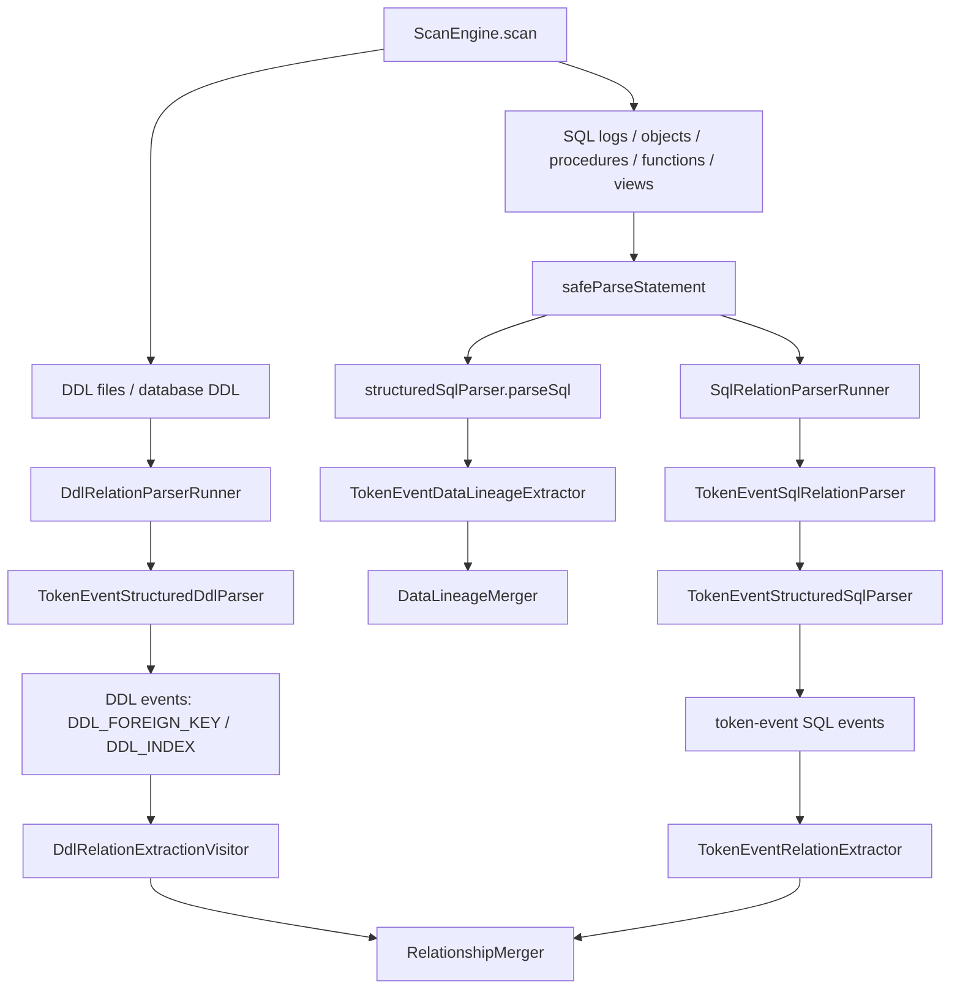
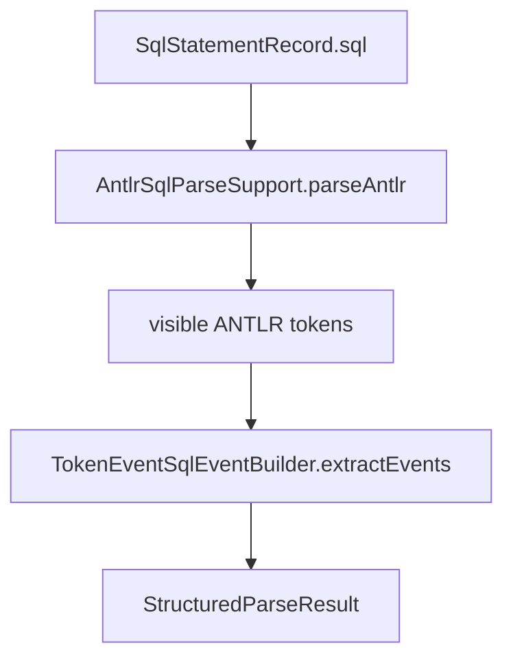
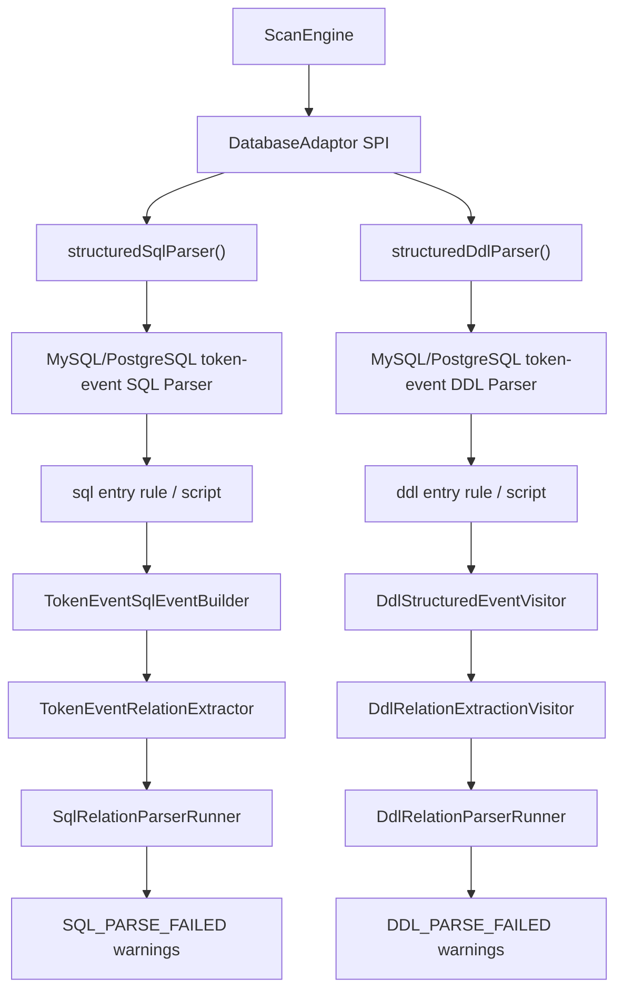

# Phase 6：SQL/DDL/对象解析增强详细设计

## 目标

增强通用 SQL/DDL/对象定义解析能力，统一支撑 MySQL 和 PostgreSQL adaptor 的关系证据生成。

Phase 4/5 可以先提供采集和基础解析；Phase 6 负责把 JOIN、子查询、表别名、schema 限定名、表共现等能力系统化，减少各数据库 adaptor 重复实现。

## 解析输入

输入来源统一抽象为：

```java
public record SqlStatementRecord(
    String sql,
    StatementSourceType sourceType,
    String sourceName,
    long startLine,
    long endLine,
    Map<String, Object> attributes
) {}
```

`sourceType`：

- `DDL_FILE`
- `PROCEDURE`
- `FUNCTION`
- `VIEW`
- `MATERIALIZED_VIEW`
- `TRIGGER`
- `EVENT`
- `RULE`
- `PACKAGE`
- `PACKAGE_BODY`
- `MIGRATION`
- `NATIVE_LOG`
- `PLAIN_SQL`

新增来源说明：

- `MATERIALIZED_VIEW`：PostgreSQL `pg_matviews` 等物化视图定义。解析策略与 view 类似，证据使用 `VIEW_JOIN`，但对象类型保持独立，方便运维理解刷新/持久化语义。
- `EVENT`：MySQL scheduler event。事件体可能包含 `INSERT ... SELECT`、`UPDATE`、`DELETE` 和 JOIN，证据按 procedure/function 处理。
- `RULE`：PostgreSQL rewrite rule。规则定义可能包含重写 SQL，证据按 view 类 SQL 处理。
- `PACKAGE` / `PACKAGE_BODY`：为 Oracle 后续 adaptor 预留。包体内的 procedure/function SQL 按持久化过程逻辑处理。
- `MIGRATION`：Flyway、Liquibase 或手写 migration SQL。它不是数据库持久对象，证据来源按 `PLAIN_SQL` 处理。

## 解析输出

输出 `RelationshipEvidence`：

```java
public record RelationshipEvidence(
    Endpoint source,
    Endpoint target,
    RelationType relationType,
    RelationSubType suggestedSubType,
    Evidence evidence,
    DirectionConfidence directionConfidence
) {}
```

说明：

- `suggestedSubType` 只是建议，最终 subtype 由 core 归并后确定。
- `directionConfidence` 标识方向是否可靠。
- 方向不可靠时，core 应退化为表级 `CO_OCCURRENCE`。

## ANTLR 迁移层

当前实现新增了 ANTLR 驱动的结构化解析前端，但不把它一次性切成唯一关系输出来源。

核心类型：

```java
public interface StructuredSqlParser {
  StructuredParseResult parseSql(SqlStatementRecord statement, AdaptorContext context);
}

public interface StructuredDdlParser {
  StructuredParseResult parseDdl(String ddl, String sourceName, AdaptorContext context);
}

public record StructuredParseResult(
    String backend,
    String dialect,
    String sourceName,
    List<StructuredSqlEvent> events,
    List<WarningMessage> warnings,
    Map<String, Object> attributes
) {}

public record StructuredSqlEvent(
    StructuredParseEventType type,
    String sourceName,
    long line,
    Map<String, Object> attributes
) {}
```

事件类型：

- `TABLE_REFERENCE`：ANTLR token stream 中识别出的 `FROM`、`JOIN`、`UPDATE`、`INTO` 后的表引用和 alias。
- `COLUMN_EQUALITY`：识别出的 `alias.column = alias.column` 谓词。
- `DDL_FOREIGN_KEY` / `DDL_INDEX`：token-event DDL event visitor 识别出的外键、inline references、source index、target unique/primary key 结构化事件。
- `DYNAMIC_SQL`：为后续可静态还原的动态 SQL 预留；当前不可还原时输出 warning。

### token-event primary 链路

MySQL/PostgreSQL SQL 链路使用 token-event primary：方言 parser 先生成结构事件，再由 `TokenEventRelationExtractor` 和 `TokenEventDataLineageExtractor` 生成正式 relationship 与 data lineage 输出。correctness golden 由 `test-fixtures/correctness` 下的 `expected-relations.json` 和 `expected-lineage.json` 决定。

token-event 的原则：

- `TokenEventStructuredSqlParser`、`TokenEventSqlEventBuilder`、`TokenEventRelationExtractor`、`TokenEventDataLineageExtractor` 是 SQL relation 与 Data Lineage 的 production 链路。
- MySQL/PostgreSQL 分别有 adaptor 子包 `com.relationdetector.mysql.tokenevent` / `com.relationdetector.postgres.tokenevent` 下的 `MySqlTokenEventStructuredSqlParser` / `PostgresTokenEventStructuredSqlParser`，以及 core token-event 方言 builder `MySqlTokenEventSqlEventBuilder` / `PostgresTokenEventSqlEventBuilder`；数据库专属 token/parse-tree 兼容必须进入对应方言类。
- token-event 把 rowset、predicate、projection、write assignment 等能力收敛到 token/shallow parse-tree 事件；仍保留少量跨方言 token scanner 作为事件构建手段，但数据库专属兼容必须在 MySQL/PostgreSQL 子类中实现。
- 公共 relation 已具备事件和抽取测试：`JOIN USING`、raw equality、correlated `EXISTS`、scalar `IN`、tuple `IN`、列级弱共现、表级共现边界。
- 公共 rowset/scope 已具备事件测试：标准 `FROM/JOIN/UPDATE/INTO/MERGE USING` rowset、comma rowset、CTE declaration、ignored rowset、显式 local temporary table、trigger target table、`NEW` / `OLD` pseudo rowset。
- Data Lineage 已接管 `UPDATE SET`、`INSERT INTO ... SELECT`、`MERGE UPDATE/INSERT`、projection item、expression source、derived aggregate projection 回溯、显式 local temporary table 过滤，并用于 `ScanEngine` 正式 `dataLineages` 输出。
- 方言 DML 覆盖 MySQL multi-table `UPDATE/DELETE`、comma DML rowset、`JSON_TABLE` 防伪表，以及 PostgreSQL `UPDATE ... FROM`、`DELETE ... USING`、`MERGE ... USING`、data-modifying CTE 等关系和 lineage 场景。
- 方言 builder 已有隔离测试：MySQL 侧覆盖 `STRAIGHT_JOIN`、`PARTITION (...)`、index hint、`JSON_TABLE` 防伪表；PostgreSQL 侧覆盖 `ONLY`、`TABLESAMPLE`、`ROWS FROM`、`UNNEST WITH ORDINALITY`、`MATERIALIZED CTE` 防伪表。
- DDL 侧通过 `mysql.tokenevent.MySqlTokenEventStructuredDdlParser` / `postgres.tokenevent.PostgresTokenEventStructuredDdlParser` 暴露生产 parser，统一进入 token-event DDL event pipeline。

### 版本化 full-grammer 与 token-event fallback

为了逐步降低 Java token scanner 的复杂度，MySQL/PostgreSQL 新增版本化 full-grammer 入口。运行时有两个用户可见 parser 模式：`full-grammer` 和 `token-event`。Java package 由于不能包含横线，使用 `fullgrammer` / `tokenevent`。默认 `parser.mode=auto`：当 database type 与 profile/version/JDBC metadata 足以选中 full-grammer profile 时优先使用 full-grammer；没有合理方言/版本信息、profile 不支持或 full-grammer 解析硬失败时，自动 fallback 到 token-event。`parser.mode=token-event` 强制跳过 full-grammer；`parser.mode=full-grammer` 明确请求 full-grammer，若无法选择或解析失败则记录 `PARSER_MODE_FALLBACK` warning 后使用 token-event。

这里的 mode 必须严格区分：

- `parser.mode` 是系统运行模式，只允许 `auto|full-grammer|token-event`。
- MySQL `SQL_MODE` 是 MySQL server/session 语法开关，例如 `ANSI_QUOTES`、`PIPES_AS_CONCAT`、`NO_BACKSLASH_ESCAPES`。它只属于 MySQL 8.0 full-grammer runtime，由 `MySqlGrammarSqlMode` / `MySqlGrammarSqlModes` 表达；PostgreSQL 没有这套 MySQL `SQL_MODE` 机制。
- ANTLR lexer mode 是 `.g4` 内部词法状态，例如 PostgreSQL string/meta command mode，不是 Java parser mode，也不应该抽成跨数据库 runtime 配置类。

当前代码中的基础设施：

```text
SqlGrammarProfile
  -> databaseType + majorVersion + minorVersion + capabilities

FullGrammerDialectModule
  -> databaseType + major/minor + sqlParser(...) + structuredDdlParser(...)

SqlGrammarProfileRegistry.select(FullGrammerProfileRequest)
  -> MySQL: mysql-8.0
  -> PostgreSQL: postgresql-16
  -> 人工配置优先，JDBC DatabaseMetaData 次之
  -> 同 major minor 复用该 major profile
  -> 只允许最多高 1 个 major 的临时降级，并返回 diagnostic
  -> 无方言/版本或跨 2 个 major 时回退 token-event

FullGrammerTokenEventParserFactory.create(...)
  -> registry module lookup，不按 profile id switch
  -> FullGrammerTokenEventStructuredSqlParser
  -> backend = FULL_GRAMMAR_TOKEN_EVENT_SHADOW 或作为 selected full-grammer parser 运行
  -> attributes.selectedGrammarProfile / requestedDatabaseVersion / versionSource / profileFallback

FullGrammerDdlParserFactory.create(...)
  -> FullGrammerDialectModule.structuredDdlParser(...)
  -> backend = FULL_GRAMMAR_DDL_SHADOW 或作为 selected full-grammer DDL parser 运行
  -> attributes.fullGrammerDdlShadow = true
```

当前 `mysql-8.0` 和 `postgresql-16` profile 已接入 vendored full-grammer `.g4`。具体实现归属数据库 adaptor：MySQL 位于 `adaptor-mysql` 的 `com.relationdetector.mysql.fullgrammer.v8_0`，PostgreSQL 位于 `adaptor-postgres` 的 `com.relationdetector.postgres.fullgrammer.v16`。版本由 package 表达，类名保持无版本数字，例如 `MySqlFullGrammerStructuredSqlParser`、`PostgresFullGrammerStructuredSqlParser`、`MySqlTokenEventParseTreeVisitor`、`PostgresTokenEventParseTreeVisitor`。core 只保留 `FullGrammerDialectModule`、profile selection、factory、shadow comparison 和 warning 语义；具体 SQL/DDL parser module 通过 `ServiceLoader<FullGrammerDialectModule>` 注入。SQL full-grammer parser 运行真实方言 parser entry rule，再进入对应 typed parse-tree visitor。relationship、lineage、confidence 和 JSON 输出仍由现有 token-event extractor/merger 决定。未实现的大版本 profile 不会静默假装支持；运行时回退 token-event，测试 shadow 仍保留 parity 验收。

DDL full-grammer shadow 使用同一批 vendored grammar：MySQL 8.0 走 `queries()`，PostgreSQL 16 走 `root()`。adaptor 内的 `MySqlFullGrammerStructuredDdlParser` / `PostgresFullGrammerStructuredDdlParser` 先运行 full-grammer parser，并把 syntax error count 写入 `fullGrammerDdlSyntaxErrors`；随后由各自 adaptor 的 typed DDL event collector 生成现有 `DDL_FOREIGN_KEY` / `DDL_INDEX` 事件。它不委托 `DdlStructuredEventVisitor.extractEvents(...)`，也不改变 production `TokenEventStructuredDdlParser`。可恢复 syntax error 会记录 `FULL_GRAMMAR_DDL_PARSE_WARNING`，但 shadow correctness 的硬门槛是 relationship parity，warning 作为诊断保留。

full-grammer shadow 的对比规则：

```text
production token-event parser
  -> relationship fingerprints
  -> lineage fingerprints

full-grammer shadow parser
  -> relationship fingerprints
  -> lineage fingerprints

FullGrammerTokenEventShadowComparator
  -> missingProductionRelations
  -> missingProductionLineages
  -> extraFullGrammerRelations
  -> extraFullGrammerLineages
```

当前 correctness guard 是 `FullGrammerCorrectnessShadowTest`：它扫描全部 SQL correctness fixture，用 MySQL 8.0 / PostgreSQL 16 默认 profile 运行 shadow parser，并要求 shadow 不少于生产 token-event 输出。`FullGrammerGeneratedParserSmokeTest` 另外验证 vendored MySQL/PostgreSQL generated lexer/parser 可实例化并解析基础 SQL。full-grammer shadow 的 `fullGrammerBridgedEventTypes` 必须为空；如果未来深化为更细的 typed parse-tree context visitor，missing 必须修 visitor，extra 必须进入审核，不能静默改 golden。

DDL correctness guard 是 `FullGrammerDdlCorrectnessShadowTest`：它扫描全部 DDL correctness fixture，用 MySQL 8.0 / PostgreSQL 16 full-grammer DDL shadow parser 生成结构事件，再复用 `DdlRelationExtractionVisitor` 与 production DDL relationship fingerprint 对比。`missingCurrentDdlRelations` 必须为空；`extraFullGrammerDdlRelations` 如果出现，必须进入审核文档，不能自动写入 golden。

版本扩展规则：

- 大版本语法差异明显时新增独立 profile，例如 `mysql-5.7`、`mysql-8.4`、`postgresql-17`，不把大量版本分支塞进一个 profile。
- 小版本差异优先用 capability 标记，例如 `json_table`、`merge`、`materialized_cte`；例如 PostgreSQL `16.5` 默认使用 `postgresql-16`。
- 版本选择优先级是人工配置高于 JDBC metadata；当只有 `postgresql-16` 时，`17.x` 可临时降级到 `postgresql-16` 并记录 warning，`18.x` 不跨两级自动降级。
- 完全没有 databaseType 或版本信息时，不启用 full-grammer profile，直接使用 token-event parser。
- parser mode 配置：
  - `parser.mode: auto`：默认。能选中 profile 时使用 full-grammer，否则安静使用 token-event。
  - `parser.mode: full-grammer`：显式请求 full-grammer；profile 不存在、版本不支持或解析硬失败时记录 fallback warning，并用 token-event 继续扫描。
  - `parser.mode: token-event`：强制使用 token-event。
  - CLI 可通过 `--parser-mode`、`--grammar-profile`、`--database-version` 覆盖 YAML。
- 遇到老库版本时新增 profile，并补对应 fixture；不能只依赖新版本 fixture 推断兼容。
- full-grammer 只负责替换“语法结构识别”，不能承载 FK-like 方向、共现、Data Lineage transform 或 confidence 语义。

### 当前代码级 DDL/DML 解析调用链

本节按当前代码实现说明，不以历史设计或迁移计划为依据。主入口是 `ScanEngine.scan(...)`，它把 metadata、database DDL、DDL 文件、database object、SQL log 和 plain SQL 文件收集到同一个扫描过程里，再分别进入 relationship 与 Data Lineage 链路。



#### DDL 调用链

DDL 来源有两类：用户配置的 DDL 文件和数据库内 DDL（例如 MySQL `SHOW CREATE TABLE`、PostgreSQL catalog 重建 DDL）。二者最终都进入同一个 DDL runner：

```text
ScanEngine.safeParseDdl(...) / safeParseDatabaseDdl(...)
  -> DdlRelationParserRunner.parse(...) / parseText(...)
  -> adaptor.structuredDdlParser()
  -> MySqlTokenEventStructuredDdlParser / PostgresTokenEventStructuredDdlParser
  -> TokenEventStructuredDdlParser.parseDdl(...)
  -> DdlStructuredEventVisitor.extractEvents(...)
  -> DdlRelationExtractionVisitor.extract(...)
```

`TokenEventStructuredDdlParser.parseDdl(...)` 不直接生成关系；它只选择方言 DDL event visitor，并返回 `StructuredParseResult`。`DdlStructuredEventVisitor.extractEvents(...)` 先用 `DdlTokenCursor.splitTopLevel(ddl, ';')` 做顶层语句切分，再用 `DdlStatementView.of(statement)` 把语句粗分成 `CREATE_TABLE`、`ALTER_TABLE`、`CREATE_INDEX` 或 `OTHER`。

`CREATE TABLE` 语句会读取目标表名、匹配表体括号、按顶层逗号拆分 body item，并识别 table-level `FOREIGN KEY`、inline `REFERENCES`、`PRIMARY KEY`、`UNIQUE`、inline `KEY` / `INDEX`。`ALTER TABLE` 语句只从 alter body 中提取 `FOREIGN KEY (...) REFERENCES ...`。`CREATE INDEX` / `CREATE UNIQUE INDEX` 使用 `DdlIndexPartParser` 解析 index part；只有 `safeColumn=true` 的普通列 index part 才能生成 index evidence，表达式、prefix、partial 等不安全 index part 不会被误当作全局唯一或 source index。

DDL event 只包含关系相关的结构事实：

```text
DDL_FOREIGN_KEY
DDL_INDEX
```

`DdlRelationExtractionVisitor.extract(...)` 分两遍消费事件：

```text
第一遍 DDL_INDEX:
  -> 收集 SOURCE_INDEX
  -> 收集 TARGET_UNIQUE

第二遍 DDL_FOREIGN_KEY:
  -> 生成 FK_LIKE / DDL_DECLARED_FK RelationshipCandidate
  -> source = foreign key column
  -> target = referenced column
  -> evidence = DDL_FOREIGN_KEY
```

随后如果 FK source column 命中 `SOURCE_INDEX`，补 `SOURCE_INDEX` evidence；如果 FK target column 命中 `TARGET_UNIQUE`，补 `TARGET_UNIQUE` evidence。DDL 不生成 Data Lineage。

#### DML / SQL relationship 调用链

DML/SQL 来源包括 SQL log、plain SQL 文件、view、materialized view、procedure、function、trigger、event、rule 等对象定义。每条 SQL 进入 `ScanEngine.safeParseStatement(...)` 后，会先做 SQL log 噪声过滤，再进入 relationship 与 lineage 两条链路。

Relationship 链路：

```text
ScanEngine.safeParseStatement(...)
  -> SqlRelationParserRunner.parse(...)
  -> adaptor.sqlRelationParser()
  -> TokenEventSqlRelationParser.parse(...)
  -> structuredParser.parseSql(...)
  -> TokenEventRelationExtractor.extract(...)
```

`TokenEventStructuredSqlParser.parseSql(...)` 先通过 `AntlrSqlParseSupport.parseAntlr(...)` 取得 visible ANTLR tokens 和 syntax diagnostics，再由 `TokenEventSqlEventBuilder.extractEvents(...)` 生成结构事件。MySQL/PostgreSQL adaptor 分别选择自己的 `MySqlTokenEventSqlEventBuilder` / `PostgresTokenEventSqlEventBuilder`，用于隔离 identifier、rowset decorator、DML rowset 和方言伪表过滤。



SQL event builder 会生成 rowset、scope、predicate、projection 和 write mapping 事件：

```text
ROWSET_REFERENCE
PREDICATE_EQUALITY
JOIN_USING_COLUMNS
EXISTS_PREDICATE
IN_SUBQUERY_PREDICATE
TUPLE_IN_SUBQUERY_PREDICATE
CTE_DECLARATION
IGNORED_ROWSET
LOCAL_TEMP_TABLE_DECLARATION
TRIGGER_TARGET_TABLE
TRIGGER_PSEUDO_ROWSET
WRITE_TARGET
UPDATE_ASSIGNMENT
INSERT_SELECT_MAPPING
MERGE_WRITE_MAPPING
PROJECTION_ITEM
EXPRESSION_SOURCE
```

`TokenEventRelationExtractor.extract(...)` 先建立作用域：`ignoredRowsets(...)` 识别 CTE、derived table、function rowset、local temp table 等非物理 rowset；`rowsetAliases(...)` 建立 alias/table name 到物理表的映射；`projectedColumns(...)` 将 CTE/derived alias column 回溯到物理列。

随后 relationship 抽取按事件类型执行：

```text
PREDICATE_EQUALITY:
  -> resolve left/right alias.column
  -> 能判断方向时输出 FK_LIKE + SQL_LOG_JOIN / VIEW_JOIN / PROCEDURE_JOIN
  -> 方向不可靠但两侧都是物理列时输出 COLUMN_CO_OCCURRENCE

EXISTS_PREDICATE:
  -> 输出 FK_LIKE + SQL_LOG_EXISTS
  -> 同 endpoint 的重复 JOIN evidence 会被移除

JOIN_USING_COLUMNS:
  -> 输出 COLUMN_CO_OCCURRENCE
  -> 不直接升级 FK-like

IN_SUBQUERY_PREDICATE:
  -> 输出 FK_LIKE + SQL_LOG_SUBQUERY_IN

TUPLE_IN_SUBQUERY_PREDICATE:
  -> 按 tuple position 逐列输出 SQL_LOG_SUBQUERY_IN
```

最后执行 `removeJoinCandidatesCoveredByExists(...)` 和 `deduplicate(...)`，防止同一 correlated `EXISTS` predicate 同时被计为 `SQL_LOG_EXISTS` 和普通 join。

#### DML / SQL Data Lineage 调用链

Data Lineage 是独立输出模型，不混入 `RelationshipCandidate`，也不改变 relationship confidence。当前调用点在 `ScanEngine.safeParseStatement(...)`：

```text
ScanEngine.safeParseStatement(...)
  -> adaptor.structuredSqlParser().parseSql(...)
  -> TokenEventDataLineageExtractor.extract(...)
  -> DataLineageMerger.merge(...)
  -> ScanResult.dataLineages()
```

`TokenEventDataLineageExtractor` 只消费写入类事件：

```text
UPDATE_ASSIGNMENT
INSERT_SELECT_MAPPING
MERGE_WRITE_MAPPING
```

抽取流程：

```text
aliases(events):
  -> ROWSET_REFERENCE / WRITE_TARGET
  -> alias -> table

localTempTables(events):
  -> LOCAL_TEMP_TABLE_DECLARATION
  -> 显式 CREATE TEMPORARY/TEMP TABLE 的表被过滤

projections(events):
  -> PROJECTION_ITEM
  -> derived/CTE output column -> physical source columns

for each write mapping:
  -> targetColumn(...)
  -> sourceEndpoints(...)
  -> filterSyntheticIntermediateSources(...)
  -> 如果 target/source 是 local temp table，跳过
  -> effectiveTransform(...)
  -> flowKind(...)
  -> DataLineageCandidate
```

Data Lineage v1 只输出数据库内部字段血缘，即 `table.column -> table.column`。参数、JSON path、literal、局部变量和动态 SQL 拼接结果不作为 source endpoint；DELETE 不生成字段血缘。

当前 transform 与默认 confidence 由 `TokenEventDataLineageExtractor` 代码决定：

```text
DIRECT: 0.90
AGGREGATE: 0.80
CUMULATIVE: 0.80
COALESCE / ARITHMETIC: 0.75
CONCAT_FORMAT: 0.70
CASE_WHEN / FUNCTION_CALL: 0.65
WINDOW_DERIVED: 0.50
UNKNOWN_EXPRESSION: 0.35
CONTROL flow: 0.55
```

#### 结果合并

最终 relationship 与 lineage 分开合并：

```text
metadata relationships
+ DDL relationships
+ SQL/DML relationships
+ profile evidence
+ metadata enhancer evidence
-> RelationshipMerger.merge(...)
-> ScanResult.relationships()

SQL/DML lineage candidates
-> DataLineageMerger.merge(...)
-> ScanResult.dataLineages()
```

当前实现中，`safeParseStatement(...)` 会为 Data Lineage 和 Relationship 各调用一次 `structuredSqlParser.parseSql(...)`。这不是旧 parser 残留，但存在性能优化空间：后续可以在不改变输出的前提下复用同一个 `StructuredParseResult`。

### 为什么 DDL Parser 和 SQL Parser 必须分层

ANTLR 只能把输入文本解析成 token stream 或 parse tree；它不直接知道哪些节点应该成为数据库关系证据。关系抽取、方向判断、证据类型和置信度评分仍然属于本系统自己的语义层。因此，即使 SQL 和 DDL 最终都可以使用 ANTLR，也不能把它们压成一个“万能 relation parser”。

DDL 输入描述的是数据库声明出来的结构事实：

```sql
CREATE TABLE orders (
  id bigint primary key,
  user_id bigint,
  CONSTRAINT fk_orders_user FOREIGN KEY (user_id) REFERENCES users(id)
);

CREATE UNIQUE INDEX uk_users_email ON users(email);
```

DDL 抽取目标是 `FOREIGN KEY`、inline `REFERENCES`、primary key、unique、普通 index、列定义、nullable、generated column、referential action 等事实。这里的 `orders.user_id -> users.id` 来自显式结构定义，通常是最高可信证据；`users.email` 的 unique index 本身不一定生成关系，但可以增强后续 SQL/DDL 候选的 `TARGET_UNIQUE` 证据。

SQL 输入描述的是应用或数据库对象实际如何使用表：

```sql
WITH recent_orders AS (
  SELECT user_id, account_id
  FROM orders
)
SELECT *
FROM recent_orders ro
JOIN users u ON ro.user_id = u.id
JOIN accounts a ON ro.account_id = a.id;
```

SQL 抽取目标是 `JOIN`、`WHERE` 等值谓词、`IN`、`EXISTS`、tuple comparison、CTE/derived table lineage、`UPDATE FROM`、`DELETE USING`、`MERGE USING`、`INSERT ... SELECT` 的 source-target 关系，以及不能确定列时的 `CO_OCCURRENCE`。这里的 `ro.user_id = u.id` 必须先经过 alias 和 CTE lineage 才能回溯到 `orders.user_id -> users.id`，置信度也应低于显式 FK。

`CO_OCCURRENCE` 分两层：如果 SQL 只有多个表共同出现，或者 `JOIN USING` / `NATURAL JOIN` 无法给出可归一的列端点，则输出表级 `SQL_LOG_TABLE_CO_OCCURRENCE`；如果 SQL 明确给出两个可解析物理列的等值谓词，但两侧命名和约束不足以判断 FK-like 方向，可输出列级 `SQL_LOG_COLUMN_CO_OCCURRENCE`。MySQL token-event SQL event builder 全局启用该列级弱共现；PostgreSQL token-event SQL event builder 在已由 business correctness fixture 覆盖的 DML 场景中启用，包括 `UPDATE ... FROM`、`DELETE ... USING`、`WITH ... UPDATE/DELETE` 和 correlated subquery 中的模糊列等值，用于 `warehouse_inventory.product_id = order_items.product_id`、`supplier_inventory_logs.sku_code = master_skus.sku_ref` 这类场景，分值 `0.40`；其它方言或新的 PostgreSQL 语句形态必须补自己的 golden 审核后再启用，避免批量重刷既有正确性基线。

外部材料中常见的 `Affected_Tables`、`Join_Relationships`、`Data_Lineage` 三段式输出可以作为产品概念参考。当前系统仍以 `RelationshipCandidate` + `Evidence` 作为关系输出；字段血缘已在 v1 中作为独立 `DataLineageCandidate` 和顶层 JSON `dataLineages` 输出，不混入 relationship。`Affected_Tables` 这类写操作摘要后续可以独立设计；本阶段不会把 `DELETE o, oi` 输出成新的顶层 JSON 字段。

`RelationshipCandidate.source -> target` 表示系统归一后的关系方向，不表示 SQL 文本中等号左右顺序，也不表示级联删除的业务影响方向。对于 FK-like JOIN，方向保持“引用列/外键样列 -> 被引用键列”：即使 SQL 写成 `u.id = o_summary.user_id`，lineage 还原后仍输出 `orders.user_id -> users.id`；即使业务上是从父订单删除影响订单明细，`orders.id = order_items.order_id` 仍输出 `order_items.order_id -> orders.id`。

对照写法的要求也按语义区分：`INNER JOIN` 可以使用传统 comma join 作为等价 fixture；非 `INNER JOIN` 的反连接/孤儿清理不强造 comma join，而使用语义等价的子查询，例如 `LEFT JOIN ... IS NULL` 对应 `NOT EXISTS`。

复杂 `UPDATE` 中的派生表穿透也遵守这个边界。窗口函数或聚合列本身不成为关系端点，但派生表投影出的普通列可以回溯到物理表：`latest_orders.order_id` 可回溯为 `orders.id`，`sm.product_id` 可回溯为 `supplier_manifests.product_id`。因此显式 `INNER JOIN` 版本和把 inner 部分改写成 comma join + `WHERE` 等值谓词的版本，应产生相同 relationship fingerprints；原本的 `LEFT JOIN` 对照则使用等价 correlated subquery，不强造 comma left join。

两条链路最终都输出 `RelationshipCandidate`，但中间语义不同：

- evidence type 不同：DDL 会产生 `DDL_FOREIGN_KEY`、`DDL_INDEX` 等结构证据；SQL 会产生 `SQL_LOG_JOIN`、`VIEW_JOIN`、`PROCEDURE_JOIN`、`SQL_LOG_EXISTS` 等行为证据。
- confidence 不同：DDL 显式 FK 通常接近确定；SQL JOIN 需要结合 metadata、索引、命名、类型和出现次数做递增增强。
- 失败策略不同：某张表的 DDL 解析失败只影响该 DDL source；SQL log 中一条截断语句失败不能影响其它日志；routine 中动态 SQL 无法静态还原时应记录对象级 warning。
- 验收边界不同：SQL correctness fixture 验证 token-event SQL relation extractor，DDL correctness fixture 验证 DDL event visitor 与 DDL relation extraction。两者都以 token-event golden 为准，但任一侧的通过结果都不能替代另一侧验收。

### ANTLR entry rule 与调用关系

长期目标不是写一个跨数据库的 `relationSQL.g4`，而是在每个方言 grammar 下保留可共享的 lexer/parser 基础规则，并为 DDL 与 SQL 暴露不同入口和 visitor：

```text
DialectLexer / DialectParser
  -> ddl entry rule
     -> DdlStructuredEventVisitor
     -> DdlRelationExtractionVisitor
     -> DdlRelationParserRunner
  -> sql entry rule
     -> TokenEventSqlEventBuilder
     -> TokenEventRelationExtractor
     -> SqlRelationParserRunner
```

当前 tolerant grammar 仍可使用统一 `script` 入口，因为第一阶段更重视容错、日志截断和过程体混合语法；但这个入口只是底层 parse support 的容错选择。后续如果替换为更完整的 MySQL/PostgreSQL grammar，应在同一方言 parser 中拆出类似 `ddlStatement/script` 和 `sqlStatement/script` 的入口，再分别交给 DDL event visitor 与 SQL event builder。不能让一个 visitor 同时决定 DDL constraint、SQL join、日志噪声过滤和解析失败诊断。

多态调用关系如下：



运行模式：

- SQL 与 DDL parser 不再提供 `simple`、`shadow` 或旧 fallback 配置。`parser.sql.mode`、`parser.ddl.mode`、`parser.sql.fallbackOnFailure`、`parser.ddl.fallbackOnFailure` 属于已移除配置；YAML 中出现时应显式报错，CLI 也不再接受对应覆盖参数。
- 当前运行模式统一为 `parser.mode: auto|full-grammer|token-event`。`auto` 默认在 profile/version/JDBC metadata 足够时选择 full-grammer，否则使用 token-event；`full-grammer` 显式请求 full-grammer，失败时记录 warning 后 fallback token-event；`token-event` 强制使用 token-event。
- MySQL/PostgreSQL token-event SQL 链路：`mysql.tokenevent.MySqlTokenEventStructuredSqlParser` / `postgres.tokenevent.PostgresTokenEventStructuredSqlParser` -> `MySqlTokenEventSqlEventBuilder` / `PostgresTokenEventSqlEventBuilder` -> `TokenEventRelationExtractor` -> `SqlRelationParserRunner`。
- MySQL/PostgreSQL token-event DDL 链路：`mysql.tokenevent.MySqlTokenEventStructuredDdlParser` / `postgres.tokenevent.PostgresTokenEventStructuredDdlParser` -> `DdlStructuredEventVisitor` 方言子类 -> `DdlRelationExtractionVisitor` -> `DdlRelationParserRunner`。
- full-grammer SQL/DDL 链路由 `FullGrammerDialectModule` 注入对应版本 parser。若 full-grammer 解析或 visitor 硬失败，扫描不中断，正式输出 fallback 到 token-event，并记录 `PARSER_MODE_FALLBACK` / parse warning provenance。
- SQL Server/Oracle 只保留 SPI 和 future adaptor 边界；没有对应 ANTLR adaptor 前，不再用 legacy simple parser 假装支持。

当前落地边界：

- `relation-core` 使用 ANTLR 4 Maven plugin 生成三个 SQL grammar：
  - `RelationSql.g4`：容错基础 grammar，供共享结构化 parser 骨架和通用测试使用。
  - `MySqlRelationSql.g4`：MySQL 方言 grammar，已把反引号 identifier 作为 MySQL quoted identifier；双引号是否作为 identifier 留给后续 `ANSI_QUOTES` capability flag。
  - `PostgresRelationSql.g4`：PostgreSQL 方言 grammar，已把双引号 identifier 和 dollar-quoted string 放在 PostgreSQL grammar 中；反引号不会被 PostgreSQL structured event visitor 当作表名。
- `AntlrSqlParseSupport` 是抽象的结构化解析骨架：负责动态 SQL warning、统一 attributes、统一 `StructuredParseResult`。
- `mysql.tokenevent.MySqlTokenEventStructuredSqlParser` / `postgres.tokenevent.PostgresTokenEventStructuredSqlParser` 分别调用自己的 generated lexer/parser，并通过 `attributes.grammar`、`attributes.lexer`、`attributes.parser` 暴露真实后端。
- `TokenEventSqlEventBuilder` 负责从 ANTLR token stream 抽取 `TABLE_REFERENCE` / `COLUMN_EQUALITY`。MySQL/PostgreSQL 分别有 `MySqlTokenEventSqlEventBuilder` / `PostgresTokenEventSqlEventBuilder`，用于隔离 identifier token、unquote 规则和方言 rowset 规则。当前已覆盖 comma table reference、multi-table DML、MERGE USING，以及跳过 `LATERAL` 这类 rowset modifier，避免把它当成物理表。
- `TokenEventRelationExtractor` 从 `TABLE_REFERENCE`、`COLUMN_EQUALITY` 事件独立构造基础 FK-like / CO_OCCURRENCE 候选；方向判断、source type 映射、evidence score 使用共享语义，并复用 `SqlLineageResolver` 处理可安全回溯的 CTE/派生表列。
- `correlated EXISTS` 的关系抽取属于公共 SQL 语义，而不是 PostgreSQL 专属能力。公共 visitor 可以识别 `WHERE EXISTS (SELECT 1 FROM users u WHERE u.id = o.user_id)` 这类跨方言谓词，并生成 `SQL_LOG_EXISTS`；但 EXISTS 子查询内部的 rowset/function/hint/identifier 方言语法仍必须由 `MySqlTokenEventSqlEventBuilder` / `PostgresTokenEventSqlEventBuilder` 处理，例如 PostgreSQL `ONLY` / `UNNEST` / set-returning function，或 MySQL `JSON_TABLE` / `PARTITION` / index hint。
- `TokenEventStructuredDdlParser` 按方言选择 `DdlStructuredEventVisitor` 子类并输出 `DDL_FOREIGN_KEY` / `DDL_INDEX` 事件；`DdlRelationExtractionVisitor` 独立转换这些事件，覆盖 `CREATE TABLE ... FOREIGN KEY`、inline `REFERENCES`、`ALTER TABLE ... ADD CONSTRAINT`、`CREATE UNIQUE INDEX` 等核心 DDL 形态。
- MySQL/PostgreSQL adaptor 已拆出 `MySqlTokenEventSqlEventBuilder` / `PostgresTokenEventSqlEventBuilder`。公共 visitor 只保留跨方言关系语义和标准 `FROM/JOIN` 兜底；MySQL-only 的 `STRAIGHT_JOIN`、ODBC `{ OJ ... }`、optimizer index hints、`PARTITION (...)`、`JSON_TABLE(...)`、MySQL multi-table `UPDATE ... JOIN`、comma `UPDATE`、`DELETE alias FROM`、`DELETE FROM alias USING`，以及 PostgreSQL-only 的 `ONLY`、`TABLESAMPLE`、`JOIN USING (...) AS alias`、`LATERAL`、`UNNEST` / `ROWS FROM` / set-returning rowset、`MATERIALIZED` CTE 边界，都由各自子类通过 protected hooks 或窄 guard 承接。泛化表级 `CO_OCCURRENCE` 只在没有更强列级关系时作为兜底；多表 DML 如果已经抽出明确 FK-like 谓词，不再额外补间接表对表共现。换句话说，`EXISTS` 外壳是公共关系抽取语义，`EXISTS` 内部如何识别真实 rowset 与排除伪表是方言责任。
- DDL 方言差异不进入 `DdlRelationExtractionVisitor`。MySQL-only 的 `KEY`/`INDEX` inline definition、`VISIBLE`/`INVISIBLE`、`USING BTREE/HASH` before `ON` 等由 `MySqlDdlStructuredEventVisitor` / `mysql.tokenevent.MySqlTokenEventStructuredDdlParser` 承接；PostgreSQL-only 的 `CONCURRENTLY`、`ON ONLY`、`INCLUDE`、partial index `WHERE`、`NOT VALID` 等由 `PostgresDdlStructuredEventVisitor` / `postgres.tokenevent.PostgresTokenEventStructuredDdlParser` 承接。
- `SqlRelationParserRunner` 负责 SQL log 噪声过滤、注入系统 schema 配置，并按 `parser.mode` 选择 full-grammer 或 token-event structured SQL parser；Data Lineage 复用同一次结构化解析结果，避免 relationship 与 lineage 走不同 parser。
- `DdlRelationParserRunner` 按同一 `parser.mode` 选择 full-grammer 或 token-event structured DDL parser，并把 `DATABASE_DDL` / `DDL_FILE` source type 写入 evidence。

### SQL relation visitor 与 lineage 的公共/方言边界

当前实现采用“公共语义 + 方言 hook”的组合，而不是每个数据库完全复制一套 relation extractor。

公共 `TokenEventRelationExtractor` 负责跨数据库稳定成立的关系语义：

- 消费 `TABLE_REFERENCE` / `COLUMN_EQUALITY` 事件，建立 alias 到物理表的映射。
- 调用 `SqlLineageResolver` 把 CTE、derived table、简单 LATERAL/correlated derived table 的投影列回溯到物理列。
- 统一判断 FK-like 方向：引用列/外键样列指向被引用键列，不受 SQL 等号左右书写顺序影响。
- 统一构造 `RelationshipCandidate`、`Evidence`、source type、evidence score 和 `lineageResolved` 等 attributes。
- 统一处理跨方言语义，例如 raw equality、tuple `IN`、scalar `IN`、correlated `EXISTS`、`JOIN USING` 表级共现、重复 evidence 去重、系统 schema 和截断 token 过滤。
- 在方向不可靠但两侧都是物理列时，通过方言 hook 决定是否输出列级弱 `SQL_LOG_COLUMN_CO_OCCURRENCE`；没有可归一列端点时才退化为表级 `SQL_LOG_TABLE_CO_OCCURRENCE`。

MySQL 和 PostgreSQL 子类只负责会改变 rowset/alias/关键字解释的方言边界：

- `MySqlTokenEventSqlEventBuilder` 承接 `STRAIGHT_JOIN`、ODBC `{ OJ ... }`、optimizer index hint、`PARTITION (...)`、`JSON_TABLE(...)`、MySQL multi-table `UPDATE/DELETE`、comma `UPDATE`、MySQL-only keyword 和 rowset modifier 过滤。
- `PostgresTokenEventSqlEventBuilder` 承接 `UPDATE ... FROM`、`DELETE ... USING`、`ONLY`、`TABLESAMPLE`、`JOIN USING (...) AS alias`、`LATERAL`、`UNNEST` / `ROWS FROM` / set-returning function、`MATERIALIZED` CTE 边界，以及 MySQL-only 语法的窄 guard。
- 方言子类也控制 lineage 的受控增强，例如“单表裸列投影可回溯”默认不是公共行为，只在对应方言已经有 correctness golden 覆盖的 DML 场景中打开。

`SqlLineageResolver` 本身保持公共，是因为 CTE/derived table 的“简单投影列回溯”语义在 MySQL 和 PostgreSQL 中一致。它只维护映射，不创建关系、不计算置信度、不判断方言语法是否合法。是否合法启用某个 lineage 规则，由 MySQL/PostgreSQL relation visitor 通过 protected hook 控制。

这个组合边界的好处是：

- 同一业务关系在 MySQL/PostgreSQL 中有一致的方向、evidence、confidence 和去重规则。
- 方言语法不会污染公共 visitor，PostgreSQL-only 写法必须配 MySQL 负向测试，MySQL-only 写法也必须配 PostgreSQL 负向测试。
- 后续替换为更完整的官方 grammar visitor 时，可以逐步把某类方言 regex 移到对应子类的 parse-tree visitor，不需要重写公共 scoring/lineage/relationship 语义。

### Data Lineage v1 抽取链路

Data Lineage v1 是独立输出链路：

```text
SqlStatementRecord
  -> SQL relation parser / TokenEventRelationExtractor 产出 relationships
  -> TokenEventDataLineageExtractor 产出 DataLineageCandidate
  -> DataLineageMerger 去重
  -> ScanResult.dataLineages
  -> JsonResultWriter.dataLineages
```

它和 `SqlLineageResolver` 的区别：

- `SqlLineageResolver` 是关系抽取的内部 helper，只把 CTE/derived alias 的列回溯到物理列，帮助 `TokenEventRelationExtractor` 不输出伪表关系。
- `TokenEventDataLineageExtractor` 是正式输出模型的 extractor，读取写操作表达式，回答“哪些物理字段值流入哪个目标字段”。
- 两者可以复用 CTE/derived 的保守回溯思想，但职责不同：前者不输出 JSON、不算血缘 confidence；后者输出 `DataLineageCandidate`，但不创建或增强 `RelationshipCandidate`。

v1 覆盖范围：

- `UPDATE ... SET target_col = expression`。
- MySQL `UPDATE target JOIN ... SET ...`、MySQL multi-table `UPDATE`、PostgreSQL `UPDATE ... FROM`。
- `INSERT INTO target(cols...) SELECT exprs... FROM ...`。
- 基础 `MERGE ... WHEN MATCHED THEN UPDATE SET ...`。
- 通过简单 derived table 解析聚合来源，例如 `SUM(o.pay_amount) AS actual_total` 后写入 `users.total_spent`。

v1 明确不做：

- 不输出 `parameter/jsonPath/literal/local variable -> table.column`；这些属于 Parameter Binding。
- 不输出 DELETE 字段血缘。DELETE 只有关系和受影响表语义，没有字段值写入。
- 不做跨过程调用链血缘。
- 不静态还原动态 SQL；动态 SQL 继续走 warning。

表达式规则：

- `SET a.x = b.y` 输出 `VALUE:DIRECT:b.y->a.x`。
- `SUM(o.pay_amount) AS total` 后写入目标列，输出 `VALUE:AGGREGATE:o.pay_amount->target`。
- running sum、running total、CDF 这类累计表达式写入目标列，输出 `VALUE:CUMULATIVE:source->target`。
- `COALESCE(a.col, b.col)` 输出多 source 的 `VALUE:COALESCE`。
- `CASE WHEN source.col ... THEN ...` 输出 `CONTROL:CASE_WHEN:source.col->target`；如果 THEN/ELSE 中也引用字段，后续可扩展为并行 VALUE lineage。
- `col1 + col2`、`col * 0.9` 输出 `VALUE:ARITHMETIC`。
- `CONCAT`、`FORMAT`、`||`、`STRING_AGG` 等输出 `VALUE:CONCAT_FORMAT`。
- 其它函数调用归为 `FUNCTION_CALL`；无法分类但能抽到字段来源的表达式归为 `UNKNOWN_EXPRESSION`。

置信度只解释字段血缘可信度，不参与关系置信度计算。默认值在 Phase 2 和 enum reference 中维护。

### 为什么 TokenEventRelationExtractor 里仍然有正则

当前 SQL token-event 链路已经是 MySQL/PostgreSQL 的唯一 primary parser。ANTLR 仍然是底层 lexer/parser/token 技术，但业务关系抽取由 token-event 事件层负责。现阶段的职责边界是：

```text
AntlrSqlParseSupport
  -> tolerant parser / token stream / syntax diagnostics
  -> TokenEventStructuredSqlParser
  -> MySqlTokenEventSqlEventBuilder 或 PostgresTokenEventSqlEventBuilder
  -> TokenEventRelationExtractor / TokenEventDataLineageExtractor
```

因此，公共 `TokenEventRelationExtractor` 不承担方言 rowset 识别；MySQL/PostgreSQL 专属兼容规则应进入对应 token-event SQL event builder。当前仍允许保留少量 token/span scanner 或 guard 逻辑，原因如下：

- 当前 `RelationSql.g4`、`MySqlRelationSql.g4`、`PostgresRelationSql.g4` 仍是容错迁移 grammar，不是完整 MySQL/PostgreSQL 官方语法树。日志截断、routine/procedure 混合语法、动态 SQL、方言局部语法都要求 parser 能尽量产出诊断，而不是遇到一个不完整节点就丢弃整条语句。
- ANTLR 给出的只是语法结构，不直接给出业务关系语义。`o.user_id = u.id` 是否应变成 `orders.user_id -> users.id`、方向如何判断、是否要降级为表级共现，仍依赖命名、metadata、lineage、source type 和 evidence scoring。
- 一些关系抽取能力暂时还需要语义兜底，例如 tuple `IN`、correlated `EXISTS`、raw equality、`JOIN USING` 弱共现、CTE/local temp rowset 忽略、系统 schema 和截断 token 过滤、derived/LATERAL alias 防伪表。这些逻辑必须在 token-event event builder 或 extractor 层维护，并由 correctness fixture 作为 gold 保护。

允许保留的正则范围：

- 公共 extractor 只用于跨方言关系语义兜底、diagnostics、防误报过滤或 tolerant grammar 尚未建模的标准 SQL 形态。`correlated EXISTS` 是公共语义的典型例子：公共层可以识别相关谓词并输出 `SQL_LOG_EXISTS`，但不能把 PostgreSQL-only 或 MySQL-only rowset 语法塞进公共层。
- 数据库专属 SQL 语法必须进入对应 token-event SQL event builder，例如 MySQL 的 `STRAIGHT_JOIN` / ODBC `{ OJ ... }` / optimizer hints / `PARTITION (...)` / `JSON_TABLE(...)` / multi-table DML，或 PostgreSQL 的 `ONLY` / `TABLESAMPLE` / `ROWS FROM` / set-returning rowset 边界。
- 方言规则必须配套反向负向测试：新增 MySQL-only rowset/DML/hint compatibility 时，`PostgresTokenEventSqlEventBuilder` 测试要证明不会输出 `JSON_TABLE`、partition 名、hint token、ODBC wrapper、delete target alias 等伪表关系；新增 PostgreSQL-only pattern 时，也必须有 MySQL 负向测试证明不会继承该能力。
- `EXISTS` span 还承担重复计分保护：同一相关子查询谓词已经生成 `SQL_LOG_EXISTS` 时，raw equality / join compatibility 不能再把同一 endpoint pair 生成普通 `SQL_LOG_JOIN`。当前 `SQL_LOG_EXISTS = 0.58`，高于普通 `SQL_LOG_JOIN = 0.55`；保留更具体的 EXISTS evidence 并去掉重复 JOIN evidence，是为了避免同一 SQL predicate 虚高计分，而不是丢弃真实证据。
- 数据库专属 DDL 语法必须进入对应 structured DDL event visitor 或 adaptor DDL parser，例如 MySQL 的 `VISIBLE` / `INVISIBLE` / inline `KEY`，或 PostgreSQL 的 `CONCURRENTLY` / `ON ONLY` / `INCLUDE` / partial index。
- 必须有 correctness fixture 或单元测试覆盖，尤其要断言 token-event golden 稳定、无非预期 parse warning，并覆盖负向伪表断言。
- 不能把 DDL constraint/index 逻辑写入 SQL visitor；DDL-only regex/scanner 必须进入 DDL visitor/runner 链路。
- 不能重新引入旧 parser 作为 token-event 关系结果来源或裁决层。

长期演进方向：

```text
AntlrSqlParseSupport
  -> dialect grammar parse tree / token stream
  -> TokenEventStructuredSqlParser
  -> dialect TokenEventSqlEventBuilder
     直接访问 withClause / tableReference / joinSpec / predicate / subquery 等节点
  -> TokenEventRelationExtractor / TokenEventDataLineageExtractor
```

当某一类 regex 能被完整 parse-tree visitor 替代时，实施顺序必须是：先把现有 correctness fixture 迁成新 visitor 的 golden 验收，再移除对应 regex，最后同步更新本设计文档和代码实现说明。不能只改代码而保留过时的“regex 过渡层”说明，也不能只改文档而让代码仍走旧兜底。

DDL 的当前状态要单独看待：DDL 已经是 token-event primary 链路，并且括号匹配、顶层分隔、identifier 读取、index part 判断已收敛到 `DdlTokenCursor` / `DdlIndexPartParser` / `DdlStatementView`。同时 DDL 已有 full-grammer shadow，用 `FullGrammerDdlCorrectnessShadowTest` 证明 MySQL/PostgreSQL full-grammer DDL relationship 不少于 production token-event DDL primary。`DdlStructuredEventVisitor` / 方言 DDL event visitor 仍保留少量 statement 入口和 FK/index 语义识别 regex；后续技术债是继续把这些入口识别拆成更完整的 typed DDL parse-tree visitor，并保持 `DdlRelationExtractionVisitor` 只消费结构事件、不承载方言语法解析。

动态 SQL 策略：

```sql
SET @s = 'SELECT * FROM orders o JOIN users u ON o.user_id = u.id';
PREPARE stmt FROM @s;
EXECUTE stmt;
```

当前不会猜测拼接结果中的关系；parser 输出 `DYNAMIC_SQL_UNRESOLVED` warning，并在 `attributes.rawStatement` 保留完整 SQL。如果 SQL 来自数据库对象，warning attributes 还会透传 `objectSchema/objectName/objectType`；procedure/function 额外透传 `routineSchema/routineName/routineType`。后续如果能证明字符串是静态、无变量拼接，可作为独立任务做二次 parse。

## 表名和别名解析

支持：

- `FROM users u`
- `JOIN orders o`
- `schema.table alias`
- 反引号和双引号标识符。
- CTE 引用别名。
- FROM/JOIN 派生表别名。

别名表：

```text
u -> users
o -> orders
```

如果别名指向子查询：

- 优先交给 `SqlLineageResolver` 尝试解析输出列来源。
- 如果输出列是简单 `alias.column` 投影，可以回溯到真实表列。
- 如果输出列是表达式、聚合、窗口函数或 `SELECT *`，不生成精确列级 lineage。
- 如果无法映射列来源，只输出表级共现或跳过该列级关系，避免伪表误报。

详细设计：

- `docs/design/sql-lineage-resolver.md`

## CTE 和派生表列血缘

`SqlLineageResolver` 是 Phase 6 中的保守列血缘组件。它不替代完整 SQL parser，只处理能安全还原的投影列。

### CTE 示例

```sql
WITH x AS (
  SELECT c.region_id
  FROM customers c
)
SELECT *
FROM x
JOIN regions r ON x.region_id = r.id;
```

lineage：

```text
x.region_id -> customers.region_id
```

最终关系：

```text
customers.region_id -> regions.id
```

### 多层 CTE 示例

```sql
WITH recent_orders AS (
  SELECT o.id AS order_id, c.region_id
  FROM orders o
  JOIN customers c ON o.customer_id = c.id
),
regional_orders AS (
  SELECT ro.order_id, ro.region_id
  FROM recent_orders ro
)
SELECT *
FROM regional_orders x
JOIN regions r ON x.region_id = r.id;
```

lineage 逐层传播：

```text
regional_orders.region_id -> customers.region_id
x.region_id               -> customers.region_id
```

最终关系：

```text
customers.region_id -> regions.id
```

### 派生表和多层嵌套查询示例

```sql
SELECT *
FROM (
  SELECT inner_orders.order_id, inner_orders.customer_id
  FROM (
    SELECT o.id AS order_id, o.customer_id
    FROM orders o
  ) AS inner_orders
) AS projected_orders
JOIN customers c ON projected_orders.customer_id = c.id;
```

lineage：

```text
inner_orders.customer_id     -> orders.customer_id
projected_orders.customer_id -> orders.customer_id
```

最终关系：

```text
orders.customer_id -> customers.id
```

### LATERAL / correlated 派生表示例

PostgreSQL `LATERAL` 和部分相关派生表可以在子查询 SELECT list 中引用外层已经出现的 alias：

```sql
SELECT o.id, u.email
FROM orders o
JOIN LATERAL (
  SELECT o.user_id AS user_id
) x ON true
JOIN users u ON x.user_id = u.id;
```

lineage：

```text
x.user_id -> orders.user_id
```

最终关系：

```text
orders.user_id -> users.id
```

当前只支持这种“无本地 FROM、投影是外层 `alias.column`”的简单安全形态。LATERAL body 内部如果包含聚合、窗口函数、表达式投影、多表 JOIN 或 `SELECT *`，仍按普通复杂派生表边界处理，不生成不确定列级 lineage。

### MySQL UPDATE 派生聚合回写示例

MySQL 业务 SQL 中常见把派生聚合结果回写主表：

```sql
UPDATE users u
LEFT JOIN (
  SELECT user_id, SUM(pay_amount) AS actual_total
  FROM orders
  WHERE order_status = 'PAID'
  GROUP BY user_id
) o_summary ON u.id = o_summary.user_id
SET u.total_spent = COALESCE(o_summary.actual_total, 0.00);
```

`o_summary.user_id` 来自单表派生查询 `SELECT user_id FROM orders`，因此 MySQL relation visitor 会在 `UPDATE` 场景中启用受控 lineage：

```text
o_summary.user_id -> orders.user_id
orders.user_id -> users.id
```

这个开关不属于公共默认行为。公共 `TokenEventRelationExtractor` 默认仍不把裸列投影当成精确来源；MySQL/PostgreSQL 只在各自 business DML correctness fixture 覆盖过的单表派生聚合回写/删除场景中开启。聚合输出 `actual_total` 仍被视为表达式结果，不参与 FK-like 关系推断。

从业务数据血缘角度，`SUM(pay_amount)` 写入 `users.total_spent` 可以理解为：

```text
orders.pay_amount -> users.total_spent, transform=SUM
```

这条血缘已经进入 Data Lineage v1 的正式输出：

```text
VALUE:AGGREGATE:orders.pay_amount->users.total_spent
```

它仍然不作为 `RelationshipCandidate`，也不改变 `orders.user_id -> users.id` 的关系置信度。

### 表达式投影的保守边界

```sql
WITH normalized_user_keys AS (
  SELECT COALESCE(a.user_id, b.user_id) AS user_id
  FROM account_events a
  LEFT JOIN backup_account_events b ON b.account_event_id = a.id
)
SELECT *
FROM normalized_user_keys nuk
JOIN users u ON nuk.user_id = u.id;
```

`nuk.user_id` 来自表达式 `COALESCE(a.user_id, b.user_id)`，不是单一确定源列。当前 `SqlLineageResolver` 只在已审核 business fixture 覆盖的关系抽取路径中使用首个直接物理参数作为保守端点，因此不会同时输出两个候选：

```text
account_events.user_id -> users.id
backup_account_events.user_id -> users.id
```

但仍会解析内部明确 JOIN：

```text
backup_account_events.account_event_id -> account_events.id
```

### 对置信度的影响

lineage 只说明“派生列来自哪个真实列”，不单独提高 confidence。

如果 lineage 还原后出现明确等值 JOIN，按原 JOIN evidence 评分，并在 evidence attributes 中记录：

```text
lineageResolved: true
```

是否提高最终置信度仍依赖更强证据，例如显式 FK、唯一索引、命名匹配、数据画像包含率、多来源重复出现等。

## JOIN 条件解析

优先支持等值 JOIN：

```sql
SELECT *
FROM orders o
JOIN users u ON o.user_id = u.id;
```

输出：

```text
orders.user_id -> users.id
Evidence: SQL_LOG_JOIN / VIEW_JOIN / PROCEDURE_JOIN
```

方向判断：

1. 如果一侧列是 PK/unique，另一侧不是，非唯一侧为 source。
2. 如果一侧列名形如 `user_id`，另一侧表名是 `users` 且列名是 `id`，`user_id` 为 source。
3. 如果是同一张表的不同列，且一侧是 `id`、另一侧是 `*_id`，允许作为受限 self-FK-like，例如 `employees.manager_id -> employees.id`。
4. 如果 metadata 显示已有 FK，使用 FK 方向。
5. 如果仍无法判断方向，退化为表级共现并记录 warning。

复杂 JOIN：

```sql
ON o.created_by = u.id OR o.updated_by = u.id
```

策略：

- 如果能拆成两个明确等值条件，生成两条候选。
- 如果不能安全拆分，生成表级共现。
- 同表同列比较不输出关系；同表不同列只有方向可判断时才输出 self-FK-like。

## WHERE 隐式 JOIN

支持：

```sql
SELECT *
FROM orders o, users u
WHERE o.user_id = u.id;
```

处理方式与显式 JOIN 相同，但 evidence detail 标记为 `where-equijoin`。

## IN 子查询

支持：

```sql
SELECT *
FROM orders o
WHERE o.user_id IN (SELECT u.id FROM users u);
```

输出：

```text
orders.user_id -> users.id
relationSubType: SUBQUERY_INFERRED_FK
evidence: SQL_LOG_SUBQUERY_IN
```

规则：

- 外层列为 source。
- 子查询投影列为 target。
- 如果子查询投影无法定位列，退化为表级共现。

## EXISTS 子查询

支持：

```sql
SELECT *
FROM users u
WHERE EXISTS (
  SELECT 1
  FROM orders o
  WHERE o.user_id = u.id
);
```

输出：

```text
orders.user_id -> users.id
evidence: SQL_LOG_EXISTS
```

规则：

- 从 EXISTS 内部 WHERE 等值条件识别列关系。
- 方向仍按 metadata、命名、唯一性判断。

## 多列 tuple comparison

支持纯列引用组成的 tuple equality：

```sql
SELECT *
FROM orders o
JOIN users u
  ON (o.tenant_id, o.user_id) = (u.tenant_id, u.id);
```

输出：

```text
orders.tenant_id -> users.tenant_id
orders.user_id   -> users.id
evidence: SQL_LOG_JOIN
```

规则：

- tuple 两侧列数量必须一致。
- 每一项必须是简单 `alias.column`，表达式、函数、`alias.*` 不处理。
- 如果某一个列对能明确方向，例如 `o.user_id -> u.id`，则整个 tuple 按该方向对齐输出。
- 如果方向冲突或无法从任何列对判断方向，不输出列级 FK-like。

支持纯列引用组成的 tuple `IN`：

```sql
SELECT *
FROM orders o
WHERE (o.tenant_id, o.user_id) IN (
  SELECT u.tenant_id, u.id
  FROM users u
);
```

输出：

```text
orders.tenant_id -> users.tenant_id
orders.user_id   -> users.id
evidence: SQL_LOG_SUBQUERY_IN
```

规则：

- 外层 tuple 为 source。
- 子查询 SELECT tuple 为 target。
- tuple 列数量不一致或出现表达式时跳过。

## UPDATE FROM、DELETE USING 和 MERGE

支持 PostgreSQL 风格写法：

```sql
UPDATE orders o
SET status = 'PAID'
FROM users u
WHERE o.user_id = u.id;
```

```sql
DELETE FROM orders o
USING users u
WHERE o.user_id = u.id;
```

支持 PostgreSQL/SQL 标准风格 `MERGE` 的基础 ON 关系：

```sql
MERGE INTO target_orders t
USING source_orders s
ON t.source_order_id = s.id
WHEN MATCHED THEN
  UPDATE SET synced_at = CURRENT_TIMESTAMP;
```

输出：

```text
orders.user_id -> users.id
evidence: SQL_LOG_JOIN
```

`MERGE` 示例输出：

```text
target_orders.source_order_id -> source_orders.id
evidence: SQL_LOG_JOIN
```

规则：

- `UPDATE <table> [alias]`、`DELETE FROM <table> [alias]`、`USING <table> [alias]` 都进入 alias map；有 alias 和无 alias 的写法都支持。
- `MERGE INTO <target> [alias]` 和 `USING <source> [alias]` 会进入 alias map，`ON` 中的等值 predicate 仍按普通 JOIN 规则判断方向。
- `WHEN MATCHED THEN UPDATE SET ...` 中的 `UPDATE SET` 不是独立 `UPDATE <table>`，不能把 `SET` 误当成表名。
- 关系识别仍由现有 equality parser 判断，不因为语句是写操作而自动生成关系。
- 当前只覆盖简单物理表名和 `MERGE ON` predicate；复杂 CTE write、`RETURNING` lineage、`MERGE UPDATE/INSERT` 写入列 lineage 仍属于边界。

## DDL 解析

token-event DDL 链路中，`DdlStructuredEventVisitor` 是结构事件抽取模板；`DdlTokenCursor` / `DdlIndexPartParser` / `DdlStatementView` 负责通用 DDL 文本切分、括号匹配、identifier 读取和 index part 安全性判断；`MySqlDdlStructuredEventVisitor` / `PostgresDdlStructuredEventVisitor` 承接方言 DDL regex 和过滤规则；`DdlRelationExtractionVisitor` 只消费 `DDL_FOREIGN_KEY` / `DDL_INDEX` 事件并生成关系，不参与方言判断。

已经确认属于 MySQL 或 PostgreSQL 的复杂差异，应优先放到对应 structured DDL event visitor 或 adaptor DDL parser 中，再统一输出 `RelationshipCandidate` / `Evidence`。

支持：

- `CREATE TABLE` 内联 PK/FK/unique。
- `ALTER TABLE ... ADD CONSTRAINT`。
- PostgreSQL `ALTER TABLE ONLY ... ADD CONSTRAINT ... FOREIGN KEY ... REFERENCES ... NOT VALID`。
- `CREATE INDEX`。
- `CREATE UNIQUE INDEX`。
- PostgreSQL `CREATE UNIQUE INDEX IF NOT EXISTS ... ON ... USING btree (...)`。
- PostgreSQL `CREATE UNIQUE INDEX ... ON ONLY ...` 由 PostgreSQL token-event DDL 入口归一化后进入 token-event DDL pipeline。
- PostgreSQL `CREATE INDEX CONCURRENTLY ... ON ONLY ... INCLUDE (...) WHERE ...` 在 token-event DDL 链路中由 `PostgresDdlStructuredEventVisitor` 识别；partial/expression/opclass index 不误升为全局唯一证据。
- PostgreSQL covering unique index：`CREATE UNIQUE INDEX ... ON users(email) INCLUDE (id)`，只把 key column `email` 作为唯一证据，`INCLUDE` 列不参与关系推断。
- MySQL 反引号表名、索引名、约束名、`USING BTREE`、表选项和 `ON DELETE` / `ON UPDATE` referential actions。
- MySQL `CREATE UNIQUE INDEX ... USING BTREE ON ... VISIBLE/INVISIBLE` 由 MySQL token-event DDL 入口归一化后进入 token-event DDL pipeline。
- MySQL inline `KEY` / `INDEX`、`VISIBLE` / `INVISIBLE`、`USING BTREE/HASH` before `ON` 在 token-event DDL 链路中由 `MySqlDdlStructuredEventVisitor` 识别；PostgreSQL `INCLUDE` / `CONCURRENTLY` 不会被 MySQL DDL visitor 接受。

DDL evidence：

- 外键生成 `DDL_FOREIGN_KEY`。
- unique 生成 metadata-like unique info 或 `TARGET_UNIQUE` 辅助 evidence。
- 普通索引生成 `SOURCE_INDEX` 辅助 evidence。

### DDL 关系证据和辅助证据边界

DDL parser 将 DDL 信息分成两类。

强关系证据：

- table-level FK：`FOREIGN KEY (customer_id) REFERENCES customers(id)`。
- inline FK：`customer_id BIGINT REFERENCES customers(id)`。
- alter FK：`ALTER TABLE orders ADD CONSTRAINT ... FOREIGN KEY (...) REFERENCES ...`。
- composite FK：`FOREIGN KEY (tenant_id, customer_id) REFERENCES customers(tenant_id, id)`。

这些会直接生成列级 `FK_LIKE`：

```text
orders.customer_id -> customers.id
Evidence: DDL_FOREIGN_KEY
```

复合 FK 会按列顺序生成多条候选关系，并在 evidence attributes 中记录：

```text
compositePosition: 1
compositeSize: 2
```

辅助置信度证据：

- source 侧普通全列索引：`INDEX idx_orders_user_id (user_id)` 生成 `SOURCE_INDEX`。
- source 侧 MySQL 普通全列索引：`` KEY `idx-orders-user` (`user_id`) USING BTREE `` 生成 `SOURCE_INDEX`。
- target 侧 `PRIMARY KEY` 生成 `TARGET_UNIQUE`。
- target 侧 full unique constraint/index 生成 `TARGET_UNIQUE`。
- target 侧 PostgreSQL non-partial covering unique index：`CREATE UNIQUE INDEX ... ON accounts(account_no) INCLUDE (id)` 生成 `TARGET_UNIQUE(account_no)`。

这些辅助 evidence 只会附加到已经存在的 FK candidate 上，不会单独生成关系。

保守跳过：

- PostgreSQL partial index：`CREATE UNIQUE INDEX ... WHERE deleted_at IS NULL`。
- expression/functional index：`CREATE UNIQUE INDEX ... ON users ((lower(email)))`。
- MySQL prefix index：`KEY idx_email (email(10))` 或 `` KEY `idx-email` (`email`(10)) ``。

原因：

- partial index 只对满足 predicate 的子集唯一，不能当成全局唯一。
- expression/functional index 不是直接物理列，不能等同于列唯一。
- prefix index 只索引列前缀，不代表完整列值索引。

这些信息后续可以作为“条件化 evidence”进入更高级的 scoring，但第一版不把它们当成强唯一性证据。

## 对象定义解析

对象定义先作为 SQL 文本解析，但 evidence 类型按来源区分：

- view 中 JOIN：`VIEW_JOIN`
- procedure/function 中 JOIN：`PROCEDURE_JOIN`
- trigger 中引用：`TRIGGER_REFERENCE`

同一 SQL 模式在不同来源中可信度不同。

## 表共现识别

当 SQL 中出现多个表，但没有明确列关系：

```sql
SELECT *
FROM users u, audit_logs l
WHERE l.action = 'LOGIN';
```

输出：

```text
users -> audit_logs
relationType: CO_OCCURRENCE
relationSubType: TABLE_CO_OCCURRENCE
evidence: SQL_LOG_TABLE_CO_OCCURRENCE
```

共现规则：

- 同一 statement 中出现两个或多个业务表。
- 无明确列级条件。
- 忽略系统表、临时表和被 exclude 的表。
- 多表共现会产生表对组合，但应设置单条 SQL 最大表数量阈值，避免大查询产生过多弱关系。

## 解析失败策略

单条 SQL/DDL 解析失败：

- 记录 warning。
- 保留来源文件、开始行号、结束行号。
- 在可取得输入文本时，保留原始失败 SQL/DDL 到 `warning.attributes.rawStatement`。
- 记录异常类型到 `warning.attributes.exceptionClass`，记录语句来源到 `warning.attributes.statementSourceType`。
- 数据库对象来源的 warning 直接带 `objectSchema/objectName/objectType`；procedure/function 额外带 `routineSchema/routineName/routineType`。
- 不中断整体扫描。

不可恢复错误：

- parser 初始化失败。

这些由 CLI 按错误码处理。

当前实现中，输入文件无法读取不直接中断整体扫描；DDL 文件读取失败记录 `DDL_PARSE_FAILED`，普通 SQL/object 文件读取失败记录 `SQL_FILE_EXTRACT_FAILED`，native log 文件读取失败记录 `LOG_EXTRACT_FAILED`。

边界：

- parser 正常返回空候选关系，不自动记录 warning。原因是很多 SQL 只做过滤、聚合或写入，不一定表达表关系。
- 如果未来引入完整 SQL AST parser，可以新增“语法明确不支持”的 warning，但仍不应把所有空结果当成失败。

## 验收标准

- JOIN、WHERE 隐式 JOIN、IN、EXISTS 均可提取列级关系。
- 简单 tuple equality 和 tuple `IN` 可按列顺序提取列级关系。
- PostgreSQL 风格 `UPDATE ... FROM`、`DELETE ... USING` 和基础 `MERGE INTO ... USING ... ON ...` 中的 alias 可被识别。
- 可安全回溯的 self-reference 能输出 self-FK-like，例如 `employees.manager_id -> employees.id`。
- 简单 LATERAL/correlated derived table 投影可回溯到外层物理表列，不输出 `LATERAL` 或 derived alias 伪表关系。
- schema 限定名和别名能正确映射。
- 复杂无法判定方向的关系不会错误输出列级 FK-like。
- DDL 外键和索引可转换为 evidence。
- 单条解析失败不影响其他语句。

## 测试设计

- simple join 测试。
- multiple join 测试。
- where equijoin 测试。
- `IN` 子查询测试。
- `EXISTS` 子查询测试。
- tuple equality 测试。
- tuple `IN` 子查询测试。
- `UPDATE ... FROM` alias 测试。
- `DELETE ... USING` alias 测试。
- `MERGE INTO ... USING ... ON ...` alias 测试。
- recursive CTE self-FK-like 测试。
- LATERAL/correlated derived table 简单列投影 lineage 测试。
- 函数型 rowset 负向测试，例如 `unnest(...) WITH ORDINALITY` 不输出物理表关系。
- evidence/confidence 断言测试，包括 source type、joinKind、辅助 evidence 后的最终 confidence。
- ANTLR correctness fixture golden 测试，以 ANTLR 输出作为 SQL/DDL 正确性基线。
- schema.table 测试。
- quoted/backtick identifier 测试。
- subquery alias 测试。
- CTE 输出列 lineage 测试。
- 多层 CTE lineage 传播测试。
- derived table 输出列 lineage 测试。
- 多层嵌套 derived table lineage 测试。
- 表达式投影不产生精确 FK-like 的负向测试。
- ambiguous join 降级测试。
- DDL FK 测试。
- DDL unique/index 测试。
- DDL inline `REFERENCES` 测试。
- DDL `ALTER TABLE ADD FOREIGN KEY` 测试。
- DDL composite FK 列顺序对齐测试。
- DDL quoted schema-qualified identifier 测试。
- DDL partial/expression/prefix index 负向测试。
- parse failure warning 测试。
