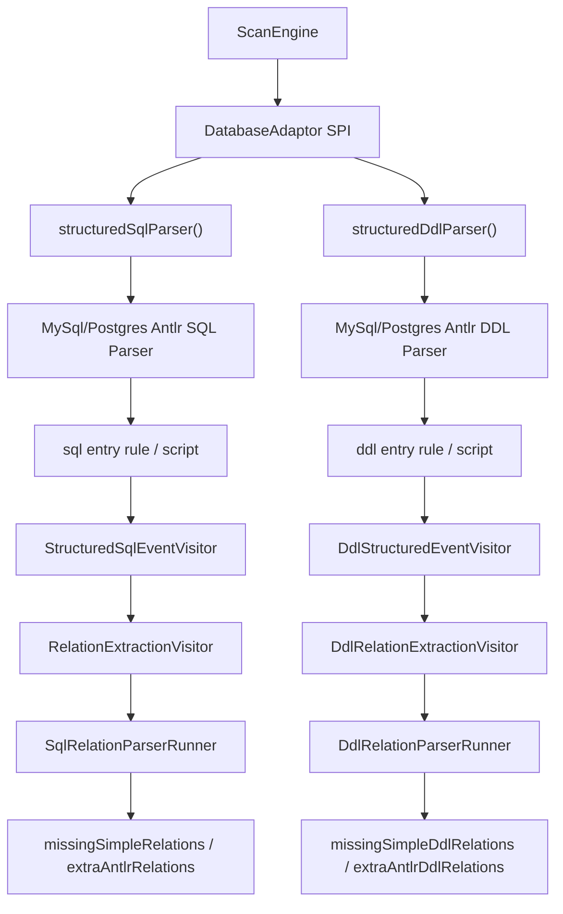

# Phase 6：SQL/DDL/对象解析增强详细设计

## 目标

增强通用 SQL/DDL/对象定义解析能力，统一支撑 MySQL 和 PostgreSQL adaptor 的关系证据生成。

Phase 4/5 可以先提供采集和基础解析；Phase 6 负责把 JOIN、子查询、表别名、schema 限定名、表共现等能力系统化，减少各数据库 adaptor 重复实现。

## 解析输入

输入来源统一抽象为：

```java
public record SqlStatementRecord(
    String sql,
    StatementSourceType sourceType,
    String sourceName,
    long startLine,
    long endLine,
    Map<String, Object> attributes
) {}
```

`sourceType`：

- `DDL_FILE`
- `PROCEDURE`
- `FUNCTION`
- `VIEW`
- `MATERIALIZED_VIEW`
- `TRIGGER`
- `EVENT`
- `RULE`
- `PACKAGE`
- `PACKAGE_BODY`
- `MIGRATION`
- `NATIVE_LOG`
- `PLAIN_SQL`

新增来源说明：

- `MATERIALIZED_VIEW`：PostgreSQL `pg_matviews` 等物化视图定义。解析策略与 view 类似，证据使用 `VIEW_JOIN`，但对象类型保持独立，方便运维理解刷新/持久化语义。
- `EVENT`：MySQL scheduler event。事件体可能包含 `INSERT ... SELECT`、`UPDATE`、`DELETE` 和 JOIN，证据按 procedure/function 处理。
- `RULE`：PostgreSQL rewrite rule。规则定义可能包含重写 SQL，证据按 view 类 SQL 处理。
- `PACKAGE` / `PACKAGE_BODY`：为 Oracle 后续 adaptor 预留。包体内的 procedure/function SQL 按持久化过程逻辑处理。
- `MIGRATION`：Flyway、Liquibase 或手写 migration SQL。它不是数据库持久对象，证据来源按 `PLAIN_SQL` 处理。

## 解析输出

输出 `RelationshipEvidence`：

```java
public record RelationshipEvidence(
    Endpoint source,
    Endpoint target,
    RelationType relationType,
    RelationSubType suggestedSubType,
    Evidence evidence,
    DirectionConfidence directionConfidence
) {}
```

说明：

- `suggestedSubType` 只是建议，最终 subtype 由 core 归并后确定。
- `directionConfidence` 标识方向是否可靠。
- 方向不可靠时，core 应退化为表级 `CO_OCCURRENCE`。

## ANTLR 迁移层

当前实现新增了 ANTLR 驱动的结构化解析前端，但不把它一次性切成唯一关系输出来源。

核心类型：

```java
public interface StructuredSqlParser {
  StructuredParseResult parseSql(SqlStatementRecord statement, AdaptorContext context);
}

public interface StructuredDdlParser {
  StructuredParseResult parseDdl(String ddl, String sourceName, AdaptorContext context);
}

public record StructuredParseResult(
    String backend,
    String dialect,
    String sourceName,
    List<StructuredSqlEvent> events,
    List<WarningMessage> warnings,
    Map<String, Object> attributes
) {}

public record StructuredSqlEvent(
    StructuredParseEventType type,
    String sourceName,
    long line,
    Map<String, Object> attributes
) {}
```

事件类型：

- `TABLE_REFERENCE`：ANTLR token stream 中识别出的 `FROM`、`JOIN`、`UPDATE`、`INTO` 后的表引用和 alias。
- `COLUMN_EQUALITY`：识别出的 `alias.column = alias.column` 谓词。
- `DDL_FOREIGN_KEY` / `DDL_INDEX`：ANTLR DDL event visitor 识别出的外键、inline references、source index、target unique/primary key 结构化事件。
- `DYNAMIC_SQL`：为后续可静态还原的动态 SQL 预留；当前不可还原时输出 warning。
- `PARSER_COMPARISON`：shadow mode 中 primary parser 与 ANTLR parser 的候选数量、缺失 Simple baseline、ANTLR 额外关系对比。

### 为什么 DDL Parser 和 SQL Parser 必须分层

ANTLR 只能把输入文本解析成 token stream 或 parse tree；它不直接知道哪些节点应该成为数据库关系证据。关系抽取、方向判断、证据类型和置信度评分仍然属于本系统自己的语义层。因此，即使 SQL 和 DDL 最终都可以使用 ANTLR，也不能把它们压成一个“万能 relation parser”。

DDL 输入描述的是数据库声明出来的结构事实：

```sql
CREATE TABLE orders (
  id bigint primary key,
  user_id bigint,
  CONSTRAINT fk_orders_user FOREIGN KEY (user_id) REFERENCES users(id)
);

CREATE UNIQUE INDEX uk_users_email ON users(email);
```

DDL 抽取目标是 `FOREIGN KEY`、inline `REFERENCES`、primary key、unique、普通 index、列定义、nullable、generated column、referential action 等事实。这里的 `orders.user_id -> users.id` 来自显式结构定义，通常是最高可信证据；`users.email` 的 unique index 本身不一定生成关系，但可以增强后续 SQL/DDL 候选的 `TARGET_UNIQUE` 证据。

SQL 输入描述的是应用或数据库对象实际如何使用表：

```sql
WITH recent_orders AS (
  SELECT user_id, account_id
  FROM orders
)
SELECT *
FROM recent_orders ro
JOIN users u ON ro.user_id = u.id
JOIN accounts a ON ro.account_id = a.id;
```

SQL 抽取目标是 `JOIN`、`WHERE` 等值谓词、`IN`、`EXISTS`、tuple comparison、CTE/derived table lineage、`UPDATE FROM`、`DELETE USING`、`MERGE USING`、`INSERT ... SELECT` 的 source-target 关系，以及不能确定列时的表级 `CO_OCCURRENCE`。这里的 `ro.user_id = u.id` 必须先经过 alias 和 CTE lineage 才能回溯到 `orders.user_id -> users.id`，置信度也应低于显式 FK。

两条链路最终都输出 `RelationshipCandidate`，但中间语义不同：

- evidence type 不同：DDL 会产生 `DDL_FOREIGN_KEY`、`DDL_INDEX` 等结构证据；SQL 会产生 `SQL_LOG_JOIN`、`VIEW_JOIN`、`PROCEDURE_JOIN`、`SQL_LOG_EXISTS` 等行为证据。
- confidence 不同：DDL 显式 FK 通常接近确定；SQL JOIN 需要结合 metadata、索引、命名、类型和出现次数做递增增强。
- 失败策略不同：某张表的 DDL 解析失败只影响该 DDL source；SQL log 中一条截断语句失败不能影响其它日志；routine 中动态 SQL 无法静态还原时应记录对象级 warning。
- primary 切换不同：DDL primary 要看 `missingSimpleDdlRelations`；SQL primary 要看 `missingSimpleRelations`。任一侧归零都不能证明另一侧可以切 primary。

### ANTLR entry rule 与调用关系

长期目标不是写一个跨数据库的 `relationSQL.g4`，而是在每个方言 grammar 下保留可共享的 lexer/parser 基础规则，并为 DDL 与 SQL 暴露不同入口和 visitor：

```text
DialectLexer / DialectParser
  -> ddl entry rule
     -> DdlStructuredEventVisitor
     -> DdlRelationExtractionVisitor
     -> DdlRelationParserRunner
  -> sql entry rule
     -> StructuredSqlEventVisitor
     -> RelationExtractionVisitor
     -> SqlRelationParserRunner
```

当前 tolerant grammar 仍可使用统一 `script` 入口，因为第一阶段更重视容错、日志截断和过程体混合语法；但这个入口只是迁移桥。后续如果替换为更完整的 MySQL/PostgreSQL grammar，应在同一方言 parser 中拆出类似 `ddlStatement/script` 和 `sqlStatement/script` 的入口，再分别交给 DDL visitor 与 SQL visitor。不能让一个 visitor 同时决定 DDL constraint、SQL join、日志噪声过滤和 primary fallback。

多态调用关系如下：



运行模式：

- `parser.sql.mode: simple`：只运行 `SimpleSqlRelationParser`，不执行 ANTLR 结构化解析。用于保守回归、排查 ANTLR 相关开销或差异。
- `parser.sql.mode: antlr-shadow`：返回 Simple 结果，同时完整运行 ANTLR structured parser 和 `RelationExtractionVisitor`，并通过 `PARSER_COMPARISON` 记录 `primaryCount`、`shadowCount`、`missingSimpleRelations`、`extraAntlrRelations`。该模式保留为回归对比和问题定位工具。
- `parser.sql.mode: antlr-primary`：MySQL/PostgreSQL 的默认灰度模式。返回 ANTLR 抽取结果；如果 `parser.sql.fallbackOnFailure: true` 且 ANTLR 缺失 Simple baseline，则记录 `ANTLR_PRIMARY_FALLBACK` warning，保留 `attributes.rawStatement` 和 `attributes.missingSimpleRelations`，最终返回 Simple 结果。SQL Server/Oracle adaptor 仍处于 future/fallback 阶段，不因 MySQL/PostgreSQL 通过而自动切 primary。

DDL parser 有独立运行模式，不能用 SQL primary 验收代替：

- `parser.ddl.mode: simple-ddl`：只运行现有 DDL parser，不执行 ANTLR DDL 结构化抽取。
- `parser.ddl.mode: antlr-ddl-shadow`：返回现有 DDL parser 结果，同时运行 ANTLR DDL structured parser 和 `DdlRelationExtractionVisitor`，并通过 `PARSER_COMPARISON` 记录 `missingSimpleDdlRelations`、`extraAntlrDdlRelations`。
- `parser.ddl.mode: antlr-ddl-primary`：默认灰度模式。返回 ANTLR DDL 抽取结果；如果 `parser.ddl.fallbackOnFailure: true` 且 ANTLR DDL 缺失 Simple DDL baseline，则记录 `ANTLR_DDL_PRIMARY_FALLBACK` warning，保留 `attributes.rawStatement` 和 `attributes.missingSimpleDdlRelations`，最终返回现有 DDL parser 结果。

DDL 切 primary 的门槛是 DDL 自己的 golden comparison 持续归零；SQL 切 primary 的门槛是 SQL 自己的 `missingSimpleRelations` 持续归零。两条线共享“ANTLR 可以多识别，但不能少于 Simple baseline”的原则，但 diagnostics 字段和测试矩阵分别维护。

当前落地边界：

- `relation-core` 使用 ANTLR 4 Maven plugin 生成三个 SQL grammar：
  - `RelationSql.g4`：core fallback tolerant grammar，保留给未知/后续数据库和通用测试。
  - `MySqlRelationSql.g4`：MySQL shadow grammar。第一期只做结构化 token/parser 分离，已把反引号 identifier 作为 MySQL quoted identifier；双引号是否作为 identifier 留给后续 `ANSI_QUOTES` capability flag。
  - `PostgresRelationSql.g4`：PostgreSQL shadow grammar。第一期已把双引号 identifier 和 dollar-quoted string 放在 PostgreSQL grammar 中；反引号不会被 PostgreSQL structured event visitor 当作表名。
- `AntlrStructuredSqlParser` 是抽象的结构化解析骨架：负责动态 SQL warning、统一 attributes、统一 `StructuredParseResult`。
- `MySqlAntlrSqlParser` / `PostgresAntlrSqlParser` 分别调用自己的 generated lexer/parser，并通过 `attributes.grammar`、`attributes.lexer`、`attributes.parser` 暴露真实后端。
- `StructuredSqlEventVisitor` 负责从 ANTLR token stream 抽取 `TABLE_REFERENCE` / `COLUMN_EQUALITY`。MySQL/PostgreSQL 分别有 `MySqlStructuredSqlEventVisitor` / `PostgresStructuredSqlEventVisitor`，用于隔离 identifier token 和 unquote 规则。当前已覆盖 comma table reference、multi-table DML、MERGE USING，以及跳过 `LATERAL` 这类 rowset modifier，避免把它当成物理表。
- `RelationExtractionVisitor` 已不再委托 `SimpleSqlRelationParser`。它从 `TABLE_REFERENCE`、`COLUMN_EQUALITY` 事件独立构造基础 FK-like / CO_OCCURRENCE 候选；方向判断、source type 映射、evidence score 与 Simple parser 保持一致，并复用 `SqlLineageResolver` 处理可安全回溯的 CTE/派生表列。
- `AntlrStructuredDdlParser` 输出 `DDL_FOREIGN_KEY` / `DDL_INDEX` 事件；`DdlRelationExtractionVisitor` 独立转换这些事件，覆盖 `CREATE TABLE ... FOREIGN KEY`、inline `REFERENCES`、`ALTER TABLE ... ADD CONSTRAINT`、`CREATE UNIQUE INDEX` 等核心 DDL 形态。
- MySQL/PostgreSQL adaptor 已拆出 `MySqlRelationExtractionVisitor` / `PostgresRelationExtractionVisitor`。当前二者继承共享实现；后续 MySQL-only 或 PostgreSQL-only 规则应进入对应子类。
- `ShadowSqlRelationParser` 默认返回 primary parser 结果，同时生成 ANTLR comparison diagnostics。diagnostics 会记录 `relationVisitor`，用于确认 shadow path 走的是数据库自己的 visitor，并记录 Simple baseline 缺失项，作为是否允许切 primary 的硬门槛。
- `DdlRelationParserRunner` 默认返回现有 DDL parser 结果，同时生成 DDL comparison diagnostics。diagnostics 会记录 `missingSimpleDdlRelations`，作为是否允许 DDL 切 primary 的硬门槛。

### 为什么 RelationExtractionVisitor 里仍然有正则

当前 SQL ANTLR 链路已经可以作为 MySQL/PostgreSQL 的灰度 primary，但它还不是“完整官方 grammar parse tree + 全语义 visitor”的最终形态。现阶段的职责边界是：

```text
ANTLR lexer/parser
  -> tolerant parser / token stream
  -> StructuredSqlEventVisitor 抽取 TABLE_REFERENCE、COLUMN_EQUALITY 等粗粒度事件
  -> RelationExtractionVisitor 用事件 + 少量语义兜底生成 RelationshipCandidate
```

因此，`RelationExtractionVisitor` 中仍保留少量 regex/scanner，原因如下：

- 当前 `RelationSql.g4`、`MySqlRelationSql.g4`、`PostgresRelationSql.g4` 仍是容错迁移 grammar，不是完整 MySQL/PostgreSQL 官方语法树。日志截断、routine/procedure 混合语法、动态 SQL、方言局部语法都要求 parser 能尽量产出诊断，而不是遇到一个不完整节点就丢弃整条语句。
- ANTLR 给出的只是语法结构，不直接给出业务关系语义。`o.user_id = u.id` 是否应变成 `orders.user_id -> users.id`、方向如何判断、是否要降级为表级共现，仍依赖命名、metadata、lineage、source type 和 evidence scoring。
- 一些关系抽取能力暂时还需要语义兜底，例如 tuple `IN`、raw equality、`JOIN USING` 表级共现、CTE/local temp rowset 忽略、系统 schema 和截断 token 过滤、derived/LATERAL alias 防伪表。这些逻辑必须在 `RelationExtractionVisitor` 中独立于 `SimpleSqlRelationParser` 存在，以保证 `antlr-primary` 不是借 Simple parser 间接通过。

允许保留的正则范围：

- 只用于关系语义兜底、diagnostics、防误报过滤或 tolerant grammar 尚未建模的边界语法。
- 必须有 correctness fixture 或单元测试覆盖，尤其要断言 `missingSimpleRelations=[]`、无非预期 fallback warning，并覆盖负向伪表断言。
- 不能把 DDL constraint/index 逻辑写入 SQL visitor；DDL-only regex/scanner 必须进入 DDL visitor/runner 链路。
- 不能重新调用 `SimpleSqlRelationParser.parse(...)` 作为 ANTLR 关系结果来源。

长期演进方向：

```text
MySqlAntlrSqlParser
  -> MySQL grammar parse tree
  -> MySqlSqlRelationVisitor
     直接访问 withClause / tableReference / joinSpec / predicate / subquery 等节点

PostgresAntlrSqlParser
  -> PostgreSQL grammar parse tree
  -> PostgresSqlRelationVisitor
```

当某一类 regex 能被完整 parse-tree visitor 替代时，实施顺序必须是：先把现有 correctness fixture 迁成新 visitor 的 golden 验收，再移除对应 regex，最后同步更新本设计文档和代码实现说明。不能只改代码而保留过时的“regex 过渡层”说明，也不能只改文档而让代码仍走旧兜底。

动态 SQL 策略：

```sql
SET @s = 'SELECT * FROM orders o JOIN users u ON o.user_id = u.id';
PREPARE stmt FROM @s;
EXECUTE stmt;
```

当前不会猜测拼接结果中的关系；parser 输出 `DYNAMIC_SQL_UNRESOLVED` warning，并在 `attributes.rawStatement` 保留完整 SQL。如果 SQL 来自数据库对象，warning attributes 还会透传 `objectSchema/objectName/objectType`；procedure/function 额外透传 `routineSchema/routineName/routineType`。后续如果能证明字符串是静态、无变量拼接，可作为独立任务做二次 parse。

## 表名和别名解析

支持：

- `FROM users u`
- `JOIN orders o`
- `schema.table alias`
- 反引号和双引号标识符。
- CTE 引用别名。
- FROM/JOIN 派生表别名。

别名表：

```text
u -> users
o -> orders
```

如果别名指向子查询：

- 优先交给 `SqlLineageResolver` 尝试解析输出列来源。
- 如果输出列是简单 `alias.column` 投影，可以回溯到真实表列。
- 如果输出列是表达式、聚合、窗口函数或 `SELECT *`，不生成精确列级 lineage。
- 如果无法映射列来源，只输出表级共现或跳过该列级关系，避免伪表误报。

详细设计：

- `docs/design/sql-lineage-resolver.md`

## CTE 和派生表列血缘

`SqlLineageResolver` 是 Phase 6 中的保守列血缘组件。它不替代完整 SQL parser，只处理能安全还原的投影列。

### CTE 示例

```sql
WITH x AS (
  SELECT c.region_id
  FROM customers c
)
SELECT *
FROM x
JOIN regions r ON x.region_id = r.id;
```

lineage：

```text
x.region_id -> customers.region_id
```

最终关系：

```text
customers.region_id -> regions.id
```

### 多层 CTE 示例

```sql
WITH recent_orders AS (
  SELECT o.id AS order_id, c.region_id
  FROM orders o
  JOIN customers c ON o.customer_id = c.id
),
regional_orders AS (
  SELECT ro.order_id, ro.region_id
  FROM recent_orders ro
)
SELECT *
FROM regional_orders x
JOIN regions r ON x.region_id = r.id;
```

lineage 逐层传播：

```text
regional_orders.region_id -> customers.region_id
x.region_id               -> customers.region_id
```

最终关系：

```text
customers.region_id -> regions.id
```

### 派生表和多层嵌套查询示例

```sql
SELECT *
FROM (
  SELECT inner_orders.order_id, inner_orders.customer_id
  FROM (
    SELECT o.id AS order_id, o.customer_id
    FROM orders o
  ) AS inner_orders
) AS projected_orders
JOIN customers c ON projected_orders.customer_id = c.id;
```

lineage：

```text
inner_orders.customer_id     -> orders.customer_id
projected_orders.customer_id -> orders.customer_id
```

最终关系：

```text
orders.customer_id -> customers.id
```

### LATERAL / correlated 派生表示例

PostgreSQL `LATERAL` 和部分相关派生表可以在子查询 SELECT list 中引用外层已经出现的 alias：

```sql
SELECT o.id, u.email
FROM orders o
JOIN LATERAL (
  SELECT o.user_id AS user_id
) x ON true
JOIN users u ON x.user_id = u.id;
```

lineage：

```text
x.user_id -> orders.user_id
```

最终关系：

```text
orders.user_id -> users.id
```

当前只支持这种“无本地 FROM、投影是外层 `alias.column`”的简单安全形态。LATERAL body 内部如果包含聚合、窗口函数、表达式投影、多表 JOIN 或 `SELECT *`，仍按普通复杂派生表边界处理，不生成不确定列级 lineage。

### 表达式投影不做强推断

```sql
WITH normalized_user_keys AS (
  SELECT COALESCE(a.user_id, b.user_id) AS user_id
  FROM account_events a
  LEFT JOIN backup_account_events b ON b.account_event_id = a.id
)
SELECT *
FROM normalized_user_keys nuk
JOIN users u ON nuk.user_id = u.id;
```

`nuk.user_id` 来自表达式 `COALESCE(a.user_id, b.user_id)`，不是单一确定源列。系统不会输出：

```text
account_events.user_id -> users.id
backup_account_events.user_id -> users.id
```

但仍会解析内部明确 JOIN：

```text
backup_account_events.account_event_id -> account_events.id
```

### 对置信度的影响

lineage 只说明“派生列来自哪个真实列”，不单独提高 confidence。

如果 lineage 还原后出现明确等值 JOIN，按原 JOIN evidence 评分，并在 evidence attributes 中记录：

```text
lineageResolved: true
```

是否提高最终置信度仍依赖更强证据，例如显式 FK、唯一索引、命名匹配、数据画像包含率、多来源重复出现等。

## JOIN 条件解析

优先支持等值 JOIN：

```sql
SELECT *
FROM orders o
JOIN users u ON o.user_id = u.id;
```

输出：

```text
orders.user_id -> users.id
Evidence: SQL_LOG_JOIN / VIEW_JOIN / PROCEDURE_JOIN
```

方向判断：

1. 如果一侧列是 PK/unique，另一侧不是，非唯一侧为 source。
2. 如果一侧列名形如 `user_id`，另一侧表名是 `users` 且列名是 `id`，`user_id` 为 source。
3. 如果是同一张表的不同列，且一侧是 `id`、另一侧是 `*_id`，允许作为受限 self-FK-like，例如 `employees.manager_id -> employees.id`。
4. 如果 metadata 显示已有 FK，使用 FK 方向。
5. 如果仍无法判断方向，退化为表级共现并记录 warning。

复杂 JOIN：

```sql
ON o.created_by = u.id OR o.updated_by = u.id
```

策略：

- 如果能拆成两个明确等值条件，生成两条候选。
- 如果不能安全拆分，生成表级共现。
- 同表同列比较不输出关系；同表不同列只有方向可判断时才输出 self-FK-like。

## WHERE 隐式 JOIN

支持：

```sql
SELECT *
FROM orders o, users u
WHERE o.user_id = u.id;
```

处理方式与显式 JOIN 相同，但 evidence detail 标记为 `where-equijoin`。

## IN 子查询

支持：

```sql
SELECT *
FROM orders o
WHERE o.user_id IN (SELECT u.id FROM users u);
```

输出：

```text
orders.user_id -> users.id
relationSubType: SUBQUERY_INFERRED_FK
evidence: SQL_LOG_SUBQUERY_IN
```

规则：

- 外层列为 source。
- 子查询投影列为 target。
- 如果子查询投影无法定位列，退化为表级共现。

## EXISTS 子查询

支持：

```sql
SELECT *
FROM users u
WHERE EXISTS (
  SELECT 1
  FROM orders o
  WHERE o.user_id = u.id
);
```

输出：

```text
orders.user_id -> users.id
evidence: SQL_LOG_EXISTS
```

规则：

- 从 EXISTS 内部 WHERE 等值条件识别列关系。
- 方向仍按 metadata、命名、唯一性判断。

## 多列 tuple comparison

支持纯列引用组成的 tuple equality：

```sql
SELECT *
FROM orders o
JOIN users u
  ON (o.tenant_id, o.user_id) = (u.tenant_id, u.id);
```

输出：

```text
orders.tenant_id -> users.tenant_id
orders.user_id   -> users.id
evidence: SQL_LOG_JOIN
```

规则：

- tuple 两侧列数量必须一致。
- 每一项必须是简单 `alias.column`，表达式、函数、`alias.*` 不处理。
- 如果某一个列对能明确方向，例如 `o.user_id -> u.id`，则整个 tuple 按该方向对齐输出。
- 如果方向冲突或无法从任何列对判断方向，不输出列级 FK-like。

支持纯列引用组成的 tuple `IN`：

```sql
SELECT *
FROM orders o
WHERE (o.tenant_id, o.user_id) IN (
  SELECT u.tenant_id, u.id
  FROM users u
);
```

输出：

```text
orders.tenant_id -> users.tenant_id
orders.user_id   -> users.id
evidence: SQL_LOG_SUBQUERY_IN
```

规则：

- 外层 tuple 为 source。
- 子查询 SELECT tuple 为 target。
- tuple 列数量不一致或出现表达式时跳过。

## UPDATE FROM、DELETE USING 和 MERGE

支持 PostgreSQL 风格写法：

```sql
UPDATE orders o
SET status = 'PAID'
FROM users u
WHERE o.user_id = u.id;
```

```sql
DELETE FROM orders o
USING users u
WHERE o.user_id = u.id;
```

支持 PostgreSQL/SQL 标准风格 `MERGE` 的基础 ON 关系：

```sql
MERGE INTO target_orders t
USING source_orders s
ON t.source_order_id = s.id
WHEN MATCHED THEN
  UPDATE SET synced_at = CURRENT_TIMESTAMP;
```

输出：

```text
orders.user_id -> users.id
evidence: SQL_LOG_JOIN
```

`MERGE` 示例输出：

```text
target_orders.source_order_id -> source_orders.id
evidence: SQL_LOG_JOIN
```

规则：

- `UPDATE <table> [alias]`、`DELETE FROM <table> [alias]`、`USING <table> [alias]` 都进入 alias map；有 alias 和无 alias 的写法都支持。
- `MERGE INTO <target> [alias]` 和 `USING <source> [alias]` 会进入 alias map，`ON` 中的等值 predicate 仍按普通 JOIN 规则判断方向。
- `WHEN MATCHED THEN UPDATE SET ...` 中的 `UPDATE SET` 不是独立 `UPDATE <table>`，不能把 `SET` 误当成表名。
- 关系识别仍由现有 equality parser 判断，不因为语句是写操作而自动生成关系。
- 当前只覆盖简单物理表名和 `MERGE ON` predicate；复杂 CTE write、`RETURNING` lineage、`MERGE UPDATE/INSERT` 写入列 lineage 仍属于边界。

## DDL 解析

`SimpleDdlParser` 是 core fallback parser，不是所有数据库方言的最终归宿。它负责识别跨数据库较稳定的 DDL 形态，并保持保守输出。已经确认属于 MySQL 或 PostgreSQL 的复杂差异，应优先放到 `MySqlDdlParser` 或 `PostgresDdlParser` 中，再统一输出 `RelationshipCandidate` / `Evidence`。

支持：

- `CREATE TABLE` 内联 PK/FK/unique。
- `ALTER TABLE ... ADD CONSTRAINT`。
- PostgreSQL `ALTER TABLE ONLY ... ADD CONSTRAINT ... FOREIGN KEY ... REFERENCES ... NOT VALID`。
- `CREATE INDEX`。
- `CREATE UNIQUE INDEX`。
- PostgreSQL `CREATE UNIQUE INDEX IF NOT EXISTS ... ON ... USING btree (...)`。
- PostgreSQL `CREATE UNIQUE INDEX ... ON ONLY ...` 由 `PostgresDdlParser` 归一化后进入 fallback。
- PostgreSQL covering unique index：`CREATE UNIQUE INDEX ... ON users(email) INCLUDE (id)`，只把 key column `email` 作为唯一证据，`INCLUDE` 列不参与关系推断。
- MySQL 反引号表名、索引名、约束名、`USING BTREE`、表选项和 `ON DELETE` / `ON UPDATE` referential actions。
- MySQL `CREATE UNIQUE INDEX ... USING BTREE ON ... VISIBLE/INVISIBLE` 由 `MySqlDdlParser` 归一化后进入 fallback。

DDL evidence：

- 外键生成 `DDL_FOREIGN_KEY`。
- unique 生成 metadata-like unique info 或 `TARGET_UNIQUE` 辅助 evidence。
- 普通索引生成 `SOURCE_INDEX` 辅助 evidence。

### DDL 关系证据和辅助证据边界

DDL parser 将 DDL 信息分成两类。

强关系证据：

- table-level FK：`FOREIGN KEY (customer_id) REFERENCES customers(id)`。
- inline FK：`customer_id BIGINT REFERENCES customers(id)`。
- alter FK：`ALTER TABLE orders ADD CONSTRAINT ... FOREIGN KEY (...) REFERENCES ...`。
- composite FK：`FOREIGN KEY (tenant_id, customer_id) REFERENCES customers(tenant_id, id)`。

这些会直接生成列级 `FK_LIKE`：

```text
orders.customer_id -> customers.id
Evidence: DDL_FOREIGN_KEY
```

复合 FK 会按列顺序生成多条候选关系，并在 evidence attributes 中记录：

```text
compositePosition: 1
compositeSize: 2
```

辅助置信度证据：

- source 侧普通全列索引：`INDEX idx_orders_user_id (user_id)` 生成 `SOURCE_INDEX`。
- source 侧 MySQL 普通全列索引：`` KEY `idx-orders-user` (`user_id`) USING BTREE `` 生成 `SOURCE_INDEX`。
- target 侧 `PRIMARY KEY` 生成 `TARGET_UNIQUE`。
- target 侧 full unique constraint/index 生成 `TARGET_UNIQUE`。
- target 侧 PostgreSQL non-partial covering unique index：`CREATE UNIQUE INDEX ... ON accounts(account_no) INCLUDE (id)` 生成 `TARGET_UNIQUE(account_no)`。

这些辅助 evidence 只会附加到已经存在的 FK candidate 上，不会单独生成关系。

保守跳过：

- PostgreSQL partial index：`CREATE UNIQUE INDEX ... WHERE deleted_at IS NULL`。
- expression/functional index：`CREATE UNIQUE INDEX ... ON users ((lower(email)))`。
- MySQL prefix index：`KEY idx_email (email(10))` 或 `` KEY `idx-email` (`email`(10)) ``。

原因：

- partial index 只对满足 predicate 的子集唯一，不能当成全局唯一。
- expression/functional index 不是直接物理列，不能等同于列唯一。
- prefix index 只索引列前缀，不代表完整列值索引。

这些信息后续可以作为“条件化 evidence”进入更高级的 scoring，但第一版不把它们当成强唯一性证据。

## 对象定义解析

对象定义先作为 SQL 文本解析，但 evidence 类型按来源区分：

- view 中 JOIN：`VIEW_JOIN`
- procedure/function 中 JOIN：`PROCEDURE_JOIN`
- trigger 中引用：`TRIGGER_REFERENCE`

同一 SQL 模式在不同来源中可信度不同。

## 表共现识别

当 SQL 中出现多个表，但没有明确列关系：

```sql
SELECT *
FROM users u, audit_logs l
WHERE l.action = 'LOGIN';
```

输出：

```text
users -> audit_logs
relationType: CO_OCCURRENCE
relationSubType: TABLE_CO_OCCURRENCE
evidence: SQL_LOG_TABLE_CO_OCCURRENCE
```

共现规则：

- 同一 statement 中出现两个或多个业务表。
- 无明确列级条件。
- 忽略系统表、临时表和被 exclude 的表。
- 多表共现会产生表对组合，但应设置单条 SQL 最大表数量阈值，避免大查询产生过多弱关系。

## 解析失败策略

单条 SQL/DDL 解析失败：

- 记录 warning。
- 保留来源文件、开始行号、结束行号。
- 在可取得输入文本时，保留原始失败 SQL/DDL 到 `warning.attributes.rawStatement`。
- 记录异常类型到 `warning.attributes.exceptionClass`，记录语句来源到 `warning.attributes.statementSourceType`。
- 数据库对象来源的 warning 直接带 `objectSchema/objectName/objectType`；procedure/function 额外带 `routineSchema/routineName/routineType`。
- 不中断整体扫描。

不可恢复错误：

- parser 初始化失败。

这些由 CLI 按错误码处理。

当前实现中，输入文件无法读取不直接中断整体扫描；DDL 文件读取失败记录 `DDL_PARSE_FAILED`，普通 SQL/object 文件读取失败记录 `SQL_FILE_EXTRACT_FAILED`，native log 文件读取失败记录 `LOG_EXTRACT_FAILED`。

边界：

- parser 正常返回空候选关系，不自动记录 warning。原因是很多 SQL 只做过滤、聚合或写入，不一定表达表关系。
- 如果未来引入完整 SQL AST parser，可以新增“语法明确不支持”的 warning，但仍不应把所有空结果当成失败。

## 验收标准

- JOIN、WHERE 隐式 JOIN、IN、EXISTS 均可提取列级关系。
- 简单 tuple equality 和 tuple `IN` 可按列顺序提取列级关系。
- PostgreSQL 风格 `UPDATE ... FROM`、`DELETE ... USING` 和基础 `MERGE INTO ... USING ... ON ...` 中的 alias 可被识别。
- 可安全回溯的 self-reference 能输出 self-FK-like，例如 `employees.manager_id -> employees.id`。
- 简单 LATERAL/correlated derived table 投影可回溯到外层物理表列，不输出 `LATERAL` 或 derived alias 伪表关系。
- schema 限定名和别名能正确映射。
- 复杂无法判定方向的关系不会错误输出列级 FK-like。
- DDL 外键和索引可转换为 evidence。
- 单条解析失败不影响其他语句。

## 测试设计

- simple join 测试。
- multiple join 测试。
- where equijoin 测试。
- `IN` 子查询测试。
- `EXISTS` 子查询测试。
- tuple equality 测试。
- tuple `IN` 子查询测试。
- `UPDATE ... FROM` alias 测试。
- `DELETE ... USING` alias 测试。
- `MERGE INTO ... USING ... ON ...` alias 测试。
- recursive CTE self-FK-like 测试。
- LATERAL/correlated derived table 简单列投影 lineage 测试。
- 函数型 rowset 负向测试，例如 `unnest(...) WITH ORDINALITY` 不输出物理表关系。
- evidence/confidence 断言测试，包括 source type、joinKind、辅助 evidence 后的最终 confidence。
- ANTLR shadow golden comparison 测试，确保 shadow path 不少于 primary baseline。
- schema.table 测试。
- quoted/backtick identifier 测试。
- subquery alias 测试。
- CTE 输出列 lineage 测试。
- 多层 CTE lineage 传播测试。
- derived table 输出列 lineage 测试。
- 多层嵌套 derived table lineage 测试。
- 表达式投影不产生精确 FK-like 的负向测试。
- ambiguous join 降级测试。
- DDL FK 测试。
- DDL unique/index 测试。
- DDL inline `REFERENCES` 测试。
- DDL `ALTER TABLE ADD FOREIGN KEY` 测试。
- DDL composite FK 列顺序对齐测试。
- DDL quoted schema-qualified identifier 测试。
- DDL partial/expression/prefix index 负向测试。
- parse failure warning 测试。
