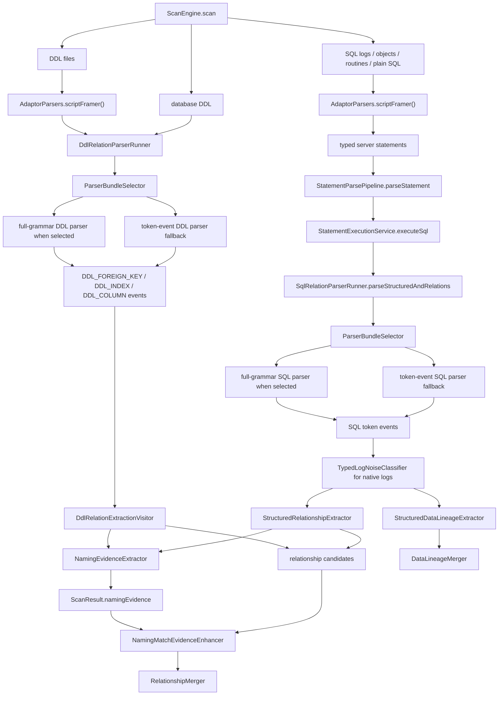
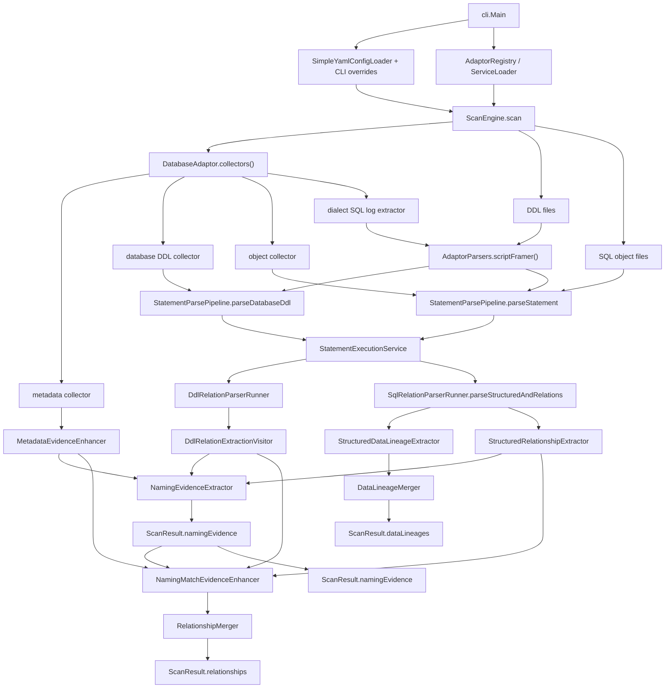
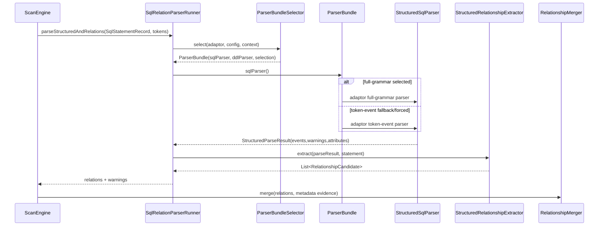
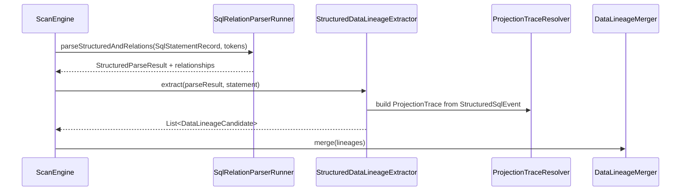
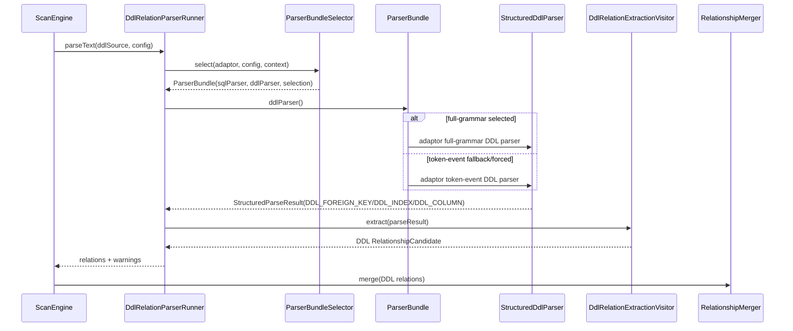
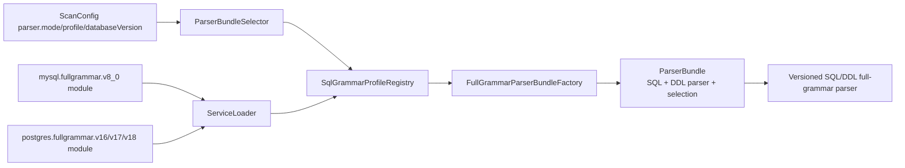
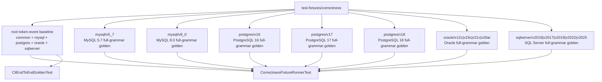

# Phase 6：SQL/DDL/对象解析增强详细设计

## 目标

Phase 6 描述当前代码中 SQL、DML、DDL、数据库对象解析如何生成 relationship 和 Data Lineage。本文按当前实现对齐，不再保留 Simple parser、旧 ANTLR primary/shadow、v2/current 等迁移期口径。

当前解析体系分成两种用户可见 parser mode：

- `token-event`：生产兜底解析链路。ANTLR 作为底层 lexer/parser 支撑；所有 `.g4` 位于 `relation-detector/grammar` 的独立 artifact，core/adaptor 只持有 typed visitor 和装配。common 同时通过 `database.type: common` 暴露为正式 CLI parser category，自然 benchmark 入口为 `sample-data/common-natural`，parser coverage 入口为 `sample-data/common-parser-coverage`；它不是任何方言 full-grammar 或 token-event 的 fallback facade。
- `full-grammar`：版本化完整 grammar 链路。MySQL 5.7/8.0、PostgreSQL 16/17/18、Oracle 12c/19c/21c/26ai 与 SQL Server 2016/2017/2019/2022/2025 的 full-grammar module 由 adaptor 提供，解析树 visitor 直接生成同一套结构事件。PostgreSQL 官方 Bison/Flex grammar 是 source-of-truth，仓库 `.g4` 是按 major version 维护的 ANTLR projection。Oracle 当前已有 versioned profile 和 sample-data versioned full-grammar golden，运行状态是 `INCOMPLETE_VERSIONED`；它不再桥接 token-event，也不代表已经覆盖 Oracle 官方完整语法。SQL Server 当前已有 sample-data versioned full-grammar golden，并已编码首批 source-backed 版本专属 T-SQL 语法边界；更广泛的 T-SQL family 硬化仍在 backlog。

默认 `parser.mode=auto`：如果能根据 database type、人工 profile、配置版本或 JDBC metadata 选中 full-grammar profile，则使用 full-grammar；否则使用 token-event。显式 `parser.mode=full-grammar` 时，如果 profile 不存在、版本不支持或 full-grammar hard failure，会记录 warning 并 fallback 到 token-event。profile 已选中后，full-grammar parser 自己返回 partial events / warning；这些 syntax warning 不触发 fallback。显式 `parser.mode=token-event` 时不启用 full-grammar。

关系方向、弱共现、Data Lineage transform、confidence 和 JSON 输出不在 `.g4` 里实现，而在 Java 语义层实现。

### Hard Boundaries

- 命名启发式只属于 `core.naming.NamingRuleEngine`。它不负责 namespace resolution、endpoint equality 或 dialect function/operator classification；这些都是 exact typed semantics，不是 name guess。
- full-grammar adaptor 只能从 typed generated context 和 `FullGrammarParseTreeAdapter` 的 typed accessors 取得列、rowset、function、operator、constraint 和 child context。禁止按 grammar rule name、反射、terminal leaf text 或 raw SQL regex 推断结构；`DialectFunctionSemanticRegistry` 只对解析出的精确 function symbol 分类。
- parser/framer 保留 SQL 显式写出的 catalog、schema、quote 和标识符拼写。对于 bare table，
  production scan 可使用已经规范化且唯一的 `ScanScope` / source-object namespace 物化
  `TableId` / `ColumnRef` / `Endpoint`；没有唯一上下文时保持 bare。显式限定名不得被默认
  namespace 覆盖，bare 也不得按名称与任意 qualified endpoint 自动等价。
- `CanonicalIdentifierResolver` 只使用 dialect `IdentifierRules` 与显式 `NamespaceContext` 做
  exact identifier resolution，并同时服务 endpoint materialization 与 canonical key；它不是 naming
  heuristic，也不能搜索同名表或执行 schema 降级匹配。
- `NAMING_MATCH` 只通过 `evidenceRef` 指向 top-level `namingEvidence`。relationship 不携带重复的 naming observations，也不能局部重算 naming rule。

## 当前包结构

核心职责分布。下列源码路径均位于仓库根的 `relation-detector/` 目录下：

```text
core/src/main/java/com/relationdetector/core/parser
  ParserBundle / ParserBundleSelector / ParserSelectionResult
  SqlRelationParserRunner
  DdlRelationParserRunner

core/src/main/java/com/relationdetector/core/tokenevent
  CommonTokenEventStructuredSqlParser
  TypedDialectTokenEventStructuredSqlParser
  CommonTokenEventParseTreeVisitor
  CommonTokenEventExpressionSupport / CommonTokenEventWriteDdlSupport
  CommonTokenEventVisitorState
  TokenEventEventEmitter / TokenEventUnknownStatementDiagnostics
  TokenEventStructuredDdlParser

core/src/main/java/com/relationdetector/core/common
  CommonDatabaseAdaptor

core/src/main/java/com/relationdetector/core/fullgrammar
  FullGrammarDialectModule
  SqlGrammarProfile / SqlGrammarProfileRegistry / SqlGrammarProfileSelection
  FullGrammarParserBundleFactory
  FullGrammarStructuredSqlParserFactory
  FullGrammarDdlParserFactory
  FullGrammarStructuredSqlParser
  FullGrammarEventFacade
  RowsetScopeSink / ProjectionEventSink / PredicateEventSink / WriteMappingSink / SourceLocationSupport
  FullGrammarExpressionAnalyzer / FullGrammarExpressionAnalysis

core/src/main/java/com/relationdetector/core/relation
  StructuredSqlRelationshipParser
  StructuredRelationshipExtractor
  DdlRelationExtractionVisitor
  RelationshipMerger

core/src/main/java/com/relationdetector/core/naming
  NamingEvidenceExtractor
  NamingEvidenceMerger
  NamingMatchEvidenceEnhancer
  NamingRuleEngine / NamingRuleSet

core/src/main/java/com/relationdetector/core/identity
  CanonicalIdentifierResolver / CanonicalEndpointKey / NamespaceContext

core/src/main/java/com/relationdetector/core/script
  ScriptFileExtractor / StructuredScriptFramer / CommonScriptFramer
  ScriptDialect / ScriptLexeme / ScriptLexemeKind
  ScriptSlicePlanner / ScriptFramingSupport
  MySqlScriptSlicePlanner / PostgresScriptSlicePlanner / OracleScriptSlicePlanner
  CommonScriptSlicePlanner / SqlServerScriptSlicePlanner

core/src/main/java/com/relationdetector/core/lineage
  StructuredDataLineageExtractor
  ProjectionTraceResolver
  DataLineageMerger

core/src/main/java/com/relationdetector/core/scan
  ScanEngine / SourceCollectorPipeline / StatementParsePipeline
  StatementExecutionService / EvidenceEnhancementService / ResultAssembler

core/src/main/java/com/relationdetector/core/lineage/model
  ProjectionTrace / ExpressionSourceSet / AssignmentMapping / RoutineScope / WriteTarget

core/src/main/java/com/relationdetector/core/ddl
  package-info.java

grammar/
  common-token-event / common-script
  mysql-token-event / mysql-script
  mysql-v5_7 / mysql-v8_0
  postgres-token-event / postgres-script
  postgres-v16 / postgres-v17 / postgres-v18
  postgres-plpgsql-token-event / plpgsql-v16 / plpgsql-v17 / plpgsql-v18
  oracle-token-event / oracle-script
  oracle-v12c / oracle-v19c / oracle-v21c / oracle-v26ai
  sqlserver-token-event / sqlserver-script
  sqlserver-v2016 / sqlserver-v2017 / sqlserver-v2019 / sqlserver-v2022 / sqlserver-v2025
  # .g4 和 generated lexer/parser/base visitor 的独立 Maven artifacts
```

Adaptor 负责具体数据库和大版本：

```text
adaptor-mysql/src/main/java/com/relationdetector/mysql/tokenevent
  MySqlTokenEventStructuredSqlParser
  MySqlTokenEventStructuredDdlParser

adaptor-mysql/src/main/java/com/relationdetector/mysql/fullgrammar/common
  MySqlFullGrammarParseSupport
  AbstractMySqlFullGrammarStructuredSqlParser
  AbstractMySqlFullGrammarStructuredDdlParser
  MySqlSqlEventVisitorCore
  MySqlDdlEventSink
  MySqlExpressionContextAdapter
  MySqlFullGrammarExpressionAnalyzer
  MySqlAggregateExpressionSupport / MySqlConditionalExpressionSupport
  MySqlRuntimeFunctionSupport / MySqlUpdateControlSupport / MySqlTransformSemantics

adaptor-mysql/src/main/java/com/relationdetector/mysql/fullgrammar/v5_7
adaptor-mysql/src/main/java/com/relationdetector/mysql/fullgrammar/v8_0
  FullGrammarDialectModule
  FullGrammarBinding
  MySqlFullGrammarStructuredSqlParser
  MySqlFullGrammarStructuredDdlParser
  MySqlFullGrammarParseTreeVisitor
  MySqlExpressionAnalyzer / MySqlParseTreeAdapter
  MySqlFullGrammarDdlEventCollector

adaptor-postgres/src/main/java/com/relationdetector/postgres/tokenevent
  PostgresTokenEventStructuredSqlParser
  PostgresTokenEventStructuredDdlParser

adaptor-postgres/src/main/java/com/relationdetector/postgres/fullgrammar/v16
adaptor-postgres/src/main/java/com/relationdetector/postgres/fullgrammar/v17
adaptor-postgres/src/main/java/com/relationdetector/postgres/fullgrammar/v18
  FullGrammarDialectModule
  FullGrammarBinding
  PostgresFullGrammarParseTreeVisitor
  PostgresFullGrammarDdlEventCollector

adaptor-postgres/src/main/java/com/relationdetector/postgres/routine
  PostgresRoutineLanguageDispatcher / PostgresRoutineDescriptor
  PlPgSqlBodyParser / GeneratedPlPgSqlBodyParserSupport

adaptor-postgres/src/main/java/com/relationdetector/postgres/plpgsql
  tokenevent/GeneratedPlPgSqlBodyParser
  v16/GeneratedPlPgSqlBodyParser
  v17/GeneratedPlPgSqlBodyParser
  v18/GeneratedPlPgSqlBodyParser

adaptor-oracle/src/main/java/com/relationdetector/oracle/tokenevent
  OracleTokenEventStructuredSqlParser
  OracleTokenEventStructuredDdlParser

adaptor-oracle/src/main/java/com/relationdetector/oracle/fullgrammar/v12c
adaptor-oracle/src/main/java/com/relationdetector/oracle/fullgrammar/v19c
adaptor-oracle/src/main/java/com/relationdetector/oracle/fullgrammar/v21c
adaptor-oracle/src/main/java/com/relationdetector/oracle/fullgrammar/v26ai
  FullGrammarDialectModule
  FullGrammarBinding
  OracleFullGrammarParseTreeVisitor

adaptor-oracle/src/main/java/com/relationdetector/oracle/fullgrammar/common
  OracleFullGrammarParseTreeEventCollector
  OracleFullGrammarParseTreeSupport
  OracleFullGrammarExpressionSupport / OracleExpressionTransformSupport
  OracleFullGrammarDdlCollector / OracleFullGrammarEventEmitter / OracleRoutineSymbolCollector

adaptor-sqlserver/src/main/java/com/relationdetector/sqlserver/tokenevent
  SqlServerTokenEventStructuredSqlParser
  SqlServerTokenEventStructuredDdlParser

adaptor-sqlserver/src/main/java/com/relationdetector/sqlserver/fullgrammar/common
  SqlServerFullGrammarStructuredSqlParser
  SqlServerFullGrammarStructuredDdlParser
  SqlServerParseTreeEventCollector
  SqlServerParseTreeSupport
  SqlServerDdlEventCollector
  SqlServerExpressionAnalyzer / SqlServerWriteControlSupport

adaptor-sqlserver/src/main/java/com/relationdetector/sqlserver/fullgrammar/v2016|v2017|v2019|v2022|v2025
  FullGrammarBinding
  SqlServer*FullGrammarDialectModule
```

版本由 package 表达，例如 `postgres.fullgrammar.v16`、`mysql.fullgrammar.v8_0`、`oracle.fullgrammar.v19c`、`sqlserver.fullgrammar.v2022`。类名不再写 `Postgres16` / `MySql80`。core 只通过 `ServiceLoader<FullGrammarDialectModule>` 加载 adaptor module，不直接 import MySQL/PostgreSQL/Oracle/SQL Server full-grammar 实现。version package 不再持有 `.g4` 或 generated Java；它们依赖 `grammar/*` 中对应的独立 artifact，只保留 binding、profile/version policy 和少量 typed context adapter。

Visitor/collector 采用职责拆分的 per-parse state：遍历类只访问 typed context，共享 helper 分别处理 rowset/projection/predicate/write/DDL/expression/source provenance，不使用 static mutable state。架构测试对 parser 目录下的 visitor/collector 设置 400 行上限，并对 Analyzer/Support/Extractor/Resolver/Merger/Framer/Facade 设置 450 行上限；generated Java、top-level record DTO 与 `package-info` 排除，不设永久 allowlist。`StructuredScriptFramer` 仅保留编排，五种 dialect slice 算法已分别进入独立 planner，并由额外的 200/250 行职责门禁保护。top-level record DTO 豁免通过 JDK compiler AST 检查真实顶层声明；普通类注释或字符串中的伪 `record` 不能绕过门禁。双语设计注释门禁覆盖 `Engine/Pipeline/Service/Collector/Extractor/Resolver/Merger/Framer/Analyzer/Visitor/Writer/Validator/Registry/Builder/Assembler/Assembly/Factory/Index/Facade/Executor/Runner/Scheduler/Loader/Normalizer/Dispatcher/Selector`；本轮实际命中的编排类及超过 40 行的方法均具有明确的输入、输出、上下游和失败/禁止职责说明。门禁验证结构，描述准确性仍由代码评审确认。

## 代码结构注释索引

生产代码的结构性注释分成三层：package 的 `package-info.java` 说明职责、输入、输出、上下游和禁止边界，生产类 Javadoc 说明文件在链路中的位置，关键 public 方法 / 大型编排方法说明调用意图与失败边界。中文和 English 应说明同一职责边界，避免后续维护者只靠类名猜测调用方向。compiler/doc-tree 架构门禁会拒绝缺失的双语 package contract、过短的公开边界说明、TODO/TBD 以及已知泛化模板；它不能自动证明描述与实现完全一致，内容准确性仍需代码评审。编排 suffix 已覆盖 `Executor/Runner/Scheduler/Loader/Normalizer/Dispatcher/Selector`；`ScanTaskExecutor`、`SingleScanRunner`、`BatchScheduler`、`BatchManifestLoader` 和 `SemanticSectionNormalizer` 及其大型编排方法已经进入强制检查。

| Package | 结构职责 |
| --- | --- |
| `contracts` | 公共 enum 入口。 |
| `contracts.model` | relationship、Data Lineage、endpoint、evidence、warning 等跨模块模型。 |
| `contracts.metadata` | catalog facts 和 metadata snapshot。 |
| `contracts.parse` | SQL/DDL/object 解析输入输出契约，包括 statement、event、parse result。 |
| `contracts.spi` | DatabaseAdaptor、collector、parser、profile、scope 等 SPI。 |
| `contracts.scoring` | 默认 evidence score 常量。 |
| `core.scan` | 扫描编排：连接配置、adaptor、metadata、parser、merger 和 ScanResult。 |
| `core.parser` | SQL/DDL runner：执行 parser.mode/profile 选择并调用语义 extractor。 |
| `core.tokenevent` | token-event 事件来源：common typed grammar、方言 typed parser 生命周期和结构事件模型。 |
| `core.common` | Common portable SQL 的 CLI adaptor 装配：把 common token-event SQL/DDL parser 暴露为 `database.type: common`，只支持离线 file sources，不做 live catalog。 |
| `core.fullgrammar` | full-grammar 通用基础设施：profile/module registry、bundle factory、共享 event helper。 |
| `core.relation` | relationship 语义：SQL/DDL events -> RelationshipCandidate，以及 relationship merge。 |
| `core.naming` | 唯一的命名启发式边界：top-level naming evidence 的抽取/合并、`NamingRuleEngine` 和已有关系的 `NAMING_MATCH` 引用增强。 |
| `core.identity` | 基于方言 `IdentifierRules` 和显式 namespace context 的精确标识符解析与 endpoint key；不执行命名猜测。 |
| `core.script` | 由 dialect generated script lexeme 驱动的 client-script framing 和 file extraction。 |
| `core.lineage` | Data Lineage 语义：write mapping/projection/derived lineage -> DataLineageCandidate。 |
| `core.lineage.model` | ProjectionTrace、ExpressionSourceSet、AssignmentMapping 等结构化字段血缘中间模型。 |
| `core.ddl` | DDL 职责边界说明包；当前 token-event DDL parser 实现在 `core.tokenevent`，DDL relationship 转换在 `core.relation`。 |
| `core.parse` | 通用 ANTLR parse support、syntax diagnostics 和 dialect 标识。 |
| `core.log` | source-name normalization 和 structured parse 后的 `TypedLogNoiseClassifier`。 |
| `core.metadata` | metadata evidence 增强：unique/index/type evidence。 |
| `core.output` | ScanResult JSON/table 渲染。 |
| `core.diagnostics` | warning 构造工厂。 |
| `core.scoring` | relationship confidence 计算。 |
| `cli` | YAML/CLI 参数、adaptor 发现、ScanEngine 调用和输出。 |
| `mysql` / `postgres` / `oracle` / `sqlserver` | adaptor 装配：metadata、object/log/DDL collector、token-event parser、full-grammar module。 |
| `mysql.tokenevent` / `postgres.tokenevent` / `oracle.tokenevent` / `sqlserver.tokenevent` | 方言 token-event parser 入口。各自依赖独立 `grammar/*-token-event` artifact，不 import full-grammar parser。 |
| `mysql.routine` / `postgres.routine` / `oracle.routine` | 方言 routine scope policy、body descriptor 或 dispatcher；供 token-event 和 full-grammar 调用，不放在 core，也不挂在 full-grammar 专属目录下。SQL Server 没有独立 `sqlserver.routine` package，routine scope 由其 typed visitor/state 处理。PostgreSQL generated PL/pgSQL shell 位于独立的 `postgres.plpgsql.tokenevent|v16|v17|v18` package，不能把 `postgres.routine` 写成 grammar module。 |
| `mysql.fullgrammar.common` / `postgres.fullgrammar.common` / `oracle.fullgrammar.common` / `sqlserver.fullgrammar.common` | full-grammar 公共 parse support、binding、visitor core、expression analyzer 和 DDL event core。 |
| `mysql.fullgrammar.v5_7` / `mysql.fullgrammar.v8_0` / `postgres.fullgrammar.v16` / `postgres.fullgrammar.v17` / `postgres.fullgrammar.v18` / `oracle.fullgrammar.v12c` / `oracle.fullgrammar.v19c` / `oracle.fullgrammar.v21c` / `oracle.fullgrammar.v26ai` / `sqlserver.fullgrammar.v2016` / `v2017` / `v2019` / `v2022` / `v2025` | 版本化 full-grammar generated parser binding、profile module 和少量 version policy / bridge。Oracle 当前是 `INCOMPLETE_VERSIONED` generated parser；SQL Server 已有首批 source-backed 版本边界，更多 T-SQL family 裁剪仍在 backlog。 |

审视结论：模块依赖方向与本文职责表一致：core 不直接承载 MySQL/PostgreSQL/Oracle/SQL Server 版本实现，adaptor 不承载最终 relationship/lineage merger，contracts 不依赖 core。原超限 expression/relationship/lineage 入口已经抽出 helper，script framing 也已按五种 dialect planner 拆分。详见 `code-design-traceability.md`。

## 解析输入和输出

SQL、DML、对象定义统一进入：

```java
public record SqlStatementRecord(
    String sql,
    StatementSourceType sourceType,
    String sourceName,
    long startLine,
    long endLine,
    Map<String, Object> attributes
) {}
```

结构 parser 输出：

```java
public record StructuredParseResult(
    String backend,
    String dialect,
    String sourceName,
    List<StructuredSqlEvent> events,
    List<WarningMessage> warnings,
    Map<String, Object> attributes
) {}

public sealed interface StructuredSqlEvent
    permits RowsetEvent, PredicateEvent, ProjectionEvent,
            WriteEvent, DdlEvent, DynamicSqlEvent {
    StructuredParseEventType type();
    SourceProvenance provenance();
}

public record ExpressionTrace(
    List<ExpressionSource> valueSources,
    List<ExpressionSource> controlSources,
    TransformType transformType,
    ExpressionSource directColumn
) {}
```

事件不再携带 parser-level `Map<String,Object> attributes`。rowset、predicate、projection、write、DDL、
dynamic SQL 和 provenance 字段都由 sealed event / record 编译期约束；token-event 与 full-grammar
只共享这个 typed contract，不互相 delegate。

当前结构事件枚举包含：

```text
TABLE_REFERENCE                 // legacy/bootstrap event，不作为当前 semantic extractor 主输入
COLUMN_EQUALITY                 // legacy/bootstrap event，builder 会归一成 PREDICATE_EQUALITY
ROWSET_REFERENCE
PREDICATE_EQUALITY
JOIN_USING_COLUMNS
EXISTS_PREDICATE
IN_SUBQUERY_PREDICATE
TUPLE_IN_SUBQUERY_PREDICATE
CTE_DECLARATION
IGNORED_ROWSET
LOCAL_TEMP_TABLE_DECLARATION
TRIGGER_TARGET_TABLE
TRIGGER_PSEUDO_ROWSET
WRITE_TARGET
UPDATE_ASSIGNMENT
INSERT_SELECT_MAPPING
MERGE_WRITE_MAPPING
PROJECTION_ITEM
EXPRESSION_SOURCE
DDL_FOREIGN_KEY
DDL_INDEX
DDL_COLUMN
DYNAMIC_SQL
```

`StructuredRelationshipExtractor` 消费的是 `ROWSET_REFERENCE`、`PREDICATE_EQUALITY`、`JOIN_USING_COLUMNS`、`EXISTS_PREDICATE`、`IN_SUBQUERY_PREDICATE`、`TUPLE_IN_SUBQUERY_PREDICATE`、`PROJECTION_ITEM` 和 scope events。`StructuredDataLineageExtractor` 消费 `WRITE_TARGET`、`UPDATE_ASSIGNMENT`、`INSERT_SELECT_MAPPING`、`MERGE_WRITE_MAPPING`、`PROJECTION_ITEM`、`LOCAL_TEMP_TABLE_DECLARATION` 等事件。`DdlRelationExtractionVisitor` 消费 `DDL_FOREIGN_KEY`、`DDL_INDEX` 和 `DDL_COLUMN`；其中 `DDL_COLUMN` 只补充 column inventory / naming evidence，不直接创建 relationship。

## 总体调用链



当前生产 `ScanEngine.scan(...)` 只保留对外编排入口；source collection 进入 `SourceCollectorPipeline`，单条 SQL/DDL 进入 `StatementParsePipeline`，再由 `StatementExecutionService` 调用 `SqlRelationParserRunner.parseStructuredAndRelations(...)` 或 DDL runner。生产 SQL 语句只做一次结构化解析，同时得到 relationship candidates 和可供 Data Lineage 使用的 `StructuredParseResult`。SQL naming rule 在 statement 层不执行，只在 scan-level relationship merge 后由 `EvidenceEnhancementService` 统一生成 top-level naming evidence。这样生产 scan 中 SQL/DML 的 parser mode、profile selection、fallback warning 和 diagnostics 在同一条语句内保持一致。

`ScanConfig` 只在 parser bundle 选择和 typed log-noise policy 的实际拥有者路径中使用；SQL runner
直接把原始 `SqlStatementRecord` 交给共享 parser 执行边界。迁移期的空 policy-attribute helper 与 direct SQL
execution 无效 config overload 已删除。correctness 的 common fixture 调用无 config direct API，
其它方言/profile fixture 调用 production adaptor/runner API；两类入口都复用
`StructuredSqlParseExecutor`。fallback relationship parser 获得 detached context，其 candidate 与 warning 全批通过
`AdaptorResultContractValidator` 后才转发，因此 parser 失败或 SPI 违约不会留下前序部分状态。

所有 `StructuredSqlParser` consumer 与 `StructuredDdlParser` runner 都经过独立的全批契约边界：
SQL 的 production runner、direct statement service 和 relationship facade 共用 `StructuredSqlParseExecutor`，
使用 detached context 和临时 warning buffer；DDL runner 使用相同 validator 的 DDL 入口。
`AdaptorParseResultContractValidator` 校验整个 `StructuredParseResult` 的 event family、必需 typed payload、
statement source/line/object/block provenance、attributes 与 warnings 后，才允许事实抽取和 warning 提交。
任何 contract violation 都不会留下前序部分状态，也不得触发 token-event fallback。
对外部文件，parser event 可以保留输入 statement 已声明的绝对 `sourceFile`；validator 要求两者精确
绑定，但不在 parser trust boundary 把输入路径当作插件伪造。公开 JSON / verification artifact 的绝对路径
禁止仍是独立的输出契约。

`SourceCollectorPipeline` 在 statement task 内让 `AdaptorContractException` 越过普通 parse warning
recovery；`ScanTaskExecutor` 在串行路径直接传播，在并行 `Future.get()` 路径识别 cause 后原样传播。
因此 single 与 batch 都保持 `ADAPTOR_ERROR`，不会因并发模式降级为 `SCAN_RUNTIME_ERROR`。

## 详细函数级调用结构

本节按代码入口列出当前 DDL / DML / relationship / lineage 的实际调用关系。代码侧结构注释见各 package 的 `package-info.java`，本节是这些注释在详细设计里的展开。

### ScanEngine 总编排



关键代码入口：

| 阶段 | 代码入口 | 说明 |
| --- | --- | --- |
| CLI 装配 | `cli.Main` | 读取 YAML/CLI、发现 adaptor、创建 `ScanConfig` 和 `ScanEngine`。 |
| 扫描编排 | `core.scan.ScanEngine.scan(...)` | 创建 scan context，管理 JDBC connection lifecycle，并委托 source collection、statement parse、evidence enhancement 和 result assembly。 |
| Source collection | `core.scan.SourceCollectorPipeline` | 收集 metadata、database DDL、database object、data profile、DDL file、object file 和 SQL log。 |
| SQL/DDL 单条执行 | `core.scan.StatementParsePipeline` / `StatementExecutionService` | 普通单条 SQL、object block 或 DDL source 失败生成 warning 并继续后续输入；`AdaptorContractException` 属于不可恢复契约错误，应在串行和并行路径均原样上抛。同一服务被 production scan 和 correctness fixture 复用。 |
| relationship merge | `core.relation.RelationshipMerger` | 合并 SQL、DDL、metadata evidence 后的 relationship candidates。 |
| lineage merge | `core.lineage.DataLineageMerger` | 独立合并字段血缘，不参与 relationship confidence。 |

### SQL relationship 调用链



结构事件来源可以不同，但 relationship 语义入口只有 `StructuredRelationshipExtractor`。因此 full-grammar 和 token-event 对 FK-like 方向、列级/表级弱共现、self-join、EXISTS 去重使用同一套规则。parser selection 由 `ParserBundleSelector` 统一完成，SQL runner 不再重复实现 full-grammar/profile fallback。

### SQL Data Lineage 调用链



Data Lineage v1 只输出数据库内部字段血缘。参数、literal、JSON path、局部变量不是 source endpoint；显式 `CREATE TEMPORARY/TEMP TABLE` 产生的本地临时表 scope 会过滤对应 lineage。过滤依据必须来自语法结构或结构事件，不允许用特殊表名/列名猜测。

### DDL relationship 调用链



DDL parser 负责产出 `DDL_FOREIGN_KEY` / `DDL_INDEX` / `DDL_COLUMN` 结构事件。`DdlRelationExtractionVisitor` 负责把 FK/index 事件转换为 relationship，并把 column inventory 交给 naming/evidence 链路。它不解析 SQL/DML，也不承担 Data Lineage。

### full-grammar module 注入链



core 只知道 `FullGrammarDialectModule` 接口和 profile selection 规则，不直接 import `adaptor-mysql` / `adaptor-postgres` 的版本实现。`ParserBundleSelector` 是唯一运行时选择入口，SQL/DDL runner 都从同一个 bundle 取 parser。新增大版本时应在对应 adaptor 中新增 version package、module registration 和对应 versioned correctness fixture。

### correctness / golden 验收链



root baseline 明确使用 `parserMode: token-event`；versioned 目录明确使用 `parserMode: full-grammar` 和对应 `grammarProfile`。不再用 token-event baseline 保护 full-grammar，也不做跨 parser 补齐验收；每个 parser 必须直接通过自己的 correctness golden。这样 full-grammar 漏识别会在 `mysql/v5_7`、`mysql/v8_0`、`postgres/v16`、`postgres/v17`、`postgres/v18`、`oracle/v12c|v19c|v21c|v26ai`、`sqlserver/v2016|v2017|v2019|v2022|v2025` 的独立 golden 中暴露，而不是被 token-event 对比机制掩盖。

`CorrectnessFixtureRunnerTest` 的测试框架当前拆成四层，避免测试链路和生产链路分叉：

```text
CorrectnessFixtureExecutor
  -> FixtureInputLoader       // manifest/input/expected JSON/object block split
  -> FixtureExecutionEngine   // calls StatementExecutionService + EvidenceEnhancementService
  -> GoldenAssertion          // relation/lineage/diagnostics/naming evidence assertions
  -> GoldenWriter             // only writes expected JSON when updateCorrectnessGold=true
```

SQL correctness fixture 通过 `StatementExecutionService` 执行，并复用 structured parser、relationship、lineage 与 naming enhancement 语义。方言/profile fixture 进入 production runner；common fixture 使用 direct structured-parser overload，但该入口与 runner 共用 `StructuredSqlParseExecutor` 的 detached context、完整 result validator 和延迟 warning 提交边界。因此 common correctness 可同时保护 parser facts/golden 与 direct SPI trust boundary。SQL naming rule 不在 statement 层提前执行；correctness 与正式 scan 都在合并 relationship candidates 后，由 scan-level `EvidenceEnhancementService` 调用 `NamingEvidenceExtractor` 一次生成 `NamingEvidencePool`。DDL fixture 仍通过 `StatementExecutionService` 和 DDL runner 执行，保持 parser-outcome 验收语义，其 typed DDL inventory 可产生 DDL naming observation，但不额外引入 scan-level metadata enhancement。

structured parse 完成后统一执行 `StructuredParseProvenanceNormalizer`：它不覆盖显式
`StatementSourceType`，只把普通 statement 根据 typed events 规范为 `SQL_WRITE`、`QUERY`、`DDL`
或 `UNKNOWN`。通用 script framer、live-object 装配和 routine dispatcher均保留精确
`FUNCTION/PROCEDURE/PACKAGE/PACKAGE_BODY/EVENT/TRIGGER`对象类型，并通过`sourceObjectIdentity`
传播事件身份。PostgreSQL full/live路径使用输入参数类型signature；compact token-event使用typed
声明statement identity。返回trigger的函数仍为`FUNCTION`，只有`CREATE TRIGGER`为`TRIGGER`。
Script Framer只负责statement/object framing，不把`PLAIN_SQL`/`NATIVE_LOG`/`MIGRATION`预设为写入。

## Parser mode 和 profile 选择

系统运行模式：

- `parser.mode=auto`：默认。能选中 full-grammar profile 时使用 full-grammar；否则 token-event。
- `parser.mode=full-grammar`：显式要求 full-grammar。profile 缺失、版本不支持或普通 full-grammar runtime hard failure 时 warning + token-event fallback。profile 已选中后的 syntax warning / partial result 仍属于 full-grammar 结果；无效或缺失 structured result 属于 `AdaptorContractException`，直接失败且禁止 fallback。
- `parser.mode=token-event`：强制 token-event，不调用 full-grammar module。

配置来源优先级：

1. CLI `--parser-mode`、`--grammar-profile`、`--database-version` 覆盖 YAML。
2. YAML `parser.mode`、`parser.grammarProfile`、`parser.databaseVersion`。
3. JDBC `DatabaseMetaData.getDatabaseMajorVersion/getDatabaseMinorVersion`，通过
   `ResolvedScanConfig.withJdbcDatabaseVersion(...)` 生成新的 immutable runtime snapshot，
   `databaseVersionSource=JDBC`；不得修改调用方传入的 `ScanConfig`。当前尚未迁移的 parser API
   只接收由该 snapshot 创建的 per-scan compatibility copy。
4. 无方言或版本信息时不启用 full-grammar，使用 token-event。

版本规则：

- 用户配置和 fixture manifest 推荐写 `postgresql/16`、`postgresql/17`、`postgresql/18`、`mysql/5.7`、`mysql/8.0`、`oracle/12c`、`oracle/19c`、`oracle/21c`、`oracle/26ai`、`sqlserver/2016`、`sqlserver/2017`、`sqlserver/2019`、`sqlserver/2022`、`sqlserver/2025`；core registry 会归一到内部 profile id。
- PostgreSQL `16.5` 使用 PostgreSQL 16 profile，`17.5` 使用 PostgreSQL 17 profile，`18.1` 使用 PostgreSQL 18 profile。
- MySQL `5.7.x` 使用 MySQL 5.7 profile，`8.0.x` 使用 MySQL 8.0 profile。
- SQL Server `2016|2017|2019|2022|2025` 或兼容级别 `130|140|150|160|170` 使用对应 SQL Server profile。
- full-grammar 是严格版本 grammar：PG16 不接受 PG17-only 语法，PG17 不接受 PG18-only 语法。版本边界直接编码在对应 SQL/PL/pgSQL grammar；低版本命中高版本语法时由 grammar syntax diagnostic 明确拒绝，不使用 Java 文本 guard。每个 PostgreSQL major 都有独立 `.g4`、parser package 和 version golden；版本间缺失项以 `docs/parser-audit/postgres-version-golden-diff.md` 分类。
- 如果请求版本只比当前已注册最高 major 高 1 个 major，可临时降级到最高低版本并记录 diagnostic；超过 1 个 major 不自动跨级。
- 遇到大版本语法差异或老库兼容需求时，在对应 adaptor 下新增 version package 和 `FullGrammarDialectModule`，并补对应 versioned fixture。

PostgreSQL versioned correctness 的命名约定：

- `postgres/v16`、`postgres/v17`、`postgres/v18` 是严格版本测试目录，分别代表 PostgreSQL 16.x、17.x、18.x。
- 不使用 `postgres/v1` 这类聚合前缀来表达测试范围。即使 fixture filter 技术上可能按字符串前缀匹配多个目录，设计文档、测试命令和验收描述也必须显式写 `postgres/v16|postgres/v17|postgres/v18`，避免维护者把 `v1` 误解成真实版本。
- root `test-fixtures/correctness/postgres` 仍是历史/兼容 baseline，不作为严格版本 grammar 证明；严格版本证明只看 `postgres/v16`、`postgres/v17`、`postgres/v18`。

MySQL correctness 的命名约定：

- root `test-fixtures/correctness/mysql` 是 MySQL token-event baseline。
- `test-fixtures/correctness/mysql/v5_7` 是 MySQL 5.7 strict full-grammar golden，manifest 强制 `parserMode: full-grammar` 和 `grammarProfile: mysql/5.7`。
- `test-fixtures/correctness/mysql/v8_0` 是 MySQL 8.0 strict full-grammar golden，manifest 强制 `parserMode: full-grammar` 和 `grammarProfile: mysql/8.0`。
- MySQL 8.4 / 未知版本当前没有 strict full-grammar 目录；这些场景由 token-event 宽松 fallback 承担，或者后续新增独立 version package 与 golden。

不要混淆三类 mode：

- `parser.mode` 是系统运行模式：`auto|full-grammar|token-event`。
- MySQL `SQL_MODE` 是 MySQL server/session 语法开关，由 `MySqlGrammarSqlMode` / `MySqlGrammarSqlModes` 表达，只属于 MySQL full-grammar runtime。
- ANTLR lexer mode 是 `.g4` 内部词法状态，例如 PostgreSQL string/meta command mode，不是 Java parser mode。

旧配置：

- `parser.sql.mode`
- `parser.sql.fallbackOnFailure`
- `parser.ddl.mode`
- `parser.ddl.fallbackOnFailure`
- `simple`
- `antlr-shadow`
- `simple-ddl`
- `antlr-ddl-shadow`

这些都已经移除；配置中出现时应明确报错，不应静默映射到当前 mode。

## SQL / DML token-event 链路

token-event SQL parser 是兜底生产链路。MySQL/PostgreSQL/Oracle/SQL Server adaptor 分别暴露：

```text
mysql.tokenevent.MySqlTokenEventStructuredSqlParser
postgres.tokenevent.PostgresTokenEventStructuredSqlParser
oracle.tokenevent.OracleTokenEventStructuredSqlParser
sqlserver.tokenevent.SqlServerTokenEventStructuredSqlParser
```

调用链：

```text
SqlRelationParserRunner
  -> selected StructuredSqlParser
  -> StructuredSqlParseExecutor
  -> StructuredSqlParser.parseSql(...), detached validation
  -> StructuredRelationshipExtractor.extract(...)

StructuredSqlRelationshipParser / StatementExecutionService direct overload
  -> StructuredSqlParseExecutor
  -> StructuredSqlParser.parseSql(...), detached validation
  -> StructuredRelationshipExtractor / StructuredDataLineageExtractor
```

token-event SQL parser 内部：

```text
MySqlTokenEventStructuredSqlParser / PostgresTokenEventStructuredSqlParser / OracleTokenEventStructuredSqlParser / SqlServerTokenEventStructuredSqlParser
  -> MySqlRelationSql.g4 / PostgresRelationSql.g4 / OracleRelationSql.g4 / SqlServerRelationSql.g4
  -> MySqlTokenEventParseTreeVisitor / PostgresTokenEventParseTreeVisitor / OracleTokenEventParseTreeVisitor / SqlServerTokenEventParseTreeVisitor
  -> StructuredParseResult(events, warnings, attributes)
```

`CommonRelationSql.g4` 是无方言信息时的 portable SQL subset。`CommonDatabaseAdaptor` 将它接入 Java SPI 和 CLI，因此 `database.type: common` 会走完整 `ScanEngine`、naming evidence、lineage、derived path 和 JSON 输出链路。`MySqlRelationSql.g4` / `PostgresRelationSql.g4` / `OracleRelationSql.g4` / `SqlServerRelationSql.g4` 分别归 `grammar/*-token-event` artifact 所有：先覆盖 common subset，再补各自常用语法边界。方言 adaptor 只消费 generated context并生成typed event，不执行ANTLR code generation。

MySQL 方言边界示例：

- `STRAIGHT_JOIN`
- ODBC `{ OJ ... }`
- optimizer index hints
- `PARTITION (...)`
- `JSON_TABLE(...)` 防伪表
- MySQL multi-table `UPDATE/DELETE`
- comma DML rowset

PostgreSQL 方言边界示例：

- `ONLY`
- `TABLESAMPLE`
- `ROWS FROM`
- `UNNEST WITH ORDINALITY`
- set-returning function rowset
- `UPDATE ... FROM`
- `DELETE ... USING`
- `MERGE ... USING`
- `MATERIALIZED / NOT MATERIALIZED` CTE

Oracle 初始边界示例：

- portable `JOIN` / comma join / CTE / `EXISTS` / `IN` / `INSERT SELECT` / basic `UPDATE` / `DELETE`
- Oracle sample-data 中的 PL/SQL object block 通过 `grammar/oracle-token-event` 的 `OracleRelationSql.g4` 和 Oracle token-event visitor 形成 root correctness baseline
- `CONNECT BY`、`MODEL`、package spec/body、更多 version-specific syntax 和完整 PL/SQL control flow 属于后续 Oracle typed grammar / full-grammar backlog

公共语义必须留在 shared extractor：raw equality、`JOIN USING`、correlated `EXISTS`、scalar `IN`、tuple `IN`、FK-like 方向、有 typed 列谓词的列级弱共现与重复证据去重。纯表级同现只保留兼容模型，不是当前 extractor 的生产职责。

## SQL / DML full-grammar 链路

full-grammar SQL parser 由 adaptor 版本 module 提供。当前实现：

```text
mysql-5.7
mysql-8.0
  -> adaptor-mysql/com.relationdetector.mysql.fullgrammar.v5_7/v8_0
  -> MySqlFullGrammarStructuredSqlParser
  -> MySqlFullGrammarParseTreeVisitor
  -> MySqlExpressionAnalyzer

postgresql-16 / postgresql-17 / postgresql-18
  -> adaptor-postgres/com.relationdetector.postgres.fullgrammar.v16/v17/v18
  -> PostgresFullGrammarStructuredSqlParser
  -> PostgresFullGrammarParseTreeVisitor
  -> PostgresExpressionAnalyzer

sqlserver-2016 / 2017 / 2019 / 2022 / 2025
  -> adaptor-sqlserver/com.relationdetector.sqlserver.fullgrammar.v2016/v2017/v2019/v2022/v2025
  -> SqlServerFullGrammarStructuredSqlParser
  -> SqlServerParseTreeEventCollector
  -> SqlServerExpressionAnalyzer
```

full-grammar SQL parser 使用 versioned ANTLR `.g4`。MySQL 5.7/8.0 当前来自 vendored grammars-v4 并按官方文档收紧版本边界；PostgreSQL 16/17/18 以官方 `gram.y` / `scan.l` / keywords 为 source-of-truth，仓库 `.g4` 作为按 major version 约束的 ANTLR projection。SQL Server 2016/2017/2019/2022/2025 来自固定 grammars-v4 T-SQL 快照，版本边界最终以 Microsoft Learn T-SQL reference 为准；当前已在 `.g4` 中编码 2017 `STRING_AGG`、2022 `DATETRUNC` / `GENERATE_SERIES` 和 2025 `VECTOR(...)` 的首批边界。它们运行真实 parser entry rule，typed parse-tree visitor 直接生成同一套 `StructuredSqlEvent`。

PostgreSQL routine 使用两条独立的第二阶段解析路径：token-event 外层 parser 调用 `postgres-plpgsql-token-event`，其中的静态 SQL 回到 token-event SQL parser；v16/v17/v18 full-grammar 外层 parser分别调用 `plpgsql-v16/v17/v18`，其中的静态 SQL回到同版本 full-grammar SQL parser。两条路径只共享 sealed body descriptor、provenance、typed event 和无状态语义 helper，任何 versioned PL/pgSQL parser都不得调用 token-event parser。`LANGUAGE sql` 字符串体由 PostgreSQL Script Framer切分后交回当前 mode parser；string body缺省 language产生 diagnostic；outer grammar typed `BEGIN ATOMIC` body逐 statement交回当前 mode SQL parser；dynamic SQL只产生 unresolved diagnostic，不扫描字符串内容。

full-grammar 仍只替换“语法结构识别”。它不会改变：

- FK-like 方向判断
- column/table co-occurrence 语义
- Data Lineage transform 归类
- confidence 公式
- JSON schema

这些仍由 `StructuredRelationshipExtractor`、`StructuredDataLineageExtractor`、merger 和 scoring 负责。

full-grammar SQL 直接通过对应 versioned golden 验收，不再拿 token-event baseline 做跨 parser 对照：

- `test-fixtures/correctness/mysql/v5_7`
- `test-fixtures/correctness/mysql/v8_0`
- `test-fixtures/correctness/postgres/v16`
- `test-fixtures/correctness/postgres/v17`
- `test-fixtures/correctness/postgres/v18`
- `test-fixtures/correctness/oracle/v12c|v19c|v21c|v26ai`
- `test-fixtures/correctness/sqlserver/v2016|v2017|v2019|v2022|v2025`

如果 full-grammar 漏识别或多识别，`CorrectnessFixtureRunnerTest` 会在对应版本 golden 上直接失败。extra relation/lineage 不能自动写入 golden，仍需按 SQL 语义审核。

### 当前 parser golden 统计与差异审计

当前 correctness 的 fixture、SQL/DDL、relationship、lineage、diagnostic 与 naming 数量只维护在
verification session 的 `reports/correctness-test-summary.md`。自然 sample-data
的 direct/derived 与 observation 统计只维护在
[`parser-comparison-summary.md`](../../parser-audit/parser-comparison-summary.md)。Phase 文档不复制这些
易变数字；relationship 仍只能引用 top-level `namingEvidence`，不能自己重新计算 `NAMING_MATCH`。

root token-event 与对应 full-grammar 数量不作为普遍等价条件：token-event 是 fallback typed grammar，目标是宽松兼容和高价值结构覆盖；full-grammar 是有 profile 时的 primary，目标是版本严格。两者都必须能从 SQL/DDL 结构解释自己的 golden。当前跨 parser 统计和 follow-up backlog 分别记录在 [`parser-comparison-summary.md`](../../parser-audit/parser-comparison-summary.md) 与 [`sample-data-output-audit-backlog.md`](../../parser-audit/sample-data-output-audit-backlog.md)。当前 natural corpus 与 semantic-equivalent benchmark 没有暴露未分类的 token/full parser gap；未覆盖的官方 statement family 仍是 coverage backlog，日后如出现差异必须按以下类别记录：

- `EXPECTED_VERSION_DELTA`：PostgreSQL 17/18 版本专属语法导致的合理差异。
- `PARSER_GAP_TYPED_VISITOR_COVERAGE`：新增同语义 fixture 证明 root token-event 缺少 full-grammar 已能确认的 typed 结构时使用。
- `PARSER_GAP_ROUTINE_OR_COMPLEX_QUERY`：新增 routine、trigger 或复杂业务查询经 SQL 审计确认为 parser 遗漏时使用。

2026-07 审计确认的 derived canonical merge、naming observation、Oracle 版本资产、CASE/scalar-subquery
source role、trigger provenance和非平凡 self-update已有定向测试。MySQL catalog 轴、dialect canonical
fact key、`TableId` 模型不变量、derived identity bridge、profile-only catalog 校验、relationship
conditional/consensus merge，以及 direct `ScanConfig.*Paths` 已由统一底层原语和负向测试闭环。
仍存在的 parser coverage backlog 是尚未进入当前 corpus 的官方 statement family，尤其是 Oracle
更广泛官方语法和 SQL Server 更多版本化 T-SQL family；它们不能因 sample-data 数量稳定而被写成完整覆盖，也不能在没有具体 SQL 差异的情况下笼统声称 root token-event 比 full-grammar 弱。

### PostgreSQL 版本专属 fixture 差异

以 v18 作为当前最新版本基准，版本专属 fixture 的差异如下：

| 版本 | 专属 fixture | 覆盖语法 | 当前输出重点 |
| --- | --- | --- | --- |
| v17 | `postgres17-json-table-sql` | SQL/JSON `JSON_TABLE()` rowset 与 `JSON_EXISTS()` | `JSON_TABLE` / `jt` 不作为物理表；保留 `orders.user_id -> users.id` FK-like relationship |
| v17 | `postgres17-merge-returning-sql` | `MERGE ... WHEN NOT MATCHED BY SOURCE/TARGET` 与 `RETURNING merge_action()` | 保留 source/target 字段关系，并输出 `staging_account_balances.balance -> account_balances.balance` direct lineage |
| v18 | `postgres18-returning-old-new-sql` | DML `RETURNING old/new` pseudo row references | `old` / `new` 不作为物理表；保留 `account_balances.balance, transaction_ledgers.amount -> account_balances.balance` arithmetic lineage |
| v18 | `postgres18-temporal-constraints-ddl` | `WITHOUT OVERLAPS` 与 `PERIOD` temporal FK columns | 输出普通 FK 列关系；`PERIOD` 时间范围列只作为 temporal metadata，不强行当普通 equality FK |
| v18 | `postgres18-virtual-generated-ddl` | virtual generated columns | 验证 PG18-only DDL 可解析；当前不产生 relationship / lineage |

这些版本专属 fixture 在低版本目录缺失属于 `EXPECTED_VERSION_GAP`。当前没有 `GRAMMAR_GAP`、`SEMANTIC_GAP` 或 `REVIEW_NEEDED` 项。

## Relationship 抽取

`StructuredRelationshipExtractor` 是 SQL/DML relationship 的共享语义层。它按以下顺序处理：

1. 从 `ROWSET_REFERENCE`、`WRITE_TARGET`、`TRIGGER_PSEUDO_ROWSET` 建立 alias/table 映射。
2. 从 `CTE_DECLARATION`、`IGNORED_ROWSET`、`LOCAL_TEMP_TABLE_DECLARATION` 建立忽略 scope。
3. 从 `PROJECTION_ITEM` 建立 CTE/derived output column 到物理列的映射。
4. 消费 predicate 事件生成 relationship candidates。

主要规则：

```text
PREDICATE_EQUALITY
  -> resolve left/right alias.column
  -> FK-like 判断优先
  -> 若 FK-like 不成立，且两侧为不同物理表，输出 RelationSubType.COLUMN_CO_OCCURRENCE
  -> 若同一物理表但不同 SQL alias 且物理列不同，也输出 RelationSubType.COLUMN_CO_OCCURRENCE
  -> evidence 保留具体语法来源，例如 SQL_LOG_JOIN
  -> 同一 alias 行内比较不输出 self co-occurrence

EXISTS_PREDICATE
  -> 输出 SQL_LOG_EXISTS
  -> attributes.joinKind = EXISTS

JOIN_USING_COLUMNS
  -> 输出列级弱共现，evidence 使用 SQL_LOG_JOIN
  -> 不直接升级 FK-like

IN_SUBQUERY_PREDICATE / TUPLE_IN_SUBQUERY_PREDICATE
  -> 输出 SQL_LOG_SUBQUERY_IN
  -> attributes.joinKind = IN_SUBQUERY
```

self-join 列级弱共现的接受条件是结构性的，不是名字匹配：

```text
same physical table
+ different SQL aliases
+ different physical columns
+ explicit equality predicate
```

因此这些可以输出 `RelationSubType.COLUMN_CO_OCCURRENCE`，但 evidence 仍保留具体谓词来源，例如 `SQL_LOG_JOIN`：

```sql
FROM hr_employees e
JOIN hr_employees m ON e.manager_id = m.emp_id
```

但这种不会输出：

```sql
FROM accounts a
WHERE a.left_col = a.right_col
```

FK-like 方向规则仍优先。无法可靠判断方向时才进入 column co-occurrence。当前生产 typed parser 不因为“同一 SQL 中出现多张表但没有列级谓词”主动生成 table co-occurrence relationship；`SQL_LOG_TABLE_CO_OCCURRENCE` 仅作为历史/外部导入兼容 evidence 保留。

`correlated EXISTS` 是跨方言公共关系语义。公共 extractor 可以处理 EXISTS 外壳和相关谓词；EXISTS 内部如果出现 MySQL/PostgreSQL 专属 rowset/function/hint/`ONLY`/`JSON_TABLE` 等语法，必须由对应方言 event builder 或 full-grammar visitor 负责识别和过滤。

当前 typed SQL parser 不再把 `EXISTS` / `IN` / 普通 equality 直接定向为 FK-like，但必须保留真实语法 evidence：JOIN / comma join 输出 `SQL_LOG_JOIN`，correlated `EXISTS` 输出 `SQL_LOG_EXISTS`，`IN (SELECT ...)` / tuple IN 输出 `SQL_LOG_SUBQUERY_IN`。这些 evidence 证明“SQL 中存在明确列级谓词”，不单独证明 FK-like 方向。FK-like 方向可以由 DDL、metadata、data-profile、“SQL 谓词 + 一侧 unique、一侧 non-unique”，或“SQL 谓词 + top-level `namingEvidence` 中的唯一方向提示”推出；否则输出 `CO_OCCURRENCE`。`NAMING_MATCH` 不解析 SQL，也不凭表名/列名创建关系；`NamingEvidenceExtractor` 先通过 `NamingRuleEngine` 执行合并后的 `NamingRuleSet` 生成完整命名证据池，系统默认规则来自 `naming-rules/system-default.yml`，客户规则来自 `namingMatch.ruleFiles` / inline `namingMatch.rules`。core 的 `NamingRuleSetResolver` 统一加载文件并合并 typed rules，CLI 和 direct Java API 共享该入口；`NamingMatchEvidenceEnhancer` 只消费最终证据池并在 relationship evidence 中写入 `evidenceRef`，不能本地重算命名规则。

本地临时 rowset 本身始终不能成为 relationship endpoint。对于 `IN` / tuple-IN，`LocalRowsetProjectionIndex` 可以把它作为内部桥折叠：来源必须来自谓词之前的 typed `INSERT_SELECT_MAPPING`，并且整条递归复制链只能包含唯一的 `VALUE/DIRECT` 物理列来源。`DISTINCT` 不改变列值，可以穿透；函数、算术、聚合、CASE、CONTROL、循环、重声明前的旧写入或多个不同物理来源都会阻止折叠。折叠后两端相同仍按现有 self-relation gate 抑制。evidence 通过 `localRowsetBridge`、`localRowsetPath` 和 `localRowsetSourceLine` 记录桥路径，不新增顶层 JSON 字段，也不让临时表进入 naming 或 derived 图。

该能力必须以端到端事件链验收，而不是只证明方言能接受临时表语法：MySQL、PostgreSQL 和 SQL Server parser 都要同时产生 typed declaration、临时目标的直接写入映射及消费端 IN predicate，最终只允许出现底层物理列关系，原临时 endpoint 必须为零。Oracle global temporary table 是持久 schema object，Common SQL 没有可移植的本地临时表声明；二者只验证不按表名误判为本地桥，不宣称具备不存在的 statement-local 折叠语义。

Naming rule 执行前的 endpoint pair identity 必须有向：`source -> target` 与 `target -> source` 分别进入 `DirectionalEndpointPairKey`。同一方向的 candidates 只执行一次 `NamingRuleEngine`，但保留所有不同 file/object/statement/block/line observation；反向 candidate 必须独立匹配，只有生成同一稳定 naming fact 后才允许 merger 合并 provenance。

`SQL_LOG_COLUMN_CO_OCCURRENCE` 和 `SQL_LOG_TABLE_CO_OCCURRENCE` 仍保留 enum、score 和 merger 兼容逻辑，但当前生产 parser / extractor 不主动产出。列级谓词共现由更具体的 `SQL_LOG_JOIN` / `SQL_LOG_EXISTS` / `SQL_LOG_SUBQUERY_IN` 代替；纯表级共现没有等价现役替代，默认不生成正式 relationship。

## Data Lineage v1

Data Lineage 是独立模型，不混入 relationship，也不改变 relationship confidence。

调用链：

```text
SqlRelationParserRunner.parseStructuredAndRelations(...)
  -> ParsedSqlRelations.structured()
  -> StructuredDataLineageExtractor.extract(...)
  -> DataLineageMerger.merge(...)
  -> ScanResult.dataLineages()
  -> JsonResultWriter.dataLineages
```

v1 只输出数据库内部字段血缘：

```text
table.column -> table.column
```

不会输出：

- parameter -> table.column
- JSON path -> table.column
- literal -> table.column
- local variable -> table.column
- dynamic SQL reconstructed value -> table.column

DELETE 不输出字段血缘；它属于关系和未来 write impact/affected table 模型。

支持的写入事件：

- `UPDATE_ASSIGNMENT`
- `INSERT_SELECT_MAPPING`
- `MERGE_WRITE_MAPPING`

辅助事件：

- `ROWSET_REFERENCE`
- `WRITE_TARGET`
- `PROJECTION_ITEM`
- `LOCAL_TEMP_TABLE_DECLARATION`

transform 类型：

```text
DIRECT              0.90
AGGREGATE           0.80
CUMULATIVE          0.80
COALESCE            0.75
ARITHMETIC          0.75
CONCAT_FORMAT       0.70
FUNCTION_CALL       0.65
CASE_WHEN VALUE     0.65
CASE_WHEN CONTROL   0.55
WINDOW_DERIVED      0.50
UNKNOWN_EXPRESSION  0.35
```

规则示例：

```text
SET a.x = b.y
  -> VALUE:DIRECT:b.y->a.x

SET u.total_spent = SUM(o.pay_amount)
  -> VALUE:AGGREGATE:orders.pay_amount->users.total_spent

@running_sum := @running_sum + weight
  -> VALUE:CUMULATIVE:source.weight->target.cdf_end

CASE WHEN c.risk_score > 80 THEN ...
  -> CONTROL:CASE_WHEN:customer_profiles.risk_score->target.status

INSERT INTO summary(total_amount)
SELECT SUM(o.amount) FROM orders o GROUP BY o.customer_id
  -> VALUE:AGGREGATE:orders.amount->summary.total_amount
  -> CONTROL:AGGREGATE:orders.customer_id->summary.total_amount

UPDATE customer_totals t
SET total_amount = s.amount
FROM source_totals s
WHERE s.customer_id = t.customer_id
  -> CONTROL:DIRECT:source_totals.customer_id,customer_totals.customer_id->customer_totals.total_amount

ROW_NUMBER() OVER (PARTITION BY o.customer_id ORDER BY o.order_date)
  -> CONTROL:WINDOW_DERIVED:orders.customer_id,orders.order_date->target.rank_no

COALESCE(sm.avg_cost, wi.default_unit_cost) * oi.quantity
  -> VALUE:AGGREGATE / ARITHMETIC / COALESCE according to reviewed fixture semantics
```

`knownPhysicalTables` 是当前 extractor 的现役 metadata-aware gate：当 scan 已有 table/column inventory 时，write target 和 source 必须按完整 catalog/schema/table identity 命中已知物理表；没有 inventory 时保留 file-only 的 typed SQL 行为。此外，v1 依据语法明确的 `LOCAL_TEMP_TABLE_DECLARATION` 过滤本对象 scope 内临时表，不按 `tmp_`、`temp_`、`jsh_temp_` 这类名字猜测临时表。上述 relationship 内部桥不会改变 Data Lineage v1：临时表写入与读取仍不作为物理 lineage endpoint，也不参与 derived lineage。

## ProjectionTraceResolver 与正式 Data Lineage 的区别

`ProjectionTraceResolver` 是 Data Lineage 链路的内部 helper，只把 CTE、derived table 和 projection alias 的结构化投影回溯到物理列或表达式来源。它消费 `StructuredSqlEvent`，不输出 JSON，不计算 lineage confidence，也不重新解析 SQL 文本。

## Derived Path Evidence

`DerivedPathInferenceService` 是 scan merge 后的可选推导层，默认关闭。开启 `derivedPaths.enabled=true` 后，它从已合并的有向 evidence 图生成：

- `derivedRelationships`：只以列级 `FK_LIKE` relationship 为主边，可用 top-level `namingEvidence` 作为辅助边；纯 naming path 不能生成 relationship。内部按 referenced-by 方向反向遍历 `parent/referenced -> child/dependent`，但输出保持 FK-like 正向 `child/dependent -> parent/referenced`，并在 attributes 中记录 `traversalMode=REVERSE_REFERENCED_BY`、`outputDirection=FK_LIKE_FORWARD` 和 `traversalPath`。
- `derivedDataLineages`：只从 `LineageFlowKind.VALUE` 的字段血缘边推导；`CONTROL` 和 `NAMING_MATCH` 不参与数据流推导。
- derived `namingEvidence`：direct namingEvidence 的有向链可生成 `rule=TRANSITIVE_NAMING_PATH` 的 top-level naming evidence，relationship 仍只能通过 `evidenceRef` 引用这个池。JSON 顶层的 `derivedNamingEvidence` 只是轻量阅读视图，方便按 derived name 统计；完整证据仍只在 top-level `namingEvidence` 中维护。

路径推导不会修改直接 relationship / lineage，不参与 parser fallback，也不使用 SQL regex、token span 或名字白名单。默认 `maxPathLength=5`；`maxPathsPerPair=0` 和 `maxFacts=0` 表示不限制，但仍做循环检测和自环过滤。最终 derived fact 按 canonical `{kind,source,target,path}` 合并；`flowKind/transformType` 只区分 direct edge variant，不能把同一 endpoint path 拆成多个 derived fact。不同 edge variant 和重复出现位置合并到该 fact 的 `rawEvidence`，observation count 统计真实 occurrence。非相邻 endpoint 重入被拒绝，相邻且有非平凡写入语义的 self-update 可以保留。

Endpoint identity 在 derived graph 中保持 catalog/schema 保真：显式 namespace 原样保留；bare
endpoint 只有在上游 production scan 已经用唯一、规范 namespace 物化时才携带该 namespace。
未物化的 `table.column` 不会因同名降级匹配 `schema.table.column` 或
`catalog.schema.table.column`。endpoint adjacency、direct pair、path identity 和 lazy table identity
bridge 均使用 `CanonicalEndpointKeyProvider`；跨 catalog 同名表不会被桥接，相关负向测试覆盖
relationship、lineage 和 naming path。

`StructuredDataLineageExtractor` 是正式 Data Lineage 输出链路。它处理写目标、表达式来源和 transform，输出 `DataLineageCandidate`。

CONTROL 传播按 typed write/projection scope 限定：CASE selector/WHEN 为 `CASE_WHEN`；scalar subquery 的 JOIN/WHERE/HAVING/correlation 为 `DIRECT`；GROUP BY 和聚合定位列为 `AGGREGATE`；window PARTITION/ORDER 为 `WINDOW_DERIVED`；UPDATE/INSERT/MERGE 的 JOIN/WHERE/ON locator 只控制同一 write scope 内的目标列，包括常量投影目标。CONTROL 只表示写入是否发生或结果如何被分组/排序，不表示字段值被复制，也不参与 derived lineage。

二者职责不同：

```text
ProjectionTraceResolver:
  x.user_id -> orders.user_id
  用于把 INSERT/UPDATE/MERGE 中的 projection alias 还原成物理来源

StructuredDataLineageExtractor:
  orders.pay_amount -> users.total_spent
  用于输出字段值流向
```

当前代码不保留 `SqlLineageResolver`、SQL 文本 regex helper 或 token span fallback。新增字段血缘能力必须从 typed grammar / typed visitor 产出结构事件，再通过 `ProjectionTrace`、`ExpressionSourceSet`、`AssignmentMapping` 进入正式 lineage。

## DDL token-event 链路

DDL token-event 是生产 DDL 兜底链路。Adaptor 暴露：

```text
mysql.tokenevent.MySqlTokenEventStructuredDdlParser
postgres.tokenevent.PostgresTokenEventStructuredDdlParser
oracle.tokenevent.OracleTokenEventStructuredDdlParser
sqlserver.tokenevent.SqlServerTokenEventStructuredDdlParser
```

调用链：

```text
DdlRelationParserRunner
  -> selected StructuredDdlParser
  -> parseDdl(...)
  -> DDL_FOREIGN_KEY / DDL_INDEX / DDL_COLUMN events
  -> DdlRelationExtractionVisitor.extract(...)
```

token-event DDL parser 内部：

```text
MySqlTokenEventStructuredDdlParser / PostgresTokenEventStructuredDdlParser / OracleTokenEventStructuredDdlParser / SqlServerTokenEventStructuredDdlParser
  -> MySqlRelationSql.g4 / PostgresRelationSql.g4 / OracleRelationSql.g4 / SqlServerRelationSql.g4 typed structural parser
  -> MySqlTokenEventParseTreeVisitor / PostgresTokenEventParseTreeVisitor / OracleTokenEventParseTreeVisitor / SqlServerTokenEventParseTreeVisitor
  -> filter DDL_FOREIGN_KEY / DDL_INDEX / DDL_COLUMN events
  -> StructuredParseResult(events, warnings, attributes)

Common TokenEventStructuredDdlParser
  -> CommonRelationSql.g4 typed structural parser
  -> CommonTokenEventParseTreeVisitor
  -> filter DDL_FOREIGN_KEY / DDL_INDEX / DDL_COLUMN events
```

支持：

- `CREATE TABLE` table-level FK
- inline `REFERENCES`
- composite FK
- `ALTER TABLE ... ADD FOREIGN KEY`
- primary key / unique constraint
- ordinary source index
- `CREATE UNIQUE INDEX`
- MySQL inline `KEY/INDEX`、prefix/functional/JSON index 边界、`VISIBLE/INVISIBLE`
- PostgreSQL `ONLY`、`CONCURRENTLY`、`INCLUDE`、partial index、expression/opclass/collation index 边界

`DdlRelationExtractionVisitor` 两遍处理：

```text
第一遍 DDL_INDEX:
  -> 收集 SOURCE_INDEX
  -> 收集 TARGET_UNIQUE

第二遍 DDL_FOREIGN_KEY:
  -> 生成 FK_LIKE + DDL_FOREIGN_KEY
  -> 如果 source 有普通索引，补 SOURCE_INDEX
  -> 如果 target 有 PK/unique，补 TARGET_UNIQUE
```

DDL index 本身不会凭空创造 FK-like relationship。partial index、expression index、prefix index、函数 index、JSON path index 等只作为 parser 覆盖边界，不作为全局唯一或 FK-like 证据。

## DDL full-grammar 链路

DDL full-grammar parser 也由 adaptor version module 提供：

```text
MySqlFullGrammarStructuredDdlParser
  -> MySqlFullGrammarParser.queries()
  -> MySqlFullGrammarDdlEventCollector
  -> DDL_FOREIGN_KEY / DDL_INDEX / DDL_COLUMN

PostgresFullGrammarStructuredDdlParser
  -> Postgres16/17/18FullGrammarParser.root()
  -> PostgresFullGrammarDdlEventCollector
  -> DDL_FOREIGN_KEY / DDL_INDEX / DDL_COLUMN
```

full-grammar DDL collector 不委托 token-event DDL parser。`DdlRelationExtractionVisitor` 仍复用同一套 DDL semantic layer。

full-grammar DDL 同样直接通过 versioned golden 验收。DDL correctness 由对应版本 golden 负责；如果某版本 DDL typed collector 漏掉 FK/index evidence，应在该版本 fixture 中直接失败并修 parser，而不是借 token-event 对比兜底。

## DDL 与 SQL 为什么分开

SQL/DML 描述“程序如何使用表”，主要证据来自 JOIN、WHERE equality、IN/EXISTS、CTE/derived lineage、DML write mapping。

DDL 描述“数据库声明的结构事实”，主要证据来自 FK、inline references、PK/unique/index。

二者最终都输出 `RelationshipCandidate`，但 evidence type、置信度语义、失败策略和测试边界不同：

- DDL 使用 `DDL_FOREIGN_KEY`、`SOURCE_INDEX`、`TARGET_UNIQUE`。
- SQL typed parser 当前保留具体谓词 evidence：`SQL_LOG_JOIN`、`SQL_LOG_EXISTS`、`SQL_LOG_SUBQUERY_IN`。这些 evidence 可以增强 confidence，也可以与唯一性/metadata/profile 或唯一的 `_id/id` 命名方向提示组合推导方向；如果方向仍不充分，则关系类型保持 `CO_OCCURRENCE`。
- DDL 不输出 Data Lineage。
- SQL/DML 可以输出 Data Lineage。
- DDL parser 失败只影响当前 DDL source；SQL parser 失败只影响当前 statement/object block。

因此不能把 SQL visitor 和 DDL visitor 合成一个万能 parser。它们共享 token-event/full-grammar 基础设施，但入口、事件、semantic extractor 和 correctness fixture 必须分开。

## 动态 SQL 和对象 SQL

Procedure/function/trigger/event/rule/view 等对象定义进入 `SqlStatementRecord`，保留 source type 与 object provenance。

routine/function fixture 可使用：

```yaml
statementFormat: OBJECT_BLOCKS
objectSourceFilter: PROCEDURE:case_01.proc_name
```

这样 procedure body 不会被普通分号拆碎。

动态 SQL 策略：

```sql
SET @s = 'SELECT ...';
PREPARE stmt FROM @s;
EXECUTE stmt;
```

当前不猜测拼接结果中的关系，也不做 Parameter Binding。系统输出 `DYNAMIC_SQL_UNRESOLVED` warning，并在 warning attributes 中保留 raw statement、object schema/name/type、routine schema/name/type 等定位信息。

## 正则、scanner 与 typed parse-tree 边界

当前生产 token-event SQL/DDL 链路使用 typed structural grammar 与 typed parse-tree visitor。common 和四个方言 grammar均来自独立 `grammar/*-token-event` artifact；DDL 同样从 typed DDL context生成 `DDL_FOREIGN_KEY` / `DDL_INDEX` / `DDL_COLUMN` 事件。core/adaptor树下没有 `.g4`，当前实现也不再把 token-span scanner、旧补充路径、DDL cursor/scanner作为生产事件来源。

full-grammar 链路的目标是用版本化 `.g4` 和 typed parse-tree visitor 表达严格版本语法。当前 SQL full-grammar event path 由各 adaptor 的 parse-tree visitor 和 core `FullGrammarEventFacade` 生成事件；sink 内部已经拆成 rowset、projection、predicate、write mapping 和 source location helper。DDL full-grammar path 由 adaptor-local DDL event collector 生成 DDL events，不委托 token-event DDL visitor。Oracle 当前是 `INCOMPLETE_VERSIONED` generated parser：每个 profile 使用自己的 generated lexer/parser 和 typed visitor，并保留 versioned sample-data golden，但不声称已覆盖 Oracle 官方全部语法。SQL Server 当前已有 versioned full-grammar sample-data golden 和首批 grammar-level version-only fixture；更广泛的官方 T-SQL 语法裁剪仍是 backlog。运行时选中 full-grammar 时，它就是当前 SQL/DDL 的 primary parser；token-event 只在 profile 选不中、版本不支持或 hard failure 时作为 fallback。默认测试直接验证各 parser 自己的 golden；full-grammar 漏识别必须在 `mysql/v5_7|v8_0`、`postgres/v16|v17|v18`、`oracle/v12c|v19c|v21c|v26ai` 或 `sqlserver/v2016|v2017|v2019|v2022|v2025` 的 versioned golden 中暴露。

允许保留的 helper：

- 读取 source location。
- 读取 identifier 原文。
- 生成 diagnostics preview。

不允许作为关系/血缘规则来源：

- 特殊业务表名或列名白名单/黑名单。
- 通过 `tmp_`、`temp_`、`jsh_temp_` 名字猜测临时表。
- 为某个 fixture 写专门列名判断。

如果某个结构无法从 typed context 稳定获得，必须进入审核文档，例如 `docs/parser-audit/full-grammar-typed-visitor-gaps.md`，不能静默 fallback 到名字过滤或旧 delegate。

## 测试与验收

核心 correctness：

```text
CorrectnessFixtureRunnerTest
  -> test-fixtures/correctness/**/*
  -> expected-relations.json
  -> expected-lineage.json
  -> expected-diagnostics.json
```

默认 `mvn test` 只运行 correctness `smoke` profile。日常开发按受影响方言显式运行：

```bash
mvn -pl relation-detector/cli -am -Dtest=CorrectnessFixtureRunnerTest \
  -DcorrectnessFixtureProfile=oracle \
  -Dsurefire.failIfNoSpecifiedTests=false test
```

可选 profile 包括 `common`、`mysql`、`postgres`、`oracle`、`sqlserver`、`mysql/v5_7`、`mysql/v8_0`、`postgres/v16`、`postgres/v17`、`postgres/v18`、`oracle/v12c`、`oracle/v19c`、`oracle/v21c`、`oracle/v26ai`、`sqlserver/v2016`、`sqlserver/v2017`、`sqlserver/v2019`、`sqlserver/v2022`、`sqlserver/v2025` 和 `full`。单个 profile 的 runner 在非更新模式下按 fixture 并行执行，可用 `-DcorrectnessFixtureParallelism=N` 调整；`-DupdateCorrectnessGold=true` 时强制串行，保证 golden 写入稳定。

发布级 full correctness 不再把全部 parser category 放进同一个 Surefire JVM。不同 versioned grammar
会保留各自的 ANTLR prediction state；在一个 JVM 中同时并发多个 parser category 会放大 Old Gen
峰值，并可能使 G1 长时间停留在 Full GC。正式入口改为：

```bash
bash relation-detector/scripts/run-correctness-isolated.sh
```

执行器按 `common`、`mysql`、`postgres`、Oracle root/v12c/v19c/v21c/v26ai、`sqlserver`
九组顺序启动独立 JVM；并发只发生在当前组自己的 fixture 中。默认每组 `-Xmx6g`、并发 6，
并发配置只允许 4–8。每组结束后 JVM 必须退出，下一组才能启动。聚合器校验：

- 所有组报告相同的 discovered fixture 总数。
- selected、executed、passed 相等且 failed 为 0。
- 所有由 manifest 发现的 parser category 无重复、无遗漏；当前数量从生成报告读取。
- 各组 selected 之和等于 discovered 总数。

2026-07-14 的历史独立复验结果为 `1198/1198`、19 个 parser category、0 failure；当次九组
Maven 墙钟时间合计约 5 分 35 秒。该数字是固定机器/提交/参数下的性能快照，不是当前提交的
持续 SLA；当前结果必须读取最新 isolated verification manifest。`verify-all.sh` 和 `verify-release.sh` 的 reactor
阶段只跑 smoke correctness，随后调用上述隔离执行器生成 full 聚合 summary。直接使用单 JVM
`-DcorrectnessFixtureProfile=full` 仍可用于诊断，但不是发布验收路径。

### Token-event SLL 首跑与 LL 回退

Token-event SQL/DDL parser 使用统一的 `AntlrSllParseSupport`：先完成 lexer 和 token
stream，再以 `PredictionMode.SLL` 和 `BailErrorStrategy` 执行入口 rule；如果发生
`ParseCancellationException`，则 rewind 同一 token stream，重建 parser 并以 `PredictionMode.LL`
和正常 error listener 完整重试。该 helper 不拥有 DFA/context cache，不清理 ANTLR
内建 prediction state，不改变 full-grammar 路径，也不引入额外线程、调度器或生命周期机制。

2026-07-15 在同一代码、`-Xmx8g`、fixture 并发 8、九个 parser family 顺序隔离的
历史全量 A/B 中：

| Mode | Fixtures | Failures | 九组 Maven 墙钟合计 |
| --- | ---: | ---: | ---: |
| LL | 1198/1198 | 0 | 6 分 54 秒 |
| SLL -> LL fallback | 1198/1198 | 0 | 5 分 10 秒 |

SLL 路径在该压力下减少约 25% 墙钟时间。随后全量 sample-data CLI 的19个case
全部成功，38份 direct/derived JSON 的完整 canonical fingerprint 和 semantic fingerprint
与 LL 基线逐文件一致，Diagnostics 为0。因此保留该优化。

并发数不按“没有 Full GC”自动提高。同一 LL 路径在 `-Xmx8g`下，并发16的全量
隔离运行约7分39秒，慢于并发8的6分54秒；当前机器的CPU超额订阅已经抵消额外并发。
因此发布验收的并发上限继续为8，除非在固定代码、堆和工作负载的新A/B中证明墙钟时间明显下降。

sample-data CLI 同样不能把全部 parser case 放入一个长生命周期 batch JVM；当前 case 数量以
[Parser 能力与统计摘要](../../parser-audit/parser-comparison-summary.md)和当次 verification manifest 为准。正式入口仍是：

```bash
bash relation-detector/test-fixtures/examples/sample-data-parser-cli/run-all-sample-data-parsers.sh
```

该入口先编译一次，再由 `run-sample-data-isolated.sh` 按与 correctness 相同的九组顺序启动
独立 CLI JVM。默认每组 `-Xmx6g`，case 并发 1、scan 并发 2、scan worker 总预算 8；同一时间
只能存在一个组。每组退出后才启动下一组，Oracle root 和四个 versioned profile 分别隔离。
最终聚合器要求请求的 case 全部成功且无重复、每个报告引用的 direct/derived 输出真实存在，
然后在原位置生成统一 `batch-report.json`、summary、observation parity 和每个请求 case 对应的
direct/derived JSON；当前文件数量由 verification manifest 校验，不在本文复制。
进程布局是验收实现细节，不改变 CLI JSON 或报告契约。

`verify-release.sh`、`verify-all.sh`、`run-correctness-isolated.sh` 与
`run-sample-data-isolated.sh` 默认使用同一个 heavy-job lock。最外层入口写入 `pid/job/token` 并从
smoke 阶段持锁到最终 manifest；嵌套入口必须验证并借用同一 token，borrower 不负责释放。
锁目录存在但 owner 元数据不完整时 fail-closed，不能当作 stale 删除；只有元数据完整且 PID 已死亡
时，才把整个目录原子重命名到 quarantine 后回收。并发首次抢锁、active/stale owner、错误 token
和 nested release chain 均由 shell contract test 覆盖；INT/TERM 会先终止当前 Maven/runner 进程组，
确认其退出后再释放最外层 owner lock。

生成报告：

```text
CorrectnessSummaryGeneratorTest
  -> relation-detector/target/generated-reports/correctness-test-summary.md

DataLineageAuditGeneratorTest
  -> relation-detector/target/generated-reports/data-lineage-full-audit.md
```

生成报告不进入默认 `mvn test` 的长耗时路径。传 `-DrunGeneratedReportTests=true` 时生成本地 artifact；`verify-all.sh` 将其复制到当前 verification session 并登记 SHA-256 与大小。完整报告不提交到 Git。

full-grammar versioned correctness：

```text
CorrectnessFixtureRunnerTest
  -> mysql/v5_7 / mysql/v8_0 full-grammar golden
  -> postgres/v16 full-grammar golden
  -> postgres/v17 full-grammar golden
  -> postgres/v18 full-grammar golden
  -> oracle/v12c full-grammar `INCOMPLETE_VERSIONED` coverage golden
  -> oracle/v19c full-grammar `INCOMPLETE_VERSIONED` coverage golden
  -> oracle/v21c full-grammar `INCOMPLETE_VERSIONED` coverage golden
  -> oracle/v26ai full-grammar `INCOMPLETE_VERSIONED` coverage golden
  -> sqlserver/v2016 / v2017 / v2019 / v2022 / v2025 full-grammar golden
```

CLI 端到端：

```text
CliEndToEndGoldenTest
  -> YAML/CLI args
  -> AdaptorRegistry
  -> ScanEngine
  -> parser runners
  -> merger + JSON writer
  -> existing fixture golden fingerprints

ParserConfigRemovalTest
  -> removed parser config rejection
  -> parser.mode CLI/YAML parsing
```

当前测试资产统计以 verification session 的 `reports/correctness-test-summary.md` 为唯一生成源；
sample-data parser/category 统计以
[`parser-comparison-summary.md`](../../parser-audit/parser-comparison-summary.md) 为唯一生成源。

验证要求：代码或 fixture 变化后应至少运行 full correctness golden；需要刷新统计时只运行其所属
generator，并由 verification manifest 记录产物摘要。Phase 文档和 validation 文档不得复制一份
需要人工同步的当前计数表。

fixture 去重不能只看名称或 SQL 文本。`CorrectnessFixtureInventoryTest` 使用 database、parser target、
source/statement/evidence type、schema、object filter、structured parser、mode/profile/version、input content hash
与 source-asset identity 组成完整身份。fixture-local `input.sql` 没有独立资产身份，在相同执行配置下按内容去重；
correctness tree 外的 tracked sample-data 使用规范 repo-relative path 作为资产身份，各路径分别保护，即使当前内容相同。
Common portable relations/lineage 复制 fixture 已合并；门禁不使用 allowlist。

维护规则：

- 新增 SQL/DDL 语法能力，优先补 correctness fixture/golden。
- 新增 full-grammar profile，必须补 profile selection 测试、对应版本 fixture，以及版本边界测试。
- 新增方言专属能力，必须补反向负向测试。
- relationship golden 变化必须人工审核，不能用测试输出机械覆盖。
- Data Lineage extra 必须进入审核或 golden，不能静默漂移。
- generated summary 和 audit 报告由 Java 测试生成，不调用大模型。
- 目录/命名/迁移过程检查只作为 code review 的可选 `rg` 手工检查，不再作为默认 Maven 测试入口；默认测试聚焦 SQL/DDL correctness、confidence、warning、输出和端到端系统行为。
