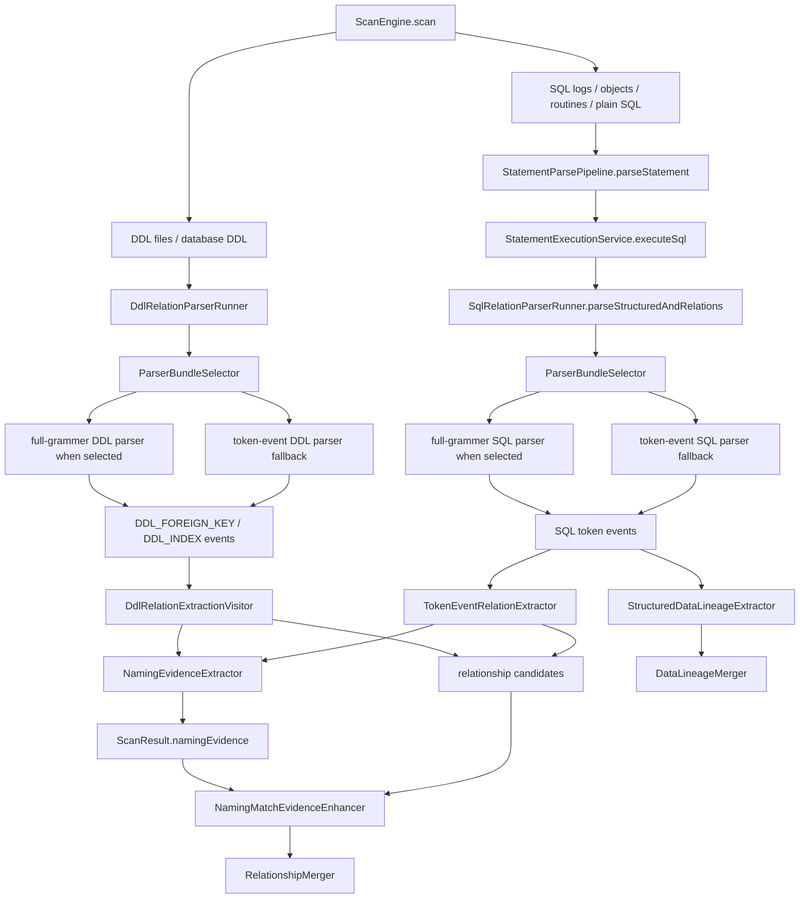
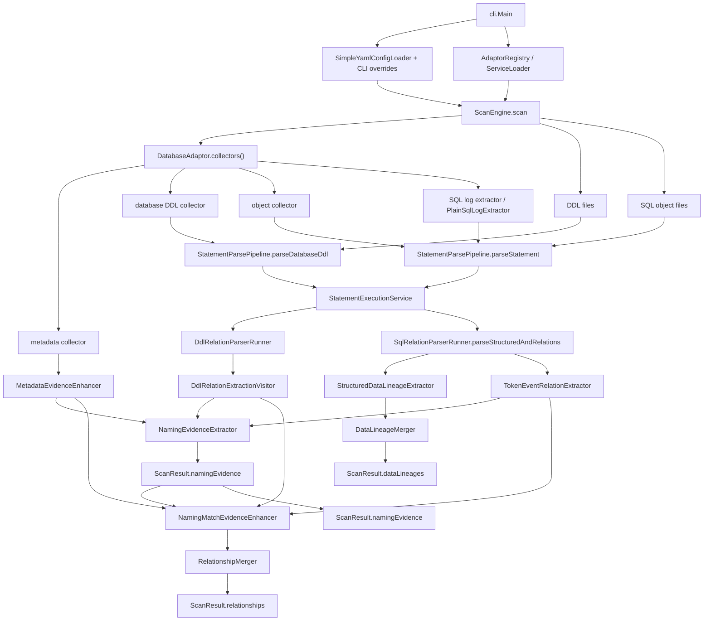
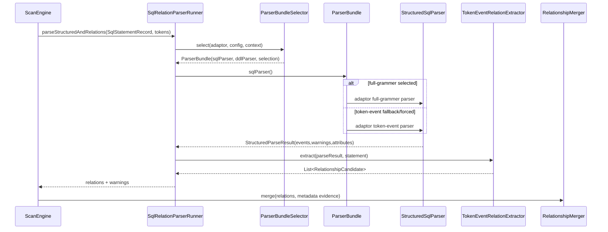
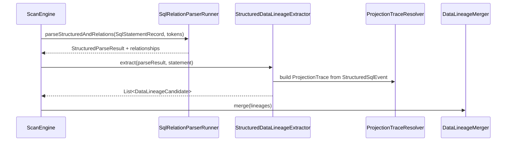
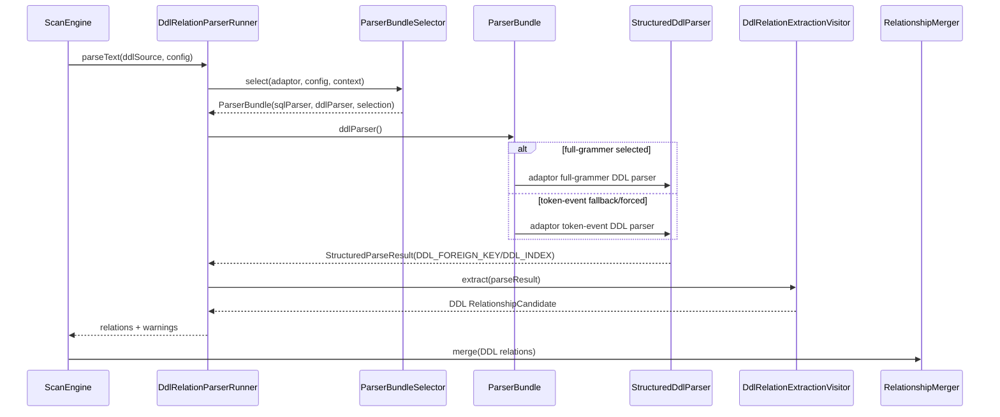
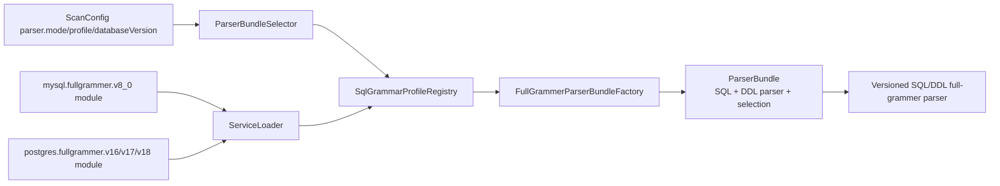
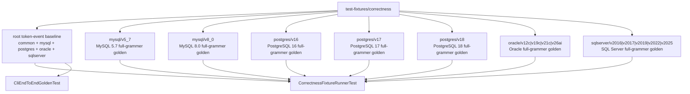

# Phase 6：SQL/DDL/对象解析增强详细设计

## 目标

Phase 6 描述当前代码中 SQL、DML、DDL、数据库对象解析如何生成 relationship 和 Data Lineage。本文按当前实现对齐，不再保留 Simple parser、旧 ANTLR primary/shadow、v2/current 等迁移期口径。

当前解析体系分成两种用户可见 parser mode：

- `token-event`：生产兜底解析链路。ANTLR 作为底层 lexer/parser 支撑；common 使用 portable typed grammar，MySQL/PostgreSQL/Oracle/SQL Server 使用各自 adaptor-local 方言 typed structural grammar，事件由 typed parse-tree visitor 生成。common 同时通过 `database.type: common` 暴露为正式 CLI parser category，可运行 `sample-data/portable` 并进入 sample-data parser comparison；它不是任何方言 full-grammer 或 token-event 的 fallback facade。
- `full-grammer`：版本化完整 grammar 链路。MySQL 5.7/8.0、PostgreSQL 16/17/18、Oracle 12c/19c/21c/26ai 与 SQL Server 2016/2017/2019/2022/2025 的 full-grammer module 由 adaptor 提供，解析树 visitor 直接生成同一套结构事件。PostgreSQL 官方 Bison/Flex grammar 是 source-of-truth，仓库 `.g4` 是按 major version 维护的 ANTLR projection。Oracle 当前已有 versioned profile 和 sample-data versioned full-grammer golden，运行状态是 `INCOMPLETE_VERSIONED`；它不再桥接 token-event，也不代表已经覆盖 Oracle 官方完整语法。SQL Server 当前已有 sample-data versioned full-grammer golden，并已编码首批 source-backed 版本专属 T-SQL 语法边界；更广泛的 T-SQL family 硬化仍在 backlog。

默认 `parser.mode=auto`：如果能根据 database type、人工 profile、配置版本或 JDBC metadata 选中 full-grammer profile，则使用 full-grammer；否则使用 token-event。显式 `parser.mode=full-grammer` 时，如果 profile 不存在、版本不支持或 full-grammer hard failure，会记录 warning 并 fallback 到 token-event。profile 已选中后，full-grammer parser 自己返回 partial events / warning；这些 syntax warning 不触发 fallback。显式 `parser.mode=token-event` 时不启用 full-grammer。

关系方向、弱共现、Data Lineage transform、confidence 和 JSON 输出不在 `.g4` 里实现，而在 Java 语义层实现。

## 当前包结构

核心职责分布。下列源码路径均位于仓库根的 `relation-detector/` 目录下：

```text
core/src/main/java/com/relationdetector/core/parser
  ParserBundle / ParserBundleSelector / ParserSelectionResult
  SqlRelationParserRunner
  DdlRelationParserRunner

core/src/main/java/com/relationdetector/core/tokenevent
  TokenEventStructuredSqlParser
  CommonTokenEventStructuredSqlParser
  TypedDialectTokenEventStructuredSqlParser
  CommonTokenEventParseTreeVisitor
  TokenEventStructuredDdlParser

core/src/main/java/com/relationdetector/core/common
  CommonDatabaseAdaptor

core/src/main/java/com/relationdetector/core/fullgrammer
  FullGrammerDialectModule
  SqlGrammarProfile / SqlGrammarProfileRegistry / SqlGrammarProfileSelection
  FullGrammerParserBundleFactory
  FullGrammerStructuredSqlParserFactory
  FullGrammerDdlParserFactory
  FullGrammerStructuredSqlParser
  FullGrammerTypedSqlEventSink
  RowsetScopeSink / ProjectionEventSink / PredicateEventSink / WriteMappingSink / SourceLocationSupport
  FullGrammerExpressionAnalyzer / FullGrammerExpressionAnalysis

core/src/main/java/com/relationdetector/core/relation
  TokenEventSqlRelationParser
  TokenEventRelationExtractor
  DdlRelationExtractionVisitor
  NamingEvidenceExtractor
  NamingEvidenceMerger
  NamingMatchEvidenceEnhancer
  RelationshipMerger

core/src/main/java/com/relationdetector/core/lineage
  StructuredDataLineageExtractor
  ProjectionTraceResolver
  DataLineageMerger

core/src/main/java/com/relationdetector/core/scan
  ScanEngine / SourceCollectorPipeline / StatementParsePipeline
  StatementExecutionService / EvidenceEnhancementService / ResultAssembly

core/src/main/java/com/relationdetector/core/lineage/model
  ProjectionTrace / ExpressionSourceSet / AssignmentMapping / RoutineScope / WriteTarget

core/src/main/java/com/relationdetector/core/ddl
  package-info.java
```

Adaptor 负责具体数据库和大版本：

```text
adaptor-mysql/src/main/java/com/relationdetector/mysql/tokenevent
  MySqlTokenEventStructuredSqlParser
  MySqlTokenEventStructuredDdlParser

adaptor-mysql/src/main/java/com/relationdetector/mysql/fullgrammer/common
  MySqlFullGrammerParseSupport
  AbstractMySqlFullGrammerStructuredSqlParser
  AbstractMySqlFullGrammerStructuredDdlParser
  MySqlSqlEventVisitorCore
  MySqlDdlEventVisitorCore

adaptor-mysql/src/main/java/com/relationdetector/mysql/fullgrammer/v5_7
adaptor-mysql/src/main/java/com/relationdetector/mysql/fullgrammer/v8_0
  MySqlFullGrammerDialectModule / MySql57FullGrammerDialectModule
  MySqlFullGrammerVersionBinding
  MySqlFullGrammerStructuredSqlParser
  MySqlFullGrammerStructuredDdlParser
  MySqlFullGrammerParseTreeVisitor
  MySqlExpressionAnalyzer
  MySqlFullGrammerDdlEventCollector

adaptor-postgres/src/main/java/com/relationdetector/postgres/tokenevent
  PostgresTokenEventStructuredSqlParser
  PostgresTokenEventStructuredDdlParser

adaptor-postgres/src/main/java/com/relationdetector/postgres/fullgrammer/v16
adaptor-postgres/src/main/java/com/relationdetector/postgres/fullgrammer/v17
adaptor-postgres/src/main/java/com/relationdetector/postgres/fullgrammer/v18
  PostgresFullGrammerDialectModule
  PostgresFullGrammerVersionBinding
  PostgresFullGrammerParseTreeVisitor
  PostgresFullGrammerDdlEventCollector

adaptor-postgres/src/main/java/com/relationdetector/postgres/routine
  PostgresRoutineBodyParser
  PostgresRoutineBodyParseTreeVisitor

adaptor-oracle/src/main/java/com/relationdetector/oracle/tokenevent
  OracleTokenEventStructuredSqlParser
  OracleTokenEventStructuredDdlParser

adaptor-oracle/src/main/java/com/relationdetector/oracle/fullgrammer/v12c
adaptor-oracle/src/main/java/com/relationdetector/oracle/fullgrammer/v19c
adaptor-oracle/src/main/java/com/relationdetector/oracle/fullgrammer/v21c
adaptor-oracle/src/main/java/com/relationdetector/oracle/fullgrammer/v26ai
  OracleFullGrammerDialectModule
  OracleFullGrammerBinding
  OracleFullGrammerParseTreeVisitor

adaptor-sqlserver/src/main/java/com/relationdetector/sqlserver/tokenevent
  SqlServerTokenEventStructuredSqlParser
  SqlServerTokenEventStructuredDdlParser

adaptor-sqlserver/src/main/java/com/relationdetector/sqlserver/fullgrammer/common
  SqlServerFullGrammerStructuredSqlParser
  SqlServerFullGrammerStructuredDdlParser
  SqlServerParseTreeEventCollector
  SqlServerExpressionAnalyzer

adaptor-sqlserver/src/main/java/com/relationdetector/sqlserver/fullgrammer/v2016|v2017|v2019|v2022|v2025
  SqlServerFullGrammerBinding
  SqlServer*FullGrammerDialectModule
```

版本由 package 表达，例如 `postgres.fullgrammer.v16`、`mysql.fullgrammer.v8_0`、`oracle.fullgrammer.v19c`、`sqlserver.fullgrammer.v2022`。类名不再写 `Postgres16` / `MySql80`。core 只通过 `ServiceLoader<FullGrammerDialectModule>` 加载 adaptor module，不直接 import MySQL/PostgreSQL/Oracle/SQL Server full-grammer 实现。

## 代码结构注释索引

生产代码的结构性注释分成三层：package 的 `package-info.java` 说明职责边界，生产类 Javadoc 说明文件在链路中的位置，关键 public 方法 / 编排方法 / 复杂 helper 说明调用意图。中文说明职责，English 说明同一职责边界，避免后续维护者只靠类名猜测调用方向。

| Package | 结构职责 |
| --- | --- |
| `contracts` | 公共 enum 入口。 |
| `contracts.model` | relationship、Data Lineage、endpoint、evidence、warning 等跨模块模型。 |
| `contracts.metadata` | catalog facts 和 metadata snapshot。 |
| `contracts.parse` | SQL/DDL/object 解析输入输出契约，包括 statement、event、parse result。 |
| `contracts.spi` | DatabaseAdaptor、collector、parser、profile、scope 等 SPI。 |
| `contracts.scoring` | 默认 evidence score 常量。 |
| `core.scan` | 扫描编排：连接配置、adaptor、metadata、parser、merger 和 ScanResult。 |
| `core.parser` | SQL/DDL runner：执行 parser.mode/profile 选择并调用语义 extractor。 |
| `core.tokenevent` | token-event 事件来源：common typed grammar、方言 typed parser 生命周期和结构事件模型。 |
| `core.common` | Common portable SQL 的 CLI adaptor 装配：把 common token-event SQL/DDL parser 暴露为 `database.type: common`，只支持离线 file sources，不做 live catalog。 |
| `core.fullgrammer` | full-grammer 通用基础设施：profile/module registry、bundle factory、共享 event helper。 |
| `core.relation` | relationship 语义：SQL/DDL events -> RelationshipCandidate、top-level naming evidence 抽取/合并，以及 relationship merge。 |
| `core.lineage` | Data Lineage 语义：write mapping/projection/derived lineage -> DataLineageCandidate。 |
| `core.lineage.model` | ProjectionTrace、ExpressionSourceSet、AssignmentMapping 等结构化字段血缘中间模型。 |
| `core.ddl` | DDL 职责边界说明包；当前 token-event DDL parser 实现在 `core.tokenevent`，DDL relationship 转换在 `core.relation`。 |
| `core.parse` | 通用 ANTLR parse support、syntax diagnostics 和 dialect 标识。 |
| `core.log` | SQL 文件拆分与 native log 噪声过滤。 |
| `core.metadata` | metadata evidence 增强：unique/index/type evidence。 |
| `core.output` | ScanResult JSON/table 渲染。 |
| `core.diagnostics` | warning 构造工厂。 |
| `core.scoring` | relationship confidence 计算。 |
| `cli` | YAML/CLI 参数、adaptor 发现、ScanEngine 调用和输出。 |
| `mysql` / `postgres` / `oracle` / `sqlserver` | adaptor 装配：metadata、object/log/DDL collector、token-event parser、full-grammer module。 |
| `mysql.tokenevent` / `postgres.tokenevent` / `oracle.tokenevent` / `sqlserver.tokenevent` | 方言 token-event parser 入口。各自使用 adaptor-local typed grammar，不 import full-grammer parser。 |
| `mysql.routine` / `postgres.routine` / `oracle.routine` / `sqlserver.routine` | 方言 routine scope policy 或 routine body parser；供 token-event 和 full-grammer 调用，不放在 core，也不挂在 full-grammer 专属目录下。 |
| `mysql.fullgrammer.common` / `postgres.fullgrammer.common` / `oracle.fullgrammer.common` / `sqlserver.fullgrammer.common` | full-grammer 公共 parse support、binding、visitor core、expression analyzer 和 DDL event core。 |
| `mysql.fullgrammer.v5_7` / `mysql.fullgrammer.v8_0` / `postgres.fullgrammer.v16` / `postgres.fullgrammer.v17` / `postgres.fullgrammer.v18` / `oracle.fullgrammer.v12c` / `oracle.fullgrammer.v19c` / `oracle.fullgrammer.v21c` / `oracle.fullgrammer.v26ai` / `sqlserver.fullgrammer.v2016` / `v2017` / `v2019` / `v2022` / `v2025` | 版本化 full-grammer generated parser binding、profile module 和少量 version policy / bridge。Oracle 当前是 `INCOMPLETE_VERSIONED` generated parser；SQL Server 已有首批 source-backed 版本边界，更多 T-SQL family 裁剪仍在 backlog。 |

审视结论：当前 package 注释、类级注释、关键函数注释、目录结构和本文职责表一致。core 不直接承载 MySQL/PostgreSQL 版本实现；adaptor 不承载 relationship/lineage semantic extractor；contracts 不依赖 core。

## 解析输入和输出

SQL、DML、对象定义统一进入：

```java
public record SqlStatementRecord(
    String sql,
    StatementSourceType sourceType,
    String sourceName,
    long startLine,
    long endLine,
    Map<String, Object> attributes
) {}
```

结构 parser 输出：

```java
public record StructuredParseResult(
    String backend,
    String dialect,
    String sourceName,
    List<StructuredSqlEvent> events,
    List<WarningMessage> warnings,
    Map<String, Object> attributes
) {}

public record StructuredSqlEvent(
    StructuredParseEventType type,
    String sourceName,
    long line,
    Map<String, Object> attributes
) {}
```

当前结构事件枚举包含：

```text
TABLE_REFERENCE                 // legacy/bootstrap event，不作为当前 semantic extractor 主输入
COLUMN_EQUALITY                 // legacy/bootstrap event，builder 会归一成 PREDICATE_EQUALITY
ROWSET_REFERENCE
PREDICATE_EQUALITY
JOIN_USING_COLUMNS
EXISTS_PREDICATE
IN_SUBQUERY_PREDICATE
TUPLE_IN_SUBQUERY_PREDICATE
CTE_DECLARATION
IGNORED_ROWSET
LOCAL_TEMP_TABLE_DECLARATION
TRIGGER_TARGET_TABLE
TRIGGER_PSEUDO_ROWSET
WRITE_TARGET
UPDATE_ASSIGNMENT
INSERT_SELECT_MAPPING
MERGE_WRITE_MAPPING
PROJECTION_ITEM
EXPRESSION_SOURCE
DDL_FOREIGN_KEY
DDL_INDEX
DYNAMIC_SQL
```

`TokenEventRelationExtractor` 消费的是 `ROWSET_REFERENCE`、`PREDICATE_EQUALITY`、`JOIN_USING_COLUMNS`、`EXISTS_PREDICATE`、`IN_SUBQUERY_PREDICATE`、`TUPLE_IN_SUBQUERY_PREDICATE`、`PROJECTION_ITEM` 和 scope events。`StructuredDataLineageExtractor` 消费 `WRITE_TARGET`、`UPDATE_ASSIGNMENT`、`INSERT_SELECT_MAPPING`、`MERGE_WRITE_MAPPING`、`PROJECTION_ITEM`、`LOCAL_TEMP_TABLE_DECLARATION` 等事件。`DdlRelationExtractionVisitor` 只消费 `DDL_FOREIGN_KEY` 和 `DDL_INDEX`。

## 总体调用链



当前 `ScanEngine.scan(...)` 只保留对外编排入口；source collection 进入 `SourceCollectorPipeline`，单条 SQL/DDL 进入 `StatementParsePipeline`，再由 `StatementExecutionService` 调用 `SqlRelationParserRunner.parseStructuredAndRelations(...)` 或 DDL runner。SQL 语句只做一次结构化解析，同时得到 relationship candidates、可供 Data Lineage 使用的 `StructuredParseResult` 和 naming evidence。这样 SQL/DML 的 parser mode、profile selection、fallback warning 和 diagnostics 在同一条语句内保持一致。

## 详细函数级调用结构

本节按代码入口列出当前 DDL / DML / relationship / lineage 的实际调用关系。代码侧结构注释见各 package 的 `package-info.java`，本节是这些注释在详细设计里的展开。

### ScanEngine 总编排



关键代码入口：

| 阶段 | 代码入口 | 说明 |
| --- | --- | --- |
| CLI 装配 | `cli.Main` | 读取 YAML/CLI、发现 adaptor、创建 `ScanConfig` 和 `ScanEngine`。 |
| 扫描编排 | `core.scan.ScanEngine.scan(...)` | 创建 scan context，管理 JDBC connection lifecycle，并委托 source collection、statement parse、evidence enhancement 和 result assembly。 |
| Source collection | `core.scan.SourceCollectorPipeline` | 收集 metadata、database DDL、database object、data profile、DDL file、object file 和 SQL log。 |
| SQL/DDL 单条执行 | `core.scan.StatementParsePipeline` / `StatementExecutionService` | 捕获单条 SQL、object block 或 DDL source 失败，生成 warning，继续扫描后续输入；同一服务被 production scan 和 correctness fixture 复用。 |
| relationship merge | `core.relation.RelationshipMerger` | 合并 SQL、DDL、metadata evidence 后的 relationship candidates。 |
| lineage merge | `core.lineage.DataLineageMerger` | 独立合并字段血缘，不参与 relationship confidence。 |

### SQL relationship 调用链



结构事件来源可以不同，但 relationship 语义入口只有 `TokenEventRelationExtractor`。因此 full-grammer 和 token-event 对 FK-like 方向、列级/表级弱共现、self-join、EXISTS 去重使用同一套规则。parser selection 由 `ParserBundleSelector` 统一完成，SQL runner 不再重复实现 full-grammer/profile fallback。

### SQL Data Lineage 调用链



Data Lineage v1 只输出数据库内部字段血缘。参数、literal、JSON path、局部变量不是 source endpoint；显式 `CREATE TEMPORARY/TEMP TABLE` 产生的本地临时表 scope 会过滤对应 lineage。过滤依据必须来自语法结构或结构事件，不允许用特殊表名/列名猜测。

### DDL relationship 调用链



DDL parser 只负责产出 `DDL_FOREIGN_KEY` / `DDL_INDEX` 结构事件。`DdlRelationExtractionVisitor` 负责把这些事件转换为 relationship，并补充 DDL evidence。它不解析 SQL/DML，也不承担 Data Lineage。

### full-grammer module 注入链



core 只知道 `FullGrammerDialectModule` 接口和 profile selection 规则，不直接 import `adaptor-mysql` / `adaptor-postgres` 的版本实现。`ParserBundleSelector` 是唯一运行时选择入口，SQL/DDL runner 都从同一个 bundle 取 parser。新增大版本时应在对应 adaptor 中新增 version package、module registration 和对应 versioned correctness fixture。

### correctness / golden 验收链



root baseline 明确使用 `parserMode: token-event`；versioned 目录明确使用 `parserMode: full-grammer` 和对应 `grammarProfile`。不再用 token-event baseline 保护 full-grammer，也不做跨 parser 补齐验收；每个 parser 必须直接通过自己的 correctness golden。这样 full-grammer 漏识别会在 `mysql/v5_7`、`mysql/v8_0`、`postgres/v16`、`postgres/v17`、`postgres/v18`、`oracle/v12c|v19c|v21c|v26ai`、`sqlserver/v2016|v2017|v2019|v2022|v2025` 的独立 golden 中暴露，而不是被 token-event 对比机制掩盖。

`CorrectnessFixtureRunnerTest` 的测试框架当前拆成四层，避免测试链路和生产链路分叉：

```text
CorrectnessFixtureExecutor
  -> FixtureInputLoader       // manifest/input/expected JSON/object block split
  -> FixtureExecutionEngine   // calls StatementExecutionService + EvidenceEnhancementService
  -> GoldenAssertion          // relation/lineage/diagnostics/naming evidence assertions
  -> GoldenWriter             // only writes expected JSON when updateCorrectnessGold=true
```

SQL correctness fixture 通过 `StatementExecutionService` 执行，与生产 scan 使用同一 structured parser、relationship、lineage 和 naming evidence 抽取入口；随后通过 `EvidenceEnhancementService` 消费 `NamingEvidencePool`。DDL fixture 也通过 `StatementExecutionService` 执行，但保持 parser-outcome 验收语义，不额外引入 scan-level metadata/naming enhancement。

## Parser mode 和 profile 选择

系统运行模式：

- `parser.mode=auto`：默认。能选中 full-grammer profile 时使用 full-grammer；否则 token-event。
- `parser.mode=full-grammer`：显式要求 full-grammer。profile 缺失、版本不支持或 full-grammer hard failure 时 warning + token-event fallback。profile 已选中后的 syntax warning / partial result 仍属于 full-grammer 结果；只有抛异常、无有效 structured result 或明确 hard failure 才 fallback。
- `parser.mode=token-event`：强制 token-event，不调用 full-grammer module。

配置来源优先级：

1. CLI `--parser-mode`、`--grammar-profile`、`--database-version` 覆盖 YAML。
2. YAML `parser.mode`、`parser.grammarProfile`、`parser.databaseVersion`。
3. JDBC `DatabaseMetaData.getDatabaseMajorVersion/getDatabaseMinorVersion`，写入 `ScanConfig.databaseVersion`，`databaseVersionSource=JDBC`。
4. 无方言或版本信息时不启用 full-grammer，使用 token-event。

版本规则：

- 用户配置和 fixture manifest 推荐写 `postgresql/16`、`postgresql/17`、`postgresql/18`、`mysql/5.7`、`mysql/8.0`、`oracle/12c`、`oracle/19c`、`oracle/21c`、`oracle/26ai`、`sqlserver/2016`、`sqlserver/2017`、`sqlserver/2019`、`sqlserver/2022`、`sqlserver/2025`；core registry 会归一到内部 profile id。
- PostgreSQL `16.5` 使用 PostgreSQL 16 profile，`17.5` 使用 PostgreSQL 17 profile，`18.1` 使用 PostgreSQL 18 profile。
- MySQL `5.7.x` 使用 MySQL 5.7 profile，`8.0.x` 使用 MySQL 8.0 profile。
- SQL Server `2016|2017|2019|2022|2025` 或兼容级别 `130|140|150|160|170` 使用对应 SQL Server profile。
- full-grammer 是严格版本 grammar：PG16 不接受 PG17-only 语法，PG17 不接受 PG18-only 语法；低版本命中高版本专属语法时返回 `FULL_GRAMMAR_VERSION_UNSUPPORTED_SYNTAX`，由 token-event 承担宽松向前兼容。每个 PostgreSQL major 都有独立 `.g4`、parser package 和 version golden；版本间缺失项以 `docs/parser-audit/postgres-version-golden-diff.md` 分类。
- 如果请求版本只比当前已注册最高 major 高 1 个 major，可临时降级到最高低版本并记录 diagnostic；超过 1 个 major 不自动跨级。
- 遇到大版本语法差异或老库兼容需求时，在对应 adaptor 下新增 version package 和 `FullGrammerDialectModule`，并补对应 versioned fixture。

PostgreSQL versioned correctness 的命名约定：

- `postgres/v16`、`postgres/v17`、`postgres/v18` 是严格版本测试目录，分别代表 PostgreSQL 16.x、17.x、18.x。
- 不使用 `postgres/v1` 这类聚合前缀来表达测试范围。即使 fixture filter 技术上可能按字符串前缀匹配多个目录，设计文档、测试命令和验收描述也必须显式写 `postgres/v16|postgres/v17|postgres/v18`，避免维护者把 `v1` 误解成真实版本。
- root `test-fixtures/correctness/postgres` 仍是历史/兼容 baseline，不作为严格版本 grammar 证明；严格版本证明只看 `postgres/v16`、`postgres/v17`、`postgres/v18`。

MySQL correctness 的命名约定：

- root `test-fixtures/correctness/mysql` 是 MySQL token-event baseline。
- `test-fixtures/correctness/mysql/v5_7` 是 MySQL 5.7 strict full-grammer golden，manifest 强制 `parserMode: full-grammer` 和 `grammarProfile: mysql/5.7`。
- `test-fixtures/correctness/mysql/v8_0` 是 MySQL 8.0 strict full-grammer golden，manifest 强制 `parserMode: full-grammer` 和 `grammarProfile: mysql/8.0`。
- MySQL 8.4 / 未知版本当前没有 strict full-grammer 目录；这些场景由 token-event 宽松 fallback 承担，或者后续新增独立 version package 与 golden。

不要混淆三类 mode：

- `parser.mode` 是系统运行模式：`auto|full-grammer|token-event`。
- MySQL `SQL_MODE` 是 MySQL server/session 语法开关，由 `MySqlGrammarSqlMode` / `MySqlGrammarSqlModes` 表达，只属于 MySQL full-grammer runtime。
- ANTLR lexer mode 是 `.g4` 内部词法状态，例如 PostgreSQL string/meta command mode，不是 Java parser mode。

旧配置：

- `parser.sql.mode`
- `parser.sql.fallbackOnFailure`
- `parser.ddl.mode`
- `parser.ddl.fallbackOnFailure`
- `simple`
- `antlr-shadow`
- `simple-ddl`
- `antlr-ddl-shadow`

这些都已经移除；配置中出现时应明确报错，不应静默映射到当前 mode。

## SQL / DML token-event 链路

token-event SQL parser 是兜底生产链路。MySQL/PostgreSQL/Oracle/SQL Server adaptor 分别暴露：

```text
mysql.tokenevent.MySqlTokenEventStructuredSqlParser
postgres.tokenevent.PostgresTokenEventStructuredSqlParser
oracle.tokenevent.OracleTokenEventStructuredSqlParser
sqlserver.tokenevent.SqlServerTokenEventStructuredSqlParser
```

调用链：

```text
SqlRelationParserRunner
  -> selected StructuredSqlParser
  -> TokenEventSqlRelationParser
  -> StructuredSqlParser.parseSql(...)
  -> TokenEventRelationExtractor.extract(...)
```

token-event SQL parser 内部：

```text
MySqlTokenEventStructuredSqlParser / PostgresTokenEventStructuredSqlParser / OracleTokenEventStructuredSqlParser / SqlServerTokenEventStructuredSqlParser
  -> MySqlRelationSql.g4 / PostgresRelationSql.g4 / OracleRelationSql.g4 / SqlServerRelationSql.g4
  -> MySqlTokenEventParseTreeVisitor / PostgresTokenEventParseTreeVisitor / OracleTokenEventParseTreeVisitor / SqlServerTokenEventParseTreeVisitor
  -> StructuredParseResult(events, warnings, attributes)
```

`CommonRelationSql.g4` 是无方言信息时的 portable SQL subset。`CommonDatabaseAdaptor` 将它接入 Java SPI 和 CLI，因此 `database.type: common` 会走完整 `ScanEngine`、naming evidence、lineage、derived path 和 JSON 输出链路。`MySqlRelationSql.g4` / `PostgresRelationSql.g4` / `OracleRelationSql.g4` / `SqlServerRelationSql.g4` 是 adaptor-local 方言 token-event typed structural grammar：先覆盖 common subset，再补各自常用语法边界。当前生产事件由 typed parse-tree visitor 生成，不再通过 token-span scanner、旧补充路径或表名/列名特殊过滤补事件。

MySQL 方言边界示例：

- `STRAIGHT_JOIN`
- ODBC `{ OJ ... }`
- optimizer index hints
- `PARTITION (...)`
- `JSON_TABLE(...)` 防伪表
- MySQL multi-table `UPDATE/DELETE`
- comma DML rowset

PostgreSQL 方言边界示例：

- `ONLY`
- `TABLESAMPLE`
- `ROWS FROM`
- `UNNEST WITH ORDINALITY`
- set-returning function rowset
- `UPDATE ... FROM`
- `DELETE ... USING`
- `MERGE ... USING`
- `MATERIALIZED / NOT MATERIALIZED` CTE

Oracle 初始边界示例：

- portable `JOIN` / comma join / CTE / `EXISTS` / `IN` / `INSERT SELECT` / basic `UPDATE` / `DELETE`
- Oracle sample-data 中的 PL/SQL object block 通过 adaptor-local `OracleRelationSql.g4` typed grammar 和 Oracle token-event visitor 形成 root correctness baseline
- `CONNECT BY`、`MODEL`、package spec/body、更多 version-specific syntax 和完整 PL/SQL control flow 属于后续 Oracle typed grammar / full-grammer backlog

公共语义必须留在 shared extractor：raw equality、`JOIN USING`、correlated `EXISTS`、scalar `IN`、tuple `IN`、FK-like 方向、列级/表级共现、重复证据去重。

## SQL / DML full-grammer 链路

full-grammer SQL parser 由 adaptor 版本 module 提供。当前实现：

```text
mysql-5.7
mysql-8.0
  -> adaptor-mysql/com.relationdetector.mysql.fullgrammer.v5_7/v8_0
  -> MySqlFullGrammerStructuredSqlParser
  -> MySqlFullGrammerParseTreeVisitor
  -> MySqlExpressionAnalyzer

postgresql-16 / postgresql-17 / postgresql-18
  -> adaptor-postgres/com.relationdetector.postgres.fullgrammer.v16/v17/v18
  -> PostgresFullGrammerStructuredSqlParser
  -> PostgresFullGrammerParseTreeVisitor
  -> PostgresExpressionAnalyzer

sqlserver-2016 / 2017 / 2019 / 2022 / 2025
  -> adaptor-sqlserver/com.relationdetector.sqlserver.fullgrammer.v2016/v2017/v2019/v2022/v2025
  -> SqlServerFullGrammerStructuredSqlParser
  -> SqlServerParseTreeEventCollector
  -> SqlServerExpressionAnalyzer
```

full-grammer SQL parser 使用 versioned ANTLR `.g4`。MySQL 5.7/8.0 当前来自 vendored grammars-v4 并按官方文档收紧版本边界；PostgreSQL 16/17/18 以官方 `gram.y` / `scan.l` / keywords 为 source-of-truth，仓库 `.g4` 作为按 major version 约束的 ANTLR projection。SQL Server 2016/2017/2019/2022/2025 来自固定 grammars-v4 T-SQL 快照，版本边界最终以 Microsoft Learn T-SQL reference 为准；当前已在 `.g4` 中编码 2017 `STRING_AGG`、2022 `DATETRUNC` / `GENERATE_SERIES` 和 2025 `VECTOR(...)` 的首批边界。它们运行真实 parser entry rule，typed parse-tree visitor 直接生成同一套 `StructuredSqlEvent`。PostgreSQL routine body 解析使用 `postgres.routine.PostgresRoutineBodySql.g4` 与对应 visitor，这是方言级 routine 层，token-event 与 full-grammer 都可调用，不 import 或调用 `postgres.tokenevent` parser。当前默认验收只比较关系、血缘、warning、naming evidence 和 JSON 行为；历史迁移期的 native/delegate/bridge 事件来源属性不再作为 correctness 验收入口。

full-grammer 仍只替换“语法结构识别”。它不会改变：

- FK-like 方向判断
- column/table co-occurrence 语义
- Data Lineage transform 归类
- confidence 公式
- JSON schema

这些仍由 `TokenEventRelationExtractor`、`StructuredDataLineageExtractor`、merger 和 scoring 负责。

full-grammer SQL 直接通过对应 versioned golden 验收，不再拿 token-event baseline 做跨 parser 对照：

- `test-fixtures/correctness/mysql/v5_7`
- `test-fixtures/correctness/mysql/v8_0`
- `test-fixtures/correctness/postgres/v16`
- `test-fixtures/correctness/postgres/v17`
- `test-fixtures/correctness/postgres/v18`
- `test-fixtures/correctness/oracle/v12c|v19c|v21c|v26ai`
- `test-fixtures/correctness/sqlserver/v2016|v2017|v2019|v2022|v2025`

如果 full-grammer 漏识别或多识别，`CorrectnessFixtureRunnerTest` 会在对应版本 golden 上直接失败。extra relation/lineage 不能自动写入 golden，仍需按 SQL 语义审核。

### 当前 parser golden 统计与差异审计

当前 correctness 资产按 parser category 统计如下。Relationship / Lineage 统计分别来自 `expected-relations.json` 和 `expected-lineage.json` 的 `fingerprints` 数量；`Rel NAMING_MATCH` 是 relationship evidence 中引用的命名证据数量；`Top-level namingEvidence` 来自 `expected-naming-evidence.json`，表示独立命名证据池。relationship 只能引用这个证据池，不能自己重新计算 `NAMING_MATCH`。

| Golden 组 | Fixture | SQL / DDL | Relationship fingerprints | Lineage fingerprints | Diagnostics | Rel NAMING_MATCH | Top-level namingEvidence |
| --- | ---: | ---: | ---: | ---: | ---: | ---: | ---: |
| common token-event | 39 | 34 / 5 | 759 | 328 | 0 | 219 | 441 |
| MySQL root token-event | 83 | 65 / 18 | 659 | 349 | 0 | 252 | 321 |
| MySQL full-grammer v5_7 | 89 | 71 / 18 | 706 | 414 | 9 | 257 | 327 |
| MySQL full-grammer v8_0 | 89 | 71 / 18 | 923 | 398 | 6 | 421 | 491 |
| PostgreSQL root token-event | 111 | 92 / 19 | 1402 | 332 | 0 | 353 | 353 |
| PostgreSQL full-grammer v16 | 111 | 92 / 19 | 1474 | 351 | 10 | 374 | 447 |
| PostgreSQL full-grammer v17 | 113 | 94 / 19 | 1478 | 364 | 0 | 375 | 448 |
| PostgreSQL full-grammer v18 | 114 | 93 / 21 | 1477 | 362 | 0 | 374 | 447 |
| Oracle root token-event | 41 | 33 / 8 | 643 | 247 | 0 | 241 | 241 |
| Oracle full-grammer v12c | 42 | 34 / 8 | 681 | 249 | 0 | 273 | 341 |
| Oracle full-grammer v19c | 43 | 35 / 8 | 681 | 249 | 0 | 273 | 341 |
| Oracle full-grammer v21c | 43 | 35 / 8 | 681 | 249 | 0 | 273 | 341 |
| Oracle full-grammer v26ai | 43 | 35 / 8 | 681 | 249 | 0 | 273 | 341 |
| SQL Server root token-event | 38 | 32 / 6 | 703 | 360 | 0 | 275 | 275 |
| SQL Server full-grammer v2016 | 39 | 33 / 6 | 1005 | 360 | 0 | 520 | 586 |
| SQL Server full-grammer v2017 | 39 | 33 / 6 | 1005 | 360 | 0 | 520 | 586 |
| SQL Server full-grammer v2019 | 39 | 33 / 6 | 1005 | 360 | 0 | 520 | 586 |
| SQL Server full-grammer v2022 | 39 | 33 / 6 | 1005 | 360 | 0 | 520 | 586 |
| SQL Server full-grammer v2025 | 39 | 33 / 6 | 1005 | 360 | 0 | 520 | 586 |

root token-event 与对应 full-grammer 数量不要求完全一致：token-event 是 fallback typed grammar，目标是宽松兼容和高价值结构覆盖；full-grammer 是有 profile 时的 primary，目标是版本严格。两者都必须能从 SQL/DDL 结构解释自己的 golden。当前跨 parser 差异和 follow-up backlog 统一记录在 `docs/parser-audit/all-golden-semantic-review.md`：

- `EXPECTED_VERSION_DELTA`：PostgreSQL 17/18 版本专属语法导致的合理差异。
- `PARSER_GAP_TYPED_VISITOR_COVERAGE`：root token-event typed visitor 尚未覆盖 full-grammer 已能确认的结构。
- `PARSER_GAP_ROUTINE_OR_COMPLEX_QUERY`：routine、trigger、sample-data 复杂业务查询或数据生成 SQL 的 typed visitor coverage backlog。

当前没有新的 `REVIEW_NEEDED` 项。后续若出现无法由 SQL/DDL 结构、版本边界、作用域或 endpoint 类型解释的差异，应写入 parser-audit 审核文档，不应通过刷新 golden 掩盖。

### PostgreSQL 版本专属 fixture 差异

以 v18 作为当前最新版本基准，版本专属 fixture 的差异如下：

| 版本 | 专属 fixture | 覆盖语法 | 当前输出重点 |
| --- | --- | --- | --- |
| v17 | `postgres17-json-table-sql` | SQL/JSON `JSON_TABLE()` rowset 与 `JSON_EXISTS()` | `JSON_TABLE` / `jt` 不作为物理表；保留 `orders.user_id -> users.id` FK-like relationship |
| v17 | `postgres17-merge-returning-sql` | `MERGE ... WHEN NOT MATCHED BY SOURCE/TARGET` 与 `RETURNING merge_action()` | 保留 source/target 字段关系，并输出 `staging_account_balances.balance -> account_balances.balance` direct lineage |
| v18 | `postgres18-returning-old-new-sql` | DML `RETURNING old/new` pseudo row references | `old` / `new` 不作为物理表；保留 `account_balances.balance, transaction_ledgers.amount -> account_balances.balance` arithmetic lineage |
| v18 | `postgres18-temporal-constraints-ddl` | `WITHOUT OVERLAPS` 与 `PERIOD` temporal FK columns | 输出普通 FK 列关系；`PERIOD` 时间范围列只作为 temporal metadata，不强行当普通 equality FK |
| v18 | `postgres18-virtual-generated-ddl` | virtual generated columns | 验证 PG18-only DDL 可解析；当前不产生 relationship / lineage |

这些版本专属 fixture 在低版本目录缺失属于 `EXPECTED_VERSION_GAP`。当前没有 `GRAMMAR_GAP`、`SEMANTIC_GAP` 或 `REVIEW_NEEDED` 项。

## Relationship 抽取

`TokenEventRelationExtractor` 是 SQL/DML relationship 的共享语义层。它按以下顺序处理：

1. 从 `ROWSET_REFERENCE`、`WRITE_TARGET`、`TRIGGER_PSEUDO_ROWSET` 建立 alias/table 映射。
2. 从 `CTE_DECLARATION`、`IGNORED_ROWSET`、`LOCAL_TEMP_TABLE_DECLARATION` 建立忽略 scope。
3. 从 `PROJECTION_ITEM` 建立 CTE/derived output column 到物理列的映射。
4. 消费 predicate 事件生成 relationship candidates。

主要规则：

```text
PREDICATE_EQUALITY
  -> resolve left/right alias.column
  -> FK-like 判断优先
  -> 若 FK-like 不成立，且两侧为不同物理表，输出 RelationSubType.COLUMN_CO_OCCURRENCE
  -> 若同一物理表但不同 SQL alias 且物理列不同，也输出 RelationSubType.COLUMN_CO_OCCURRENCE
  -> evidence 保留具体语法来源，例如 SQL_LOG_JOIN
  -> 同一 alias 行内比较不输出 self co-occurrence

EXISTS_PREDICATE
  -> 输出 SQL_LOG_EXISTS
  -> attributes.joinKind = EXISTS

JOIN_USING_COLUMNS
  -> 输出列级弱共现，evidence 使用 SQL_LOG_JOIN
  -> 不直接升级 FK-like

IN_SUBQUERY_PREDICATE / TUPLE_IN_SUBQUERY_PREDICATE
  -> 输出 SQL_LOG_SUBQUERY_IN
  -> attributes.joinKind = IN_SUBQUERY
```

self-join 列级弱共现的接受条件是结构性的，不是名字匹配：

```text
same physical table
+ different SQL aliases
+ different physical columns
+ explicit equality predicate
```

因此这些可以输出 `RelationSubType.COLUMN_CO_OCCURRENCE`，但 evidence 仍保留具体谓词来源，例如 `SQL_LOG_JOIN`：

```sql
FROM hr_employees e
JOIN hr_employees m ON e.manager_id = m.emp_id
```

但这种不会输出：

```sql
FROM accounts a
WHERE a.left_col = a.right_col
```

FK-like 方向规则仍优先。无法可靠判断方向时才进入 column co-occurrence。当前生产 typed parser 不因为“同一 SQL 中出现多张表但没有列级谓词”主动生成 table co-occurrence relationship；`SQL_LOG_TABLE_CO_OCCURRENCE` 仅作为历史/外部导入兼容 evidence 保留。

`correlated EXISTS` 是跨方言公共关系语义。公共 extractor 可以处理 EXISTS 外壳和相关谓词；EXISTS 内部如果出现 MySQL/PostgreSQL 专属 rowset/function/hint/`ONLY`/`JSON_TABLE` 等语法，必须由对应方言 event builder 或 full-grammer visitor 负责识别和过滤。

当前 typed SQL parser 不再把 `EXISTS` / `IN` / 普通 equality 直接定向为 FK-like，但必须保留真实语法 evidence：JOIN / comma join 输出 `SQL_LOG_JOIN`，correlated `EXISTS` 输出 `SQL_LOG_EXISTS`，`IN (SELECT ...)` / tuple IN 输出 `SQL_LOG_SUBQUERY_IN`。这些 evidence 证明“SQL 中存在明确列级谓词”，不单独证明 FK-like 方向。FK-like 方向可以由 DDL、metadata、data-profile、“SQL 谓词 + 一侧 unique、一侧 non-unique”，或“SQL 谓词 + top-level `namingEvidence` 中的唯一方向提示”推出；否则输出 `CO_OCCURRENCE`。`NAMING_MATCH` 不解析 SQL，也不凭表名/列名创建关系；`NamingEvidenceExtractor` 先生成完整命名证据池，`NamingMatchEvidenceEnhancer` 只消费该证据池并在 relationship evidence 中写入 `evidenceRef`。

`SQL_LOG_COLUMN_CO_OCCURRENCE` 和 `SQL_LOG_TABLE_CO_OCCURRENCE` 仍保留 enum、score 和 merger 兼容逻辑，但当前生产 parser / extractor 不主动产出。列级谓词共现由更具体的 `SQL_LOG_JOIN` / `SQL_LOG_EXISTS` / `SQL_LOG_SUBQUERY_IN` 代替；纯表级共现没有等价现役替代，默认不生成正式 relationship。

## Data Lineage v1

Data Lineage 是独立模型，不混入 relationship，也不改变 relationship confidence。

调用链：

```text
SqlRelationParserRunner.parseStructuredAndRelations(...)
  -> ParsedSqlRelations.structured()
  -> StructuredDataLineageExtractor.extract(...)
  -> DataLineageMerger.merge(...)
  -> ScanResult.dataLineages()
  -> JsonResultWriter.dataLineages
```

v1 只输出数据库内部字段血缘：

```text
table.column -> table.column
```

不会输出：

- parameter -> table.column
- JSON path -> table.column
- literal -> table.column
- local variable -> table.column
- dynamic SQL reconstructed value -> table.column

DELETE 不输出字段血缘；它属于关系和未来 write impact/affected table 模型。

支持的写入事件：

- `UPDATE_ASSIGNMENT`
- `INSERT_SELECT_MAPPING`
- `MERGE_WRITE_MAPPING`

辅助事件：

- `ROWSET_REFERENCE`
- `WRITE_TARGET`
- `PROJECTION_ITEM`
- `LOCAL_TEMP_TABLE_DECLARATION`

transform 类型：

```text
DIRECT              0.90
AGGREGATE           0.80
CUMULATIVE          0.80
COALESCE            0.75
ARITHMETIC          0.75
CONCAT_FORMAT       0.70
FUNCTION_CALL       0.65
CASE_WHEN VALUE     0.65
CASE_WHEN CONTROL   0.55
WINDOW_DERIVED      0.50
UNKNOWN_EXPRESSION  0.35
```

规则示例：

```text
SET a.x = b.y
  -> VALUE:DIRECT:b.y->a.x

SET u.total_spent = SUM(o.pay_amount)
  -> VALUE:AGGREGATE:orders.pay_amount->users.total_spent

@running_sum := @running_sum + weight
  -> VALUE:CUMULATIVE:source.weight->target.cdf_end

CASE WHEN c.risk_score > 80 THEN ...
  -> CONTROL:CASE_WHEN:customer_profiles.risk_score->target.status

COALESCE(sm.avg_cost, wi.default_unit_cost) * oi.quantity
  -> VALUE:AGGREGATE / ARITHMETIC / COALESCE according to reviewed fixture semantics
```

`knownPhysicalTables` 当前作为 extractor 入参保留，用于未来 metadata-aware lineage。当前 v1 主要依据语法明确的 `LOCAL_TEMP_TABLE_DECLARATION` 过滤本对象 scope 内临时表，不按 `tmp_`、`temp_`、`jsh_temp_` 这类名字猜测临时表。

## ProjectionTraceResolver 与正式 Data Lineage 的区别

`ProjectionTraceResolver` 是 Data Lineage 链路的内部 helper，只把 CTE、derived table 和 projection alias 的结构化投影回溯到物理列或表达式来源。它消费 `StructuredSqlEvent`，不输出 JSON，不计算 lineage confidence，也不重新解析 SQL 文本。

## Derived Path Evidence

`DerivedPathInferenceService` 是 scan merge 后的可选推导层，默认关闭。开启 `derivedPaths.enabled=true` 后，它从已合并的有向 evidence 图生成：

- `derivedRelationships`：只以列级 `FK_LIKE` relationship 为主边，可用 top-level `namingEvidence` 作为辅助边；纯 naming path 不能生成 relationship。内部按 referenced-by 方向反向遍历 `parent/referenced -> child/dependent`，但输出保持 FK-like 正向 `child/dependent -> parent/referenced`，并在 attributes 中记录 `traversalMode=REVERSE_REFERENCED_BY`、`outputDirection=FK_LIKE_FORWARD` 和 `traversalPath`。
- `derivedDataLineages`：只从 `LineageFlowKind.VALUE` 的字段血缘边推导；`CONTROL` 和 `NAMING_MATCH` 不参与数据流推导。
- derived `namingEvidence`：direct namingEvidence 的有向链可生成 `rule=TRANSITIVE_NAMING_PATH` 的 top-level naming evidence，relationship 仍只能通过 `evidenceRef` 引用这个池。JSON 顶层的 `derivedNamingEvidence` 只是轻量阅读视图，方便按 derived name 统计；完整证据仍只在 top-level `namingEvidence` 中维护。

路径推导不会修改直接 relationship / lineage，不参与 parser fallback，也不使用 SQL regex、token span 或名字白名单。默认 `maxPathLength=5`；`maxPathsPerPair=0` 和 `maxFacts=0` 表示不限制，但仍做循环检测和自环过滤。

Endpoint identity 在 derived graph 中保持 schema 保真：parser 只保留 SQL/DDL 显式写出的 schema，不自动补默认 schema，也不丢弃 schema。`schema.table.column` 与 `table.column` 默认不是同一个 graph key。表内 identity bridge 只允许在同一个 canonical table key 内连接，例如 `orders.id -> orders.customer_id` 或 `dbo.orders.id -> dbo.orders.customer_id`；`orders.id -> dbo.orders.customer_id` 这类 schema-qualified / bare endpoint 混合路径不能被自动桥接。

`StructuredDataLineageExtractor` 是正式 Data Lineage 输出链路。它处理写目标、表达式来源和 transform，输出 `DataLineageCandidate`。

二者职责不同：

```text
ProjectionTraceResolver:
  x.user_id -> orders.user_id
  用于把 INSERT/UPDATE/MERGE 中的 projection alias 还原成物理来源

StructuredDataLineageExtractor:
  orders.pay_amount -> users.total_spent
  用于输出字段值流向
```

当前代码不保留 `SqlLineageResolver`、SQL 文本 regex helper 或 token span fallback。新增字段血缘能力必须从 typed grammar / typed visitor 产出结构事件，再通过 `ProjectionTrace`、`ExpressionSourceSet`、`AssignmentMapping` 进入正式 lineage。

## DDL token-event 链路

DDL token-event 是生产 DDL 兜底链路。Adaptor 暴露：

```text
mysql.tokenevent.MySqlTokenEventStructuredDdlParser
postgres.tokenevent.PostgresTokenEventStructuredDdlParser
oracle.tokenevent.OracleTokenEventStructuredDdlParser
sqlserver.tokenevent.SqlServerTokenEventStructuredDdlParser
```

调用链：

```text
DdlRelationParserRunner
  -> selected StructuredDdlParser
  -> parseDdl(...)
  -> DDL_FOREIGN_KEY / DDL_INDEX events
  -> DdlRelationExtractionVisitor.extract(...)
```

token-event DDL parser 内部：

```text
MySqlTokenEventStructuredDdlParser / PostgresTokenEventStructuredDdlParser / OracleTokenEventStructuredDdlParser / SqlServerTokenEventStructuredDdlParser
  -> MySqlRelationSql.g4 / PostgresRelationSql.g4 / OracleRelationSql.g4 / SqlServerRelationSql.g4 typed structural parser
  -> MySqlTokenEventParseTreeVisitor / PostgresTokenEventParseTreeVisitor / OracleTokenEventParseTreeVisitor / SqlServerTokenEventParseTreeVisitor
  -> filter DDL_FOREIGN_KEY / DDL_INDEX events
  -> StructuredParseResult(events, warnings, attributes)

Common TokenEventStructuredDdlParser
  -> CommonRelationSql.g4 typed structural parser
  -> CommonTokenEventParseTreeVisitor
  -> filter DDL_FOREIGN_KEY / DDL_INDEX events
```

支持：

- `CREATE TABLE` table-level FK
- inline `REFERENCES`
- composite FK
- `ALTER TABLE ... ADD FOREIGN KEY`
- primary key / unique constraint
- ordinary source index
- `CREATE UNIQUE INDEX`
- MySQL inline `KEY/INDEX`、prefix/functional/JSON index 边界、`VISIBLE/INVISIBLE`
- PostgreSQL `ONLY`、`CONCURRENTLY`、`INCLUDE`、partial index、expression/opclass/collation index 边界

`DdlRelationExtractionVisitor` 两遍处理：

```text
第一遍 DDL_INDEX:
  -> 收集 SOURCE_INDEX
  -> 收集 TARGET_UNIQUE

第二遍 DDL_FOREIGN_KEY:
  -> 生成 FK_LIKE + DDL_FOREIGN_KEY
  -> 如果 source 有普通索引，补 SOURCE_INDEX
  -> 如果 target 有 PK/unique，补 TARGET_UNIQUE
```

DDL index 本身不会凭空创造 FK-like relationship。partial index、expression index、prefix index、函数 index、JSON path index 等只作为 parser 覆盖边界，不作为全局唯一或 FK-like 证据。

## DDL full-grammer 链路

DDL full-grammer parser 也由 adaptor version module 提供：

```text
MySqlFullGrammerStructuredDdlParser
  -> MySqlFullGrammerParser.queries()
  -> MySqlFullGrammerDdlEventCollector
  -> DDL_FOREIGN_KEY / DDL_INDEX

PostgresFullGrammerStructuredDdlParser
  -> Postgres16/17/18FullGrammerParser.root()
  -> PostgresFullGrammerDdlEventCollector
  -> DDL_FOREIGN_KEY / DDL_INDEX
```

full-grammer DDL collector 不委托 token-event DDL parser。`DdlRelationExtractionVisitor` 仍复用同一套 DDL semantic layer。

full-grammer DDL 同样直接通过 versioned golden 验收。DDL correctness 由对应版本 golden 负责；如果某版本 DDL typed collector 漏掉 FK/index evidence，应在该版本 fixture 中直接失败并修 parser，而不是借 token-event 对比兜底。

## DDL 与 SQL 为什么分开

SQL/DML 描述“程序如何使用表”，主要证据来自 JOIN、WHERE equality、IN/EXISTS、CTE/derived lineage、DML write mapping。

DDL 描述“数据库声明的结构事实”，主要证据来自 FK、inline references、PK/unique/index。

二者最终都输出 `RelationshipCandidate`，但 evidence type、置信度语义、失败策略和测试边界不同：

- DDL 使用 `DDL_FOREIGN_KEY`、`SOURCE_INDEX`、`TARGET_UNIQUE`。
- SQL typed parser 当前保留具体谓词 evidence：`SQL_LOG_JOIN`、`SQL_LOG_EXISTS`、`SQL_LOG_SUBQUERY_IN`。这些 evidence 可以增强 confidence，也可以与唯一性/metadata/profile 或唯一的 `_id/id` 命名方向提示组合推导方向；如果方向仍不充分，则关系类型保持 `CO_OCCURRENCE`。
- DDL 不输出 Data Lineage。
- SQL/DML 可以输出 Data Lineage。
- DDL parser 失败只影响当前 DDL source；SQL parser 失败只影响当前 statement/object block。

因此不能把 SQL visitor 和 DDL visitor 合成一个万能 parser。它们共享 token-event/full-grammer 基础设施，但入口、事件、semantic extractor 和 correctness fixture 必须分开。

## 动态 SQL 和对象 SQL

Procedure/function/trigger/event/rule/view 等对象定义进入 `SqlStatementRecord`，保留 source type 与 object provenance。

routine/function fixture 可使用：

```yaml
statementFormat: OBJECT_BLOCKS
objectSourceFilter: PROCEDURE:case_01.proc_name
```

这样 procedure body 不会被普通分号拆碎。

动态 SQL 策略：

```sql
SET @s = 'SELECT ...';
PREPARE stmt FROM @s;
EXECUTE stmt;
```

当前不猜测拼接结果中的关系，也不做 Parameter Binding。系统输出 `DYNAMIC_SQL_UNRESOLVED` warning，并在 warning attributes 中保留 raw statement、object schema/name/type、routine schema/name/type 等定位信息。

## 正则、scanner 与 typed parse-tree 边界

当前生产 token-event SQL/DDL 链路使用 typed structural grammar 与 typed parse-tree visitor。common token-event 使用 `CommonRelationSql.g4`，MySQL/PostgreSQL/Oracle/SQL Server token-event 使用各自 adaptor-local 方言 typed grammar；DDL 同样从 typed DDL context 生成 `DDL_FOREIGN_KEY` / `DDL_INDEX` / `DDL_COLUMN` 事件。当前实现不再把 token-span scanner、旧补充路径、DDL cursor/scanner 作为生产事件来源。

full-grammer 链路的目标是用版本化 `.g4` 和 typed parse-tree visitor 表达严格版本语法。当前 SQL full-grammer event path 由各 adaptor 的 parse-tree visitor 和 core `FullGrammerTypedSqlEventSink` 生成事件；sink 内部已经拆成 rowset、projection、predicate、write mapping 和 source location helper。DDL full-grammer path 由 adaptor-local DDL event collector 生成 DDL events，不委托 token-event DDL visitor。Oracle 当前是 `INCOMPLETE_VERSIONED` generated parser：每个 profile 使用自己的 generated lexer/parser 和 typed visitor，并保留 versioned sample-data golden，但不声称已覆盖 Oracle 官方全部语法。SQL Server 当前已有 versioned full-grammer sample-data golden 和首批 grammar-level version-only fixture；更广泛的官方 T-SQL 语法裁剪仍是 backlog。运行时选中 full-grammer 时，它就是当前 SQL/DDL 的 primary parser；token-event 只在 profile 选不中、版本不支持或 hard failure 时作为 fallback。默认测试直接验证各 parser 自己的 golden；full-grammer 漏识别必须在 `mysql/v5_7|v8_0`、`postgres/v16|v17|v18`、`oracle/v12c|v19c|v21c|v26ai` 或 `sqlserver/v2016|v2017|v2019|v2022|v2025` 的 versioned golden 中暴露。

允许保留的 helper：

- 读取 source location。
- 读取 identifier 原文。
- 生成 diagnostics preview。

不允许作为关系/血缘规则来源：

- 特殊业务表名或列名白名单/黑名单。
- 通过 `tmp_`、`temp_`、`jsh_temp_` 名字猜测临时表。
- 为某个 fixture 写专门列名判断。

如果某个结构无法从 typed context 稳定获得，必须进入审核文档，例如 `docs/parser-audit/full-grammer-typed-visitor-gaps.md`，不能静默 fallback 到名字过滤或旧 delegate。

## 测试与验收

核心 correctness：

```text
CorrectnessFixtureRunnerTest
  -> test-fixtures/correctness/**/*
  -> expected-relations.json
  -> expected-lineage.json
  -> expected-diagnostics.json
```

默认 `mvn test` 只运行 correctness `smoke` profile。日常开发按受影响方言显式运行：

```bash
mvn -pl relation-detector/cli -am -Dtest=CorrectnessFixtureRunnerTest \
  -DcorrectnessFixtureProfile=oracle \
  -Dsurefire.failIfNoSpecifiedTests=false test
```

可选 profile 包括 `common`、`mysql`、`postgres`、`oracle`、`sqlserver`、`mysql/v5_7`、`mysql/v8_0`、`postgres/v16`、`postgres/v17`、`postgres/v18`、`oracle/v12c`、`oracle/v19c`、`oracle/v21c`、`oracle/v26ai`、`sqlserver/v2016`、`sqlserver/v2017`、`sqlserver/v2019`、`sqlserver/v2022`、`sqlserver/v2025` 和 `full`。合并前使用 `-DcorrectnessFixtureProfile=full` 跑全量。runner 在非更新模式下按 fixture 并行执行，可用 `-DcorrectnessFixtureParallelism=N` 调整；`-DupdateCorrectnessGold=true` 时强制串行，保证 golden 写入稳定。

生成报告：

```text
CorrectnessSummaryGeneratorTest
  -> docs/generated/correctness-test-summary.md

DataLineageAuditGeneratorTest
  -> docs/parser-audit/data-lineage-full-audit.md
```

生成报告不进入默认 `mvn test` 的长耗时路径。需要验收生成文件是否最新时传 `-DrunGeneratedReportTests=true`；需要刷新时分别传 `-DupdateCorrectnessSummary=true` 或 `-DupdateDataLineageAudit=true`。

full-grammer versioned correctness：

```text
CorrectnessFixtureRunnerTest
  -> mysql/v5_7 / mysql/v8_0 full-grammer golden
  -> postgres/v16 full-grammer golden
  -> postgres/v17 full-grammer golden
  -> postgres/v18 full-grammer golden
  -> oracle/v12c full-grammer `INCOMPLETE_VERSIONED` coverage golden
  -> oracle/v19c full-grammer `INCOMPLETE_VERSIONED` coverage golden
  -> oracle/v21c full-grammer `INCOMPLETE_VERSIONED` coverage golden
  -> oracle/v26ai full-grammer `INCOMPLETE_VERSIONED` coverage golden
  -> sqlserver/v2016 / v2017 / v2019 / v2022 / v2025 full-grammer golden
```

CLI 端到端：

```text
CliEndToEndGoldenTest
  -> YAML/CLI args
  -> AdaptorRegistry
  -> ScanEngine
  -> parser runners
  -> merger + JSON writer
  -> existing fixture golden fingerprints

ParserConfigRemovalTest
  -> removed parser config rejection
  -> parser.mode CLI/YAML parsing
```

当前最近一次文档对齐时的测试资产统计：

| Golden 组 | Fixture | SQL / DDL | Relationship fingerprints | Lineage fingerprints | Diagnostics | Rel NAMING_MATCH | Top-level namingEvidence |
| --- | ---: | ---: | ---: | ---: | ---: | ---: | ---: |
| 全部 correctness | 1194 | 981 / 213 | 17973 | 6301 | 25 | 6833 | 8085 |
| common token-event | 39 | 34 / 5 | 759 | 328 | 0 | 219 | 441 |
| MySQL root token-event | 83 | 65 / 18 | 659 | 349 | 0 | 252 | 321 |
| MySQL full-grammer v5_7 | 89 | 71 / 18 | 706 | 414 | 9 | 257 | 327 |
| MySQL full-grammer v8_0 | 89 | 71 / 18 | 923 | 398 | 6 | 421 | 491 |
| PostgreSQL root token-event | 111 | 92 / 19 | 1402 | 332 | 0 | 353 | 353 |
| PostgreSQL full-grammer v16 | 111 | 92 / 19 | 1474 | 351 | 10 | 374 | 447 |
| PostgreSQL full-grammer v17 | 113 | 94 / 19 | 1478 | 364 | 0 | 375 | 448 |
| PostgreSQL full-grammer v18 | 114 | 93 / 21 | 1477 | 362 | 0 | 374 | 447 |
| Oracle root token-event | 41 | 33 / 8 | 643 | 247 | 0 | 241 | 241 |
| Oracle full-grammer v12c | 42 | 34 / 8 | 681 | 249 | 0 | 273 | 341 |
| Oracle full-grammer v19c | 43 | 35 / 8 | 681 | 249 | 0 | 273 | 341 |
| Oracle full-grammer v21c | 43 | 35 / 8 | 681 | 249 | 0 | 273 | 341 |
| Oracle full-grammer v26ai | 43 | 35 / 8 | 681 | 249 | 0 | 273 | 341 |
| SQL Server root token-event | 38 | 32 / 6 | 703 | 360 | 0 | 275 | 275 |
| SQL Server full-grammer v2016 | 39 | 33 / 6 | 1005 | 360 | 0 | 520 | 586 |
| SQL Server full-grammer v2017 | 39 | 33 / 6 | 1005 | 360 | 0 | 520 | 586 |
| SQL Server full-grammer v2019 | 39 | 33 / 6 | 1005 | 360 | 0 | 520 | 586 |
| SQL Server full-grammer v2022 | 39 | 33 / 6 | 1005 | 360 | 0 | 520 | 586 |
| SQL Server full-grammer v2025 | 39 | 33 / 6 | 1005 | 360 | 0 | 520 | 586 |

验证要求：代码或 fixture 变化后应至少运行 full correctness golden；文档或统计变化后应同步刷新本表、`docs/relation-detector/test-assets-map.md` 和 `docs/design/relation-detector/design-validation-report.md`。报告生成器仍需显式运行，不进入普通 `mvn test` 默认重负担路径。

维护规则：

- 新增 SQL/DDL 语法能力，优先补 correctness fixture/golden。
- 新增 full-grammer profile，必须补 profile selection 测试、对应版本 fixture，以及版本边界测试。
- 新增方言专属能力，必须补反向负向测试。
- relationship golden 变化必须人工审核，不能用测试输出机械覆盖。
- Data Lineage extra 必须进入审核或 golden，不能静默漂移。
- generated summary 和 audit 报告由 Java 测试生成，不调用大模型。
- 目录/命名/迁移过程检查只作为 code review 的可选 `rg` 手工检查，不再作为默认 Maven 测试入口；默认测试聚焦 SQL/DDL correctness、confidence、warning、输出和端到端系统行为。
