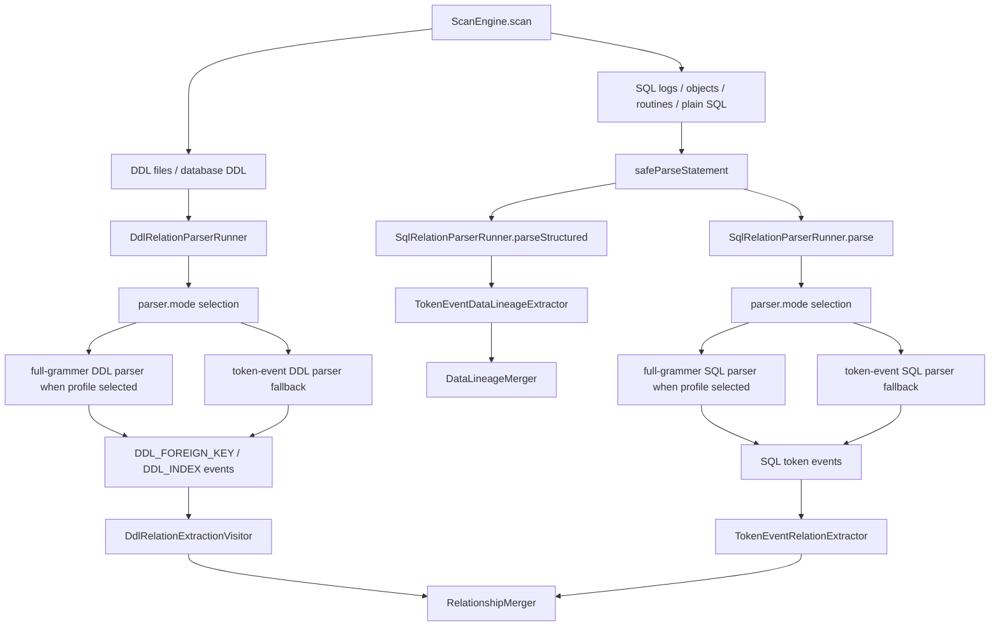
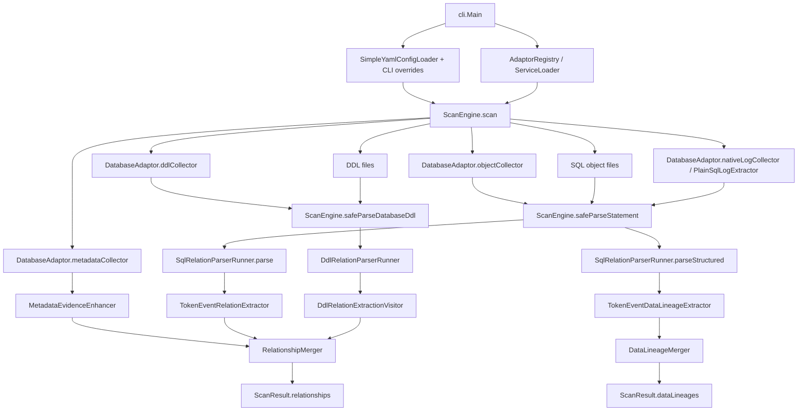
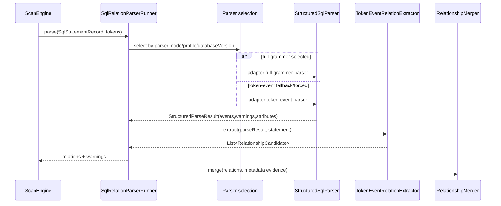
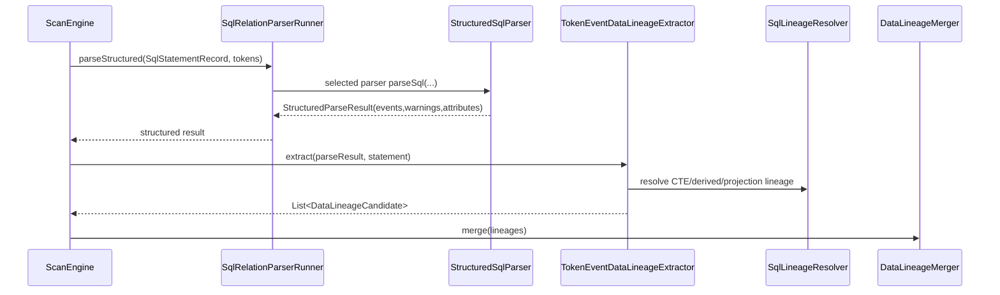
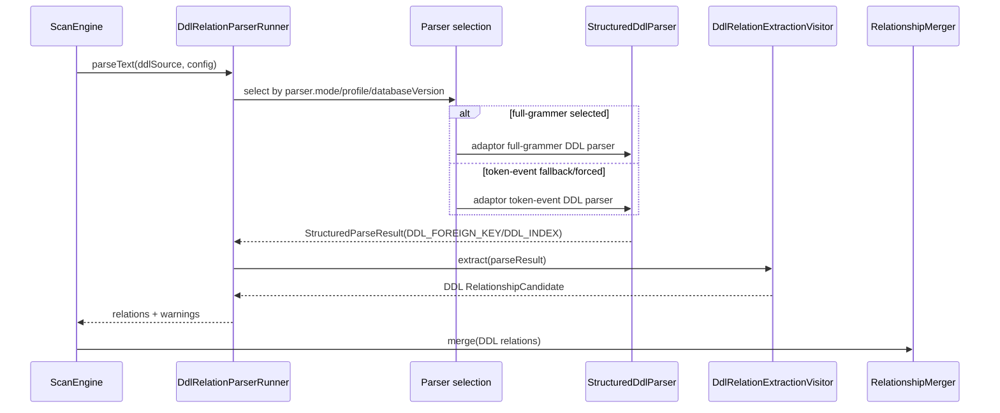
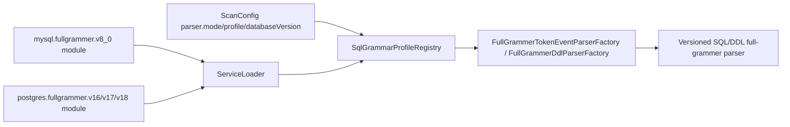
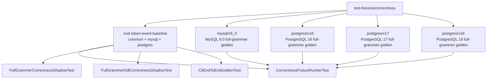

# Phase 6：SQL/DDL/对象解析增强详细设计

## 目标

Phase 6 描述当前代码中 SQL、DML、DDL、数据库对象解析如何生成 relationship 和 Data Lineage。本文按当前实现对齐，不再保留 Simple parser、旧 ANTLR primary/shadow、v2/current 等迁移期口径。

当前解析体系分成两种用户可见 parser mode：

- `token-event`：生产兜底解析链路。ANTLR 作为底层 lexer/parser/token 支撑，Java token-event builder 生成结构事件。
- `full-grammer`：版本化完整 grammar 链路。MySQL 8.0 与 PostgreSQL 16/17/18 的 full-grammer module 由 adaptor 提供，解析树 visitor 直接生成同一套结构事件。PostgreSQL 官方 Bison/Flex grammar 是 source-of-truth，仓库 `.g4` 是按 major version 维护的 ANTLR projection。

默认 `parser.mode=auto`：如果能根据 database type、人工 profile、配置版本或 JDBC metadata 选中 full-grammer profile，则使用 full-grammer；否则使用 token-event。显式 `parser.mode=full-grammer` 时，如果 profile 不存在或版本不支持，会记录 warning 并 fallback 到 token-event。profile 已选中后，full-grammer parser 自己返回 partial events / warning；未捕获异常由 `ScanEngine` 记录当前 statement/source 失败，不在同一次 parse 中混入 token-event 事件。显式 `parser.mode=token-event` 时不启用 full-grammer。

关系方向、弱共现、Data Lineage transform、confidence 和 JSON 输出不在 `.g4` 里实现，而在 Java 语义层实现。

## 当前包结构

核心职责分布：

```text
core/src/main/java/com/relationdetector/core/parser
  SqlRelationParserRunner
  DdlRelationParserRunner

core/src/main/java/com/relationdetector/core/tokenevent
  TokenEventStructuredSqlParser
  TokenEventSqlEventBuilder
  MySqlTokenEventSqlEventBuilder
  PostgresTokenEventSqlEventBuilder
  TokenEventStructuredDdlParser
  TokenEventSqlTokenSupport

core/src/main/java/com/relationdetector/core/fullgrammer
  FullGrammerDialectModule
  SqlGrammarProfile / SqlGrammarProfileRegistry / SqlGrammarProfileSelection
  FullGrammerTokenEventParserFactory
  FullGrammerDdlParserFactory
  FullGrammerTokenEventStructuredSqlParser
  FullGrammerTypedSqlEventSink
  FullGrammerExpressionAnalyzer / FullGrammerExpressionAnalysis
  FullGrammerTokenEventShadowComparator

core/src/main/java/com/relationdetector/core/relation
  TokenEventSqlRelationParser
  TokenEventRelationExtractor
  DdlRelationExtractionVisitor
  RelationshipMerger

core/src/main/java/com/relationdetector/core/lineage
  TokenEventDataLineageExtractor
  DataLineageMerger
  SqlLineageResolver

core/src/main/java/com/relationdetector/core/ddl
  DdlStructuredEventVisitor
  MySqlDdlStructuredEventVisitor
  PostgresDdlStructuredEventVisitor
  DdlTokenCursor / DdlStatementView / DdlIndexPartParser
```

Adaptor 负责具体数据库和大版本：

```text
adaptor-mysql/src/main/java/com/relationdetector/mysql/tokenevent
  MySqlTokenEventStructuredSqlParser
  MySqlTokenEventStructuredDdlParser

adaptor-mysql/src/main/java/com/relationdetector/mysql/fullgrammer/v8_0
  MySqlFullGrammerDialectModule
  MySqlFullGrammerStructuredSqlParser
  MySqlFullGrammerStructuredDdlParser
  MySqlTokenEventParseTreeVisitor
  MySqlExpressionAnalyzer
  MySqlFullGrammerDdlEventCollector
  MySqlGrammarSqlMode / MySqlGrammarSqlModes

adaptor-postgres/src/main/java/com/relationdetector/postgres/tokenevent
  PostgresTokenEventStructuredSqlParser
  PostgresTokenEventStructuredDdlParser

adaptor-postgres/src/main/java/com/relationdetector/postgres/fullgrammer/v16
adaptor-postgres/src/main/java/com/relationdetector/postgres/fullgrammer/v17
adaptor-postgres/src/main/java/com/relationdetector/postgres/fullgrammer/v18
  PostgresFullGrammerDialectModule
  PostgresFullGrammerStructuredSqlParser
  PostgresFullGrammerStructuredDdlParser
  PostgresTokenEventParseTreeVisitor
  PostgresExpressionAnalyzer
  PostgresFullGrammerDdlEventCollector
```

版本由 package 表达，例如 `postgres.fullgrammer.v16`、`mysql.fullgrammer.v8_0`。类名不再写 `Postgres16` / `MySql80`。core 只通过 `ServiceLoader<FullGrammerDialectModule>` 加载 adaptor module，不直接 import MySQL/PostgreSQL full-grammer 实现。

## 代码结构注释索引

生产代码的结构性注释分成三层：package 的 `package-info.java` 说明职责边界，生产类 Javadoc 说明文件在链路中的位置，关键 public 方法 / 编排方法 / 复杂 helper 说明调用意图。中文说明职责，English 说明同一职责边界，避免后续维护者只靠类名猜测调用方向。

| Package | 结构职责 |
| --- | --- |
| `contracts` | 公共 enum 入口。 |
| `contracts.model` | relationship、Data Lineage、endpoint、evidence、warning 等跨模块模型。 |
| `contracts.metadata` | catalog facts 和 metadata snapshot。 |
| `contracts.parse` | SQL/DDL/object 解析输入输出契约，包括 statement、event、parse result。 |
| `contracts.spi` | DatabaseAdaptor、collector、parser、profile、scope 等 SPI。 |
| `contracts.scoring` | 默认 evidence score 常量。 |
| `core.scan` | 扫描编排：连接配置、adaptor、metadata、parser、merger 和 ScanResult。 |
| `core.parser` | SQL/DDL runner：执行 parser.mode/profile 选择并调用语义 extractor。 |
| `core.tokenevent` | token-event 事件来源：ANTLR token stream -> StructuredSqlEvent。 |
| `core.fullgrammer` | full-grammer 通用基础设施：profile/module registry、factory、parity、共享 event helper。 |
| `core.relation` | relationship 语义：SQL/DDL events -> RelationshipCandidate，以及 relationship merge。 |
| `core.lineage` | Data Lineage 语义：write mapping/projection/derived lineage -> DataLineageCandidate。 |
| `core.ddl` | token-event DDL event：CREATE/ALTER/INDEX text -> DDL_FOREIGN_KEY/DDL_INDEX。 |
| `core.parse` | 通用 ANTLR parse support、syntax diagnostics 和 dialect 标识。 |
| `core.log` | SQL 文件拆分与 native log 噪声过滤。 |
| `core.metadata` | metadata evidence 增强：unique/index/type evidence。 |
| `core.output` | ScanResult JSON/table 渲染。 |
| `core.diagnostics` | warning 构造工厂。 |
| `core.scoring` | relationship confidence 计算。 |
| `cli` | YAML/CLI 参数、adaptor 发现、ScanEngine 调用和输出。 |
| `mysql` / `postgres` | adaptor 装配：metadata、object/log/DDL collector、token-event parser、full-grammer module。 |
| `mysql.tokenevent` / `postgres.tokenevent` | 方言 token-event parser 入口。 |
| `mysql.fullgrammer.v8_0` / `postgres.fullgrammer.v16` / `postgres.fullgrammer.v17` / `postgres.fullgrammer.v18` | 版本化 full-grammer grammar/profile module、typed visitor、expression analyzer 和 DDL collector。 |

审视结论：当前 package 注释、类级注释、关键函数注释、目录结构和本文职责表一致。core 不直接承载 MySQL/PostgreSQL 版本实现；adaptor 不承载 relationship/lineage semantic extractor；contracts 不依赖 core。

## 解析输入和输出

SQL、DML、对象定义统一进入：

```java
public record SqlStatementRecord(
    String sql,
    StatementSourceType sourceType,
    String sourceName,
    long startLine,
    long endLine,
    Map<String, Object> attributes
) {}
```

结构 parser 输出：

```java
public record StructuredParseResult(
    String backend,
    String dialect,
    String sourceName,
    List<StructuredSqlEvent> events,
    List<WarningMessage> warnings,
    Map<String, Object> attributes
) {}

public record StructuredSqlEvent(
    StructuredParseEventType type,
    String sourceName,
    long line,
    Map<String, Object> attributes
) {}
```

当前结构事件枚举包含：

```text
TABLE_REFERENCE                 // legacy/bootstrap event，不作为当前 semantic extractor 主输入
COLUMN_EQUALITY                 // legacy/bootstrap event，builder 会归一成 PREDICATE_EQUALITY
ROWSET_REFERENCE
PREDICATE_EQUALITY
JOIN_USING_COLUMNS
EXISTS_PREDICATE
IN_SUBQUERY_PREDICATE
TUPLE_IN_SUBQUERY_PREDICATE
CTE_DECLARATION
IGNORED_ROWSET
LOCAL_TEMP_TABLE_DECLARATION
TRIGGER_TARGET_TABLE
TRIGGER_PSEUDO_ROWSET
WRITE_TARGET
UPDATE_ASSIGNMENT
INSERT_SELECT_MAPPING
MERGE_WRITE_MAPPING
PROJECTION_ITEM
EXPRESSION_SOURCE
DDL_FOREIGN_KEY
DDL_INDEX
DYNAMIC_SQL
```

`TokenEventRelationExtractor` 消费的是 `ROWSET_REFERENCE`、`PREDICATE_EQUALITY`、`JOIN_USING_COLUMNS`、`EXISTS_PREDICATE`、`IN_SUBQUERY_PREDICATE`、`TUPLE_IN_SUBQUERY_PREDICATE`、`PROJECTION_ITEM` 和 scope events。`TokenEventDataLineageExtractor` 消费 `WRITE_TARGET`、`UPDATE_ASSIGNMENT`、`INSERT_SELECT_MAPPING`、`MERGE_WRITE_MAPPING`、`PROJECTION_ITEM`、`LOCAL_TEMP_TABLE_DECLARATION` 等事件。`DdlRelationExtractionVisitor` 只消费 `DDL_FOREIGN_KEY` 和 `DDL_INDEX`。

## 总体调用链



当前 `ScanEngine.safeParseStatement(...)` 会调用 `SqlRelationParserRunner.parseStructured(...)` 抽取 Data Lineage，再调用 `SqlRelationParserRunner.parse(...)` 抽取 relationship。这意味着同一语句当前会结构化解析两次。它不是旧 parser 残留，而是实现层的性能优化空间；后续可以在不改变输出的前提下复用同一个 `StructuredParseResult`。

## 详细函数级调用结构

本节按代码入口列出当前 DDL / DML / relationship / lineage 的实际调用关系。代码侧结构注释见各 package 的 `package-info.java`，本节是这些注释在详细设计里的展开。

### ScanEngine 总编排



关键代码入口：

| 阶段 | 代码入口 | 说明 |
| --- | --- | --- |
| CLI 装配 | `cli.Main` | 读取 YAML/CLI、发现 adaptor、创建 `ScanConfig` 和 `ScanEngine`。 |
| 扫描编排 | `core.scan.ScanEngine.scan(...)` | 收集 metadata、DDL、SQL log、routine/object、file input，并分别进入 SQL/DDL runner。 |
| SQL 安全解析 | `ScanEngine.safeParseStatement(...)` | 捕获单条 SQL / object block 失败，生成 warning，继续扫描后续输入。 |
| DDL 安全解析 | `ScanEngine.safeParseDdl(...)` / `safeParseDatabaseDdl(...)` | 捕获单个 DDL source 失败，生成 warning，继续扫描。 |
| relationship merge | `core.relation.RelationshipMerger` | 合并 SQL、DDL、metadata evidence 后的 relationship candidates。 |
| lineage merge | `core.lineage.DataLineageMerger` | 独立合并字段血缘，不参与 relationship confidence。 |

### SQL relationship 调用链



结构事件来源可以不同，但 relationship 语义入口只有 `TokenEventRelationExtractor`。因此 full-grammer 和 token-event 对 FK-like 方向、列级/表级弱共现、self-join、EXISTS 去重使用同一套规则。

### SQL Data Lineage 调用链



Data Lineage v1 只输出数据库内部字段血缘。参数、literal、JSON path、局部变量不是 source endpoint；显式 `CREATE TEMPORARY/TEMP TABLE` 产生的本地临时表 scope 会过滤对应 lineage。过滤依据必须来自语法结构或结构事件，不允许用特殊表名/列名猜测。

### DDL relationship 调用链



DDL parser 只负责产出 `DDL_FOREIGN_KEY` / `DDL_INDEX` 结构事件。`DdlRelationExtractionVisitor` 负责把这些事件转换为 relationship，并补充 DDL evidence。它不解析 SQL/DML，也不承担 Data Lineage。

### full-grammer module 注入链



core 只知道 `FullGrammerDialectModule` 接口和 profile selection 规则，不直接 import `adaptor-mysql` / `adaptor-postgres` 的版本实现。新增大版本时应在对应 adaptor 中新增 version package、module registration、fixture/parity test。

### correctness / golden 验收链



root baseline 明确使用 `parserMode: token-event`；versioned 目录明确使用 `parserMode: full-grammer` 和对应 `grammarProfile`。full-grammer parity 测试只证明 baseline profile 不低于 token-event；严格版本语法证明由 `mysql/v8_0`、`postgres/v16`、`postgres/v17`、`postgres/v18` 的独立 golden 负责。

## Parser mode 和 profile 选择

系统运行模式：

- `parser.mode=auto`：默认。能选中 full-grammer profile 时使用 full-grammer；否则 token-event。
- `parser.mode=full-grammer`：显式要求 full-grammer。profile 缺失或版本不支持时 warning + token-event fallback。profile 已选中后的 parse warning / partial result 仍属于 full-grammer 结果；异常由扫描层记录失败，不用 token-event 补 event。
- `parser.mode=token-event`：强制 token-event，不调用 full-grammer module。

配置来源优先级：

1. CLI `--parser-mode`、`--grammar-profile`、`--database-version` 覆盖 YAML。
2. YAML `parser.mode`、`parser.grammarProfile`、`parser.databaseVersion`。
3. JDBC `DatabaseMetaData.getDatabaseMajorVersion/getDatabaseMinorVersion`，写入 `ScanConfig.databaseVersion`，`databaseVersionSource=JDBC`。
4. 无方言或版本信息时不启用 full-grammer，使用 token-event。

版本规则：

- 用户配置和 fixture manifest 推荐写 `postgresql/16`、`postgresql/17`、`postgresql/18`、`mysql/8.0`；core registry 会归一到内部 profile id `postgresql-16`、`postgresql-17`、`postgresql-18`、`mysql-8.0`。
- PostgreSQL `16.5` 使用 PostgreSQL 16 profile，`17.5` 使用 PostgreSQL 17 profile，`18.1` 使用 PostgreSQL 18 profile。
- MySQL `8.0.x` 使用 MySQL 8.0 profile。
- full-grammer 是严格版本 grammar：PG16 不接受 PG17-only 语法，PG17 不接受 PG18-only 语法；低版本命中高版本专属语法时返回 `FULL_GRAMMAR_VERSION_UNSUPPORTED_SYNTAX`，由 token-event 承担宽松向前兼容。每个 PostgreSQL major 都有独立 `.g4`、parser package 和 version golden；版本间缺失项以 `docs/parser-audit/postgres-version-golden-diff.md` 分类。
- 如果请求版本只比当前已注册最高 major 高 1 个 major，可临时降级到最高低版本并记录 diagnostic；超过 1 个 major 不自动跨级。
- 遇到大版本语法差异或老库兼容需求时，在对应 adaptor 下新增 version package 和 `FullGrammerDialectModule`，并补对应 fixture 或 shadow test。

PostgreSQL versioned correctness 的命名约定：

- `postgres/v16`、`postgres/v17`、`postgres/v18` 是严格版本测试目录，分别代表 PostgreSQL 16.x、17.x、18.x。
- 不使用 `postgres/v1` 这类聚合前缀来表达测试范围。即使 fixture filter 技术上可能按字符串前缀匹配多个目录，设计文档、测试命令和验收描述也必须显式写 `postgres/v16|postgres/v17|postgres/v18`，避免维护者把 `v1` 误解成真实版本。
- root `test-fixtures/correctness/postgres` 仍是历史/兼容 baseline，不作为严格版本 grammar 证明；严格版本证明只看 `postgres/v16`、`postgres/v17`、`postgres/v18`。

MySQL correctness 的命名约定：

- root `test-fixtures/correctness/mysql` 是 MySQL token-event baseline。
- `test-fixtures/correctness/mysql/v8_0` 是 MySQL 8.0 strict full-grammer golden，manifest 强制 `parserMode: full-grammer` 和 `grammarProfile: mysql/8.0`。
- MySQL 5.7 / 8.4 / 未知版本当前没有 strict full-grammer 目录；这些场景由 token-event 宽松 fallback 承担，或者后续新增独立 version package 与 golden。

不要混淆三类 mode：

- `parser.mode` 是系统运行模式：`auto|full-grammer|token-event`。
- MySQL `SQL_MODE` 是 MySQL server/session 语法开关，由 `MySqlGrammarSqlMode` / `MySqlGrammarSqlModes` 表达，只属于 MySQL full-grammer runtime。
- ANTLR lexer mode 是 `.g4` 内部词法状态，例如 PostgreSQL string/meta command mode，不是 Java parser mode。

旧配置：

- `parser.sql.mode`
- `parser.sql.fallbackOnFailure`
- `parser.ddl.mode`
- `parser.ddl.fallbackOnFailure`
- `simple`
- `antlr-shadow`
- `simple-ddl`
- `antlr-ddl-shadow`

这些都已经移除；配置中出现时应明确报错，不应静默映射到当前 mode。

## SQL / DML token-event 链路

token-event SQL parser 是兜底生产链路。MySQL/PostgreSQL adaptor 分别暴露：

```text
mysql.tokenevent.MySqlTokenEventStructuredSqlParser
postgres.tokenevent.PostgresTokenEventStructuredSqlParser
```

调用链：

```text
SqlRelationParserRunner
  -> selected StructuredSqlParser
  -> TokenEventSqlRelationParser
  -> StructuredSqlParser.parseSql(...)
  -> TokenEventRelationExtractor.extract(...)
```

token-event SQL parser 内部：

```text
MySqlTokenEventStructuredSqlParser / PostgresTokenEventStructuredSqlParser
  -> AntlrSqlParseSupport.parseAntlr(...)
  -> visible ANTLR tokens + syntax diagnostics
  -> MySqlTokenEventSqlEventBuilder / PostgresTokenEventSqlEventBuilder
  -> StructuredParseResult(events, warnings, attributes)
```

`TokenEventSqlEventBuilder` 负责跨方言常见结构：rowset、predicate、projection、write mapping、CTE/temp/trigger scope。MySQL/PostgreSQL 子类负责方言 rowset 和语法边界。

MySQL 方言边界示例：

- `STRAIGHT_JOIN`
- ODBC `{ OJ ... }`
- optimizer index hints
- `PARTITION (...)`
- `JSON_TABLE(...)` 防伪表
- MySQL multi-table `UPDATE/DELETE`
- comma DML rowset

PostgreSQL 方言边界示例：

- `ONLY`
- `TABLESAMPLE`
- `ROWS FROM`
- `UNNEST WITH ORDINALITY`
- set-returning function rowset
- `UPDATE ... FROM`
- `DELETE ... USING`
- `MERGE ... USING`
- `MATERIALIZED / NOT MATERIALIZED` CTE

公共语义必须留在 shared extractor：raw equality、`JOIN USING`、correlated `EXISTS`、scalar `IN`、tuple `IN`、FK-like 方向、列级/表级共现、重复证据去重。

## SQL / DML full-grammer 链路

full-grammer SQL parser 由 adaptor 版本 module 提供。当前实现：

```text
mysql-8.0
  -> adaptor-mysql/com.relationdetector.mysql.fullgrammer.v8_0
  -> MySqlFullGrammerStructuredSqlParser
  -> MySqlTokenEventParseTreeVisitor
  -> MySqlExpressionAnalyzer

postgresql-16 / postgresql-17 / postgresql-18
  -> adaptor-postgres/com.relationdetector.postgres.fullgrammer.v16/v17/v18
  -> PostgresFullGrammerStructuredSqlParser
  -> PostgresTokenEventParseTreeVisitor
  -> PostgresExpressionAnalyzer
```

full-grammer SQL parser 使用 versioned ANTLR `.g4`。MySQL 8.0 当前来自 vendored grammars-v4；PostgreSQL 16/17/18 以官方 `gram.y` / `scan.l` / keywords 为 source-of-truth，仓库 `.g4` 作为按 major version 约束的 ANTLR projection。它运行真实 parser entry rule，typed parse-tree visitor 直接生成同一套 `StructuredSqlEvent`。当前默认验收只比较关系、血缘、warning 和 JSON 行为；历史迁移期的 native/delegate/bridged 事件来源属性不再作为 correctness 验收入口。

full-grammer 仍只替换“语法结构识别”。它不会改变：

- FK-like 方向判断
- column/table co-occurrence 语义
- Data Lineage transform 归类
- confidence 公式
- JSON schema

这些仍由 `TokenEventRelationExtractor`、`TokenEventDataLineageExtractor`、merger 和 scoring 负责。

`FullGrammerCorrectnessShadowTest` 扫描无版本 manifest 的 SQL correctness fixture，比较 full-grammer 与 token-event 正式输出，要求：

```text
missingProductionRelations = []
missingProductionLineages = []
```

如果 full-grammer 识别出 extra relation/lineage，不能自动写 golden，必须人工审核。

### PostgreSQL full-grammer 与 token-event 当前对比

当前 PostgreSQL versioned full-grammer 在 correctness fixture 上相对 token-event 不弱，并在若干场景识别更多内容。这个结论只针对已有 fixture gold，不表示 full-grammer 可以宽松解析未知版本语法；未知或 unsupported version 仍由 token-event fallback 承担。

| 组别 | Fixture | SQL / DDL | Relationship fingerprints | Lineage fingerprints | Diagnostics |
| --- | ---: | ---: | ---: | ---: | ---: |
| PostgreSQL root token-event | 66 | 55 / 11 | 742 | 52 | 1 |
| PostgreSQL full-grammer v16 | 66 | 55 / 11 | 745 | 37 | 1 |
| PostgreSQL full-grammer v17 | 68 | 57 / 11 | 748 | 59 | 0 |
| PostgreSQL full-grammer v18 | 69 | 56 / 13 | 748 | 58 | 0 |

root token-event 与 v16/v17/v18 的同名 fixture 对比结果：

| 对比 | 差异 | 设计解释 |
| --- | --- | --- |
| root -> v16 | relation +6 / -2，lineage +0 / -7；root-only `postgres-pg17-sql`，v16-only `postgres-pg17-version-boundary-sql` | v16 对 PG17-only SQL 使用负向版本边界 fixture；relation 增强来自 CTE/IN/DDL evidence，lineage 少量缺失来自严格 v16 的 MERGE lineage 边界。 |
| root -> v17 | relation +6 / -2，lineage +7 / -2；v17-only `postgres-json-table-sql`、`postgres-merge-returning-sql` | v17 新增 SQL/JSON 与 MERGE 扩展 fixture；共同 fixture 中 full-grammer 对 CTE/IN/DDL evidence 和 MERGE lineage 更强。 |
| root -> v18 | relation +6 / -2，lineage +7 / -2；v18-only `postgres-returning-old-new-sql`、`postgres-temporal-constraints-ddl`、`postgres-virtual-generated-ddl` | v18 新增 `old/new` RETURNING、temporal constraints、virtual generated column fixture；共同 fixture 与 v17 行为一致。 |
| v16 -> v17 | relation 无变化，lineage +9；v16-only `postgres-pg17-version-boundary-sql`，v17-only PG17 专属 fixture | v17 在 `pg15` MERGE lineage 上补齐 9 条字段血缘，并新增 PG17-only 正向 fixture。 |
| v17 -> v18 | 共同 fixture relation/lineage 无变化；fixture 集合不同 | v17 与 v18 的共同 SQL/DDL 语义输出一致，差异来自各自版本专属 fixture。 |

当前不需要新的人工审核项。已知 relation 差异都可由明确 SQL/DDL 结构解释：例如 `generated-comprehensive-query-sql` 的 `SQL_LOG_SUBQUERY_IN`、`postgres-official-cte-dml-sql` 的 CTE DML 回溯、`postgres-official-index-include-partial-ddl` 的 `TARGET_UNIQUE` evidence 丰富度、`postgres-official-subquery-deep-sql` 的 tuple/subquery IN 关系。若后续出现 endpoint 缺失、lineage 缺失，或 evidence 变化无法由 SQL 语法结构解释，应进入 `docs/parser-audit/postgres-version-golden-diff.md` 或新的审核报告。

### MySQL 8.0 full-grammer 与 token-event 当前对比

MySQL 当前同时有 root token-event baseline 和 MySQL 8.0 strict full-grammer golden：

| 组别 | Fixture | SQL / DDL | Relationship fingerprints | Lineage fingerprints | Diagnostics |
| --- | ---: | ---: | ---: | ---: | ---: |
| MySQL root token-event | 57 | 46 / 11 | 108 | 24 | 1 |
| MySQL full-grammer v8_0 | 57 | 46 / 11 | 119 | 95 | 0 |

逐 fixture 对比中，MySQL v8_0 相对 root token-event 只有新增，没有删除：

| 差异类型 | 数量 | 主要来源 |
| --- | ---: | --- |
| Relationship added | 11 | procedure body 中更完整的 JOIN / procedure relation、business financial procedure 的物理表关系。 |
| Relationship removed | 0 | 无。 |
| Data Lineage added | 71 | purchase inbound/order/requisition、worker distribution、org PDF refresh、biz bill progress 等 procedure 内写入字段血缘。 |
| Data Lineage removed | 0 | 无。 |

这些新增项来自 MySQL 8.0 full-grammer typed visitor 对 procedure body、CTE/derived projection、DML write mapping 和表达式来源的更强解析，不来自表名/列名特殊过滤。参数、literal、局部变量、JSON path、显式临时表链路仍按 v1 边界过滤。

### PostgreSQL 版本专属 fixture 差异

以 v18 作为当前最新版本基准，版本专属 fixture 的差异如下：

| 版本 | 专属 fixture | 覆盖语法 | 当前输出重点 |
| --- | --- | --- | --- |
| v17 | `postgres17-json-table-sql` | SQL/JSON `JSON_TABLE()` rowset 与 `JSON_EXISTS()` | `JSON_TABLE` / `jt` 不作为物理表；保留 `orders.user_id -> users.id` FK-like relationship |
| v17 | `postgres17-merge-returning-sql` | `MERGE ... WHEN NOT MATCHED BY SOURCE/TARGET` 与 `RETURNING merge_action()` | 保留 source/target 字段关系，并输出 `staging_account_balances.balance -> account_balances.balance` direct lineage |
| v18 | `postgres18-returning-old-new-sql` | DML `RETURNING old/new` pseudo row references | `old` / `new` 不作为物理表；保留 `account_balances.balance, transaction_ledgers.amount -> account_balances.balance` arithmetic lineage |
| v18 | `postgres18-temporal-constraints-ddl` | `WITHOUT OVERLAPS` 与 `PERIOD` temporal FK columns | 输出普通 FK 列关系；`PERIOD` 时间范围列只作为 temporal metadata，不强行当普通 equality FK |
| v18 | `postgres18-virtual-generated-ddl` | virtual generated columns | 验证 PG18-only DDL 可解析；当前不产生 relationship / lineage |

这些版本专属 fixture 在低版本目录缺失属于 `EXPECTED_VERSION_GAP`。当前没有 `GRAMMAR_GAP`、`SEMANTIC_GAP` 或 `REVIEW_NEEDED` 项。

## Relationship 抽取

`TokenEventRelationExtractor` 是 SQL/DML relationship 的共享语义层。它按以下顺序处理：

1. 从 `ROWSET_REFERENCE`、`WRITE_TARGET`、`TRIGGER_PSEUDO_ROWSET` 建立 alias/table 映射。
2. 从 `CTE_DECLARATION`、`IGNORED_ROWSET`、`LOCAL_TEMP_TABLE_DECLARATION` 建立忽略 scope。
3. 从 `PROJECTION_ITEM` 建立 CTE/derived output column 到物理列的映射。
4. 消费 predicate 事件生成 relationship candidates。

主要规则：

```text
PREDICATE_EQUALITY
  -> resolve left/right alias.column
  -> FK-like 判断优先
  -> 若 FK-like 不成立，且两侧为不同物理表，输出 COLUMN_CO_OCCURRENCE
  -> 若同一物理表但不同 SQL alias 且物理列不同，也输出 COLUMN_CO_OCCURRENCE
  -> 同一 alias 行内比较不输出 self co-occurrence

EXISTS_PREDICATE
  -> 输出 SQL_LOG_EXISTS
  -> 同 endpoint pair 的重复 SQL_LOG_JOIN 会被去掉，避免重复计分

JOIN_USING_COLUMNS
  -> 输出列级弱共现
  -> 不直接升级 FK-like

IN_SUBQUERY_PREDICATE / TUPLE_IN_SUBQUERY_PREDICATE
  -> 输出 SQL_LOG_SUBQUERY_IN
```

self-join 列级弱共现的接受条件是结构性的，不是名字匹配：

```text
same physical table
+ different SQL aliases
+ different physical columns
+ explicit equality predicate
```

因此这些可以输出 `SQL_LOG_COLUMN_CO_OCCURRENCE`：

```sql
FROM hr_employees e
JOIN hr_employees m ON e.manager_id = m.emp_id
```

但这种不会输出：

```sql
FROM accounts a
WHERE a.left_col = a.right_col
```

FK-like 方向规则仍优先。无法可靠判断方向时才进入 column co-occurrence；没有列端点时才退化为 table co-occurrence。

`correlated EXISTS` 是跨方言公共关系语义。公共 extractor 可以处理 EXISTS 外壳和相关谓词；EXISTS 内部如果出现 MySQL/PostgreSQL 专属 rowset/function/hint/`ONLY`/`JSON_TABLE` 等语法，必须由对应方言 event builder 或 full-grammer visitor 负责识别和过滤。

`SQL_LOG_EXISTS` 当前分值高于普通 `SQL_LOG_JOIN`。同一 predicate 已生成 EXISTS evidence 时去掉重复 JOIN，是为了避免单个 SQL predicate 虚高置信度，不是丢证据。

## Data Lineage v1

Data Lineage 是独立模型，不混入 relationship，也不改变 relationship confidence。

调用链：

```text
SqlRelationParserRunner.parseStructured(...)
  -> StructuredParseResult
  -> TokenEventDataLineageExtractor.extract(...)
  -> DataLineageMerger.merge(...)
  -> ScanResult.dataLineages()
  -> JsonResultWriter.dataLineages
```

v1 只输出数据库内部字段血缘：

```text
table.column -> table.column
```

不会输出：

- parameter -> table.column
- JSON path -> table.column
- literal -> table.column
- local variable -> table.column
- dynamic SQL reconstructed value -> table.column

DELETE 不输出字段血缘；它属于关系和未来 write impact/affected table 模型。

支持的写入事件：

- `UPDATE_ASSIGNMENT`
- `INSERT_SELECT_MAPPING`
- `MERGE_WRITE_MAPPING`

辅助事件：

- `ROWSET_REFERENCE`
- `WRITE_TARGET`
- `PROJECTION_ITEM`
- `LOCAL_TEMP_TABLE_DECLARATION`

transform 类型：

```text
DIRECT              0.90
AGGREGATE           0.80
CUMULATIVE          0.80
COALESCE            0.75
ARITHMETIC          0.75
CONCAT_FORMAT       0.70
FUNCTION_CALL       0.65
CASE_WHEN VALUE     0.65
CASE_WHEN CONTROL   0.55
WINDOW_DERIVED      0.50
UNKNOWN_EXPRESSION  0.35
```

规则示例：

```text
SET a.x = b.y
  -> VALUE:DIRECT:b.y->a.x

SET u.total_spent = SUM(o.pay_amount)
  -> VALUE:AGGREGATE:orders.pay_amount->users.total_spent

@running_sum := @running_sum + weight
  -> VALUE:CUMULATIVE:source.weight->target.cdf_end

CASE WHEN c.risk_score > 80 THEN ...
  -> CONTROL:CASE_WHEN:customer_profiles.risk_score->target.status

COALESCE(sm.avg_cost, wi.default_unit_cost) * oi.quantity
  -> VALUE:AGGREGATE / ARITHMETIC / COALESCE according to reviewed fixture semantics
```

`knownPhysicalTables` 当前作为 extractor 入参保留，用于未来 metadata-aware lineage。当前 v1 主要依据语法明确的 `LOCAL_TEMP_TABLE_DECLARATION` 过滤本对象 scope 内临时表，不按 `tmp_`、`temp_`、`jsh_temp_` 这类名字猜测临时表。

## SqlLineageResolver 与正式 Data Lineage 的区别

`SqlLineageResolver` 是 relationship 抽取内部 helper，只把 CTE/derived/LATERAL 简单投影列回溯到物理列。它不输出 JSON，不计算 lineage confidence。

`TokenEventDataLineageExtractor` 是正式 Data Lineage 输出链路。它处理写目标和表达式来源，输出 `DataLineageCandidate`。

二者可以复用“安全列回溯”思想，但职责不同：

```text
SqlLineageResolver:
  x.user_id -> orders.user_id
  用于把 x.user_id = users.id 还原成 orders.user_id -> users.id

TokenEventDataLineageExtractor:
  orders.pay_amount -> users.total_spent
  用于输出字段值流向
```

## DDL token-event 链路

DDL token-event 是生产 DDL 兜底链路。Adaptor 暴露：

```text
mysql.tokenevent.MySqlTokenEventStructuredDdlParser
postgres.tokenevent.PostgresTokenEventStructuredDdlParser
```

调用链：

```text
DdlRelationParserRunner
  -> selected StructuredDdlParser
  -> parseDdl(...)
  -> DDL_FOREIGN_KEY / DDL_INDEX events
  -> DdlRelationExtractionVisitor.extract(...)
```

token-event DDL parser 内部：

```text
TokenEventStructuredDdlParser
  -> DdlStructuredEventVisitor.forDialect(...)
  -> MySqlDdlStructuredEventVisitor / PostgresDdlStructuredEventVisitor
  -> DdlTokenCursor / DdlStatementView / DdlIndexPartParser
```

支持：

- `CREATE TABLE` table-level FK
- inline `REFERENCES`
- composite FK
- `ALTER TABLE ... ADD FOREIGN KEY`
- primary key / unique constraint
- ordinary source index
- `CREATE UNIQUE INDEX`
- MySQL inline `KEY/INDEX`、prefix/functional/JSON index 边界、`VISIBLE/INVISIBLE`
- PostgreSQL `ONLY`、`CONCURRENTLY`、`INCLUDE`、partial index、expression/opclass/collation index 边界

`DdlRelationExtractionVisitor` 两遍处理：

```text
第一遍 DDL_INDEX:
  -> 收集 SOURCE_INDEX
  -> 收集 TARGET_UNIQUE

第二遍 DDL_FOREIGN_KEY:
  -> 生成 FK_LIKE + DDL_FOREIGN_KEY
  -> 如果 source 有普通索引，补 SOURCE_INDEX
  -> 如果 target 有 PK/unique，补 TARGET_UNIQUE
```

DDL index 本身不会凭空创造 FK-like relationship。partial index、expression index、prefix index、函数 index、JSON path index 等只作为 parser 覆盖边界，不作为全局唯一或 FK-like 证据。

## DDL full-grammer 链路

DDL full-grammer parser 也由 adaptor version module 提供：

```text
MySqlFullGrammerStructuredDdlParser
  -> MySqlFullGrammerParser.queries()
  -> MySqlFullGrammerDdlEventCollector
  -> DDL_FOREIGN_KEY / DDL_INDEX

PostgresFullGrammerStructuredDdlParser
  -> PostgresFullGrammerParser.root()
  -> PostgresFullGrammerDdlEventCollector
  -> DDL_FOREIGN_KEY / DDL_INDEX
```

full-grammer DDL collector 不委托 `DdlStructuredEventVisitor.extractEvents(...)`。`DdlRelationExtractionVisitor` 仍复用同一套 DDL semantic layer。

`FullGrammerDdlCorrectnessShadowTest` 扫描无版本 manifest 的 DDL correctness fixture，要求：

```text
missingCurrentDdlRelations = []
```

extra DDL relation/index evidence 需要审核，不自动写 golden。

## DDL 与 SQL 为什么分开

SQL/DML 描述“程序如何使用表”，主要证据来自 JOIN、WHERE equality、IN/EXISTS、CTE/derived lineage、DML write mapping。

DDL 描述“数据库声明的结构事实”，主要证据来自 FK、inline references、PK/unique/index。

二者最终都输出 `RelationshipCandidate`，但 evidence type、置信度语义、失败策略和测试边界不同：

- DDL 使用 `DDL_FOREIGN_KEY`、`SOURCE_INDEX`、`TARGET_UNIQUE`。
- SQL 使用 `SQL_LOG_JOIN`、`VIEW_JOIN`、`PROCEDURE_JOIN`、`SQL_LOG_EXISTS`、`SQL_LOG_SUBQUERY_IN`、`SQL_LOG_COLUMN_CO_OCCURRENCE`。
- DDL 不输出 Data Lineage。
- SQL/DML 可以输出 Data Lineage。
- DDL parser 失败只影响当前 DDL source；SQL parser 失败只影响当前 statement/object block。

因此不能把 SQL visitor 和 DDL visitor 合成一个万能 parser。它们共享 token-event/full-grammer 基础设施，但入口、事件、semantic extractor 和 correctness fixture 必须分开。

## 动态 SQL 和对象 SQL

Procedure/function/trigger/event/rule/view 等对象定义进入 `SqlStatementRecord`，保留 source type 与 object provenance。

routine/function fixture 可使用：

```yaml
statementFormat: OBJECT_BLOCKS
objectSourceFilter: PROCEDURE:case_01.proc_name
```

这样 procedure body 不会被普通分号拆碎。

动态 SQL 策略：

```sql
SET @s = 'SELECT ...';
PREPARE stmt FROM @s;
EXECUTE stmt;
```

当前不猜测拼接结果中的关系，也不做 Parameter Binding。系统输出 `DYNAMIC_SQL_UNRESOLVED` warning，并在 warning attributes 中保留 raw statement、object schema/name/type、routine schema/name/type 等定位信息。

## 正则、scanner 与 typed parse-tree 边界

当前生产兜底 token-event 链路仍有 token scanner，因为它需要容忍日志截断、routine/object 混合语法、动态 SQL、局部方言语法和不完整 SQL。token scanner 只能作为事件来源，不应承载 relationship scoring。

full-grammer 链路的目标是用版本化 `.g4` 和 typed parse-tree visitor 替代 token scanner 的结构识别。当前 SQL full-grammer event path 已由 MySQL/PostgreSQL parse-tree visitor 与 `FullGrammerTypedSqlEventSink` 生成事件。DDL full-grammer path 由 adaptor-local DDL event collector 生成 DDL events，不委托 token-event DDL visitor。默认测试只验证 full-grammer 输出行为和 parity；实现来源诊断属性只用于 debug/code review。

允许保留的 helper：

- 读取 source location。
- 读取 identifier 原文。
- 生成 diagnostics preview。

不允许作为关系/血缘规则来源：

- 特殊业务表名或列名白名单/黑名单。
- 通过 `tmp_`、`temp_`、`jsh_temp_` 名字猜测临时表。
- 为某个 fixture 写专门列名判断。

如果某个结构无法从 typed context 稳定获得，必须进入审核文档，例如 `docs/parser-audit/full-grammer-typed-visitor-gaps.md`，不能静默 fallback 到名字过滤或旧 delegate。

## 测试与验收

核心 correctness：

```text
CorrectnessFixtureRunnerTest
  -> test-fixtures/correctness/**/*
  -> expected-relations.json
  -> expected-lineage.json
  -> expected-diagnostics.json
```

生成报告：

```text
CorrectnessSummaryGeneratorTest
  -> docs/generated/correctness-test-summary.md

DataLineageAuditGeneratorTest
  -> docs/parser-audit/data-lineage-full-audit.md
```

full-grammer parity：

```text
FullGrammerCorrectnessShadowTest
  -> SQL relationship + Data Lineage 不少于 token-event

FullGrammerDdlCorrectnessShadowTest
  -> DDL relationship 不少于 token-event
```

CLI 端到端：

```text
CliEndToEndGoldenTest
  -> YAML/CLI args
  -> AdaptorRegistry
  -> ScanEngine
  -> parser runners
  -> merger + JSON writer
  -> existing fixture golden fingerprints

ParserConfigRemovalTest
  -> removed parser config rejection
  -> parser.mode CLI/YAML parsing
```

当前最近一次文档对齐时的测试资产统计：

| Golden 组 | Fixture | SQL / DDL | Relationship fingerprints | Lineage fingerprints | Diagnostics |
| --- | ---: | ---: | ---: | ---: | ---: |
| 全部 correctness | 385 | 317 / 68 | 3212 | 325 | 3 |
| root token-event baseline（common + MySQL root + PostgreSQL root） | 125 | 103 / 22 | 852 | 76 | 2 |
| MySQL root token-event | 57 | 46 / 11 | 108 | 24 | 1 |
| MySQL full-grammer v8_0 | 57 | 46 / 11 | 119 | 95 | 0 |
| PostgreSQL root token-event | 66 | 55 / 11 | 742 | 52 | 1 |
| PostgreSQL full-grammer v16 | 66 | 55 / 11 | 745 | 37 | 1 |
| PostgreSQL full-grammer v17 | 68 | 57 / 11 | 748 | 59 | 0 |
| PostgreSQL full-grammer v18 | 69 | 56 / 13 | 748 | 58 | 0 |

最新验证摘要：`mvn test` 已通过；targeted correctness / full-grammer parity / CLI E2E 测试也已通过。该摘要是对当前手写设计的实现快照；如果后续 fixture/golden 增减，应同步刷新本表、`docs/relation-detector/test-assets-map.md` 和 `docs/design/relation-detector/design-validation-report.md`。

维护规则：

- 新增 SQL/DDL 语法能力，优先补 correctness fixture/golden。
- 新增 full-grammer profile，必须补 profile selection 测试和至少一组对应版本 fixture/shadow test。
- 新增方言专属能力，必须补反向负向测试。
- relationship golden 变化必须人工审核，不能用测试输出机械覆盖。
- Data Lineage extra 必须进入审核或 golden，不能静默漂移。
- generated summary 和 audit 报告由 Java 测试生成，不调用大模型。
- 目录/命名/迁移过程检查只作为 code review 的可选 `rg` 手工检查，不再作为默认 Maven 测试入口；默认测试聚焦 SQL/DDL correctness、confidence、warning、输出和端到端系统行为。
