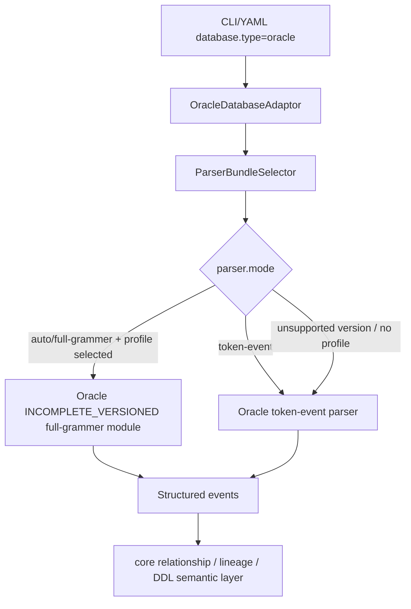

# Phase 9：Oracle adaptor 详细设计

## 目标

Oracle adaptor 按 PostgreSQL versioned full-grammer 的设计方式接入 relation-detector：对外仍使用统一 `parser.mode=auto|full-grammer|token-event`，内部由 Oracle adaptor 提供 root token-event parser、versioned full-grammer module、sample-data 和 correctness golden。

本轮支持矩阵：

| Profile | 版本基线 | package | correctness golden |
| --- | --- | --- | --- |
| `oracle/12c` | Oracle 12c Release 2 / 12.2 | `oracle.fullgrammer.v12c` | `test-fixtures/correctness/oracle/v12c` |
| `oracle/19c` | Oracle 19c | `oracle.fullgrammer.v19c` | `test-fixtures/correctness/oracle/v19c` |
| `oracle/21c` | Oracle 21c | `oracle.fullgrammer.v21c` | `test-fixtures/correctness/oracle/v21c` |
| `oracle/26ai` | Oracle 26ai | `oracle.fullgrammer.v26ai` | `test-fixtures/correctness/oracle/v26ai` |

官方 SQL Reference 入口：

- Oracle 12.2 SQL Language Reference: `https://docs.oracle.com/en/database/oracle/oracle-database/12.2/sqlrf/`
- Oracle 19c SQL Language Reference: `https://docs.oracle.com/en/database/oracle/oracle-database/19/sqlrf/`
- Oracle 21c SQL Language Reference: `https://docs.oracle.com/en/database/oracle/oracle-database/21/sqlrf/`
- Oracle 26ai SQL Language Reference: `https://docs.oracle.com/en/database/oracle/oracle-database/26/sqlrf/`

## 当前实现状态

Oracle 当前处于“adaptor + token-event baseline + `INCOMPLETE_VERSIONED` full-grammer projection”的阶段。它已经不再是 sample-data facade：每个 full-grammer profile 都使用自己的 generated lexer/parser，并且 `.g4` 中已经存在官方来源可解释的首批版本差异。但它仍不是 Oracle 官方 SQL/PLSQL 手册的完整 ANTLR 转换，不能与 MySQL 8.0 / PostgreSQL v16-v18 的成熟 full-grammer 覆盖度等同展示。

已实现：

- Maven 模块：`adaptor-oracle`。
- `DatabaseAdaptor`：`com.relationdetector.oracle.OracleDatabaseAdaptor`，通过 Java SPI 注册。
- token-event SQL：`OracleTokenEventStructuredSqlParser`，使用 `adaptor-oracle` 自己的 `OracleRelationSql.g4` 与 typed visitor。
- token-event DDL：`OracleTokenEventStructuredDdlParser`，同样通过 Oracle token-event grammar 的 typed DDL context 生成 DDL events。
- full-grammer module：`oracle/12c`、`oracle/19c`、`oracle/21c`、`oracle/26ai` 通过 `FullGrammerDialectModule` 注册；每个版本使用自己的 split lexer/parser grammar，并带有首批官方版本边界差异，运行属性 `grammarCoverage=INCOMPLETE_VERSIONED`。
- sample-data：`sample-data/oracle/12c|19c|21c|26ai`，每版 37 个 SQL 文件。
- correctness golden：root token-event 保留 37 个 sample-data fixture；四个 versioned full-grammer 目录覆盖对应 `sample-data/oracle/<version>` 的 37 个 SQL 文件，并保留 profile smoke / version-only fixture。

已实现的官方版本边界：

| Feature | First accepted profile | Lower version behavior |
| --- | --- | --- |
| `CREATE TABLE ... MEMOPTIMIZE FOR READ` | `oracle/19c` | `oracle/12c` grammar rejects it. |
| PL/SQL `SQL_MACRO(SCALAR)` function header | `oracle/21c` | `oracle/12c` and `oracle/19c` grammar reject it. |
| `VECTOR(...)` column data type | `oracle/26ai` | `oracle/12c`、`oracle/19c`、`oracle/21c` grammar reject it. |

详细来源和差异清单见 `docs/parser-audit/oracle-version-grammar-diff.md`。

当前有意保留的缺口：

- Oracle versioned `.g4` 目前是 `INCOMPLETE_VERSIONED` grammar projection，不是官方完整 Oracle grammar；它已经拆成每个版本自己的 lexer/parser grammar，并运行本版本 generated lexer/parser/visitor。
- Oracle full-grammer 不再持有或调用 Oracle token-event parser delegate；versioned sample-data golden 通过各版本 generated parser 直接验收。
- Oracle sample-data 是从 ERP 样例迁移而来，已进入 parser correctness golden；Oracle SQL 资产卫生测试会拒绝 PostgreSQL/MySQL 残留语法，例如 `LANGUAGE plpgsql`、`::TYPE`、`WITH RECURSIVE`、`LIMIT`、`string_agg`、`jsonb_*`、`->>`、`AUTO_INCREMENT`、`ENGINE=` 和 `ON DUPLICATE KEY UPDATE`。真实 Oracle 实例 runtime smoke 仍待补充。

这些缺口记录在 `docs/parser-audit/oracle-sample-data-migration-review.md`，属于 `PARSER_GAP_BACKLOG` / `OFFICIAL_GRAMMAR_BACKLOG` / `RUNTIME_SMOKE_PENDING`，不是需要业务口径审核的 `REVIEW_NEEDED`。

## 包结构

```text
adaptor-oracle/src/main/java/com/relationdetector/oracle
  OracleDatabaseAdaptor

adaptor-oracle/src/main/java/com/relationdetector/oracle/tokenevent
  OracleTokenEventStructuredSqlParser
  OracleTokenEventStructuredDdlParser

adaptor-oracle/src/main/java/com/relationdetector/oracle/fullgrammer/common
  AbstractOracleFullGrammerDialectModule
  OracleFullGrammerStructuredSqlParser
  OracleFullGrammerStructuredDdlParser

adaptor-oracle/src/main/java/com/relationdetector/oracle/fullgrammer/v12c
adaptor-oracle/src/main/java/com/relationdetector/oracle/fullgrammer/v19c
adaptor-oracle/src/main/java/com/relationdetector/oracle/fullgrammer/v21c
adaptor-oracle/src/main/java/com/relationdetector/oracle/fullgrammer/v26ai
  OracleFullGrammerDialectModule
```

ANTLR grammar：

```text
adaptor-oracle/src/main/antlr4/com/relationdetector/oracle/tokenevent
  OracleRelationSql.g4

adaptor-oracle/src/main/antlr4/com/relationdetector/oracle/fullgrammer/v12c
  OracleFullGrammerLexer.g4
  OracleFullGrammerParser.g4

adaptor-oracle/src/main/antlr4/com/relationdetector/oracle/fullgrammer/v19c
  OracleFullGrammerLexer.g4
  OracleFullGrammerParser.g4

adaptor-oracle/src/main/antlr4/com/relationdetector/oracle/fullgrammer/v21c
  OracleFullGrammerLexer.g4
  OracleFullGrammerParser.g4

adaptor-oracle/src/main/antlr4/com/relationdetector/oracle/fullgrammer/v26ai
  OracleFullGrammerLexer.g4
  OracleFullGrammerParser.g4
```

token-event 与 full-grammer 不共享 generated grammar 或 parser class。root token-event 只使用 `OracleRelationSql.g4`；versioned full-grammer 只使用各自 `OracleFullGrammerLexer.g4` / `OracleFullGrammerParser.g4`。

ServiceLoader：

```text
META-INF/services/com.relationdetector.contracts.spi.DatabaseAdaptor
META-INF/services/com.relationdetector.core.fullgrammer.FullGrammerDialectModule
```

## Parser 选择



运行时语义：

- `parser.mode=token-event`：只调用 Oracle token-event fallback。
- `parser.mode=auto`：有 `oracle/<version>` profile 时选择 `INCOMPLETE_VERSIONED` full-grammer generated parser；选不中时 fallback token-event。
- `parser.mode=full-grammer`：优先 `INCOMPLETE_VERSIONED` full-grammer generated parser；profile 缺失或 hard failure 时 fallback token-event 并 warning。
- versioned correctness fixture 不允许 silent fallback；它必须按 manifest 指定的 profile 运行。

## Sample-Data 与 Golden

当前 Oracle sample-data 从 PostgreSQL 18 ERP 样例迁移，目录如下。它同时进入 Oracle root token-event baseline 和 Oracle v12c/v19c/v21c/v26ai versioned full-grammer golden。

```text
sample-data/oracle/12c
sample-data/oracle/19c
sample-data/oracle/21c
sample-data/oracle/26ai
```

每版包含：

- `01-schema`：7 个 schema / view / index 文件。
- `02-procedures`：13 个 procedure / trigger / package-like logic 文件。
- `03-data`：5 个 seed / business data 文件。
- `04-queries`：12 个业务查询和写入样例。

Oracle correctness 当前统计：

| Golden 组 | Fixture | SQL / DDL | Relationship fingerprints | Lineage fingerprints | Diagnostics | NAMING_MATCH |
| --- | ---: | ---: | ---: | ---: | ---: | ---: |
| Oracle root token-event | 37 | 30 / 7 | 300 | 94 | 0 | 128 |
| Oracle full-grammer v12c | 38 | 31 / 7 | 301 | 96 | 0 | 129 |
| Oracle full-grammer v19c | 39 | 32 / 7 | 301 | 96 | 0 | 129 |
| Oracle full-grammer v21c | 39 | 32 / 7 | 301 | 96 | 0 | 129 |
| Oracle full-grammer v26ai | 39 | 32 / 7 | 301 | 96 | 0 | 129 |

## 后续收口

Oracle 后续不能靠增加 regex、token span scanner 或表名/列名特殊规则来追能力。优先级如下：

1. 用官方 SQL / PL/SQL Reference 逐版本固化 Oracle `.g4` source-of-truth 和转换说明。
2. 在已覆盖 sample-data 和首批 official version-only golden 的基础上，继续扩大 full-grammer generated parser 和 typed parse-tree visitor 到 Oracle 官方 SQL/PLSQL 语法面。
3. 继续为 12c / 19c / 21c / 26ai 增加真实版本边界 SQL，低版本不得接受高版本专属语法。
4. 在可用 Oracle Free / XE / 企业版环境时对 `sample-data/oracle/12c|19c|21c|26ai` 做 runtime smoke，并把任何 runtime-only 方言问题继续回写到源 sample-data 与 correctness fixture。
