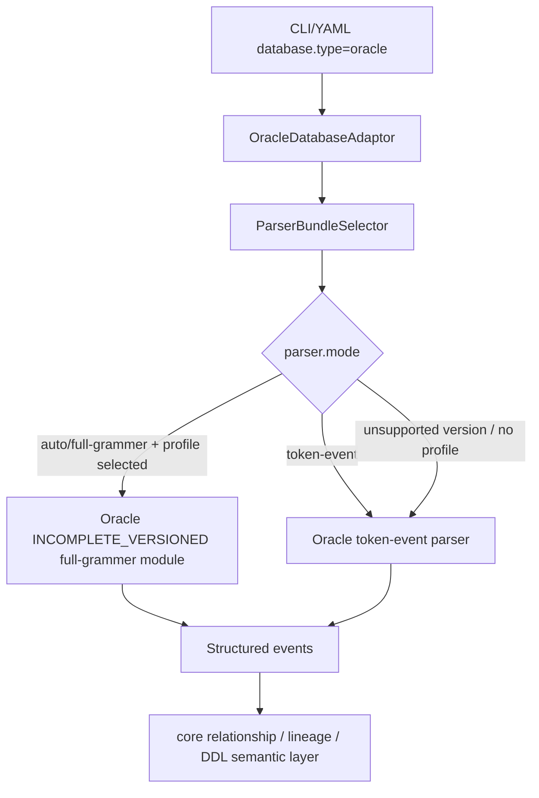

# Phase 9：Oracle adaptor 详细设计

## 目标

Oracle adaptor 按 PostgreSQL versioned full-grammer 的设计方式接入 relation-detector：对外仍使用统一 `parser.mode=auto|full-grammer|token-event`，内部由 Oracle adaptor 提供 root token-event parser、versioned full-grammer module、sample-data 和 correctness golden。

本轮支持矩阵：

| Profile | 版本基线 | package | correctness golden |
| --- | --- | --- | --- |
| `oracle/12c` | Oracle 12c Release 2 / 12.2 | `oracle.fullgrammer.v12c` | `test-fixtures/correctness/oracle/v12c` |
| `oracle/19c` | Oracle 19c | `oracle.fullgrammer.v19c` | `test-fixtures/correctness/oracle/v19c` |
| `oracle/21c` | Oracle 21c | `oracle.fullgrammer.v21c` | `test-fixtures/correctness/oracle/v21c` |
| `oracle/26ai` | Oracle 26ai | `oracle.fullgrammer.v26ai` | `test-fixtures/correctness/oracle/v26ai` |

官方 SQL Reference 入口：

- Oracle 12.2 SQL Language Reference: `https://docs.oracle.com/en/database/oracle/oracle-database/12.2/sqlrf/`
- Oracle 19c SQL Language Reference: `https://docs.oracle.com/en/database/oracle/oracle-database/19/sqlrf/`
- Oracle 21c SQL Language Reference: `https://docs.oracle.com/en/database/oracle/oracle-database/21/sqlrf/`
- Oracle 26ai SQL Language Reference: `https://docs.oracle.com/en/database/oracle/oracle-database/26/sqlrf/`

## 当前实现状态

Oracle 当前处于“adaptor + token-event baseline + `INCOMPLETE_VERSIONED` full-grammer projection”的阶段。它已经不再是 sample-data facade：每个 full-grammer profile 都使用自己的 generated lexer/parser，并且 `.g4` 中已经存在官方来源可解释的首批版本差异。但它仍不是 Oracle 官方 SQL/PLSQL 手册的完整 ANTLR 转换，不能与 MySQL 8.0 / PostgreSQL v16-v18 的成熟 full-grammer 覆盖度等同展示。

Oracle 的 SPI v3 `OracleScriptParser` 使用 generated script lexer 的 typed token，只有单独一行的 `/` 才结束 PL/SQL / object block；普通 SQL 仍按 semicolon framing。client-script slash 不是 server SQL operator，因此该边界在 SQL/DDL grammar 前处理。

已实现：

- Maven 模块：`adaptor-oracle`。
- `DatabaseAdaptor`：`com.relationdetector.oracle.OracleDatabaseAdaptor`，通过 Java SPI 注册。
- token-event SQL：`OracleTokenEventStructuredSqlParser`，使用 `adaptor-oracle` 自己的 `OracleRelationSql.g4` 与 typed visitor。
- token-event DDL：`OracleTokenEventStructuredDdlParser`，同样通过 Oracle token-event grammar 的 typed DDL context 生成 DDL events。
- full-grammer module：`oracle/12c`、`oracle/19c`、`oracle/21c`、`oracle/26ai` 通过 `FullGrammerDialectModule` 注册；每个版本使用自己的 split lexer/parser grammar，并带有首批官方版本边界差异，运行属性 `grammarCoverage=INCOMPLETE_VERSIONED`。
- sample-data：`sample-data/oracle/12c|19c|21c|26ai`，每版 38 个 SQL 文件。
- correctness golden：root token-event 保留会产生 relationship / lineage / diagnostics、或承载 Oracle DDL / 版本边界语法的 sample-data fixture；四个 versioned full-grammer 目录覆盖对应 `sample-data/oracle/<version>` 的保留 fixture，并保留 profile smoke / version-only fixture。
- live database DDL：`OracleDatabaseDdlCollector` 通过 `ALL_TABLES` 与 `DBMS_METADATA.GET_DDL` 读取 table DDL；`OracleDataProfiler` 通过公共 `JdbcDataProfilerTemplate` 执行 bounded containment query。Oracle metadata / object collectors 仍是保守空实现。

已实现的官方版本边界：

| Feature | First accepted profile | Lower version behavior |
| --- | --- | --- |
| `CREATE TABLE ... MEMOPTIMIZE FOR READ` | `oracle/19c` | `oracle/12c` grammar rejects it. |
| PL/SQL `SQL_MACRO(SCALAR)` function header | `oracle/21c` | `oracle/12c` and `oracle/19c` grammar reject it. |
| `VECTOR(...)` column data type | `oracle/26ai` | `oracle/12c`、`oracle/19c`、`oracle/21c` grammar reject it. |

详细来源和差异清单见 `docs/parser-audit/oracle-version-grammar-diff.md`。

当前有意保留的缺口：

- Oracle versioned `.g4` 目前是 `INCOMPLETE_VERSIONED` grammar projection，不是官方完整 Oracle grammar；它已经拆成每个版本自己的 lexer/parser grammar，并运行本版本 generated lexer/parser/visitor。
- Oracle full-grammer 不再持有或调用 Oracle token-event parser delegate；versioned sample-data golden 通过各版本 generated parser 直接验收。
- Oracle sample-data 是从 ERP 样例迁移而来，已进入 parser correctness golden；Oracle SQL 资产卫生测试会拒绝 PostgreSQL/MySQL 残留语法，例如 `LANGUAGE plpgsql`、`::TYPE`、`WITH RECURSIVE`、`LIMIT`、`string_agg`、`jsonb_*`、`->>`、`AUTO_INCREMENT`、`ENGINE=` 和 `ON DUPLICATE KEY UPDATE`。真实 Oracle 实例 runtime smoke 仍待补充。
- Oracle full-grammer 的版本 `.g4` 不再声明 PostgreSQL/MySQL 结构性语法：`LIMIT`、`UNLOGGED`、`CONCURRENTLY`、PostgreSQL `::` cast / JSON arrow、`TABLESAMPLE`、`WITH ORDINALITY`、`DO NOTHING` 和 materialized CTE 等都会在 versioned full-grammer 层失败，而不是被宽松 statement fallback 吞掉。
- Oracle natural assets 已统一为跨版本可表达的 `GENERATED ALWAYS AS (...) VIRTUAL`；布尔比较生成列使用 `CASE WHEN ... THEN 1 ELSE 0 END`。无参 function/procedure definition 不再写空 `()`，四个 versioned grammar 对这种空参数括号产生 parse failure/unsupported diagnostic。未经官方来源确认的 `STORED` generated-column syntax 不进入 natural assets 或版本正向 fixture。

这些缺口记录在 `docs/parser-audit/oracle-sample-data-migration-review.md`，属于 `PARSER_GAP_BACKLOG` / `OFFICIAL_GRAMMAR_BACKLOG` / `RUNTIME_SMOKE_PENDING`，不是需要业务口径审核的 `REVIEW_NEEDED`。

Oracle full-grammer 已经以 `antlr/grammars-v4/sql/plsql` 作为主底座完成
第一轮 vendor 和重接。固定上游 commit：

```text
994628b6d261f5313b72e76039818549352684ce
```

本地把 `PlSqlLexer.g4`、`PlSqlParser.g4`、`PlSqlLexerBase.java`、
`PlSqlParserBase.java` 重命名为每个版本自己的
`OracleFullGrammerLexer/Parser/Base`。这套 grammar 的体量和覆盖面更接近
MySQL/PostgreSQL 当前 vendored full-grammer：它包含独立 lexer/parser、
`sql_script` 入口、DDL、DML、`MERGE`、`CREATE TABLE`、`ALTER TABLE`、
`CREATE PROCEDURE`、`CREATE FUNCTION` 和 `CREATE TRIGGER` 等规则。

但它不是社区预拆好的 Oracle 12c/19c/21c/26ai 严格 grammar，因此本项目
继续维护官方文档驱动的版本裁剪：12c 删除高版本专属语法，19c 加
`MEMOPTIMIZE FOR READ`，21c 加 `SQL_MACRO(SCALAR)`，26ai 加 `VECTOR(...)`。
文档和测试仍将 Oracle 标为 `INCOMPLETE_VERSIONED`，不能等同于
MySQL 8.0 或 PostgreSQL v16/v17/v18 的成熟覆盖度。

## 包结构

```text
adaptor-oracle/src/main/java/com/relationdetector/oracle
  OracleDatabaseAdaptor

adaptor-oracle/src/main/java/com/relationdetector/oracle/tokenevent
  OracleTokenEventStructuredSqlParser
  OracleTokenEventStructuredDdlParser

adaptor-oracle/src/main/java/com/relationdetector/oracle/fullgrammer/common
  AbstractOracleFullGrammerDialectModule
  OracleFullGrammerStructuredSqlParser
  OracleFullGrammerStructuredDdlParser

adaptor-oracle/src/main/java/com/relationdetector/oracle/fullgrammer/v12c
adaptor-oracle/src/main/java/com/relationdetector/oracle/fullgrammer/v19c
adaptor-oracle/src/main/java/com/relationdetector/oracle/fullgrammer/v21c
adaptor-oracle/src/main/java/com/relationdetector/oracle/fullgrammer/v26ai
  OracleFullGrammerDialectModule
```

ANTLR grammar：

```text
adaptor-oracle/src/main/antlr4/com/relationdetector/oracle/tokenevent
  OracleRelationSql.g4

adaptor-oracle/src/main/antlr4/com/relationdetector/oracle/fullgrammer/v12c
  OracleFullGrammerLexer.g4
  OracleFullGrammerParser.g4

adaptor-oracle/src/main/antlr4/com/relationdetector/oracle/fullgrammer/v19c
  OracleFullGrammerLexer.g4
  OracleFullGrammerParser.g4

adaptor-oracle/src/main/antlr4/com/relationdetector/oracle/fullgrammer/v21c
  OracleFullGrammerLexer.g4
  OracleFullGrammerParser.g4

adaptor-oracle/src/main/antlr4/com/relationdetector/oracle/fullgrammer/v26ai
  OracleFullGrammerLexer.g4
  OracleFullGrammerParser.g4
```

token-event 与 full-grammer 不共享 generated grammar 或 parser class。root token-event 只使用 `OracleRelationSql.g4`；versioned full-grammer 只使用各自 `OracleFullGrammerLexer.g4` / `OracleFullGrammerParser.g4`。

ServiceLoader：

```text
META-INF/services/com.relationdetector.contracts.spi.DatabaseAdaptor
META-INF/services/com.relationdetector.core.fullgrammer.FullGrammerDialectModule
```

## Parser 选择



运行时语义：

- `parser.mode=token-event`：只调用 Oracle token-event fallback。
- `parser.mode=auto`：有 `oracle/<version>` profile 时选择 `INCOMPLETE_VERSIONED` full-grammer generated parser；选不中时 fallback token-event。
- `parser.mode=full-grammer`：优先 `INCOMPLETE_VERSIONED` full-grammer generated parser；profile 缺失或 hard failure 时 fallback token-event 并 warning。
- versioned correctness fixture 不允许 silent fallback；它必须按 manifest 指定的 profile 运行。

## Sample-Data 与 Golden

当前 Oracle sample-data 从 PostgreSQL 18 ERP 样例迁移，目录如下。它同时进入 Oracle root token-event baseline 和 Oracle v12c/v19c/v21c/v26ai versioned full-grammer golden。

```text
sample-data/oracle/12c
sample-data/oracle/19c
sample-data/oracle/21c
sample-data/oracle/26ai
```

每版包含：

- `01-schema`：7 个 schema / view / index 文件。
- `02-procedures`：13 个 procedure / trigger / package-like logic 文件。
- `03-data`：5 个 seed / business data 文件。
- `04-queries`：12 个业务查询和写入样例。

Oracle correctness 当前统计：

| Golden 组 | Fixture | SQL / DDL | Relationship fingerprints | Lineage fingerprints | Diagnostics | Rel NAMING_MATCH | Top-level namingEvidence |
| --- | ---: | ---: | ---: | ---: | ---: | ---: | ---: |
| Oracle root token-event | 41 | 33 / 8 | 623 | 247 | 0 | 241 | 309 |
| Oracle full-grammer v12c | 42 | 34 / 8 | 654 | 249 | 0 | 273 | 341 |
| Oracle full-grammer v19c | 43 | 35 / 8 | 654 | 249 | 0 | 273 | 341 |
| Oracle full-grammer v21c | 43 | 35 / 8 | 654 | 249 | 0 | 273 | 341 |
| Oracle full-grammer v26ai | 43 | 35 / 8 | 654 | 249 | 0 | 273 | 341 |

`sample-data/oracle/<version>` 仍保留完整 ERP SQL 资产；correctness 中只保留会产生 relationship / lineage / diagnostics，或承载 Oracle 版本特性、DDL 解析等特殊语法边界的 fixture。纯 seed / routine / metadata-only 空输出切片不再进入 correctness，以降低全量测试时间。

当前 sample-data CLI 专项对比为：

| Parser family | Fixture | SQL / DDL | Relationship fingerprints | Lineage fingerprints | NAMING_MATCH | Diagnostics |
| --- | ---: | ---: | ---: | ---: | ---: | ---: |
| common token-event sample-data | 9 | 6 / 3 | 315 | 109 | 250 | 0 |
| MySQL token-event root sample-data | 38 | 32 / 6 | 352 | 286 | 248 | 0 |
| MySQL full-grammer v5_7 sample-data | 38 | 32 / 6 | 330 | 281 | 244 | 0 |
| MySQL full-grammer v8_0 sample-data | 38 | 32 / 6 | 361 | 281 | 248 | 0 |
| PostgreSQL token-event root sample-data | 38 | 32 / 6 | 347 | 205 | 246 | 0 |
| PostgreSQL full-grammer v16 sample-data | 38 | 32 / 6 | 347 | 206 | 246 | 0 |
| PostgreSQL full-grammer v17 sample-data | 38 | 32 / 6 | 347 | 206 | 246 | 0 |
| PostgreSQL full-grammer v18 sample-data | 38 | 32 / 6 | 347 | 205 | 246 | 0 |
| Oracle token-event root sample-data | 38 | 32 / 6 | 365 | 217 | 248 | 0 |
| Oracle full-grammer v12c sample-data | 38 | 32 / 6 | 365 | 217 | 248 | 0 |
| Oracle full-grammer v19c sample-data | 38 | 32 / 6 | 365 | 217 | 248 | 0 |
| Oracle full-grammer v21c sample-data | 38 | 32 / 6 | 365 | 217 | 248 | 0 |
| Oracle full-grammer v26ai sample-data | 38 | 32 / 6 | 365 | 217 | 248 | 0 |
| SQL Server token-event root sample-data | 38 | 32 / 6 | 333 | 297 | 245 | 0 |
| SQL Server full-grammer v2016 sample-data | 38 | 32 / 6 | 338 | 306 | 245 | 0 |
| SQL Server full-grammer v2017 sample-data | 38 | 32 / 6 | 338 | 306 | 245 | 0 |
| SQL Server full-grammer v2019 sample-data | 38 | 32 / 6 | 338 | 306 | 245 | 0 |
| SQL Server full-grammer v2022 sample-data | 38 | 32 / 6 | 338 | 306 | 245 | 0 |
| SQL Server full-grammer v2025 sample-data | 38 | 32 / 6 | 338 | 306 | 245 | 0 |

## 后续收口

Oracle 后续不能靠增加 regex、token span scanner 或表名/列名特殊规则来追能力。优先级如下：

1. 继续用官方 SQL / PL/SQL Reference 逐版本固化 Oracle `.g4` source-of-truth 和转换说明。
2. 在已覆盖 sample-data 和首批 official version-only golden 的基础上，继续扩大 full-grammer generated parser 和 typed parse-tree visitor 到 Oracle 官方 SQL/PLSQL 语法面。
3. 继续为 12c / 19c / 21c / 26ai 增加真实版本边界 SQL，低版本不得接受高版本专属语法。
4. 在可用 Oracle Free / XE / 企业版环境时对 `sample-data/oracle/12c|19c|21c|26ai` 做 runtime smoke，并把任何 runtime-only 方言问题继续回写到源 sample-data 与 correctness fixture。
