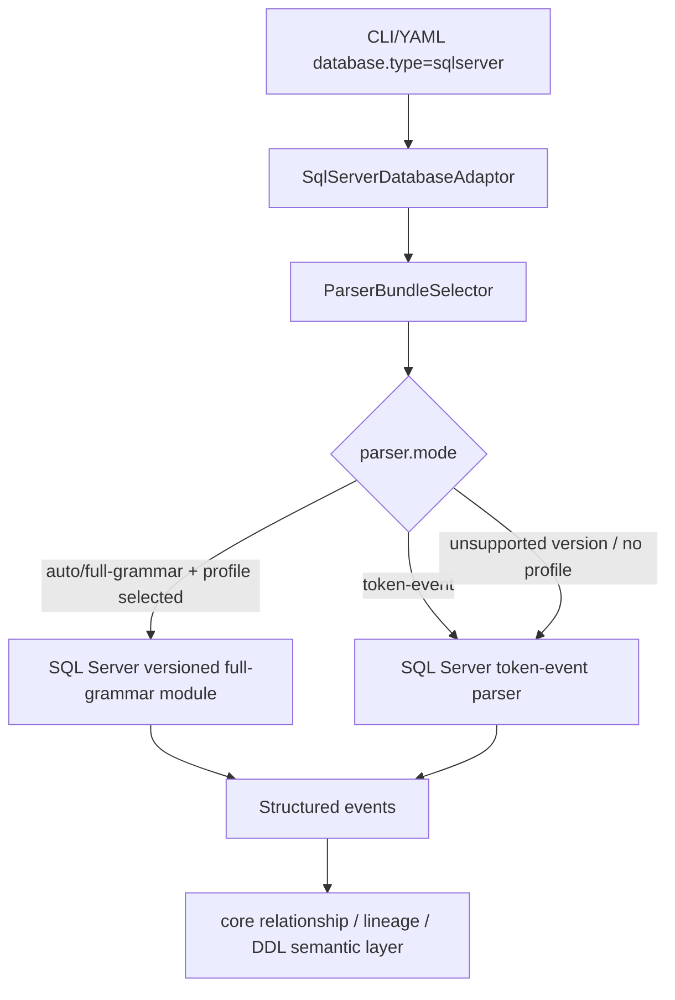

# Phase 10：SQL Server adaptor 详细设计

## 目标

SQL Server adaptor 按 MySQL / PostgreSQL / Oracle 的 parser bundle 模式接入 relation-detector：对外仍使用统一的 `parser.mode=auto|full-grammar|token-event`，内部提供 SQL Server root token-event fallback、versioned full-grammar module、sample-data 和 correctness golden。

本轮版本矩阵：

| Profile | SQL Server 版本 | 兼容级别 | package | correctness golden |
| --- | --- | ---: | --- | --- |
| `sqlserver/2016` | SQL Server 2016 | 130 | `sqlserver.fullgrammar.v2016` | `test-fixtures/correctness/sqlserver/v2016` |
| `sqlserver/2017` | SQL Server 2017 | 140 | `sqlserver.fullgrammar.v2017` | `test-fixtures/correctness/sqlserver/v2017` |
| `sqlserver/2019` | SQL Server 2019 | 150 | `sqlserver.fullgrammar.v2019` | `test-fixtures/correctness/sqlserver/v2019` |
| `sqlserver/2022` | SQL Server 2022 | 160 | `sqlserver.fullgrammar.v2022` | `test-fixtures/correctness/sqlserver/v2022` |
| `sqlserver/2025` | SQL Server 2025 | 170 | `sqlserver.fullgrammar.v2025` | `test-fixtures/correctness/sqlserver/v2025` |

官方参考入口：

- T-SQL Language Reference: `https://learn.microsoft.com/en-us/sql/t-sql/language-reference`
- ALTER DATABASE compatibility level: `https://learn.microsoft.com/en-us/sql/t-sql/statements/alter-database-transact-sql-compatibility-level`
- Community grammar base: `https://github.com/antlr/grammars-v4/tree/master/sql/tsql`

## 当前实现状态

SQL Server 当前已经完成 **ERP sample-data correctness 全量接入**：有独立 Maven 模块、DatabaseAdaptor、root token-event grammar、五个 versioned full-grammar profile、`sample-data/sqlserver/2016|2017|2019|2022|2025` 每版 38 个 SQL 文件，以及 root token-event + 五个 versioned full-grammar correctness golden。首批 Microsoft 文档可确认的 version-only 语法已经落到 `.g4` 差异和 correctness / architecture 测试中：2017 `STRING_AGG`、2022 `DATETRUNC` / `GENERATE_SERIES`、2025 `VECTOR(...)`。

SQL Server 的 SPI v6 `SqlServerScriptFramer` 使用 generated script lexer 的 typed `GO` token：只有单独一行的 `GO` 结束 batch；procedure/function/trigger batch 不会被其中的 semicolon 拆开。batch framing 与 SQL grammar 分离，避免把 client command 当成 T-SQL 结构。

需要分清两个边界：

- sample-data 业务语义覆盖已经从 smoke 扩展到与 MySQL 8.0 sample-data 文件布局对齐。
- Microsoft 官方 T-SQL reference 的逐版本严格裁剪已完成首批边界；当前 sample-data 仍使用 SQL Server 2016-compatible 保守 T-SQL 子集，因此 sample-data 输出保持跨版本一致，version-only 探针单独放在 correctness fixture。

已实现：

- Maven 模块：`adaptor-sqlserver`。
- `DatabaseAdaptor`：`com.relationdetector.sqlserver.SqlServerDatabaseAdaptor`，通过 Java SPI 注册。
- token-event SQL/DDL：`SqlServerTokenEventStructuredSqlParser` / `SqlServerTokenEventStructuredDdlParser`，共同使用 `grammar/sqlserver-token-event` artifact中的 compact combined grammar `SqlServerRelationSql.g4`。
- full-grammar module：`sqlserver/2016`、`sqlserver/2017`、`sqlserver/2019`、`sqlserver/2022`、`sqlserver/2025`，每个 profile 使用自己 package 下的 generated lexer/parser。
- sample-data：`sample-data/sqlserver/2016|2017|2019|2022|2025`，每版 38 个 SQL 文件。
- correctness golden：root token-event 覆盖 `sample-data/sqlserver/2025` 的 38 个文件；五个 versioned full-grammar profile 各覆盖对应版本目录的 38 个文件，另有 version-only fixture 锁定 2017/2022/2025 的首批边界。
- asset hygiene：SQL Server sample-data 与 correctness input 会拒绝 MySQL/PostgreSQL/Oracle 残留语法。
- endpoint schema fidelity：SQL Server parser 支持 `[schema].[table]` 和 `[table]` 两种输入形态。输入显式写 `[dbo].[employees]` 时，SQL/DDL relationship、DDL column inventory 和 top-level `namingEvidence` 都保留 `dbo.employees`；输入只写 `[employees]` 时输出 `employees`，不自动补 `dbo`。SQL Server sample-data 当前选择 `[dbo].[table]` 作为资产内 canonical 形式，这是资产一致性规则，不是所有数据库都必须 schema-qualified 的全局规则。

当前有意保留的缺口：

- 五个 SQL Server full-grammar `.g4` 来自同一个 pinned `grammars-v4/sql/tsql` 快照，但已经按 Microsoft 官方文档做了首批逐版本裁剪。更广泛的官方 T-SQL family 覆盖仍是 backlog。
- 当前 sample-data 为跨版本业务等价 baseline，不混入高版本专属 T-SQL。后续版本专属语法应单独进入 version-only fixture。
- SQL Server live metadata 通过 `sys.tables/sys.schemas/sys.columns/sys.types`、key/FK constraints 和 `sys.indexes/sys.index_columns` 采集；object collector 通过 `sys.objects/sys.schemas/sys.sql_modules` 读取 procedure/function/view/trigger 定义。metadata组合约束/索引按 ordinal 保留，无权访问 definition 会产生 warning 而非空壳对象。metadata/object/database-DDL/profile 共用 scan boundary 解析后的 catalog：scope catalog为空时继承connection catalog；显式 catalog 必须在第一条 `sys.*` 或 profile SQL 前与 `Connection.getCatalog()` 按 SQL Server identifier rules 一致，否则拒绝扫描，不执行隐式跨 database 查询。`SqlServerDatabaseDdlCollector` 通过 `sys.foreign_keys/sys.foreign_key_columns` 的 `constraint_column_id` 对 composite FK 两端做ordinal-safe配对。该 collector 当前从 `INFORMATION_SCHEMA.COLUMNS` 重建关系解析用 table skeleton，只保留基础 data type、nullable 和 key/FK；length/precision/scale、default、identity、computed、collation 等未保留，因此不能当作完整可执行 table DDL。`SqlServerDataProfiler`执行exact aggregate query，独立返回四项profile metrics。当 `sys.sql_modules.definition` 为 null/blank 时，通过统一 `LiveDiagnosticSanitizer` 输出带 object context 的 `DEFINITION_UNAVAILABLE`。

详细迁移审计见 `docs/parser-audit/sqlserver-migration-review.md`；版本差异清单见 `docs/parser-audit/sqlserver-version-grammar-diff.md`。

## 包结构

```text
adaptor-sqlserver/src/main/java/com/relationdetector/sqlserver
  SqlServerDatabaseAdaptor

adaptor-sqlserver/src/main/java/com/relationdetector/sqlserver/tokenevent
  SqlServerTokenEventStructuredSqlParser
  SqlServerTokenEventStructuredDdlParser

adaptor-sqlserver/src/main/java/com/relationdetector/sqlserver/fullgrammar/common
  AbstractSqlServerFullGrammarDialectModule
  SqlServerFullGrammarStructuredSqlParser
  SqlServerFullGrammarStructuredDdlParser
  SqlServerParseTreeEventCollector
  SqlServerExpressionAnalyzer

adaptor-sqlserver/src/main/java/com/relationdetector/sqlserver/fullgrammar/v2016
adaptor-sqlserver/src/main/java/com/relationdetector/sqlserver/fullgrammar/v2017
adaptor-sqlserver/src/main/java/com/relationdetector/sqlserver/fullgrammar/v2019
adaptor-sqlserver/src/main/java/com/relationdetector/sqlserver/fullgrammar/v2022
adaptor-sqlserver/src/main/java/com/relationdetector/sqlserver/fullgrammar/v2025
  FullGrammarBinding
  FullGrammarDialectModule

SQL Server routine scope由 token-event/full-grammar 的 typed object context直接维护，
不再保留无生产引用的独立 routine scope policy。
```

ANTLR grammar：

```text
grammar/sqlserver-token-event/src/main/antlr4/com/relationdetector/sqlserver/tokenevent
  SqlServerRelationSql.g4

grammar/sqlserver-v2016/src/main/antlr4/com/relationdetector/sqlserver/fullgrammar/v2016
grammar/sqlserver-v2017/src/main/antlr4/com/relationdetector/sqlserver/fullgrammar/v2017
grammar/sqlserver-v2019/src/main/antlr4/com/relationdetector/sqlserver/fullgrammar/v2019
grammar/sqlserver-v2022/src/main/antlr4/com/relationdetector/sqlserver/fullgrammar/v2022
grammar/sqlserver-v2025/src/main/antlr4/com/relationdetector/sqlserver/fullgrammar/v2025
  SqlServerFullGrammarLexer.g4
  SqlServerFullGrammarParser.g4
```

token-event 与 full-grammar 不共享 generated parser class，也不互相 delegate。root token-event 只使用 `SqlServerRelationSql*`；versioned full-grammar 只使用各自 `SqlServerFullGrammar*`。

## Parser 选择



运行语义：

- `parser.mode=token-event`：只调用 SQL Server token-event fallback。
- `parser.mode=auto`：有 `sqlserver/<version>` profile 时选择对应 full-grammar generated parser；选不中时 fallback token-event。
- `parser.mode=full-grammar`：优先 versioned full-grammar generated parser；profile 缺失或 hard failure 时 fallback token-event 并 warning。
- versioned correctness fixture 不允许 silent fallback；它必须按 manifest 指定 profile 运行。

## Correctness 范围

SQL Server correctness 覆盖 root token-event 与五个 versioned full-grammar 的 ERP sample-data、
profile smoke 和版本边界 fixture。当前 fixture/fingerprint 数量只维护在
[`correctness-test-summary.md`](../../generated/correctness-test-summary.md)；本 Phase 文档不复制统计。

当前 fixture 语义：

- DDL：ERP 表、PK / FK / UNIQUE / index、视图和触发器承载表间结构 evidence。
- SQL / procedure / query：`JOIN`、`EXISTS`、`IN`、CTE、`INSERT SELECT`、`UPDATE ... FROM`、`MERGE`、聚合和表达式写入。
- 预期 relationship：DDL FK/index 关系，以及 SQL predicate join / subquery relation。
- 预期 lineage：明确字段写入、聚合写入、`UPDATE ... FROM` 与 `MERGE` 更新映射；参数、局部变量、临时表和动态 SQL 不作为物理 source。
- `CREATE TABLE #temp` 由 token-event 和五个 full profile产生 typed local declaration；后续 `FROM #temp` 保留为本地 rowset reference，`INSERT INTO #temp ... SELECT ...` 保留直接写入映射。IN/tuple-IN 只能将唯一 `VALUE/DIRECT` 来源折叠为物理列 relationship，不能恢复 `#temp` endpoint。

SQL Server root token-event 与 versioned full-grammar 在 correctness golden 中分别验证自己的输出。
自然 sample-data 的当前 direct/derived 与 semantic observation 统计只以
[`parser-comparison-summary.md`](../../parser-audit/parser-comparison-summary.md) 为准。该 parity 只证明
当前同一套 natural SQL 资产的一致性；版本差异仍由 version-only fixture 和
`SqlServerParserArchitectureTest` 单独验证。

## 后续收口

1. 继续按 Microsoft Learn T-SQL 文档为 2016/2017/2019/2022/2025 扩展 source-backed 版本边界 `.g4` 差异和负向测试。
2. 保持 SQL Server sample-data 的自然业务 SQL；如需高密度关系探测，继续扩展 semantic-equivalent benchmark，而不是把探针模板放回 sample-data。
3. 补 live SQL Server runtime smoke，验证已实现的 metadata/object/database-DDL/profile catalog 查询在目标权限模型下可执行。
4. 明确 database-DDL 的产品契约：若只服务关系解析，应继续标记为 structural skeleton；若要作为完整声明输出，则补齐 type modifier、default、identity、computed 和 collation。
5. 扩展 semantic-equivalent benchmark，对比 MySQL 8.0、PostgreSQL、Oracle、SQL Server 在同一业务语义上的 relation / lineage 覆盖。
