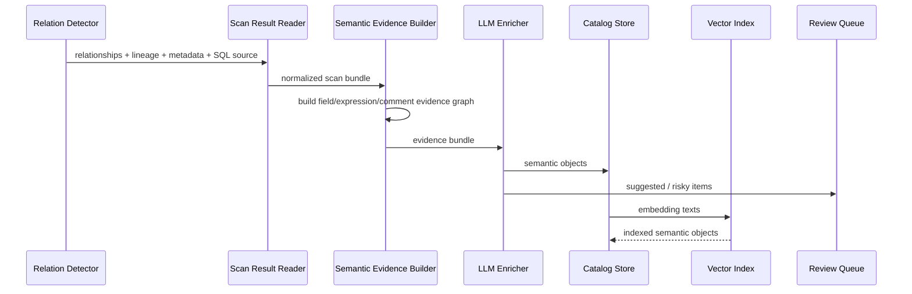
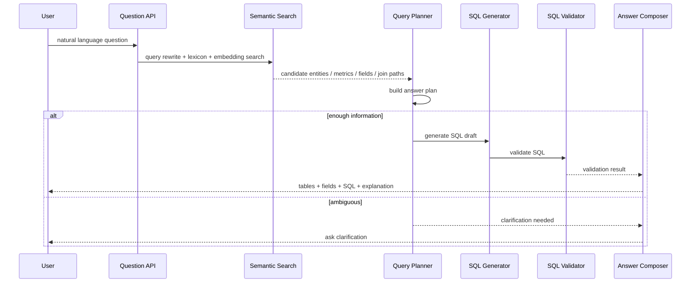
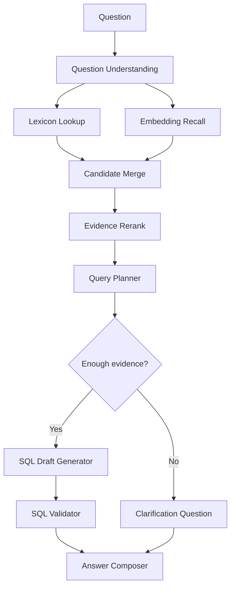

# Evidence-Grounded Semantic Layer 整体设计

## 1. 背景与目标

当前 relation-detector 已经能够从 metadata、DDL、SQL 日志、对象定义和 correctness fixture 中识别数据库表关系，并输出一定的数据来源关系。它解决的是“数据库里真实存在什么结构证据”的问题，例如：

- 哪些表和字段存在。
- 哪些字段可能构成 FK-like relationship。
- 哪些字段写入依赖哪些来源字段。
- 某条关系或血缘来自 DDL、metadata、SQL、procedure、trigger 还是 Data Lineage extractor。

语义层要解决的是另一层问题：用户不会总用物理表字段名提问，而是会说“客户”“会员”“买家”“最近消费金额”“活跃客户”“库存风险”。这些词和物理 schema 之间需要一个可审计、可搜索、可审核的中间层。

因此本设计将当前 relation-detector 定位为更大系统中的 **事实层子系统**：

- relation-detector 负责采集 facts 和 evidence。
- Semantic Layer 负责把 facts 组织成业务语义对象。
- LLM 负责解释、归纳、同义词扩展、指标候选和问题规划。
- LLM 不负责创造数据库事实。
- 每个语义结论都必须保存 `evidenceRefs`，可以回到 relationship、lineage、metadata、SQL source、SQL comment 或 DDL comment。

第一版目标不是直接自动执行 SQL，而是先稳定回答：

- 这个问题应该用哪些表？
- 应该用哪些字段？
- 这些表如何连接？
- 哪些指标口径需要审核？
- 可以生成什么 SQL draft？
- 这个 SQL draft 为什么可信，哪些地方不确定？

## 2. 总体架构

### 2.1 架构图


### 2.2 两条主链路

离线构建链路负责把数据库事实变成语义资产：



在线问答链路负责从自然语言问题生成 answer plan、SQL draft 或澄清问题：



## 3. 模块职责总览

### 3.1 Scan Result Reader

读取 relation-detector 输出的扫描结果，并统一成 semantic build 可消费的输入包。

输入：

- relationship JSON。
- dataLineage JSON。
- metadata facts。
- DDL / SQL / object source location。
- warning 和 confidence。

输出：

- normalized scan bundle。

不负责：

- 不生成业务词。
- 不判断指标口径。
- 不调用 LLM。

### 3.2 Semantic Evidence Builder

把关系、血缘、元数据、SQL 注释、DDL 注释、表达式来源组合成 evidence graph。

典型 evidence：

- 字段证据：`orders.customer_id` 有 DDL comment、JOIN evidence、metadata type。
- 表达式证据：`SUM(payments.amount)` 来自 SQL projection alias 或 lineage transform。
- Join path 证据：`payments.order_id -> orders.id -> customers.id`。
- 注释证据：SQL 中的 `-- customer paid amount` 或 DDL comment。

输出：

- `semantic-evidence.json`。
- 可供 LLM enrichment 的 compact evidence bundle。

不负责：

- 不发明新的 relationship。
- 不把表达式直接变成已接受指标。

### 3.3 LLM Semantic Enricher

使用大模型把 evidence graph 转换成语义候选对象。

生成内容：

- 表和字段的业务描述。
- 业务实体候选，例如 Customer、Order、Payment、Product。
- 同义词候选，例如 “客户 / 用户 / 会员 / 买家”。
- 指标候选，例如 “客户总支付金额 = SUM(payments.amount)”。
- join path 解释。
- 问题样例。

约束：

- 每个输出必须带 `evidenceRefs`。
- 低置信度、冲突或指标口径进入 Review Queue。
- 模型输出保存 `model`、`promptVersion`、`confidence`、`reviewStatus`。

### 3.4 Semantic Catalog Store

保存可查询、可审核、可版本化的语义资产。

推荐实现：

- PostgreSQL。
- JSONB 保存半结构化 payload。
- pgvector 保存 embedding。

第一版可以先落地为 JSON 文件：

- `semantic-objects.json`
- `semantic-evidence.json`
- `semantic-lexicon.json`
- `semantic-review-items.json`

### 3.5 Lexicon Manager

管理业务词、同义词、简称、别名和多语言表达。

来源：

- DDL comment。
- SQL comment。
- 表字段命名。
- LLM suggestion。
- 人工审核。
- 用户问题历史。

例子：

```text
客户 -> customers
用户 -> customers
会员 -> customers
买家 -> customers
消费金额 -> payments.amount / SUM(payments.amount)
```

### 3.6 Embedding Indexer

为语义对象构造 embedding 文本并写入向量索引。

索引对象：

- SemanticTable。
- SemanticColumn。
- SemanticEntity。
- SemanticMetric。
- SemanticJoinPath。
- SQL comment / DDL comment。
- 常见问题和问题 trace。

Embedding 文本应包含：

- 物理名。
- 业务名。
- 同义词。
- 描述。
- evidence 摘要。
- 常见问法。

### 3.7 Semantic Search

结合 lexicon 精确匹配和 embedding 召回候选语义对象。

排序建议：

```text
score =
  embedding_similarity * 0.35
+ semantic_confidence * 0.25
+ relationship_path_confidence * 0.20
+ lineage_support * 0.10
+ reviewed_status_bonus * 0.10
```

不能只靠 embedding，因为 embedding 容易把相似业务词召回但无法证明字段存在。也不能只靠字段名，因为用户问法变化非常大。

### 3.8 Question Understanding

把自然语言问题拆成结构化意图。

识别内容：

- 业务实体：客户、商品、订单、支付。
- 指标：支付金额、订单数、库存风险。
- 维度：客户、地区、日期、商品。
- 时间范围：最近 30 天、本月、去年。
- 过滤条件：活跃、已支付、未退款。
- 输出意图：查询明细、聚合排行、解释字段、生成 SQL。

### 3.9 Query Planner

将候选语义对象组合成 answer plan。

职责：

- 选择主实体和 grain。
- 选择指标和字段。
- 选择 join path。
- 判断是否需要 aggregation。
- 判断是否缺时间字段、指标口径或过滤定义。
- 生成澄清问题或 SQL draft request。

### 3.10 SQL Draft Generator

根据 answer plan 生成 SQL 草稿。

约束：

- 只能使用 Catalog 中存在的表和字段。
- Join path 必须来自 relationship evidence 或已审核 semantic join path。
- 指标表达式必须来自 accepted metric，或明确标记为 suggested draft。
- 不直接执行 SQL。

### 3.11 SQL Validator

校验 SQL draft。

校验内容：

- 表和字段是否存在。
- join path 是否有 evidence。
- 方言是否匹配。
- 聚合字段是否符合 SQL 规则。
- 是否引用了未审核指标。
- 是否包含危险操作。

SQL Validator 可以复用 relation-detector 的 parser 能力，把 SQL draft 重新解析成事件、relationship 和 lineage 检查点。

### 3.12 Answer Composer

组织最终响应。

可能输出：

- 可直接执行前仍需确认的 SQL draft。
- 使用的表字段。
- join path 和 evidence。
- 指标解释。
- 不确定项和澄清问题。

### 3.13 Review Queue

保存需要人工审核的语义候选。

进入审核的典型情况：

- 新指标候选。
- 低置信度实体识别。
- 同义词冲突。
- 多条 join path 均可用。
- 业务口径不确定。
- LLM 与 evidence 不一致。

状态：

```text
SUGGESTED
ACCEPTED
REJECTED
NEEDS_MORE_EVIDENCE
```

## 4. Evidence 与语义对象

### 4.1 EvidenceRef

每个语义对象都必须保存 evidenceRefs。

```json
{
  "evidenceType": "RELATIONSHIP",
  "evidenceFingerprint": "FK_LIKE:orders.customer_id->customers.id:SQL_LOG_JOIN",
  "sourceName": "postgres-pg12-sql/input.sql",
  "lineStart": 18,
  "lineEnd": 22,
  "confidence": 0.91
}
```

### 4.2 字段 evidence 示例

```json
{
  "physicalRef": "orders.customer_id",
  "evidence": [
    {
      "type": "RELATIONSHIP",
      "fingerprint": "FK_LIKE:orders.customer_id->customers.id:SQL_LOG_JOIN"
    },
    {
      "type": "DDL_COLUMN",
      "text": "customer_id bigint not null"
    },
    {
      "type": "SQL_USAGE",
      "text": "JOIN customers c ON o.customer_id = c.id"
    }
  ]
}
```

### 4.3 表达式 evidence 示例

```json
{
  "expressionId": "expr:customer_total_paid_amount",
  "expression": "SUM(payments.amount)",
  "sourceColumns": ["payments.amount"],
  "lineage": [
    "VALUE:AGGREGATE:payments.amount->customer_total_paid_amount"
  ],
  "evidenceRefs": [
    "SQL_PROJECTION:payments.amount",
    "LINEAGE:payments.amount->customer_total_paid_amount"
  ]
}
```

### 4.4 SQL 注释 evidence 示例

```sql
-- paid amount by customer in recent 30 days
SELECT c.id, SUM(p.amount) AS paid_amount_30d
FROM customers c
JOIN orders o ON o.customer_id = c.id
JOIN payments p ON p.order_id = o.id;
```

该注释可以增强以下语义对象：

- `metric:customer_paid_amount_30d`
- `entity:Customer`
- `column:payments.amount`
- `joinpath:customers-orders-payments`

## 5. 数据结构设计

### 5.1 SemanticTable

```json
{
  "id": "table:orders",
  "physicalName": "orders",
  "semanticNames": ["订单", "订单主表", "交易订单"],
  "description": "记录客户订单主数据",
  "domain": "交易",
  "grain": "一行表示一个订单",
  "primaryKey": ["orders.id"],
  "importantColumns": ["orders.id", "orders.customer_id", "orders.status", "orders.created_at"],
  "evidenceRefs": ["DDL:orders", "REL:orders.customer_id->customers.id"],
  "reviewStatus": "ACCEPTED"
}
```

### 5.2 SemanticColumn

```json
{
  "id": "column:orders.customer_id",
  "physicalName": "orders.customer_id",
  "semanticNames": ["客户ID", "下单客户", "订单客户"],
  "description": "订单所属客户",
  "businessRole": "foreign_key",
  "entityRef": "entity:Customer",
  "dataType": "bigint",
  "synonyms": ["客户", "买家", "用户", "会员"],
  "evidenceRefs": ["REL:orders.customer_id->customers.id", "DDL_COLUMN:orders.customer_id"],
  "reviewStatus": "ACCEPTED"
}
```

### 5.3 SemanticEntity

```json
{
  "id": "entity:Customer",
  "names": ["客户", "用户", "会员", "买家"],
  "primaryTable": "customers",
  "keyColumns": ["customers.id"],
  "relatedTables": ["orders", "payments", "customer_profiles"],
  "description": "系统中的客户主体",
  "evidenceRefs": ["REL:orders.customer_id->customers.id", "REL:payments.customer_id->customers.id"]
}
```

### 5.4 SemanticMetric

```json
{
  "id": "metric:customer_total_paid_amount",
  "names": ["客户总支付金额", "总消费金额", "支付总额"],
  "description": "客户在指定时间范围内的支付金额合计",
  "expression": "SUM(payments.amount)",
  "sourceColumns": ["payments.amount"],
  "defaultGrain": ["customers.id"],
  "defaultTimeColumn": "payments.paid_at",
  "joinPaths": ["payments.order_id -> orders.id", "orders.customer_id -> customers.id"],
  "evidenceRefs": ["EXPR:paid_amount_30d", "REL:payments.order_id->orders.id", "REL:orders.customer_id->customers.id"],
  "reviewStatus": "SUGGESTED"
}
```

### 5.5 SemanticJoinPath

```json
{
  "id": "joinpath:customers-orders-payments",
  "fromEntity": "Customer",
  "toTables": ["orders", "payments"],
  "steps": [
    {
      "source": "orders.customer_id",
      "target": "customers.id",
      "evidenceType": "SQL_LOG_JOIN",
      "confidence": 0.91
    },
    {
      "source": "payments.order_id",
      "target": "orders.id",
      "evidenceType": "DDL_FOREIGN_KEY",
      "confidence": 0.98
    }
  ],
  "usage": "回答客户订单、客户支付、客户消费相关问题"
}
```

### 5.6 QuestionPlan

```json
{
  "question": "每个客户最近30天的支付金额是多少？",
  "answerable": true,
  "entities": ["entity:Customer"],
  "metrics": ["metric:customer_total_paid_amount"],
  "tables": ["customers", "orders", "payments"],
  "fields": ["customers.id", "customers.name", "payments.amount", "payments.paid_at"],
  "joinPaths": ["joinpath:customers-orders-payments"],
  "timeFilter": "payments.paid_at >= CURRENT_DATE - INTERVAL '30 days'",
  "ambiguities": [],
  "sqlDraftStatus": "VALIDATED"
}
```

## 6. 存储设计

### 6.1 推荐生产存储

推荐使用 PostgreSQL + JSONB + pgvector。

原因：

- PostgreSQL 可以保存结构化 catalog 和半结构化 payload。
- JSONB 适合保存不同类型 semantic object。
- pgvector 可以支持 embedding 搜索。
- 和多数业务系统、BI 系统、审计系统集成成本低。

### 6.2 semantic_object

```sql
CREATE TABLE semantic_object (
  id text PRIMARY KEY,
  object_type text NOT NULL,
  physical_ref text,
  name text,
  description text,
  confidence numeric,
  review_status text,
  payload jsonb,
  created_at timestamp,
  updated_at timestamp
);
```

### 6.3 semantic_evidence_ref

```sql
CREATE TABLE semantic_evidence_ref (
  semantic_object_id text,
  evidence_type text,
  evidence_fingerprint text,
  source_name text,
  line_start int,
  line_end int,
  payload jsonb
);
```

### 6.4 semantic_lexicon

```sql
CREATE TABLE semantic_lexicon (
  term text,
  normalized_term text,
  language text,
  maps_to_object_id text,
  relation_type text,
  confidence numeric,
  review_status text,
  source text
);
```

### 6.5 semantic_embedding

```sql
CREATE TABLE semantic_embedding (
  object_id text PRIMARY KEY,
  object_type text,
  text_for_embedding text,
  embedding vector(1536),
  model text,
  updated_at timestamp
);
```

### 6.6 semantic_question_trace

```sql
CREATE TABLE semantic_question_trace (
  id text primary key,
  question text,
  normalized_question text,
  selected_objects jsonb,
  answer_plan jsonb,
  sql_draft text,
  validation_result jsonb,
  created_at timestamp
);
```

### 6.7 JSON 文件落地版本

第一版也可以不引入数据库，先产出文件：

```text
semantic-catalog/
  semantic-objects.json
  semantic-evidence-refs.json
  semantic-lexicon.json
  semantic-embeddings.jsonl
  semantic-review-queue.json
  semantic-question-traces.jsonl
```

这种方式适合验证模型提示词、语义对象结构和问答流程。缺点是并发、增量更新、审核流和向量检索能力较弱。

## 7. API 设计

### 7.1 Build Semantic Catalog

```http
POST /semantic/build
```

请求：

```json
{
  "scanResultPath": "outputs/scan-result.json",
  "mode": "incremental",
  "llm": {
    "model": "gpt-4.1",
    "temperature": 0.1
  }
}
```

响应：

```json
{
  "semanticObjectsCreated": 320,
  "semanticObjectsUpdated": 84,
  "reviewItemsCreated": 27,
  "embeddingIndexed": 404
}
```

### 7.2 Search Semantic Objects

```http
GET /semantic/search?q=客户消费金额
```

响应：

```json
{
  "query": "客户消费金额",
  "results": [
    {
      "objectId": "metric:customer_total_paid_amount",
      "objectType": "METRIC",
      "name": "客户总支付金额",
      "score": 0.92,
      "reviewStatus": "ACCEPTED",
      "evidenceRefs": ["EXPR:paid_amount_30d", "REL:payments.order_id->orders.id"]
    },
    {
      "objectId": "column:payments.amount",
      "objectType": "COLUMN",
      "name": "支付金额",
      "score": 0.86,
      "reviewStatus": "ACCEPTED",
      "evidenceRefs": ["DDL_COLUMN:payments.amount"]
    }
  ]
}
```

### 7.3 Plan A Question

```http
POST /semantic/question/plan
```

请求：

```json
{
  "question": "每个客户最近30天的支付金额是多少？",
  "dialect": "postgresql",
  "schema": "public",
  "generateSql": true
}
```

响应：

```json
{
  "answerable": true,
  "tables": ["customers", "orders", "payments"],
  "fields": ["customers.id", "customers.name", "payments.amount", "payments.paid_at"],
  "joinPaths": [
    {
      "steps": [
        "orders.customer_id -> customers.id",
        "payments.order_id -> orders.id"
      ],
      "confidence": 0.94
    }
  ],
  "sqlDraft": "SELECT c.id, c.name, SUM(p.amount) AS paid_amount_30d FROM customers c JOIN orders o ON o.customer_id = c.id JOIN payments p ON p.order_id = o.id WHERE p.paid_at >= CURRENT_DATE - INTERVAL '30 days' GROUP BY c.id, c.name ORDER BY paid_amount_30d DESC",
  "validation": {
    "status": "PASSED",
    "warnings": []
  },
  "evidenceRefs": [
    "REL:orders.customer_id->customers.id",
    "REL:payments.order_id->orders.id",
    "METRIC:customer_total_paid_amount"
  ]
}
```

### 7.4 Review Semantic Candidate

```http
POST /semantic/review
```

请求：

```json
{
  "objectId": "metric:customer_total_paid_amount",
  "decision": "ACCEPTED",
  "comment": "确认支付金额口径使用 payments.amount"
}
```

响应：

```json
{
  "objectId": "metric:customer_total_paid_amount",
  "reviewStatus": "ACCEPTED",
  "updatedAt": "2026-06-23T00:00:00Z"
}
```

## 8. 近义词和多问法处理

用户问题的多样性主要来自四类差异：

- 同一业务对象有多个叫法：客户、用户、会员、买家。
- 同一指标有多个叫法：消费金额、支付金额、成交金额、GMV。
- 问题结构不同：最近谁买得最多、最近 30 天客户支付金额排行。
- 业务口径不同：活跃客户可以指登录、下单、支付或状态字段。

处理策略是四层叠加。

### 8.1 Lexicon 精确映射

人工审核过的业务词优先级最高。

```json
{
  "term": "客户",
  "mapsTo": "entity:Customer",
  "relationType": "SYNONYM",
  "reviewStatus": "ACCEPTED"
}
```

### 8.2 Embedding 模糊召回

Embedding 用于召回相似语义对象，例如 “买东西最多的人” 可以召回：

- Customer。
- Order。
- Payment。
- customer_total_paid_amount。
- customer_order_count。

Embedding 召回后必须经过 evidence rerank，不直接作为最终答案。

### 8.3 LLM Query Rewrite

LLM 将自然语言问题改写成结构化候选意图。

例子：

```text
原问题：最近买东西最多的人是谁？
改写候选：
1. 最近一段时间按支付金额统计客户排行。
2. 最近一段时间按订单数量统计客户排行。
3. 需要确认“最近”是 7 天、30 天还是本月。
```

### 8.4 Evidence-based Rerank

最终候选排序要结合 evidence：

- 是否有明确 relationship path。
- 是否有 lineage 支持指标表达式。
- 是否有 DDL/SQL comment 支持业务名。
- 是否已经人工审核。
- 是否存在多义冲突。

## 9. 自然语言问答流程

### 9.1 流程概览



### 9.2 Answer Plan

Answer Plan 是 SQL 生成前的中间结果。它比直接让 LLM 生成 SQL 更安全，因为它先锁定了：

- 使用哪些表。
- 使用哪些字段。
- 使用哪条 join path。
- 使用哪个指标表达式。
- 哪些条件来自用户。
- 哪些口径需要确认。

### 9.3 SQL Draft

SQL Draft 只能从 Answer Plan 生成。不能让 LLM 自由编造表字段。

### 9.4 SQL Validator

Validator 是最后一道防线。它负责拒绝：

- 不存在的表字段。
- 没有 evidence 的 join。
- 未审核指标被当作正式指标。
- 方言不匹配 SQL。
- 不安全写操作。

## 10. 问答示例

### 10.1 可直接回答：客户最近 30 天支付金额

问题：

```text
每个客户最近30天的支付金额是多少？
```

候选表：

- `customers`
- `orders`
- `payments`

候选字段：

- `customers.id`
- `customers.name`
- `payments.amount`
- `payments.paid_at`

Join path：

```text
orders.customer_id -> customers.id
payments.order_id -> orders.id
```

SQL draft：

```sql
SELECT
  c.id,
  c.name,
  SUM(p.amount) AS paid_amount_30d
FROM customers c
JOIN orders o ON o.customer_id = c.id
JOIN payments p ON p.order_id = o.id
WHERE p.paid_at >= CURRENT_DATE - INTERVAL '30 days'
GROUP BY c.id, c.name
ORDER BY paid_amount_30d DESC;
```

回答应解释：

- 使用 `customers` 表表示客户。
- 使用 `payments.amount` 表示支付金额。
- 通过 `orders` 连接客户与支付。
- 时间过滤来自 `payments.paid_at`。

### 10.2 需要反问：活跃客户

问题：

```text
找出活跃客户
```

候选口径：

- `customers.status = 'ACTIVE'`
- `customers.last_login_at` 最近登录。
- `orders.created_at` 最近下单。
- `payments.paid_at` 最近支付。

输出：

```text
“活跃客户”有多个可能口径。你希望按哪一种判断？
1. 客户状态字段为 ACTIVE。
2. 最近登录过。
3. 最近下单过。
4. 最近支付过。
```

### 10.3 只能回答表字段计划：库存风险

问题：

```text
看一下商品库存风险
```

候选表：

- `products`
- `inventory_snapshots`
- `supplier_inventory_logs`

候选字段：

- `products.sku_code`
- `inventory_snapshots.quantity_on_hand`
- `inventory_snapshots.reserved_quantity`
- `supplier_inventory_logs.available_quantity`

候选关系：

```text
inventory_snapshots.product_id -> products.id
supplier_inventory_logs.sku_code -> products.sku_code
```

输出：

```text
可以用 products、inventory_snapshots、supplier_inventory_logs 分析库存风险。
但“库存风险”的业务口径还不明确：是可用库存低于阈值、供应商库存不足，还是保留库存过高？
```

## 11. 治理与边界

### 11.1 LLM 不创造数据库事实

LLM 可以提出：

- 业务实体候选。
- 同义词候选。
- 指标候选。
- SQL draft。

LLM 不可以直接创造：

- 物理表。
- 物理字段。
- 物理 relationship。
- 物理 lineage。

这些事实必须来自 relation-detector、metadata、DDL、SQL 或人工审核。

### 11.2 指标默认需要审核

指标比表字段描述风险更高。第一版建议：

- LLM 生成的新指标默认 `SUGGESTED`。
- 只有人工确认后才变成 `ACCEPTED`。
- 未接受指标可以用于草稿，但输出必须标注。

### 11.3 SQL draft 必须校验

SQL draft 不直接执行。必须经过 SQL Validator，并保存 validation result。

### 11.4 不确定优先反问

如果系统无法确定用户意图，应优先反问，而不是生成看似确定但口径错误的 SQL。

### 11.5 所有语义结果可追溯

每个语义对象至少包含：

- `evidenceRefs`
- `model`
- `promptVersion`
- `reviewStatus`
- `confidence`
- `createdAt`
- `updatedAt`

## 12. 第一版落地建议

### 12.1 Phase A：Semantic Evidence Builder

先不调用 LLM，把 relation-detector 输出规范化为 evidence graph。

产物：

- `semantic-evidence.json`
- 表字段 evidence 索引。
- expression evidence 索引。
- join path evidence 索引。

验收：

- 任意 relationship / lineage 都能追溯到 source。
- 表字段可以看到相关 DDL、SQL usage、comment。

### 12.2 Phase B：LLM Semantic Enricher

基于 evidence bundle 生成语义对象候选。

产物：

- SemanticTable。
- SemanticColumn。
- SemanticEntity。
- SemanticMetric。
- Review Queue。

验收：

- 所有对象有 evidenceRefs。
- 指标候选默认 SUGGESTED。
- 冲突项进入审核。

### 12.3 Phase C：Semantic Search

建设 lexicon + embedding search。

产物：

- `semantic_lexicon`
- `semantic_embedding`
- `/semantic/search`

验收：

- “客户 / 用户 / 会员 / 买家”能召回 Customer。
- “消费金额 / 支付金额”能召回 payments.amount 和相关 metric。

### 12.4 Phase D：Question Planner

实现自然语言问题到 Answer Plan。

产物：

- `/semantic/question/plan`
- QuestionTrace。

验收：

- 能回答“用哪些表字段”。
- 能生成可验证 SQL draft。
- 不确定时能反问。

### 12.5 Phase E：SQL Draft + Validator

将 Answer Plan 转为 SQL draft，并用 parser/catalog 校验。

验收：

- SQL draft 不引用不存在字段。
- Join path 来自 evidence。
- 未审核指标被标注。

## 13. relation-detector 在整体系统中的位置

当前工具仍然是整体系统的核心事实来源。它后续不需要承担业务语义解释，但要继续提升：

- relationship 准确率。
- Data Lineage 覆盖度。
- DDL / DML / procedure / trigger evidence。
- source location。
- SQL comment / object comment 采集。
- full-grammer versioned grammar correctness。

Semantic Layer 依赖这些事实，但不应该把事实探测和业务语义解释混在同一层。这样系统才可审计、可迭代、可人工纠偏。
