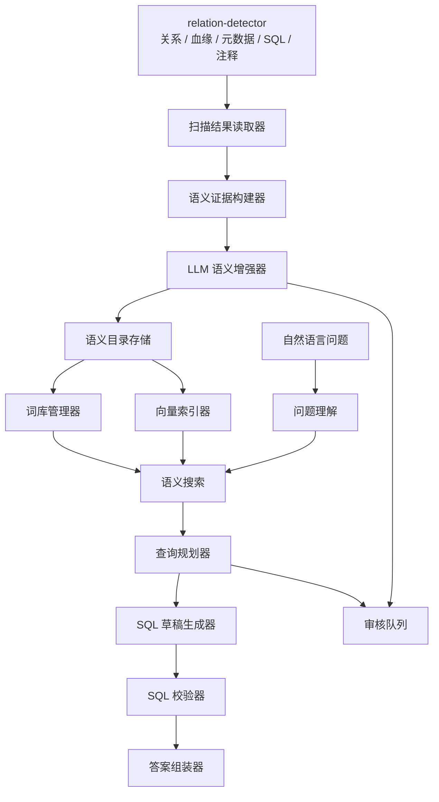
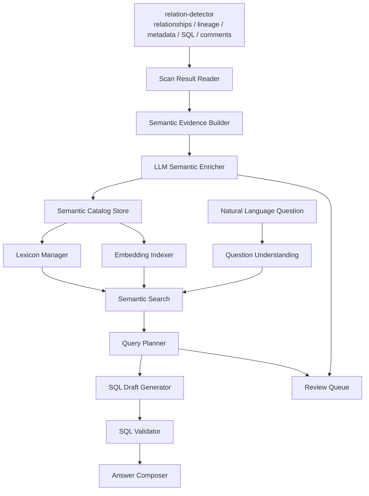
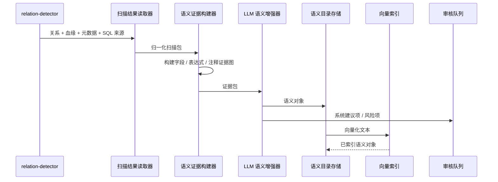
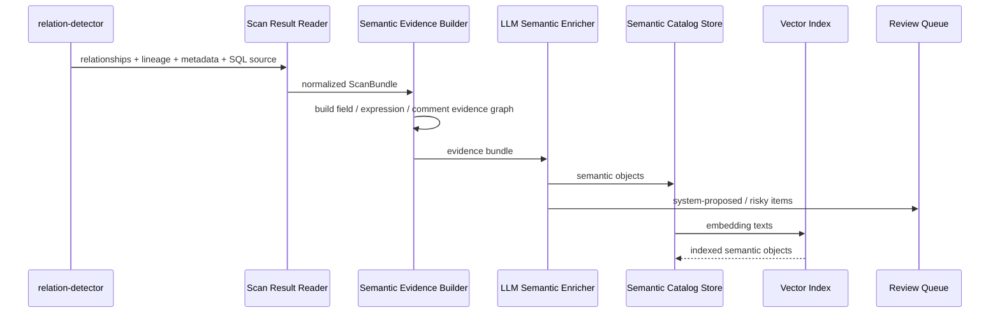
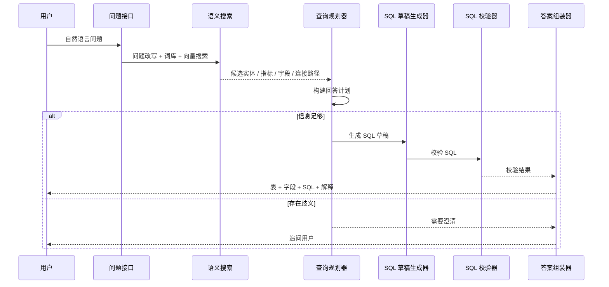
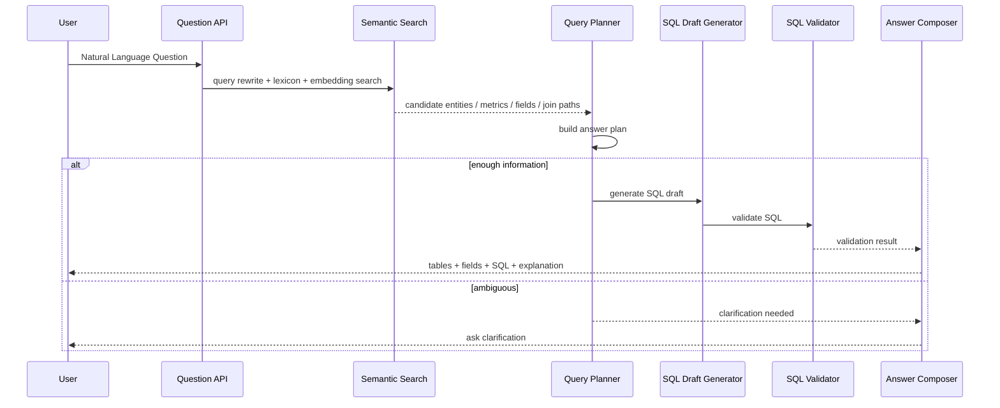
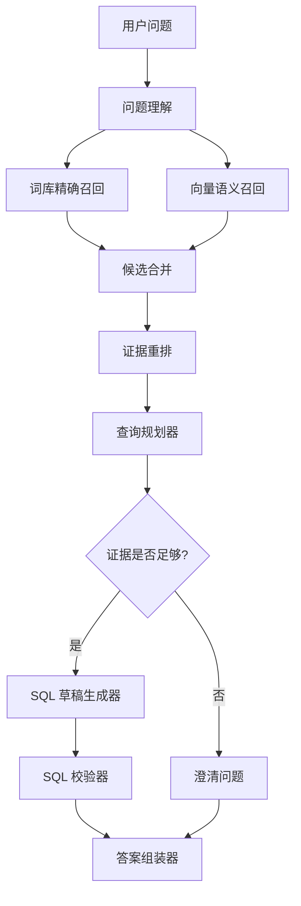
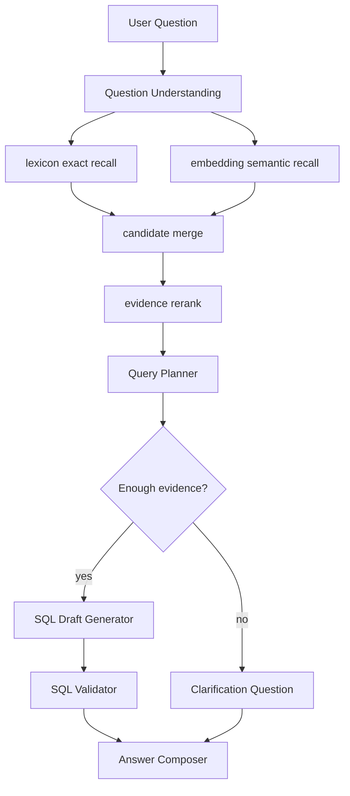

# Evidence-Grounded Semantic Layer 整体设计

术语定义统一维护在 [Semantic Layer 术语表](semantic-layer/glossary.md)。本文首次出现的能力分层、审核状态、事实层和问答术语均以该术语表为准。外部参考材料与路线对比见 [参考亿问改进分析](semantic-layer/yiyiwen-reference-improvement.md)。

## 1. 背景与目标

当前 relation-detector 已经能够从 metadata、DDL、SQL 日志和对象定义中识别数据库表关系，并输出一定的数据来源关系。它解决的是"数据库里真实存在什么结构证据"的问题，例如：

- 哪些表和字段存在。
- 哪些字段可能构成 FK-like relationship。
- 哪些字段写入依赖哪些来源字段。
- 某条关系或血缘来自 DDL、metadata、SQL、procedure、trigger 还是 Data Lineage extractor。

语义层要解决的是另一层问题：用户不会总用物理表字段名提问，而是会说"客户""会员""买家""最近消费金额""活跃客户""库存风险"。这些词和物理 schema 之间需要一个可审计、可搜索、可审核的中间层。

因此本设计将当前 relation-detector 定位为更大系统中的 **事实层子系统**：

- relation-detector 负责采集 facts 和 evidence。
- Semantic Layer 负责把 facts 组织成业务语义对象。
- LLM 负责解释、归纳、同义词扩展、指标候选和问题规划。
- LLM 不负责创造数据库事实。
- 每个语义结论都必须保存 `evidenceRefs`，可以回到 relationship、lineage、metadata、SQL source、SQL comment 或 DDL comment。

第一版目标不是直接自动执行 SQL，而是先稳定回答：

- 这个问题应该用哪些表？
- 应该用哪些字段？
- 这些表如何连接？
- 哪些指标口径需要审核？
- 可以生成什么 SQL draft？
- 这个 SQL draft 为什么可信，哪些地方不确定？

### 1.1 能力分层

为避免把总体方向误读成已经完整实现的 BI/Agent 平台，本设计按四类标签描述能力和示例：

| 标签 | 本设计中的含义 | 默认边界 |
| --- | --- | --- |
| [`Phase 1 Scope`](semantic-layer/glossary.md#phase-1-scope) | 第一版应落地的核心能力 | semantic evidence graph、semantic catalog、lexicon/embedding search、question plan、SQL draft validation outline。 |
| [`Phase 2+`](semantic-layer/glossary.md#phase-2) | Phase 1 Scope 稳定后可扩展的工程能力 | 更完整的 Review workflow、指标版本管理、离线评测集、用户反馈调权、catalog 增量构建。 |
| [`Future Capability`](semantic-layer/glossary.md#future-capability) | 未来版本才考虑的能力 | 跨系统 fuzzy match、方言 SQL 自动改写、SQL 执行频率统计、成本估计、复杂安全审计、自动执行 SQL。 |
| [`Example`](semantic-layer/glossary.md#example) | 解释设计用的示例 | 不进入 schema，不作为验收项，不代表系统已实现。 |

未标为 `Phase 1 Scope` 的能力不属于第一版实现目标；未标为 [`BUSINESS_APPROVED`](semantic-layer/glossary.md#business_approved) 的指标或业务口径不能作为正式回答依据。文档中的复杂 SQL、复杂指标、跨系统关联和方言提示如果标为 `Example`，只用于解释设计；如果标为 `Future Capability`，表示未来版本才考虑。它们不代表 relation-detector 已输出业务事实，也不代表语义层会自动执行 SQL。

## 2. 总体架构

### 2.1 架构图

<details open>
<summary>中文</summary>



</details>

<details>
<summary>English</summary>



</details>

### 2.2 两条主链路

离线构建链路负责把数据库事实变成语义资产：

<details open>
<summary>中文</summary>



</details>

<details>
<summary>English</summary>



</details>

在线问答链路负责从自然语言问题生成 answer plan、SQL draft 或澄清问题：

<details open>
<summary>中文</summary>



</details>

<details>
<summary>English</summary>



</details>

## 3. 模块职责总览

### 3.1 Scan Result Reader

读取 relation-detector 输出的扫描结果，并统一成 semantic build 可消费的输入包。

输入：

- relationship JSON。
- dataLineage JSON。
- metadata facts。
- DDL / SQL / object source location。
- warning 和 confidence。

输出：

- normalized scan bundle。

不负责：

- 不生成业务词。
- 不判断指标口径。
- 不调用 LLM。

### 3.2 Semantic Evidence Builder

把关系、血缘、元数据、SQL 注释、DDL 注释、表达式来源组合成 evidence graph。

典型 evidence：

- 字段证据：`orders.customer_id` 有 DDL comment、JOIN evidence、metadata type。
- 表达式证据：`SUM(payments.amount)` 来自 SQL projection alias 或 lineage transform。
- Join path 证据：`payments.order_id -> orders.id -> customers.id`。
- 注释证据：SQL 中的 `-- customer paid amount` 或 DDL comment。

输出：

- `semantic-evidence.json`。
- 可供 LLM enrichment 的 compact evidence bundle。

不负责：

- 不发明新的 relationship。
- 不把表达式直接变成已接受指标。

### 3.3 LLM Semantic Enricher

使用大模型把 evidence graph 转换成语义候选对象。LLM 的角色是解释、归纳、扩展和规划，不是事实裁决者。

四类角色示例：

| 角色 | 输入 evidence | LLM 可以输出什么 | 边界 |
| --- | --- | --- | --- |
| 解释 | `orders.customer_id -> customers.id`，字段注释为 "下单客户" | "`orders.customer_id` 表示订单所属客户，可用于连接客户主表。" | 只能解释已有 relationship，不能新增 join。 |
| 归纳 | `customers`、`orders`、`payments` 多个表和 join path | "这些表共同支持客户交易域，`customers` 是客户主体，`orders` 是订单事实，`payments` 是支付事实。" | 归纳的是业务视角，不改变物理表关系。 |
| 扩展 | 字段名 `customer_id`，注释 "客户编号"，已有术语 "客户" | 同义词候选："用户"、"会员"、"买家"。 | 只能进入词库候选和审核队列，不能直接成为正式业务口径。 |
| 规划 | 问题："每个客户最近30天支付金额是多少？"；catalog 中有 `customers/orders/payments` | 问题改写、候选指标、候选表字段、需要的 join path 提示。 | 只生成 question plan 候选；SQL 由模板生成并由 Validator 校验。 |

可生成内容：

- 表和字段的业务描述候选。
- 业务实体候选，例如 Customer、Order、Payment、Product。
- 同义词候选，例如 "客户 / 用户 / 会员 / 买家"。
- 指标候选，例如 "客户总支付金额 = SUM(payments.amount)"。
- evidence-backed join path 的自然语言解释。
- 问题样例和 query rewrite 候选。

硬约束：

- 每个输出必须带 `evidenceRefs`。
- LLM 不能生成正式物理 relationship、正式 physical lineage 或 `BUSINESS_APPROVED` metric。
- LLM 可以提出无 evidence join 的 `SYSTEM_PROPOSED` semantic object，但不能写入正式 catalog join path。
- 低置信度、冲突或指标口径进入 Review Queue。
- 模型输出保存 `model`、`promptVersion`、`confidence`、`reviewStatus`。

### 3.4 Semantic Catalog Store

保存可查询、可审核、可版本化的语义资产。

推荐实现：

- PostgreSQL。
- JSONB 保存半结构化 payload。
- pgvector 保存 embedding。

第一版可以先落地为 JSON 文件：

- `semantic-objects.json`
- `semantic-evidence.json`
- `semantic-lexicon.json`
- `semantic-review-items.json`

### 3.5 Lexicon Manager

管理业务词、同义词、简称、别名和多语言表达。

来源：

- DDL comment。
- SQL comment。
- 表字段命名。
- LLM suggestion。
- 人工审核。
- 用户问题历史。

例子：

```text
客户 -> customers
用户 -> customers
会员 -> customers
买家 -> customers
消费金额 -> payments.amount / SUM(payments.amount)
```

### 3.6 Embedding Indexer

为语义对象构造 embedding 文本并写入向量索引。

索引对象：

- SemanticTable。
- SemanticColumn。
- SemanticEntity。
- SemanticMetric。
- SemanticJoinPath。
- SQL comment / DDL comment。
- 常见问题和问题 trace。

Embedding 文本应包含：

- 物理名。
- 业务名。
- 同义词。
- 描述。
- evidence 摘要。
- 常见问法。

### 3.7 Semantic Search

结合 lexicon 精确匹配和 embedding 召回 SYSTEM_PROPOSED semantic objects。

排序建议是可配置的初始 heuristic，不是已经校准过的正式评分公式：

```text
score =
  embedding_similarity * configurable_weight
+ semantic_confidence * configurable_weight
+ relationship_path_confidence * configurable_weight
+ lineage_support * configurable_weight
+ reviewed_status_bonus * configurable_weight
```

不能只靠 embedding，因为 embedding 容易把相似业务词召回但无法证明字段存在。也不能只靠字段名，因为用户问法变化非常大。权重必须通过 question trace、人工审核反馈和离线 benchmark 逐步校准；在没有评测数据前，文档中的权重只能作为调参入口，不应写死为产品承诺。

### 3.8 Question Understanding

把自然语言问题拆成结构化意图。

识别内容：

- 业务实体：客户、商品、订单、支付。
- 指标：支付金额、订单数、库存风险。
- 维度：客户、地区、日期、商品。
- 时间范围：最近 30 天、本月、去年。
- 过滤条件：活跃、已支付、未退款。
- 输出意图：查询明细、聚合排行、解释字段、生成 SQL。

### 3.9 Query Planner

将 SYSTEM_PROPOSED semantic objects 组合成 answer plan。

职责：

- 选择主实体和 grain。
- 选择指标和字段。
- 选择 join path。
- 判断是否需要 aggregation。
- 判断是否缺时间字段、指标口径或过滤定义。
- 生成澄清问题或 SQL draft request。

### 3.10 SQL Draft Generator

根据 answer plan 生成 SQL 草稿。

约束：

- 只能使用 Catalog 中存在的表和字段。
- Join path 必须来自 relationship evidence 或已审核 semantic join path。
- 指标表达式必须来自 `BUSINESS_APPROVED` metric，或明确标记为 SYSTEM_PROPOSED draft。
- 不直接执行 SQL。

### 3.11 SQL Validator

校验 SQL draft。Validator 分成 `Phase 1 Scope` 和 `Future Capability` 两层，避免把 SQL 静态分析、方言迁移和安全审计一次性混成一个承诺。

Phase 1 validator 只承诺：

- 表和字段是否存在于 semantic catalog。
- join path 是否有 relationship evidence 或已审核 semantic join path。
- 指标是否为 `BUSINESS_APPROVED`，未审核指标只能作为 draft warning。
- SQL draft 是否保持 read-only，禁止自动执行写操作。
- SQL draft 是否能被 relation-detector/parser 解析到基本结构。

Future Capability validator 才考虑：

- 方言 SQL 自动改写建议。
- 深层聚合合法性校验。
- 查询成本估计。
- 更完整的 SQL 安全审计。
- 执行计划和数据权限集成。

SQL Validator 可以复用 relation-detector 的 parser 能力，把 SQL draft 重新解析成事件、relationship 和 lineage 检查点。但 relation-detector parser 不是完整数据库优化器；Phase 1 Scope 只把它作为 evidence/catalog guard，不把它包装成完整 SQL 安全分析器。

### 3.12 Answer Composer

组织最终响应。

可能输出：

- 待确认的 SQL draft、validation result 和人工确认事项。
- 使用的表字段。
- join path 和 evidence。
- 指标解释。
- 不确定项和澄清问题。

### 3.13 Review Queue

保存需要人工审核的语义候选。

进入审核的典型情况：

- 新指标候选。
- 低置信度实体识别。
- 同义词冲突。
- 多条 join path 均可用。
- 业务口径不确定。
- LLM 与 evidence 不一致。

状态：

```text
SYSTEM_PROPOSED
EVIDENCE_SUPPORTED
BUSINESS_APPROVED
REJECTED
NEEDS_MORE_EVIDENCE
```

状态含义：

- `SYSTEM_PROPOSED`：LLM、comment、SQL usage 或用户问题提出的候选，尚不能作为正式业务口径。
- `EVIDENCE_SUPPORTED`：已有 relation-detector evidence 支持，但还没有人工接受。
- `BUSINESS_APPROVED`：人工或治理流程确认后的正式语义对象，可作为默认回答口径。
- `REJECTED`：明确不采用。
- `NEEDS_MORE_EVIDENCE`：证据不足或存在冲突，需要补事实或人工判断。

## 4. Evidence 与语义对象

### 4.1 EvidenceRef

每个语义对象都必须保存 evidenceRefs。EvidenceRef 不只是一个 fingerprint；它还要能解释该语义结论来自哪次扫描、哪个 parser/profile、哪个 source artifact，以及是否经过人工审核。

Phase 1 Scope 必备字段建议：

```json
{
  "evidenceType": "RELATIONSHIP",
  "evidenceFingerprint": "FK_LIKE:orders.customer_id->customers.id:SQL_LOG_JOIN",
  "scanRunId": "scan-2026-06-23-001",
  "scanVersion": "relation-detector-result-phase-1",
  "detectorVersion": "0.1.0-SNAPSHOT",
  "parserMode": "full-grammer",
  "grammarProfile": "postgresql/18",
  "sourceName": "postgres-pg12-sql/input.sql",
  "sourceHash": "sha256:example-source-hash",
  "lineStart": 18,
  "lineEnd": 22,
  "confidence": 0.91,
  "reviewDecisionId": null,
  "payloadSnapshot": {
    "relationshipType": "FK_LIKE",
    "source": "orders.customer_id",
    "target": "customers.id",
    "evidenceTypes": ["SQL_LOG_JOIN"]
  }
}
```

`payloadSnapshot` 用于保存当时用于语义判断的最小事实切片。后续重新扫描后即使 fingerprint 仍然相似，也能回放当时语义对象为何成立。

### 4.2 字段 evidence 示例

```json
{
  "physicalRef": "orders.customer_id",
  "evidence": [
    {
      "type": "RELATIONSHIP",
      "fingerprint": "FK_LIKE:orders.customer_id->customers.id:SQL_LOG_JOIN"
    },
    {
      "type": "DDL_COLUMN",
      "text": "customer_id bigint not null"
    },
    {
      "type": "SQL_USAGE",
      "text": "JOIN customers c ON o.customer_id = c.id"
    }
  ]
}
```

### 4.3 表达式 evidence 示例

```json
{
  "expressionId": "expr:customer_total_paid_amount",
  "expression": "SUM(payments.amount)",
  "sourceColumns": ["payments.amount"],
  "lineage": [
    "VALUE:AGGREGATE:payments.amount->customer_total_paid_amount"
  ],
  "evidenceRefs": [
    "SQL_PROJECTION:payments.amount",
    "LINEAGE:payments.amount->customer_total_paid_amount"
  ]
}
```

### 4.4 SQL 注释 evidence 示例

```sql
-- paid amount by customer in recent 30 days
SELECT c.id, SUM(p.amount) AS paid_amount_30d
FROM customers c
JOIN orders o ON o.customer_id = c.id
JOIN payments p ON p.order_id = o.id;
```

该注释可以增强以下语义对象：

- `metric:customer_paid_amount_30d`
- `entity:Customer`
- `column:payments.amount`
- `joinpath:customers-orders-payments`


### 4.5 DDL Comment 证据示例

```sql
-- 订单表 DDL
CREATE TABLE orders (
    id BIGINT PRIMARY KEY,
    customer_id BIGINT NOT NULL,  -- 关联客户主表
    status VARCHAR(20) NOT NULL DEFAULT 'pending',  -- pending/confirmed/shipped/delivered/cancelled
    total_amount DECIMAL(12,2) NOT NULL,  -- 订单原始金额（不含优惠）
    discount_amount DECIMAL(12,2) DEFAULT 0,  -- 优惠金额
    actual_amount DECIMAL(12,2) NOT NULL,  -- 实付金额 = total_amount - discount_amount
    created_at TIMESTAMP NOT NULL DEFAULT now()
);
```

DDL 注释可以增强语义解释，但不能直接创造已确认的物理 lineage。下面的 `candidateDerivedFrom` 只表示注释暗示的 SYSTEM_PROPOSED semantic object，需要后续 SQL/Data Lineage evidence 或人工审核确认：

- `column:orders.customer_id`：业务描述候选，来自"关联客户主表"。
- `column:orders.status`：枚举值候选，来自注释中的状态列表。
- `column:orders.total_amount`：口径候选，来自"不含优惠"。
- `column:orders.actual_amount`：计算关系候选，来自注释中的 `total_amount - discount_amount`。

```json
{
  "physicalRef": "orders.actual_amount",
  "evidence": [
    {
      "type": "DDL_COLUMN",
      "text": "actual_amount DECIMAL(12,2) NOT NULL"
    },
    {
      "type": "DDL_COMMENT",
      "text": "实付金额 = total_amount - discount_amount",
      "candidateDerivedFrom": ["orders.total_amount", "orders.discount_amount"],
      "reviewStatus": "SYSTEM_PROPOSED"
    }
  ]
}
```

### 4.6 存储过程证据示例

```sql
CREATE OR REPLACE PROCEDURE sp_calculate_customer_tier(
    IN p_customer_id BIGINT,
    OUT p_tier VARCHAR(20)
)
LANGUAGE plpgsql
AS $$
DECLARE
    v_total_spent DECIMAL(12,2);
    v_order_count INT;
BEGIN
    SELECT COALESCE(SUM(o.actual_amount), 0)
    INTO v_total_spent
    FROM orders o
    WHERE o.customer_id = p_customer_id
      AND o.created_at >= CURRENT_DATE - INTERVAL '1 year'
      AND o.status = 'delivered';

    SELECT COUNT(*)
    INTO v_order_count
    FROM orders o
    WHERE o.customer_id = p_customer_id
      AND o.created_at >= CURRENT_DATE - INTERVAL '1 year';

    IF v_total_spent > 100000 AND v_order_count > 20 THEN
        p_tier := 'PLATINUM';
    ELSIF v_total_spent > 50000 THEN
        p_tier := 'GOLD';
    ELSE
        p_tier := 'STANDARD';
    END IF;
END;
$$;
```

存储过程可以提供 SYSTEM_PROPOSED semantic evidence：

- `metric:customer_total_spent_1y` 候选表达式 `SUM(orders.actual_amount)`。
- `metric:customer_order_count_1y` 候选表达式 `COUNT(*)`。
- `entity:CustomerTier` 候选枚举值 `PLATINUM/GOLD/STANDARD`。

这些候选必须保留 procedure evidenceRefs，并默认进入 `SYSTEM_PROPOSED` 或 `NEEDS_MORE_EVIDENCE` 状态；它们不是 relation-detector 已确认的正式业务指标。

```json
{
  "expressionId": "expr:customer_total_spent_1y",
  "expression": "SUM(orders.actual_amount)",
  "filterClause": "orders.status = 'delivered' AND orders.created_at >= CURRENT_DATE - INTERVAL '1 year'",
  "evidenceRefs": [
    {
      "type": "PROCEDURE",
      "name": "sp_calculate_customer_tier",
      "role": "system_proposed_semantic_metric",
      "confidence": 0.85
    }
  ],
  "reviewStatus": "SYSTEM_PROPOSED"
}
```

### 4.7 触发器证据示例

```sql
CREATE OR REPLACE FUNCTION trg_update_customer_order_summary()
RETURNS TRIGGER AS $$
BEGIN
    UPDATE customer_order_summary cos
    SET
        total_orders = cos.total_orders + 1,
        total_amount = cos.total_amount + NEW.actual_amount,
        last_order_at = NEW.created_at
    WHERE cos.customer_id = NEW.customer_id;

    RETURN NEW;
END;
$$ LANGUAGE plpgsql;

CREATE TRIGGER trg_orders_after_insert
    AFTER INSERT ON orders
    FOR EACH ROW EXECUTE FUNCTION trg_update_customer_order_summary();
```

触发器可以增强 SYSTEM_PROPOSED semantic lineage evidence：

- `table:customer_order_summary` 的写入来源候选来自 `orders` 表和触发器函数。
- `column:customer_order_summary.total_orders` 的候选来源来自 `orders` INSERT 触发。
- `orders.customer_id -> customer_order_summary.customer_id` 只有在 SQL/DDL/metadata 明确支持时才成为 relationship；触发器注释本身不能单独创造物理关系。

```json
{
  "semanticCandidateRef": "customer_order_summary.total_orders",
  "sourceType": "TRIGGER",
  "triggerEvent": "AFTER INSERT ON orders",
  "targetTable": "customer_order_summary",
  "targetColumn": "total_orders",
  "transformLogic": "cos.total_orders + 1",
  "evidenceRefs": [
    "TRIGGER:trg_orders_after_insert",
    "FUNCTION:trg_update_customer_order_summary"
  ],
  "reviewStatus": "SYSTEM_PROPOSED"
}
```

### 4.8 冲突证据示例：同一字段的多口径

同一字段 `payments.amount` 可能在不同上下文中代表不同口径。语义层必须保存冲突来源，并进入审核，而不是默认选择一个口径。

```json
{
  "physicalRef": "payments.amount",
  "conflictingDefinitions": [
    {
      "context": "订单支付",
      "description": "单笔支付金额（原始值）",
      "source": "DDL:payments.amount + SQL:payment_report",
      "confidence": 0.95
    },
    {
      "context": "退款计算",
      "description": "可退款金额（不含已退款部分）",
      "source": "PROCEDURE:sp_process_refund",
      "filterLogic": "WHERE refund_status != 'REFUNDED'",
      "confidence": 0.85
    },
    {
      "context": "佣金计算",
      "description": "佣金基数（扣除平台手续费后的净额）",
      "source": "PROCEDURE:sp_calculate_commission",
      "transformLogic": "payments.amount * (1 - platform_fee_rate)",
      "confidence": 0.80
    }
  ],
  "reviewStatus": "NEEDS_MORE_EVIDENCE",
  "reviewNote": "payments.amount 在多个业务场景下有不同口径，需要人工确认各场景的标准定义"
}
```

## 5. 数据结构设计

### 5.1 SemanticTable

```json
{
  "id": "table:orders",
  "physicalName": "orders",
  "semanticNames": ["订单", "订单主表", "交易订单"],
  "description": "记录客户订单主数据",
  "domain": "交易",
  "grain": "一行表示一个订单",
  "primaryKey": ["orders.id"],
  "importantColumns": ["orders.id", "orders.customer_id", "orders.status", "orders.created_at"],
  "evidenceRefs": ["DDL:orders", "REL:orders.customer_id->customers.id"],
  "reviewStatus": "BUSINESS_APPROVED"
}
```

### 5.2 SemanticColumn

```json
{
  "id": "column:orders.customer_id",
  "physicalName": "orders.customer_id",
  "semanticNames": ["客户ID", "下单客户", "订单客户"],
  "description": "订单所属客户",
  "businessRole": "foreign_key",
  "entityRef": "entity:Customer",
  "dataType": "bigint",
  "synonyms": ["客户", "买家", "用户", "会员"],
  "evidenceRefs": ["REL:orders.customer_id->customers.id", "DDL_COLUMN:orders.customer_id"],
  "reviewStatus": "BUSINESS_APPROVED"
}
```

### 5.3 SemanticEntity

```json
{
  "id": "entity:Customer",
  "names": ["客户", "用户", "会员", "买家"],
  "primaryTable": "customers",
  "keyColumns": ["customers.id"],
  "relatedTables": ["orders", "payments", "customer_profiles"],
  "description": "系统中的客户主体",
  "evidenceRefs": ["REL:orders.customer_id->customers.id", "REL:payments.customer_id->customers.id"]
}
```

### 5.4 SemanticMetric

```json
{
  "id": "metric:customer_total_paid_amount",
  "names": ["客户总支付金额", "总消费金额", "支付总额"],
  "description": "客户在指定时间范围内的支付金额合计",
  "expression": "SUM(payments.amount)",
  "sourceColumns": ["payments.amount"],
  "defaultGrain": ["customers.id"],
  "defaultTimeColumn": "payments.paid_at",
  "joinPaths": ["payments.order_id -> orders.id", "orders.customer_id -> customers.id"],
  "evidenceRefs": ["EXPR:paid_amount_30d", "REL:payments.order_id->orders.id", "REL:orders.customer_id->customers.id"],
  "reviewStatus": "SYSTEM_PROPOSED"
}
```

### 5.5 SemanticJoinPath

```json
{
  "id": "joinpath:customers-orders-payments",
  "fromEntity": "Customer",
  "toTables": ["orders", "payments"],
  "steps": [
    {
      "source": "orders.customer_id",
      "target": "customers.id",
      "evidenceType": "SQL_LOG_JOIN",
      "confidence": 0.91
    },
    {
      "source": "payments.order_id",
      "target": "orders.id",
      "evidenceType": "DDL_FOREIGN_KEY",
      "confidence": 0.98
    }
  ],
  "usage": "回答客户订单、客户支付、客户消费相关问题"
}
```

### 5.6 QuestionPlan

```json
{
  "question": "每个客户最近30天的支付金额是多少？",
  "answerable": true,
  "entities": ["entity:Customer"],
  "metrics": ["metric:customer_total_paid_amount"],
  "tables": ["customers", "orders", "payments"],
  "fields": ["customers.id", "customers.name", "payments.amount", "payments.paid_at"],
  "joinPaths": ["joinpath:customers-orders-payments"],
  "timeFilter": "payments.paid_at >= CURRENT_DATE - INTERVAL '30 days'",
  "ambiguities": [],
  "sqlDraftStatus": "VALIDATED"
}
```

## 6. 存储设计

### 6.1 推荐生产存储

推荐使用 PostgreSQL + JSONB + pgvector。

原因：

- PostgreSQL 可以保存结构化 catalog 和半结构化 payload。
- JSONB 适合保存不同类型 semantic object。
- pgvector 可以支持 embedding 搜索。
- 和多数业务系统、BI 系统、审计系统集成成本低。

### 6.2 semantic_build_run

记录每次语义构建的输入、版本和状态，保证 semantic object 可以追溯到具体构建批次。

```sql
CREATE TABLE semantic_build_run (
  id text PRIMARY KEY,
  scan_run_id text NOT NULL,
  detector_version text,
  semantic_builder_version text,
  mode text,
  status text,
  input_manifest jsonb,
  started_at timestamp,
  finished_at timestamp
);
```

### 6.3 semantic_object

```sql
CREATE TABLE semantic_object (
  id text PRIMARY KEY,
  build_run_id text,
  object_type text NOT NULL,
  physical_ref text,
  name text,
  description text,
  confidence numeric,
  review_status text,
  payload jsonb,
  created_at timestamp,
  updated_at timestamp
);
```

### 6.4 semantic_object_edge

保存 entity、table、column、metric、join path 之间的关系，避免语义图退化成无法查询的 JSONB 仓库。

```sql
CREATE TABLE semantic_object_edge (
  from_object_id text,
  to_object_id text,
  edge_type text,
  confidence numeric,
  review_status text,
  evidence_ref_ids jsonb,
  payload jsonb
);
```

### 6.5 semantic_evidence_ref

```sql
CREATE TABLE semantic_evidence_ref (
  id text PRIMARY KEY,
  semantic_object_id text,
  build_run_id text,
  evidence_type text,
  evidence_fingerprint text,
  scan_run_id text,
  detector_version text,
  parser_mode text,
  grammar_profile text,
  source_name text,
  source_hash text,
  line_start int,
  line_end int,
  review_decision_id text,
  payload jsonb
);
```

### 6.6 semantic_review_decision

保存人工审核历史，避免 `review_status` 只留下最终状态而丢失决策依据。

```sql
CREATE TABLE semantic_review_decision (
  id text PRIMARY KEY,
  object_id text,
  decision text,
  reviewer text,
  comment text,
  decided_at timestamp,
  payload jsonb
);
```

### 6.7 semantic_lexicon

```sql
CREATE TABLE semantic_lexicon (
  term text,
  normalized_term text,
  language text,
  maps_to_object_id text,
  relation_type text,
  confidence numeric,
  review_status text,
  source text
);
```

### 6.8 semantic_embedding

```sql
CREATE TABLE semantic_embedding (
  object_id text PRIMARY KEY,
  object_type text,
  text_for_embedding text,
  embedding vector(1536),
  model text,
  updated_at timestamp
);
```

### 6.9 semantic_question_trace

```sql
CREATE TABLE semantic_question_trace (
  id text primary key,
  question text,
  normalized_question text,
  selected_objects jsonb,
  answer_plan jsonb,
  sql_draft text,
  validation_result jsonb,
  created_at timestamp
);
```

### 6.10 JSON 文件落地版本

第一版也可以不引入数据库，先产出文件：

```text
semantic-catalog/
  semantic-build-runs.json
  semantic-objects.json
  semantic-object-edges.json
  semantic-evidence-refs.json
  semantic-review-decisions.json
  semantic-lexicon.json
  semantic-embeddings.jsonl
  semantic-question-traces.jsonl
```

这种方式适合验证模型提示词、语义对象结构和问答流程。缺点是并发、增量更新、审核流和向量检索能力较弱。

## 7. API 设计

本节是概念接口草案，不是最终 wire contract。正式实现前还需要补认证、多租户、错误码、分页、幂等和版本兼容策略。

### 7.1 Build Semantic Catalog

```http
POST /semantic/build
```

请求：

```json
{
  "scanResultPath": "outputs/scan-result.json",
  "mode": "incremental",
  "llm": {
    "model": "gpt-4.1",
    "temperature": 0.1
  }
}
```

响应：

```json
{
  "buildRunId": "semantic-build-2026-06-23-001",
  "status": "QUEUED",
  "statusUrl": "/semantic/build/semantic-build-2026-06-23-001",
  "partialResultPolicy": "KEEP_EVIDENCE_AND_REPORT_WARNINGS"
}
```

构建可能是异步任务。实现时应提供 build status 查询，返回 created/updated/review item/embedding 统计和 warning 列表。

### 7.2 Search Semantic Objects

```http
GET /semantic/search?q=客户消费金额&pageSize=20&pageToken=...
```

响应：

```json
{
  "query": "客户消费金额",
  "pageSize": 20,
  "nextPageToken": null,
  "results": [
    {
      "objectId": "metric:customer_total_paid_amount",
      "objectType": "METRIC",
      "name": "客户总支付金额",
      "score": 0.92,
      "reviewStatus": "BUSINESS_APPROVED",
      "evidenceRefs": ["EXPR:paid_amount_30d", "REL:payments.order_id->orders.id"]
    },
    {
      "objectId": "column:payments.amount",
      "objectType": "COLUMN",
      "name": "支付金额",
      "score": 0.86,
      "reviewStatus": "BUSINESS_APPROVED",
      "evidenceRefs": ["DDL_COLUMN:payments.amount"]
    }
  ]
}
```

### 7.3 Plan A Question

```http
POST /semantic/question/plan
```

请求：

```json
{
  "question": "每个客户最近30天的支付金额是多少？",
  "dialect": "postgresql",
  "schema": "public",
  "generateSql": true,
  "trace": true
}
```

响应：

```json
{
  "traceId": "question-trace-2026-06-23-001",
  "answerable": true,
  "tables": ["customers", "orders", "payments"],
  "fields": ["customers.id", "customers.name", "payments.amount", "payments.paid_at"],
  "joinPaths": [
    {
      "steps": [
        "orders.customer_id -> customers.id",
        "payments.order_id -> orders.id"
      ],
      "confidence": 0.94
    }
  ],
  "sqlDraft": "SELECT c.id, c.name, SUM(p.amount) AS paid_amount_30d FROM customers c JOIN orders o ON o.customer_id = c.id JOIN payments p ON p.order_id = o.id WHERE p.paid_at >= CURRENT_DATE - INTERVAL '30 days' GROUP BY c.id, c.name ORDER BY paid_amount_30d DESC",
  "validation": {
    "status": "PASSED",
    "warnings": []
  },
  "evidenceRefs": [
    "REL:orders.customer_id->customers.id",
    "REL:payments.order_id->orders.id",
    "METRIC:customer_total_paid_amount"
  ]
}
```

### 7.4 Review Semantic Object

```http
POST /semantic/review
```

请求：

```json
{
  "objectId": "metric:customer_total_paid_amount",
  "decision": "BUSINESS_APPROVED",
  "reviewer": "data-owner@example.com",
  "comment": "确认支付金额口径使用 payments.amount",
  "basedOnEvidenceRefs": ["EXPR:paid_amount_30d", "REL:payments.order_id->orders.id"]
}
```

响应：

```json
{
  "objectId": "metric:customer_total_paid_amount",
  "reviewStatus": "BUSINESS_APPROVED",
  "reviewDecisionId": "review-decision-001",
  "updatedAt": "2026-06-23T00:00:00Z"
}
```

## 8. 近义词和多问法处理

用户问题的多样性主要来自四类差异：

- 同一业务对象有多个叫法：客户、用户、会员、买家。
- 同一指标有多个叫法：消费金额、支付金额、成交金额、GMV。
- 问题结构不同：最近谁买得最多、最近 30 天客户支付金额排行。
- 业务口径不同：活跃客户可以指登录、下单、支付或状态字段。

处理策略是四层叠加。

### 8.1 Lexicon 精确映射

人工审核过的业务词优先级最高。

```json
{
  "term": "客户",
  "mapsTo": "entity:Customer",
  "relationType": "SYNONYM",
  "reviewStatus": "BUSINESS_APPROVED"
}
```

### 8.2 Embedding 模糊召回

Embedding 用于召回相似语义对象，例如 "买东西最多的人" 可以召回：

- Customer。
- Order。
- Payment。
- customer_total_paid_amount。
- customer_order_count。

Embedding 召回后必须经过 evidence rerank，不直接作为最终答案。

### 8.3 LLM Query Rewrite

LLM 将自然语言问题改写成结构化候选意图。

例子：

```text
原问题：最近买东西最多的人是谁？
改写候选：
1. 最近一段时间按支付金额统计客户排行。
2. 最近一段时间按订单数量统计客户排行。
3. 需要确认"最近"是 7 天、30 天还是本月。
```

### 8.4 Evidence-based Rerank

最终候选排序要结合 evidence：

- 是否有明确 relationship path。
- 是否有 lineage 支持指标表达式。
- 是否有 DDL/SQL comment 支持业务名。
- 是否已经人工审核。
- 是否存在多义冲突。

## 9. 自然语言问答流程

### 9.1 流程概览

<details open>
<summary>中文</summary>



</details>

<details>
<summary>English</summary>



</details>

### 9.2 Answer Plan

Answer Plan 是 SQL 生成前的中间结果。它比直接让 LLM 生成 SQL 更安全，因为它先锁定了：

- 使用哪些表。
- 使用哪些字段。
- 使用哪条 join path。
- 使用哪个指标表达式。
- 哪些条件来自用户。
- 哪些口径需要确认。

### 9.3 SQL Draft

SQL Draft 只能从 Answer Plan 生成。不能让 LLM 自由编造表字段。

### 9.4 SQL Validator

Validator 是最后一道防线。它负责拒绝：

- 不存在的表字段。
- 没有 evidence 的 join。
- 未审核指标被当作正式指标。
- 方言不匹配 SQL。
- 不安全写操作。

## 10. 问答示例

### 10.0 示例读法：共用离线输入

本章每个问答例子都假设离线语义构建已经完成。离线模块的共用输入输出如下：

| 模块 | 输入 | 输出 | 在问答示例中的作用 |
| --- | --- | --- | --- |
| relation-detector 事实层 | metadata、DDL、SQL log、procedure、trigger、object SQL、comments | relationship、Data Lineage、diagnostics、evidence payload | 提供表字段、join evidence、lineage evidence 和 source location。 |
| Scan Result Reader | relation-detector JSON output | normalized scan bundle | 把不同来源的 facts 归一化，供语义构建读取。 |
| Semantic Evidence Builder | scan bundle | semantic evidence graph、EvidenceRef、初始 table/column evidence | 把 relationship、lineage、comment、SQL usage 组织成可引用证据。 |
| LLM Semantic Enricher | evidence bundle、字段名、注释、SQL alias、已有 lexicon | SYSTEM_PROPOSED semantic objects、描述、同义词、review item | 只做解释、归纳、扩展和规划候选，不确认物理事实或 BUSINESS_APPROVED 指标。 |
| Semantic Catalog Store | semantic objects、edges、evidenceRefs、review decisions | Semantic Catalog | 在线问答时的事实与语义资产中心。 |
| Lexicon Manager | catalog objects、人工词库、SYSTEM_PROPOSED 同义词 | term -> semantic object mapping | 处理 "客户"、"活跃"、"库存风险" 等业务词精确匹配。 |
| Embedding Indexer | semantic object texts、字段描述、指标描述、示例问法 | vector index | 处理多问法和模糊召回；召回结果仍需 evidence rerank。 |
| Review Queue | SYSTEM_PROPOSED metric/entity/synonym、低置信度或冲突项 | review decisions、BUSINESS_APPROVED / REJECTED / NEEDS_MORE_EVIDENCE | 决定哪些指标或业务口径能成为正式默认回答依据。 |

下面每个例子只展开在线问答链路：Question Understanding -> Semantic Search -> Query Planner -> SQL Draft Generator -> SQL Validator -> Answer Composer。

### 10.1 可直接回答：客户最近 30 天支付金额

问题：

```text
每个客户最近30天的支付金额是多少？
```

模块流转：

| 模块 | 输入 | 输出 |
| --- | --- | --- |
| Question Understanding | 用户问题："每个客户最近30天的支付金额是多少？" | 结构化意图：实体 `客户`，指标 `支付金额`，时间窗口 `最近30天`，粒度 `customer`，期望 `generateSql=true`。 |
| Semantic Search | 结构化意图、Lexicon、Embedding index、Semantic Catalog | 候选对象：`entity:Customer`、`metric:customer_paid_amount`、字段 `customers.id/name`、`payments.amount/paid_at`、候选表 `customers/orders/payments`。 |
| Query Planner | 候选对象、relationship evidence、metric reviewStatus、grain | AnswerPlan：选择 `customers -> orders -> payments` join path，选择 `SUM(payments.amount)`，过滤 `payments.paid_at >= CURRENT_DATE - INTERVAL '30 days'`，group by customer。 |
| SQL Draft Generator | AnswerPlan | SQL draft；每个 SELECT、JOIN、WHERE、GROUP BY 元素都带 sourceObjectId 和 evidenceRefs。 |
| SQL Validator | SQL draft、catalog、join evidence、metric reviewStatus | validation `PASSED` 或 `PASSED_WITH_WARNINGS`；校验表字段存在、join 有 evidence、metric 口径可用于 draft。 |
| Answer Composer | validation result、SQL draft、AnswerPlan evidence | 返回候选表、字段、join path、SQL draft 和解释；如果 metric 未 BUSINESS_APPROVED，则附 warning。 |

逐模块中间结果明细见 [示例附录 13.1](semantic-layer-examples.md#131-可直接回答客户最近-30-天支付金额)。

候选表：

- `customers`
- `orders`
- `payments`

候选字段：

- `customers.id`
- `customers.name`
- `payments.amount`
- `payments.paid_at`

Join path：

```text
orders.customer_id -> customers.id
payments.order_id -> orders.id
```

SQL draft：

```sql
SELECT
  c.id,
  c.name,
  SUM(p.amount) AS paid_amount_30d
FROM customers c
JOIN orders o ON o.customer_id = c.id
JOIN payments p ON p.order_id = o.id
WHERE p.paid_at >= CURRENT_DATE - INTERVAL '30 days'
GROUP BY c.id, c.name
ORDER BY paid_amount_30d DESC;
```

回答应解释：

- 使用 `customers` 表表示客户。
- 使用 `payments.amount` 表示支付金额。
- 通过 `orders` 连接客户与支付。
- 时间过滤来自 `payments.paid_at`。

### 10.2 需要反问：活跃客户

问题：

```text
找出活跃客户
```

模块流转：

| 模块 | 输入 | 输出 |
| --- | --- | --- |
| Question Understanding | 用户问题："找出活跃客户" | 结构化意图：实体 `客户`，业务词 `活跃`，缺少明确指标/过滤口径。 |
| Semantic Search | `客户`、`活跃`、lexicon、embedding index | 多组候选口径：`customers.status`、`customers.last_login_at`、`orders.created_at`、`payments.paid_at`。 |
| Query Planner | 多个候选口径、reviewStatus、evidenceRefs | AnswerPlan 不生成最终 SQL；生成 ambiguity set，标记需要用户确认 "活跃" 的定义。 |
| SQL Draft Generator | ambiguity set | 不生成 SQL draft；返回 `skipped: clarification_required`。 |
| SQL Validator | 无 SQL draft；clarification_required plan | 不做 SQL 结构校验；返回 `NOT_RUN`，原因是业务口径不明确。 |
| Answer Composer | ambiguity set、候选 evidence | 输出反问问题和可选口径列表。 |

逐模块中间结果明细见 [示例附录 13.2](semantic-layer-examples.md#132-需要反问活跃客户)。

候选口径：

- `customers.status = 'ACTIVE'`
- `customers.last_login_at` 最近登录。
- `orders.created_at` 最近下单。
- `payments.paid_at` 最近支付。

输出：

```text
"活跃客户"有多个可能口径。你希望按哪一种判断？
1. 客户状态字段为 ACTIVE。
2. 最近登录过。
3. 最近下单过。
4. 最近支付过。
```

### 10.3 只能回答表字段计划：库存风险

问题：

```text
看一下商品库存风险
```

模块流转：

| 模块 | 输入 | 输出 |
| --- | --- | --- |
| Question Understanding | 用户问题："看一下商品库存风险" | 结构化意图：实体 `商品`，主题 `库存风险`，缺少明确风险公式、阈值和时间范围。 |
| Semantic Search | `商品`、`库存`、`风险`、lexicon、embedding index | 候选表字段：`products`、`inventory_snapshots`、`supplier_inventory_logs` 及库存数量、保留数量、供应商可用数量字段。 |
| Query Planner | 候选表字段、relationship evidence、缺失的 metric definition | 表字段计划：给出可用表、字段、join path；标记 `risk_metric_missing`。 |
| SQL Draft Generator | 表字段计划，没有正式 metric expression | 不生成完整 SQL；可生成字段探索 draft 或返回 `skipped: metric_definition_required`。 |
| SQL Validator | 字段探索 draft 或无 SQL draft | 校验候选表字段存在；如果无 SQL draft，则返回 `NOT_RUN` 并说明缺少库存风险口径。 |
| Answer Composer | 表字段计划、缺失项、候选 evidence | 返回 "可以用哪些表字段回答"，并反问库存风险口径。 |

逐模块中间结果明细见 [示例附录 13.3](semantic-layer-examples.md#133-只能回答表字段计划库存风险)。

候选表：

- `products`
- `inventory_snapshots`
- `supplier_inventory_logs`

候选字段：

- `products.sku_code`
- `inventory_snapshots.quantity_on_hand`
- `inventory_snapshots.reserved_quantity`
- `supplier_inventory_logs.available_quantity`

候选关系：

```text
inventory_snapshots.product_id -> products.id
supplier_inventory_logs.sku_code -> products.sku_code
```

输出：

```text
可以用 products、inventory_snapshots、supplier_inventory_logs 分析库存风险。
但"库存风险"的业务口径还不明确：是可用库存低于阈值、供应商库存不足，还是保留库存过高？
```


### 10.4 需要反问：退款率口径冲突

问题：

```text
上个月的退款率是多少？
```

模块流转：

| 模块 | 输入 | 输出 |
| --- | --- | --- |
| Question Understanding | 用户问题："上个月的退款率是多少？" | 结构化意图：主题 `退款率`，时间窗口 `上个月`，但分子/分母口径未定。 |
| Semantic Search | `退款率`、`上个月`、lexicon、embedding index、catalog metrics | 候选 metrics：按金额、按笔数、按客户、仅全额退款等。 |
| Query Planner | 多个 metric candidate、reviewStatus、evidenceRefs | 不选择单一正式 AnswerPlan；生成 metric ambiguity set，列出候选定义和审核状态。 |
| SQL Draft Generator | metric ambiguity set | 不生成最终 SQL；可为每个候选 metric 生成草稿片段，但默认返回 `skipped: metric_ambiguous`。 |
| SQL Validator | 候选 SQL fragment 或无 SQL draft | 对候选片段只做 draft-level 检查；未 BUSINESS_APPROVED 的 metric 产生 warning。 |
| Answer Composer | metric ambiguity set、warning、clarification question | 输出反问："按金额还是按笔数？是否包含部分退款？"。 |

逐模块中间结果明细见 [示例附录 13.4](semantic-layer-examples.md#134-需要反问退款率口径冲突)。

候选口径：

| 口径 | 分子 | 分母 | 来源 | 处理建议 |
| --- | --- | --- | --- | --- |
| 按金额 | `SUM(refunds.amount)` | `SUM(orders.actual_amount)` | finance report / SQL evidence | 可作为候选 metric，需审核 |
| 按笔数 | `COUNT(refunds.id)` | `COUNT(orders.id)` | ops dashboard / SQL evidence | 可作为候选 metric，需审核 |
| 按客户 | `COUNT(DISTINCT refund_customer)` | `COUNT(DISTINCT order_customer)` | procedure / semantic evidence | 进入 Review Queue |
| 仅全额退款 | 全额退款笔数 | 订单笔数 | procedure / semantic evidence | 进入 Review Queue |

```json
{
  "question": "上个月的退款率是多少？",
  "answerable": false,
  "reason": "refund_rate_multiple_definitions",
  "candidates": [
    {
      "definition": "按金额计算：退款金额 / 订单金额",
      "metricRef": "metric:refund_rate_by_amount",
      "reviewStatus": "SYSTEM_PROPOSED"
    },
    {
      "definition": "按笔数计算：退款笔数 / 订单笔数",
      "metricRef": "metric:refund_rate_by_count",
      "reviewStatus": "SYSTEM_PROPOSED"
    }
  ],
  "clarificationQuestion": "退款率有多个口径，你希望按金额还是按笔数计算？是否包含部分退款？"
}
```

### 10.5 更多场景示例

复杂多表关联、自关联递归、多跳 join path、时间窗口指标、HAVING/[RFM](semantic-layer/glossary.md#rfm)、存储过程指标、SQL 日志指标和跨系统关联等长例子已移到 [Semantic Layer 示例附录](semantic-layer-examples.md)。主文档只保留说明架构边界所需的代表性例子。


## 11. Review Queue 示例

### 11.1 指标审核：支付金额的多种口径

```json
[
  {
    "reviewId": "review-001",
    "objectId": "metric:customer_total_paid_amount",
    "objectType": "METRIC",
    "status": "SYSTEM_PROPOSED",
    "conflictingDefinitions": [
      {
        "expression": "SUM(payments.amount)",
        "filter": "payments.status = 'success'",
        "source": "SQL:bi_dashboard",
        "support": 0.85
      },
      {
        "expression": "SUM(orders.actual_amount)",
        "filter": "orders.status = 'delivered'",
        "source": "PROCEDURE:sp_customer_tier",
        "support": 0.60
      }
    ],
    "recommendation": "建议统一口径为 SUM(payments.amount) WHERE payments.status = 'success'，并交由数据 owner 审核",
    "needsDecision": true
  }
]
```

### 11.2 同义词冲突审核

```json
{
  "reviewId": "review-002",
  "objectType": "LEXICON",
  "term": "会员",
  "conflictingMappings": [
    {
      "mapsTo": "entity:Customer",
      "source": "LLM:semantic_enricher",
      "confidence": 0.60,
      "reviewStatus": "SYSTEM_PROPOSED"
    },
    {
      "mapsTo": "entity:Membership_Account",
      "source": "TABLE:membership_accounts",
      "confidence": 0.80,
      "reviewStatus": "SYSTEM_PROPOSED"
    }
  ],
  "resolution": "会员在不同上下文中可能指代不同对象，需要按场景消歧"
}
```

## 12. SQL Validator 示例

### 12.1 校验通过

```json
{
  "sqlDraft": "SELECT c.id, c.name, SUM(p.amount) FROM customers c JOIN orders o ON o.customer_id = c.id JOIN payments p ON p.order_id = o.id WHERE p.paid_at >= DATE '2025-06-01' GROUP BY c.id, c.name",
  "validation": {
    "status": "PASSED",
    "checks": {
      "tableExists": {
        "customers": true,
        "orders": true,
        "payments": true
      },
      "joinEvidence": {
        "orders.customer_id->customers.id": {
          "evidence": "SQL_LOG_JOIN",
          "confidence": 0.91
        },
        "payments.order_id->orders.id": {
          "evidence": "DDL_FOREIGN_KEY",
          "confidence": 0.98
        }
      },
      "aggregationValid": true,
      "groupByComplete": true
    },
    "warnings": []
  }
}
```

### 12.2 校验失败

```json
{
  "validation": {
    "status": "FAILED",
    "errors": [
      {
        "type": "Future Capability:JOIN_NO_EVIDENCE",
        "status": "Example",
        "capabilityScope": "Future Capability",
        "message": "reviews.product_id -> orders.id 未找到 relationship evidence",
        "severity": "ERROR"
      },
      {
        "type": "COLUMN_NOT_FOUND",
        "message": "reviews.rating 在 catalog 中不存在",
        "severity": "ERROR"
      }
    ]
  }
}
```

`Future Capability:JOIN_NO_EVIDENCE` 是 SQL Validator 的 Future Capability diagnostic type，不属于当前 relation-detector 输出 schema。

## 13. 治理与边界


### 13.1 LLM 不创造数据库事实

LLM 可以提出：

- 业务实体候选。
- 同义词候选。
- 指标候选。
- SQL draft。

LLM 不可以直接创造：

- 物理表。
- 物理字段。
- 物理 relationship。
- 物理 lineage。

这些事实必须来自 relation-detector、metadata、DDL、SQL 或人工审核。

### 13.2 指标默认需要审核

指标比表字段描述风险更高。第一版建议：

- LLM 生成的新指标默认 `SYSTEM_PROPOSED`。
- 有 relation-detector evidence 支持但未审核的指标最多是 `EVIDENCE_SUPPORTED`。
- 只有人工确认后才变成 `BUSINESS_APPROVED`。
- 未接受指标只能用于 SQL draft 或候选说明，不能作为正式默认口径。

### 13.3 SQL draft 必须校验

SQL draft 不直接执行。必须经过 SQL Validator，并保存 validation result。Phase 1 输出仍应称为 draft 或 SQL draft；是否执行由外部受控系统或人工流程决定。

### 13.4 不确定优先反问

如果系统无法确定用户意图，应优先反问，而不是生成看似确定但口径错误的 SQL。

### 13.5 所有语义结果可追溯

每个语义对象至少包含：

- `evidenceRefs`
- `model`
- `promptVersion`
- `reviewStatus`
- `confidence`
- `createdAt`
- `updatedAt`

## 14. 第一版落地建议

### 14.1 Phase A：Semantic Evidence Builder

先不调用 LLM，把 relation-detector 输出规范化为 evidence graph。

产物：

- `semantic-evidence.json`
- 表字段 evidence 索引。
- expression evidence 索引。
- join path evidence 索引。

验收：

- 任意 relationship / lineage 都能追溯到 source。
- 表字段可以看到相关 DDL、SQL usage、comment。

### 14.2 Phase B：LLM Semantic Enricher

基于 evidence bundle 生成语义对象候选。

产物：

- SemanticTable。
- SemanticColumn。
- SemanticEntity。
- SemanticMetric。
- Review Queue。

验收：

- 所有对象有 evidenceRefs。
- 指标候选默认 SYSTEM_PROPOSED。
- 冲突项进入审核。

### 14.3 Phase C：Semantic Search

建设 lexicon + embedding search。

产物：

- `semantic_lexicon`
- `semantic_embedding`
- `/semantic/search`

验收：

- "客户 / 用户 / 会员 / 买家"能召回 Customer。
- "消费金额 / 支付金额"能召回 payments.amount 和相关 metric。

### 14.4 Phase D：Question Planner

实现自然语言问题到 Answer Plan。

产物：

- `/semantic/question/plan`
- QuestionTrace。

验收：

- 能回答"用哪些表字段"。
- 能生成可验证 SQL draft。
- 不确定时能反问。

### 14.5 Phase E：SQL Draft + Validator

将 Answer Plan 转为 SQL draft，并用 parser/catalog 校验。

验收：

- SQL draft 不引用不存在字段。
- Join path 来自 evidence。
- 未审核指标被标注。

## 15. relation-detector 在整体系统中的位置

当前工具仍然是整体系统的核心事实来源。它后续不需要承担业务语义解释，但要继续提升：

- relationship 准确率。
- Data Lineage 覆盖度。
- DDL / DML / procedure / trigger evidence。
- source location。
- SQL comment / object comment 采集。
- full-grammer versioned grammar correctness。

Semantic Layer 依赖这些事实，但不应该把事实探测和业务语义解释混在同一层。这样系统才可审计、可迭代、可人工纠偏。
