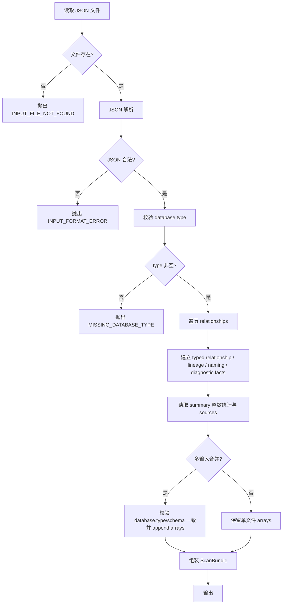
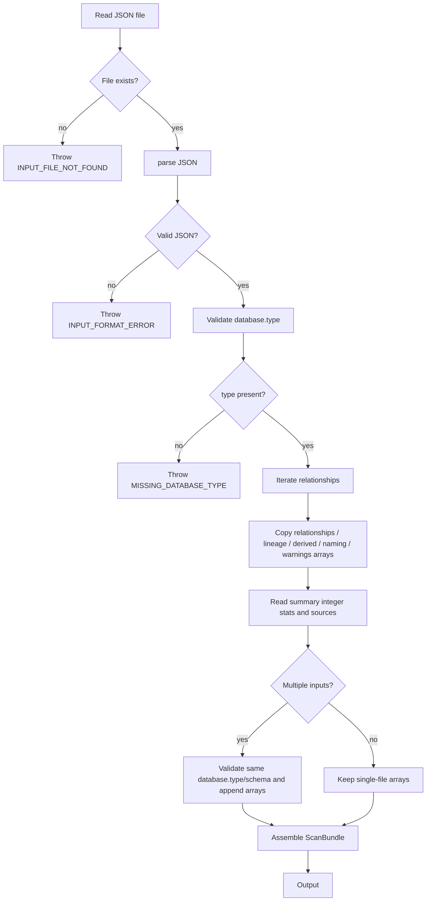
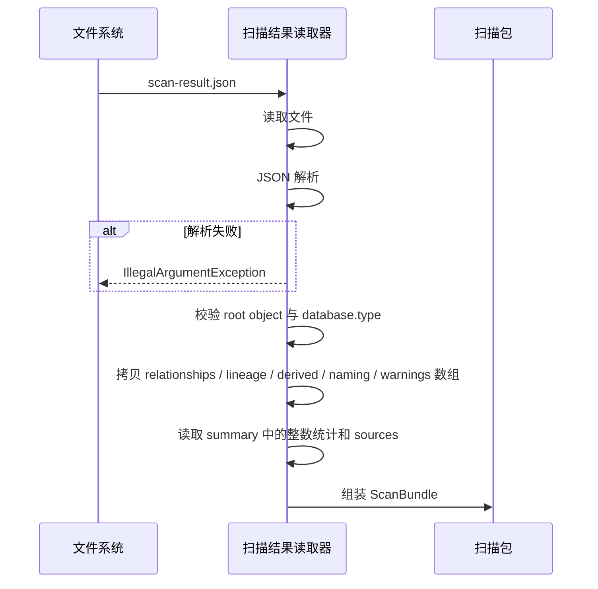
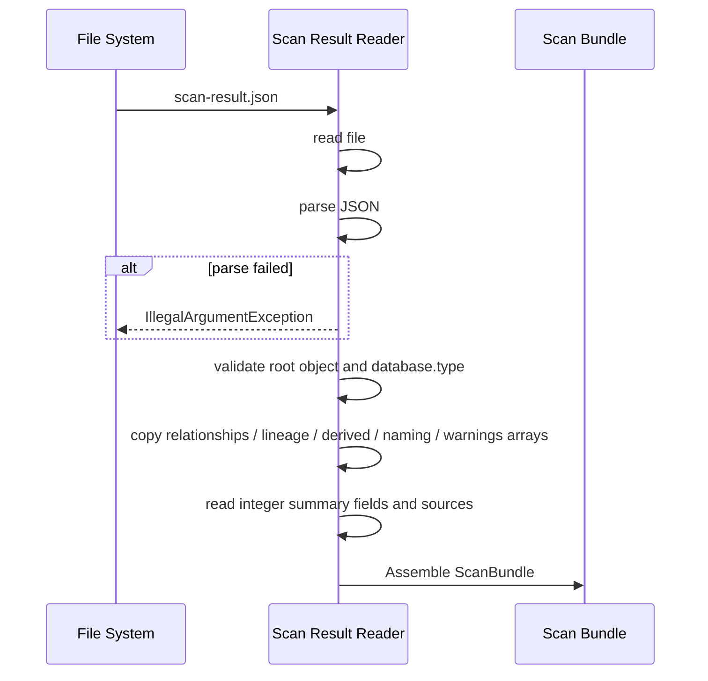

# Scan Result Reader 详细设计

## 1. 目标与定位

**职责：** 读取 relation-detector JSON 输出，校验完整性，归一化为 Semantic Layer 可消费的 `ScanBundle`。

当前代码实现位于 `semantic-layer/semantic-core/src/main/java/com/relationdetector/semantic/reader`。它已经落地为轻量离线 reader：

- `ScanResultReader.read(Path)` 读取单个 relation-detector JSON。
- `ScanResultReader.readMerged(List<Path>)` 合并同一 `database.type` 和 `database.schema` 下的多个 JSON。
- `ScanBundle` 保存 `relationships`、`dataLineages`、`derivedRelationships`、`derivedDataLineages`、`namingEvidence`、`diagnostics`、`summary`、`sources` 和输入文件列表。
- relation-detector 的 `derivedNamingEvidence` 是阅读/统计视图；当前 semantic reader 不单独读取该数组，derived naming facts 通过 canonical top-level `namingEvidence` 进入 `NamingEvidenceFact`。
- 当前 reader 不构建 `metadataIndex`、`relationshipIndex`、`lineageIndex`，也不在读取阶段做 relationship / lineage 去重；这些属于后续 catalog/search 阶段或上游 relation-detector merge 责任。

**LLM 依赖：** 否。纯 JSON 读取、轻量字段检查和同库同 schema 合并，是确定性规则操作。

**为什么不需要 LLM：** 输入是结构化 JSON，输出是结构化内存对象。当前操作是类型转换、必要字段检查和数组保留；LLM 无法比规则更可靠地完成这些操作，反而可能引入错误。

## 1.1 Semantica 启发：ScanBundle 是本项目的 Raw Records 层

Semantica 官方 ARCHITECTURE 中，不同来源会先进入 `Raw Documents`，再进入 parse、normalize、split 和 semantic extract。本项目的数据源不是任意文档，而是 relation-detector 的标准 JSON 输出；因此 `ScanBundle` 承担的是同类职责：

- 把 relationship、Data Lineage、namingEvidence、derived facts、diagnostics 和 rawEvidence 统一成可处理 records。
- 当前代码保留原始 JSON payload snapshot、summary、sources 和输入文件路径，支撑后续 provenance；`sourceHash`、`scanRunId`、`parserMode`、`grammarProfile` 等更细 build metadata 仍是后续 catalog/profile 扩展点。
- 对顶层 JSON、`database.type` 和多 input 的 `database.type/schema` 一致性做轻量校验；endpoint、schema、evidenceRef、warning 和 review-related payload 仍保留为 JsonNode，由后续 builder / normalizer / catalog 阶段解释。
- 只做读取、标准化和合并，不判断业务实体、指标口径或 join path 是否业务正确。

这意味着后续 Semantic Evidence Builder、Catalog、Question Planner 都只能消费 `ScanBundle` 或由它构建出的 evidence graph，不应直接绕过它读取零散 SQL、DDL 或 parser 内部结构。

## 2. 上游与下游

```
上游: relation-detector
  ↓ 输入: scan-result.json (JSON 文件, 1-100MB)

[Scan Result Reader]
  ↓ 输出: ScanBundle (内存对象)

下游: Semantic Evidence Builder
  消费: ScanBundle.relationships, ScanBundle.dataLineages, ScanBundle.namingEvidence,
        ScanBundle.derivedRelationships, ScanBundle.derivedDataLineages, ScanBundle.diagnostics
```

## 3. 接口契约

### 3.1 当前 Java 入口

```java
public final class ScanResultReader {
    ScanBundle read(Path scanResultPath);
    ScanBundle readMerged(List<Path> scanResultPaths);
}
```

当前合并规则：

- 所有输入文件必须有相同 `database.type` 和 `database.schema`。
- `sources` 去重后保留顺序。
- `summary` 中整数值按 key 求和。
- `relationships`、`dataLineages`、`derivedRelationships`、`derivedDataLineages`、`namingEvidence`、`diagnostics` 直接 append。
- 不在 reader 层做 semantic 去重、confidence 重算或 evidence 合并。

### 3.2 输入 Schema 与当前校验边界

下列字段是 relation-detector 正常输出契约；当前 reader 的强制校验比该契约更轻：只校验文件存在、JSON root 是 object、`database.type` 非空，以及多 input 的 `database.type/schema` 一致。`database.schema`、`generatedAt`、summary count 和各 fact 内部字段当前不会在 reader 层做完整 schema validation；缺失数组按空数组处理，缺失字符串按空字符串处理。严格 schema validation 是尚未实现的输入 gate，不能把下面标注的“契约必填”理解为当前代码已经逐字段拒绝。

```pseudo-json
{
  "database": {
    "type": "mysql",           // 必填，枚举来自 relation-detector 输出: common|mysql|postgresql|oracle|sqlserver 等
    "schema": "shop",          // 必填
    "catalog": null            // 可选
  },
  "generatedAt": "2026-06-23T00:00:00Z",  // 必填，ISO 8601
  "summary": {
    "directRelationshipCount": 24,   // 必填，整数 >= 0
    "derivedRelationshipCount": 6,   // 必填，整数 >= 0
    "totalRelationshipCount": 30,    // 必填，整数 >= 0
    "directDataLineageCount": 8,
    "derivedDataLineageCount": 2,
    "totalDataLineageCount": 10,
    "directNamingEvidenceCount": 40,
    "derivedNamingEvidenceCount": 5,
    "totalNamingEvidenceCount": 45,
    "warningCount": 3,         // 必填，整数 >= 0
    "sources": ["metadata", "ddl", "logs"]  // 必填
  },
  "relationships": [
    {
      "source": {
        "table": "orders",     // 必填，非空字符串
        "column": "customer_id" // 可空，null 表示表级关系
      },
      "target": {
        "table": "customers",  // 必填
        "column": "id"         // 可空
      },
      "relationType": "FK_LIKE",     // 必填，枚举: FK_LIKE|CO_OCCURRENCE
      "relationSubType": "INFERRED_JOIN_FK",  // 必填
      "confidence": 0.70,            // 必填，范围 [0.0, 0.99]
      "evidence": [                  // 必填，可为空数组
        {
          "type": "SQL_LOG_JOIN",    // 必填
          "sourceType": "NATIVE_LOG", // 必填
          "score": 0.55,             // 必填
          "source": "mysql-slow.log", // 必填
          "detail": "line 10: o.user_id = u.id", // 必填
          "attributes": {"count": 2} // 可选
        }
      ],
      "rawEvidence": [...],          // 必填，可为空数组
      "warnings": [...]              // 必填，可为空数组
    }
  ],
  "dataLineages": [...],       // 可选，缺失视为空数组
  "derivedRelationships": [...],
  "derivedDataLineages": [...],
  "namingEvidence": [...],
  "derivedNamingEvidence": [...], // 轻量视图；semantic reader 当前忽略，canonical 数据来自 namingEvidence
  "warnings": [...]            // 必填，可为空数组
}
```

### 3.3 当前输出模型（ScanBundle）

```pseudo-json
{
  "databaseType": "mysql",
  "schema": "shop",
  "generatedAt": "2026-06-23T00:00:00Z",
  "sources": ["ddl", "object-files", "logs"],
  "inputFiles": ["relation-detector/target/.../mysql-v8_0-full-derived-fresh.json"],
  "summary": {"directRelationshipCount": 397, "totalNamingEvidenceCount": 1031},
  "relationships": [ScanRelationshipFact],
  "dataLineages": [ScanLineageFact],
  "derivedRelationships": [ScanRelationshipFact],
  "derivedDataLineages": [ScanLineageFact],
  "namingEvidence": [ScanNamingEvidenceFact],
  "diagnostics": [ScanDiagnosticFact] // 来自 relation-detector 顶层 warnings
}
```

`ScanBundle` 在 reader 边界把 relation-detector 事实一次性转为强类型 fact；每个 fact 同时保留原始 `document()` payload，只在 evidence/provenance 渲染时访问。下游 event、bundle 和 evidence graph 不再重复解析 endpoint、confidence、flowKind 和 stable id。relation-detector 顶层 `warnings` 映射为 `ScanBundle.diagnostics`；当前 reader 不读取独立顶层 `diagnostics` 字段。`SemanticKgBuilder` 输出的 input file 是 canonical repo-relative path，不泄漏本机绝对路径。

## 4. 处理流程图

<details open>
<summary>中文</summary>



</details>

<details>
<summary>English</summary>



</details>

## 5. 交互时序图

<details open>
<summary>中文</summary>



</details>

<details>
<summary>English</summary>



</details>

## 6. 处理逻辑详解

### 4.1 当前读取流程（伪代码）

```java
ScanBundle read(Path path) {
    // 1. 文件存在性检查
    if (!Files.isRegularFile(path)) throw new IllegalArgumentException("scan result file does not exist");

    // 2. JSON 解析
    JsonNode root;
    try { root = objectMapper.readTree(path.toFile()); }
    catch (IOException e) { throw new IllegalArgumentException("failed to read scan result JSON", e); }

    // 3. 校验 root 与 database.type
    if (!root.isObject()) throw new IllegalArgumentException("scan result JSON root must be an object");
    String databaseType = root.path("database").path("type").asText("");
    if (databaseType.isBlank()) throw new IllegalArgumentException("database.type is required");

    // 4. 在 reader 边界建立 typed facts，每个 fact 仍保留原始 payload
    return new ScanBundle(
        databaseType,
        root.path("database").path("schema").asText(""),
        root.path("generatedAt").asText(""),
        readSources(root.path("summary").path("sources")),
        List.of(path),
        readIntegerSummary(root.path("summary")),
        relationshipFacts(root.path("relationships")),
        lineageFacts(root.path("dataLineages")),
        relationshipFacts(root.path("derivedRelationships")),
        lineageFacts(root.path("derivedDataLineages")),
        namingFacts(root.path("namingEvidence")),
        diagnosticFacts(root.path("warnings"))
    );
}
```

### 4.2 目标去重算法（未来 Catalog/Search 阶段）

当前 reader 不执行 relationship / lineage 去重；它保留 relation-detector JSON 中的数组顺序。以下算法只描述未来如果在 Semantic Catalog 或 Search 层需要合并多批事实时的目标方向，不是当前 `ScanResultReader` 代码。

```java
List<NormalizedRelationship> deduplicate(List<NormalizedRelationship> rels) {
    // key = source.table:source.column->target.table:target.column:relationType
    Map<String, NormalizedRelationship> best = new LinkedHashMap<>();
    for (NormalizedRelationship rel : rels) {
        String key = buildKey(rel);
        NormalizedRelationship existing = best.get(key);
        if (existing == null || rel.confidence().compareTo(existing.confidence()) > 0) {
            best.put(key, rel);
        } else if (rel.confidence().compareTo(existing.confidence()) == 0
                   && rel.evidence().size() > existing.evidence().size()) {
            best.put(key, rel);
        }
    }
    return new ArrayList<>(best.values());
}
```

### 4.3 校验规则

| 校验项 | 失败级别 | 处理 |
| --- | --- | --- |
| 文件不存在 | ERROR | 抛异常，终止 |
| JSON 格式错误 | ERROR | 抛异常，终止 |
| database.type 缺失 | ERROR | 抛异常，终止 |
| relationship.source.table 缺失 | 当前不逐条校验 | 保留原始 JsonNode，交给后续 builder/consumer |
| relationship.confidence 越界 | 当前不 clamp | 保留原始 JsonNode |
| relationship.evidence 缺失 | 当前不补默认值 | 保留原始 JsonNode |
| dataLineages 字段缺失 | INFO | 设为空数组，不终止 |

## 5. 测试验收

### 5.1 单元测试

| 测试场景 | 输入 | 预期输出 |
| --- | --- | --- |
| 正常读取 | 标准 scan-result.json（24条关系） | ScanBundle 含 24 条关系，并保留输入数组顺序 |
| 空关系 | relationships: [] | ScanBundle 含 0 条关系 |
| 缺失 dataLineages | 无 dataLineages 字段 | ScanBundle.dataLineages 为空列表 |
| 文件不存在 | 不存在路径 | `IllegalArgumentException` |
| JSON 格式错误 | 非 JSON 文本 | `IllegalArgumentException` |
| 缺失 database.type | database: {} | `IllegalArgumentException` |
| 单条关系字段异常 | source.table 缺失 | reader 不逐条校验 relationship schema，保留原始 JsonNode，后续 builder/consumer 再处理 |
| confidence 越界 | confidence: 1.5 | reader 不 clamp，保留原始 JsonNode |
| 去重 | 3 条同 key 关系，confidence 0.5/0.8/0.6 | reader 不去重，保持输入数组顺序 |
| 合并读取 | 2 个文件，各有同 key 关系 | 数组 append，summary 整数求和，sources 去重 |

### 5.2 集成测试

```java
// 端到端：从 relation-detector 输出到 ScanBundle
@Test
void endToEndFromRelationDetectorOutput() {
    Path scanResult = Path.of("test-fixtures/scan-result-mysql.json");
    ScanBundle bundle = reader.read(scanResult);

    // 基础断言
    assertEquals("mysql", bundle.databaseType());
    assertEquals("shop", bundle.schema());
    assertTrue(bundle.relationships().size() > 0);

    // 当前 reader 保留原始 JsonNode，不构建 typed index
    JsonNode rel = bundle.relationships().get(0);
    assertFalse(rel.path("source").path("table").asText("").isBlank());
    assertTrue(bundle.summary().containsKey("directRelationshipCount"));
}
```

### 5.3 性能测试

| 场景 | 数据量 | 预算 |
| --- | --- | --- |
| 标准读取 | 100 条关系, 50 个表 | < 500ms |
| 大规模读取 | 10000 条关系, 1000 个表 | < 5s |
| 合并读取 | 3 个文件, 各 100 条关系 | < 2s |
