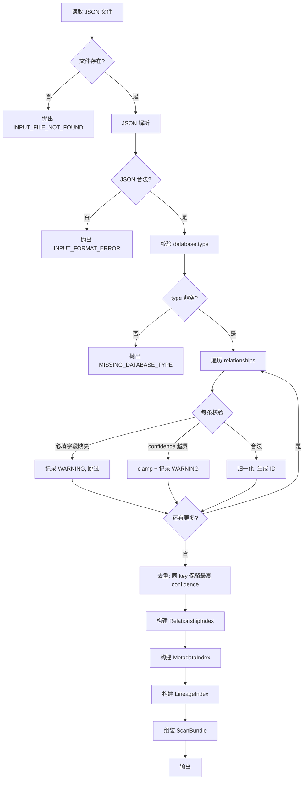
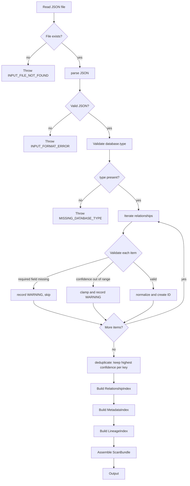
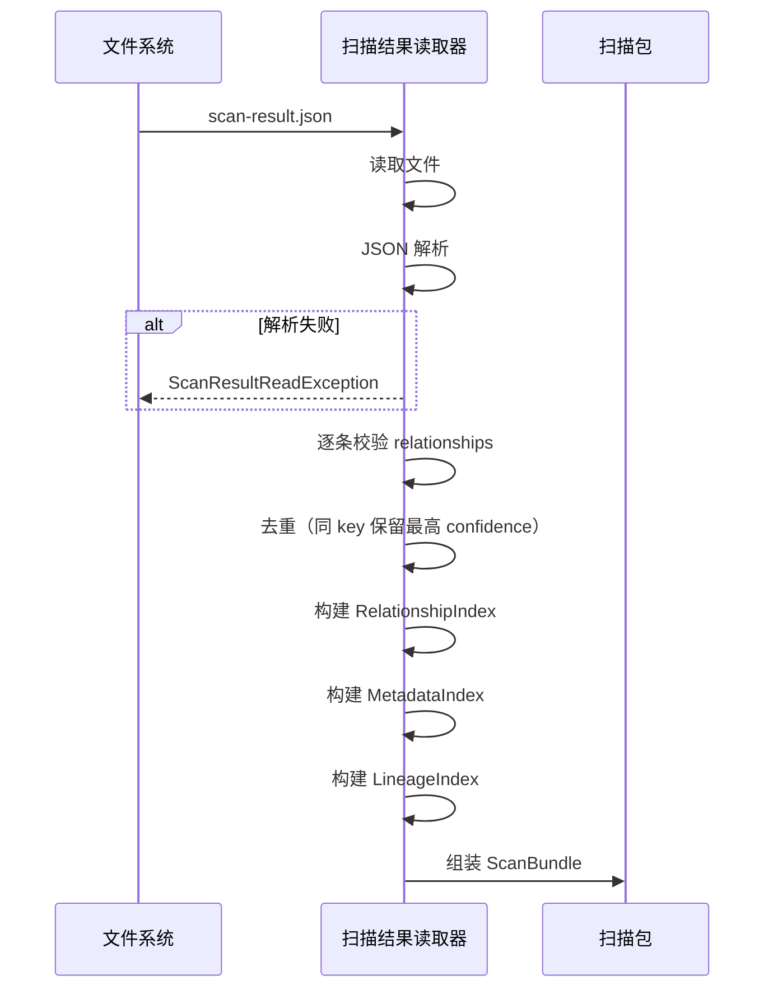
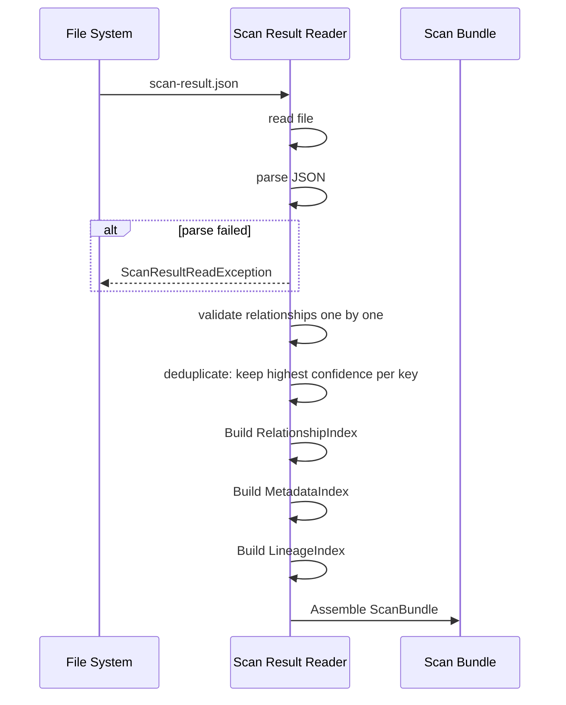

# Scan Result Reader 详细设计

## 1. 目标与定位

**职责：** 读取 relation-detector JSON 输出，校验完整性，归一化为 Semantic Layer 可消费的 `ScanBundle`。

**LLM 依赖：** 否。纯数据解析和校验，是确定性规则操作。JSON 解析 + 字段校验 + 索引构建全为确定性算法。

**为什么不需要 LLM：** 输入是结构化 JSON，输出是结构化内存对象。所有操作都是类型转换、字段校验和索引构建。LLM 无法比规则更可靠地完成这些操作，反而可能引入错误。

## 2. 上游与下游

```
上游: relation-detector
  ↓ 输入: scan-result.json (JSON 文件, 1-100MB)
  
[Scan Result Reader]
  ↓ 输出: ScanBundle (内存对象)

下游: Semantic Evidence Builder
  消费: ScanBundle.relationships, ScanBundle.metadataIndex, ScanBundle.dataLineages
```

## 3. 接口契约

### 3.1 主接口

```java
public interface ScanResultReader {
    /**
     * 读取单个 scan result 文件。
     *
     * 前置条件：
     * - scanResultPath 指向 relation-detector 的标准 JSON 输出
     * - 文件大小 < 500MB
     *
     * 后置条件：
     * - 返回的 ScanBundle 中所有必填字段非空
     * - relationships 已去重（同 key 保留 confidence 最高）
     * - 所有索引已构建完毕
     *
     * 异常：
     * - ScanResultReadException: 文件不存在/格式错误/必填字段缺失
     */
    ScanBundle read(Path scanResultPath);

    /**
     * 合并多个扫描结果。
     *
     * 合并规则：
     * - 同 key 关系: confidence 取 max, evidence 合并去重
     * - 同 key lineage: confidence 取 max, evidence 合并去重
     * - metadata: 取并集
     * - warnings: 全部保留
     *
     * 前置条件：
     * - 所有文件 database.type 一致
     * - 所有文件 database.schema 一致
     */
    ScanBundle readMerged(List<Path> scanResultPaths);
}
```

### 3.2 精确输入 Schema

```pseudo-json
{
  "database": {
    "type": "mysql",           // 必填，枚举: mysql|postgresql
    "schema": "shop",          // 必填
    "catalog": null            // 可选
  },
  "generatedAt": "2026-06-23T00:00:00Z",  // 必填，ISO 8601
  "summary": {
    "relationshipCount": 24,   // 必填，整数 >= 0
    "warningCount": 3,         // 必填，整数 >= 0
    "sources": ["metadata", "ddl", "logs"]  // 必填
  },
  "relationships": [
    {
      "source": {
        "table": "orders",     // 必填，非空字符串
        "column": "customer_id" // 可空，null 表示表级关系
      },
      "target": {
        "table": "customers",  // 必填
        "column": "id"         // 可空
      },
      "relationType": "FK_LIKE",     // 必填，枚举: FK_LIKE|CO_OCCURRENCE
      "relationSubType": "INFERRED_JOIN_FK",  // 必填
      "confidence": 0.70,            // 必填，范围 [0.0, 0.99]
      "evidence": [                  // 必填，可为空数组
        {
          "type": "SQL_LOG_JOIN",    // 必填
          "sourceType": "NATIVE_LOG", // 必填
          "score": 0.55,             // 必填
          "source": "mysql-slow.log", // 必填
          "detail": "line 10: o.user_id = u.id", // 必填
          "attributes": {"count": 2} // 可选
        }
      ],
      "rawEvidence": [...],          // 必填，可为空数组
      "warnings": [...]              // 必填，可为空数组
    }
  ],
  "dataLineage": [...],        // 可选，缺失视为空数组
  "warnings": [...]            // 必填，可为空数组
}
```

### 3.3 精确输出 Schema（ScanBundle）

```pseudo-json
{
  "database": {"type": "mysql", "schema": "shop", "catalog": null, "version": null},
  "generatedAt": "2026-06-23T00:00:00Z",
  "relationships": [
    {
      "id": "FK_LIKE:orders.customer_id->customers.id",
      "source": {"table": "orders", "column": "customer_id", "normalizedName": "orders.customer_id"},
      "target": {"table": "customers", "column": "id", "normalizedName": "customers.id"},
      "relationType": "FK_LIKE",
      "relationSubType": "INFERRED_JOIN_FK",
      "confidence": 0.70,
      "evidence": [...],
      "rawEvidence": [...],
      "warnings": []
    }
  ],
  "dataLineages": [...],
  "metadataIndex": {
    "tables": {
      "orders": {
        "tableName": "orders",
        "schema": "shop",
        "columns": {
          "id": {"columnName": "id", "dataType": "bigint", "nullable": false, "isPrimaryKey": true},
          "customer_id": {"columnName": "customer_id", "dataType": "bigint", "nullable": false}
        }
      }
    },
    "primaryKeys": {"orders": ["id"], "customers": ["id"]},
    "foreignKeys": {},
    "uniqueConstraints": {},
    "indexes": {"orders": [{"name": "idx_orders_customer", "columns": ["customer_id"]}]}
  },
  "relationshipIndex": {
    "bySourceTable": {"orders": ["FK_LIKE:orders.customer_id->customers.id"]},
    "byTargetTable": {"customers": ["FK_LIKE:orders.customer_id->customers.id"]},
    "byTablePair": {"(orders,customers)": [...]},
    "byColumnPair": {"(orders.customer_id,customers.id)": [...]},
    "byType": {"FK_LIKE": [...]},
    "all": [...]
  },
  "lineageIndex": {
    "bySourceTable": {},
    "byTargetTable": {},
    "byTargetColumn": {},
    "all": []
  },
  "warnings": [...]
}
```

## 4. 处理流程图

<details open>
<summary>中文</summary>



</details>

<details>
<summary>English</summary>



</details>

## 5. 交互时序图

<details open>
<summary>中文</summary>



</details>

<details>
<summary>English</summary>



</details>

## 6. 处理逻辑详解

### 4.1 读取流程（伪代码）

```java
ScanBundle read(Path path) {
    // 1. 文件存在性检查
    if (!Files.exists(path)) throw new ScanResultReadException("INPUT_FILE_NOT_FOUND", path);

    // 2. JSON 解析
    JsonNode root;
    try { root = objectMapper.readTree(path.toFile()); }
    catch (JsonParseException e) { throw new ScanResultReadException("INPUT_FORMAT_ERROR", e); }

    // 3. 校验 database 信息
    JsonNode db = root.get("database");
    if (db == null || !db.has("type") || db.get("type").asText().isEmpty())
        throw new ScanResultReadException("MISSING_DATABASE_TYPE");

    // 4. 归一化 relationships
    List<NormalizedRelationship> rels = new ArrayList<>();
    List<WarningMessage> warnings = new ArrayList<>();
    for (JsonNode rel : root.get("relationships")) {
        try {
            rels.add(normalizeRelationship(rel));
        } catch (ValidationException e) {
            warnings.add(WarningMessage.of("RELATIONSHIP_VALIDATION_FAILED", e.getMessage()));
        }
    }

    // 5. 去重
    rels = deduplicate(rels);

    // 6. 构建索引
    MetadataIndex metaIdx = buildMetadataIndex(root);
    RelationshipIndex relIdx = buildRelationshipIndex(rels);
    LineageIndex linIdx = buildLineageIndex(root.get("dataLineage"));

    // 7. 组装
    return new ScanBundle(databaseInfo, generatedAt, rels, lineages, metaIdx, relIdx, linIdx, warnings);
}
```

### 4.2 去重算法

```java
List<NormalizedRelationship> deduplicate(List<NormalizedRelationship> rels) {
    // key = source.table:source.column->target.table:target.column:relationType
    Map<String, NormalizedRelationship> best = new LinkedHashMap<>();
    for (NormalizedRelationship rel : rels) {
        String key = buildKey(rel);
        NormalizedRelationship existing = best.get(key);
        if (existing == null || rel.confidence().compareTo(existing.confidence()) > 0) {
            best.put(key, rel);
        } else if (rel.confidence().compareTo(existing.confidence()) == 0
                   && rel.evidence().size() > existing.evidence().size()) {
            best.put(key, rel);
        }
    }
    return new ArrayList<>(best.values());
}
```

### 4.3 校验规则

| 校验项 | 失败级别 | 处理 |
| --- | --- | --- |
| 文件不存在 | ERROR | 抛异常，终止 |
| JSON 格式错误 | ERROR | 抛异常，终止 |
| database.type 缺失 | ERROR | 抛异常，终止 |
| relationship.source.table 缺失 | WARNING | 跳过该条关系 |
| relationship.confidence 越界 | WARNING | clamp 到 [0.0, 0.99] |
| relationship.evidence 缺失 | WARNING | 设为空数组 |
| dataLineage 字段缺失 | INFO | 设为空数组，不终止 |

## 5. 测试验收

### 5.1 单元测试

| 测试场景 | 输入 | 预期输出 |
| --- | --- | --- |
| 正常读取 | 标准 scan-result.json（24条关系） | ScanBundle 含 24 条关系，索引正确 |
| 空关系 | relationships: [] | ScanBundle 含 0 条关系，索引为空 Map |
| 缺失 dataLineage | 无 dataLineage 字段 | ScanBundle.dataLineages 为空列表 |
| 文件不存在 | 不存在路径 | ScanResultReadException("INPUT_FILE_NOT_FOUND") |
| JSON 格式错误 | 非 JSON 文本 | ScanResultReadException("INPUT_FORMAT_ERROR") |
| 缺失 database.type | database: {} | ScanResultReadException("MISSING_DATABASE_TYPE") |
| 单条关系无效 | source.table 缺失 | Warning 记录，该条跳过，其余正常 |
| confidence 越界 | confidence: 1.5 | clamp 到 0.99，Warning 记录 |
| 去重 | 3 条同 key 关系，confidence 0.5/0.8/0.6 | 保留 0.8 那条 |
| 合并读取 | 2 个文件，各有同 key 关系 | 取最高 confidence，evidence 合并 |

### 5.2 集成测试

```java
// 端到端：从 relation-detector 输出到 ScanBundle
@Test
void endToEndFromRelationDetectorOutput() {
    Path scanResult = Path.of("test-fixtures/scan-result-mysql.json");
    ScanBundle bundle = reader.read(scanResult);

    // 基础断言
    assertEquals("mysql", bundle.database().type());
    assertEquals("shop", bundle.database().schema());
    assertTrue(bundle.relationships().size() > 0);

    // 索引断言
    NormalizedRelationship rel = bundle.relationships().get(0);
    assertNotNull(rel.id());
    assertTrue(rel.confidence().compareTo(BigDecimal.ZERO) >= 0);
    assertTrue(rel.confidence().compareTo(new BigDecimal("0.99")) <= 0);

    // 索引可查询
    assertFalse(bundle.relationshipIndex().bySourceTable().isEmpty());
    assertFalse(bundle.metadataIndex().tables().isEmpty());
}
```

### 5.3 性能测试

| 场景 | 数据量 | 预算 |
| --- | --- | --- |
| 标准读取 | 100 条关系, 50 个表 | < 500ms |
| 大规模读取 | 10000 条关系, 1000 个表 | < 5s |
| 合并读取 | 3 个文件, 各 100 条关系 | < 2s |
