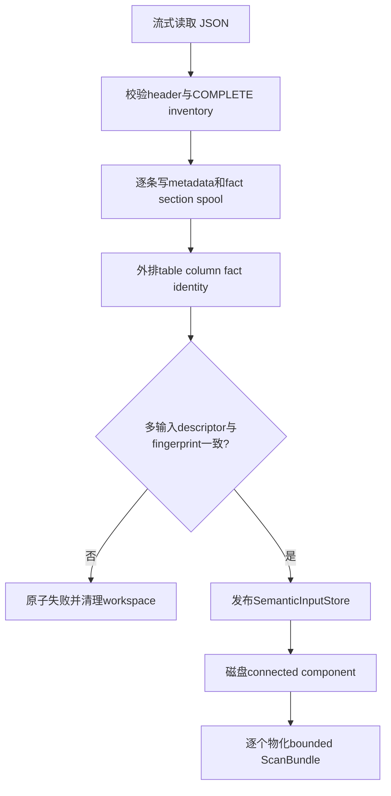
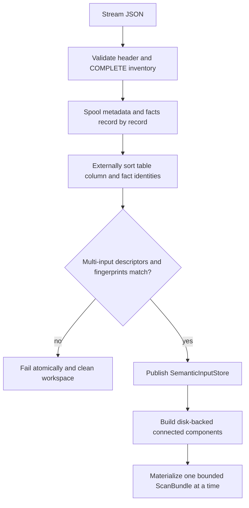
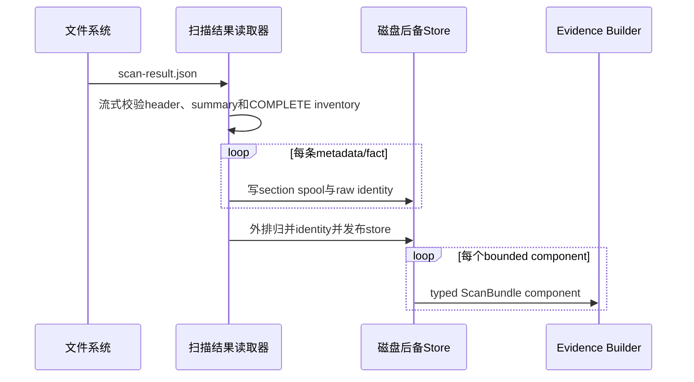
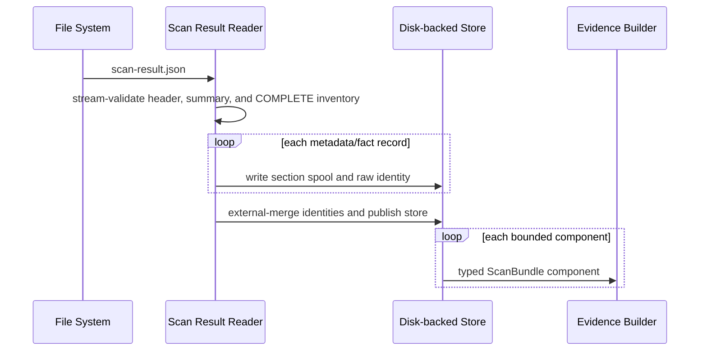

# Scan Result Reader 详细设计

## 1. 目标与定位

**职责：** 流式读取 relation-detector JSON，校验完整性并写入磁盘后备 typed store；只在有界
component或兼容调用中物化`ScanBundle`。

当前代码实现位于 `semantic-layer/semantic-core/src/main/java/com/relationdetector/semantic/reader`。它已经落地为轻量离线 reader：

- `ScanResultReader.open(List<Path>, Path)` 是生产入口，返回可关闭的`SemanticInputStore`。
- store逐条读取顶层数组，写入section spool及外排table/column/fact索引，不持有完整输入。
- 多输入要求`database.type/catalog/schema`、inventory scope和完整inventory fingerprint一致。
- `ScanResultReader.read/readMerged`只供明确有界的兼容调用和测试使用。
- `ScanBundle`保存完整metadata inventory及一个有界component的typed事实。
- relation-detector 的 `derivedNamingEvidence` 是阅读/统计视图；当前 semantic reader 不单独读取该数组，derived naming facts 通过 canonical top-level `namingEvidence` 进入 `NamingEvidenceFact`。
- 当前 reader 不构建 `metadataIndex`、`relationshipIndex`、`lineageIndex`，也不在读取阶段做 relationship / lineage 去重；这些属于后续 catalog/search 阶段或上游 relation-detector merge 责任。

**LLM 依赖：** 否。纯 JSON 读取、当前已实现的结构契约校验和同一 database identity 合并，是确定性规则操作。

**为什么不需要 LLM：** 输入是结构化 JSON，输出是结构化内存对象。当前操作是类型转换、必要字段检查和数组保留；LLM 无法比规则更可靠地完成这些操作，反而可能引入错误。

## 1.1 Semantica 启发：ScanBundle 是本项目的 Raw Records 层

Semantica 官方 ARCHITECTURE 中，不同来源会先进入 `Raw Documents`，再进入 parse、normalize、split 和 semantic extract。本项目的数据源不是任意文档，而是 relation-detector 的标准 JSON 输出；因此 `ScanBundle` 承担的是同类职责：

- 把 relationship、Data Lineage、namingEvidence、derived facts、diagnostics 和 rawEvidence 统一成可处理 records。
- 当前代码保留原始 JSON payload snapshot、summary、sources 和输入文件路径，支撑后续 provenance；`sourceHash`、`scanRunId`、`parserMode`、`grammarProfile` 等更细 build metadata 仍是后续 catalog/profile 扩展点。
- `ScanResultContractValidator` 在 typed fact 创建前校验 database、ISO-8601 `generatedAt`、summary、必需数组、endpoint、confidence、relation/lineage/evidence/warning 枚举、嵌套 evidence/warning 结构和 summary/数组计数一致性。
- database identity 是 `type + catalog + schema`；catalog 必须同时为空或精确相同，不能跨 catalog 合并同名对象。
- 只做读取、标准化和合并，不判断业务实体、指标口径或 join path 是否业务正确。

这意味着生产 Evidence Builder 只能消费`SemanticInputStore`产生的有界`ScanBundle` component或由其
构建的evidence store，不应绕过reader读取零散SQL、DDL或parser内部结构。

## 2. 上游与下游

```
上游: relation-detector
  ↓ 输入: scan-result.json（含metadataInventory）

[Scan Result Reader]
  ↓ 输出: SemanticInputStore（section spool + 外排索引）
  ↓ 按需: bounded ScanBundle component

下游: Semantic Evidence Builder
  逐component消费完整inventory、direct/derived facts、naming和diagnostics
```

## 3. 接口契约

### 3.1 当前 Java 入口

```java
public final class ScanResultReader {
    SemanticInputStore open(List<Path> scanResultPaths, Path workspace);
    ScanBundle read(Path scanResultPath);
    ScanBundle readMerged(List<Path> scanResultPaths);
}
```

生产`open()`的合并规则：

- 所有输入必须有相同`database.type/catalog/schema`、inventory scope与COMPLETE fingerprint。
- `NOT_REQUESTED/PARTIAL/UNAVAILABLE`及缺失inventory在任何模型调用和正式artifact写入前拒绝。
- `sources` 去重后保留顺序。
- `summary` 中整数值按 key 求和。
- facts与四类metadata记录逐条验证、spool；stable ID与物理identity通过外排索引检查。
- 不在 reader 层做 semantic 去重、confidence 重算或 evidence 合并。

`read/readMerged`保留相同wire与COMPLETE inventory语义，但会物化完整`ScanBundle`，只适用于有界调用。

### 3.2 输入 Schema 与当前校验边界

下列字段是 relation-detector 的正常输出契约。reader 在构建 typed fact 前拒绝缺失必需数组、空 endpoint、越界 confidence、非法 summary 数值、summary/数组计数不一致、无法解析的时间戳、未知枚举值以及不符合 writer 契约的 nested evidence/warning。`catalog`、`schema` 可为空，但存在时必须是字符串；未知顶层扩展字段被忽略，不进入 `ScanBundle`。

```pseudo-json
{
  "database": {
    "type": "mysql",           // 必填，枚举来自 relation-detector 输出: common|mysql|postgresql|oracle|sqlserver 等
    "schema": "",              // 可选；MySQL catalog-only 输出通常为空
    "catalog": "shop"          // 可选；若存在则属于 database identity
  },
  "generatedAt": "2026-06-23T00:00:00Z",  // 必填，必须可由 Instant.parse 解析
  "summary": {
    "directRelationshipCount": 24,   // 必填，整数 >= 0
    "derivedRelationshipCount": 6,   // 必填，整数 >= 0
    "totalRelationshipCount": 30,    // 必填，整数 >= 0
    "directDataLineageCount": 8,
    "derivedDataLineageCount": 2,
    "totalDataLineageCount": 10,
    "directNamingEvidenceCount": 40,
    "derivedNamingEvidenceCount": 5,
    "totalNamingEvidenceCount": 45,
    "warningCount": 3,         // 必填，整数 >= 0
    "sources": ["metadata", "ddl", "logs"]  // 必填
  },
  "metadataInventory": {
    "status": "COMPLETE", // relation-detector也可输出NOT_REQUESTED/PARTIAL/UNAVAILABLE；semantic只接受COMPLETE
    "scope": {
      "catalog": "shop",
      "schema": "",
      "includeTables": [],
      "excludeTables": []
    },
    "counts": {"tables": 10, "columns": 120, "constraints": 14, "indexes": 22},
    "tables": [...],
    "columns": [...],
    "constraints": [...],
    "indexes": [...]
  },
  "relationships": [
    {
      "source": {
        "table": "orders",     // 必填，非空字符串
        "column": "customer_id" // 可空，null 表示表级关系
      },
      "target": {
        "table": "customers",  // 必填
        "column": "id"         // 可空
      },
      "relationType": "FK_LIKE",     // 必填，枚举: FK_LIKE|CO_OCCURRENCE
      "relationSubType": "INFERRED_JOIN_FK",  // 必填
      "confidence": 0.70,            // 必填，reader 接受范围 [0.0, 1.0]
      "evidence": [                  // 必填，可为空数组
        {
          "type": "SQL_LOG_JOIN",    // 必填
          "sourceType": "NATIVE_LOG", // 必填
          "score": 0.55,             // 必填
          "source": "mysql-slow.log", // 必填
          "detail": "line 10: o.user_id = u.id", // 必填
          "attributes": {"count": 2} // 可选
        }
      ],
      "rawEvidence": [...],          // 必填，可为空数组
      "warnings": [...]              // 必填，可为空数组
    }
  ],
  "dataLineages": [...],       // 必填，可为空数组
  "derivedRelationships": [...],
  "derivedDataLineages": [...],
  "namingEvidence": [...],
  "derivedNamingEvidence": [...], // 轻量视图；semantic reader 当前忽略，canonical 数据来自 namingEvidence
  "warnings": [...]            // 必填，可为空数组
}
```

### 3.3 当前生产输出模型（SemanticInputStore）

```pseudo-json
{
  "descriptor": {
    "databaseType": "mysql",
    "catalog": "shop",
    "schema": "",
    "inventory": {"status": "COMPLETE", "counts": {...}, "fingerprint": "..."}
  },
  "sectionSpools": {
    "metadataTables": "...jsonl",
    "relationships": "...jsonl",
    "dataLineages": "...jsonl"
  },
  "externalIndexes": ["tables.index", "columns.index", "facts.index"]
}
```

store按需把一个固定原始字节上限的connected-component chunk物化为`ScanBundle`。每个typed fact保留
原始`document()` payload；下游不再重复解析endpoint、confidence或flowKind。relationship、lineage、
naming和diagnostic ID不依赖数组位置；重复stable ID在store发布前拒绝。顶层`warnings`映射为
diagnostics。portable input label不泄漏本机绝对路径，但不等同于持久repository identity。

不可变边界覆盖外层list/map与公开JSON状态。typed fact的`document()`、`EvidenceGraphFact.payload()`
和`EvidenceGraph.diagnostics()`在构造及公开读取时deep-copy；下游调用方修改返回`JsonNode`不会改变
reader或graph内部已验证状态。

## 4. 处理流程图

<details open>
<summary>中文</summary>


```mermaid
flowchart TD
    A[流式读取 JSON] --> B[校验header与COMPLETE inventory]
    B --> C[逐条写metadata和fact section spool]
    C --> D[外排table column fact identity]
    D --> E{多输入descriptor与fingerprint一致?}
    E -- 否 --> F[原子失败并清理workspace]
    E -- 是 --> G[发布SemanticInputStore]
    G --> H[磁盘connected component]
    H --> I[逐个物化bounded ScanBundle]
```

</details>

<details>
<summary>English</summary>


```mermaid
flowchart TD
    A[Stream JSON] --> B[Validate header and COMPLETE inventory]
    B --> C[Spool metadata and facts record by record]
    C --> D[Externally sort table column and fact identities]
    D --> E{Multi-input descriptors and fingerprints match?}
    E -- no --> F[Fail atomically and clean workspace]
    E -- yes --> G[Publish SemanticInputStore]
    G --> H[Build disk-backed connected components]
    H --> I[Materialize one bounded ScanBundle at a time]
```

</details>

## 5. 生产交互时序图

<details open>
<summary>中文</summary>


```mermaid
sequenceDiagram
    participant FS as 文件系统
    participant SR as 扫描结果读取器
    participant DS as 磁盘后备Store
    participant EB as Evidence Builder

    FS->>SR: scan-result.json
    SR->>SR: 流式校验header、summary和COMPLETE inventory
    loop 每条metadata/fact
        SR->>DS: 写section spool与raw identity
    end
    SR->>DS: 外排归并identity并发布store
    loop 每个bounded component
        DS->>EB: typed ScanBundle component
    end
```

</details>

<details>
<summary>English</summary>


```mermaid
sequenceDiagram
    participant FS as File System
    participant SR as Scan Result Reader
    participant DS as Disk-backed Store
    participant EB as Evidence Builder

    FS->>SR: scan-result.json
    SR->>SR: stream-validate header, summary, and COMPLETE inventory
    loop each metadata/fact record
        SR->>DS: write section spool and raw identity
    end
    SR->>DS: external-merge identities and publish store
    loop each bounded component
        DS->>EB: typed ScanBundle component
    end
```

</details>

## 6. 处理逻辑详解

### 6.1 有界兼容读取流程（伪代码）

正式命令调用`open()`；下面的`read()`只用于测试和明确受限输入，不是大输入生产路径。

```java
ScanBundle read(Path path) {
    // 1. 文件存在性检查
    if (!Files.isRegularFile(path)) throw new IllegalArgumentException("scan result file does not exist");

    // 2. JSON 解析
    JsonNode root;
    try { root = objectMapper.readTree(path.toFile()); }
    catch (IOException e) { throw new IllegalArgumentException("failed to read scan result JSON", e); }

    // 3. 校验当前 reader 已拥有的 wire contract
    contractValidator.validate(root);
    String databaseType = root.path("database").path("type").asText("");

    // 4. 在 reader 边界建立 typed facts，每个 fact 仍保留原始 payload
    return new ScanBundle(
        databaseType,
        root.path("database").path("catalog").asText(""),
        root.path("database").path("schema").asText(""),
        root.path("generatedAt").asText(""),
        readSources(root.path("summary").path("sources")),
        List.of(path),
        readIntegerSummary(root.path("summary")),
        readCompleteMetadataInventory(root.path("metadataInventory")),
        relationshipFacts(root.path("relationships")),
        lineageFacts(root.path("dataLineages")),
        relationshipFacts(root.path("derivedRelationships")),
        lineageFacts(root.path("derivedDataLineages")),
        namingFacts(root.path("namingEvidence")),
        diagnosticFacts(root.path("warnings"))
    );
}
```

### 6.2 目标去重算法（未来 Catalog/Search 阶段）

当前 reader 不执行 relationship / lineage 去重；它保留 relation-detector JSON 中的数组顺序。以下算法只描述未来如果在 Semantic Catalog 或 Search 层需要合并多批事实时的目标方向，不是当前 `ScanResultReader` 代码。

```java
List<NormalizedRelationship> deduplicate(List<NormalizedRelationship> rels) {
    // key = source.table:source.column->target.table:target.column:relationType
    Map<String, NormalizedRelationship> best = new LinkedHashMap<>();
    for (NormalizedRelationship rel : rels) {
        String key = buildKey(rel);
        NormalizedRelationship existing = best.get(key);
        if (existing == null || rel.confidence().compareTo(existing.confidence()) > 0) {
            best.put(key, rel);
        } else if (rel.confidence().compareTo(existing.confidence()) == 0
                   && rel.evidence().size() > existing.evidence().size()) {
            best.put(key, rel);
        }
    }
    return new ArrayList<>(best.values());
}
```

### 6.3 校验规则

| 校验项 | 失败级别 | 处理 |
| --- | --- | --- |
| 文件不存在 | ERROR | 抛异常，终止 |
| JSON 格式错误 | ERROR | 抛异常，终止 |
| database.type 缺失 | ERROR | 抛异常，终止 |
| relationship.source.table 缺失 | ERROR | 抛出 `ScanResultContractException` |
| relationship.confidence 越界 | ERROR | 抛出 `ScanResultContractException`，不 clamp |
| 必需 fact 数组缺失 | ERROR | 抛出 `ScanResultContractException` |
| summary 与数组计数不一致 | ERROR | 抛出 `ScanResultContractException` |
| 重复 stable fact id | ERROR | 拒绝存在重复语义身份的 bundle |
| generatedAt 不是 ISO 8601 | ERROR | 抛出 `ScanResultContractException` |
| 未知 relation/lineage/evidence/warning enum | ERROR | 抛出 `ScanResultContractException` |
| 嵌套 evidence、warning 或 derived path 不符合当前 writer shape | ERROR | 抛出 `ScanResultContractException` |
| `summary.warningCount` 与根 `warnings` 数组不一致 | ERROR | 抛出 `ScanResultContractException`；writer 的 `includeWarnings=false` 会同步清空根/fact warnings并把 count 置零，因此其 suppressed output 合法 |

## 7. 测试验收

### 7.1 单元测试

| 测试场景 | 输入 | 预期输出 |
| --- | --- | --- |
| 正常读取 | 标准 scan-result.json（24条关系） | ScanBundle 含 24 条关系，并保留输入数组顺序 |
| 空关系 | relationships: [] | ScanBundle 含 0 条关系 |
| 缺失 dataLineages | 无 dataLineages 字段 | `ScanResultContractException` |
| 文件不存在 | 不存在路径 | `IllegalArgumentException` |
| JSON 格式错误 | 非 JSON 文本 | `IllegalArgumentException` |
| 缺失 database.type | database: {} | `IllegalArgumentException` |
| 单条关系字段异常 | source.table 缺失 | `ScanResultContractException` |
| confidence 越界 | confidence: 1.5 | `ScanResultContractException` |
| 去重 | 3 条同 key 关系，confidence 0.5/0.8/0.6 | reader 不去重，保持输入数组顺序 |
| 合并读取 | 2 个文件，facts identity 不同 | 数组 append，summary 整数求和，sources 去重 |
| 合并重复事实 | 2 个文件含相同 stable fact id | 拒绝合并，不择优去重 |
| 跨 catalog 合并 | type/schema 相同，catalog 不同 | 拒绝合并 |
| 输入重排 | 相同 facts 使用不同数组顺序 | stable fact/evidence/candidate id 集合不变 |
| warning suppression | writer 隐藏内部非空 warning | 根/fact warning 数组为空且 count 为 0，可正常读取；人工构造的不一致 count/array 仍拒绝 |

### 7.2 集成测试

```java
// 端到端：从 relation-detector 输出到 ScanBundle
@Test
void endToEndFromRelationDetectorOutput() {
    Path scanResult = Path.of("test-fixtures/scan-result-mysql.json");
    ScanBundle bundle = reader.read(scanResult);

    // 基础断言
    assertEquals("mysql", bundle.databaseType());
    assertEquals("shop", bundle.schema());
    assertTrue(bundle.relationships().size() > 0);

    // 当前 reader 在边界创建 typed fact，同时保留原始 document payload
    ScanRelationshipFact rel = bundle.relationships().get(0);
    assertFalse(rel.source().isBlank());
    assertTrue(rel.document().isObject());
    assertTrue(bundle.summary().containsKey("directRelationshipCount"));
}
```

catalog 负向 contract test 已覆盖不同 catalog 拒绝合并；artifact test 验证 `ScanBundle`、extraction bundle
和 build-run 均保留 catalog 并输出 canonical input path。

### 7.3 性能测试

| 场景 | 数据量 | 预算 |
| --- | --- | --- |
| 标准读取 | 100 条关系, 50 个表 | < 500ms |
| 大规模读取 | 10000 条关系, 1000 个表 | < 5s |
| 合并读取 | 3 个文件, 各 100 条关系 | < 2s |
