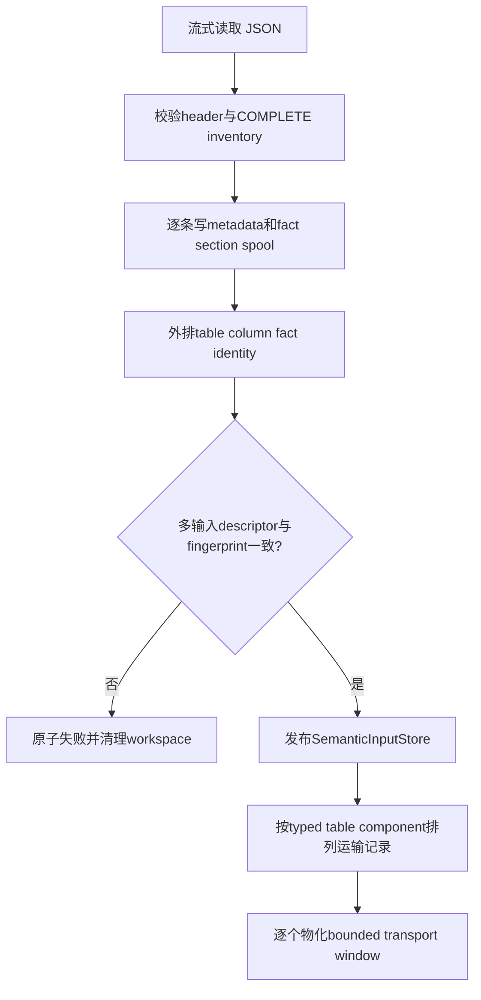
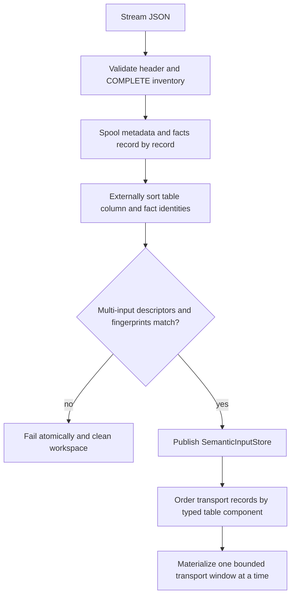
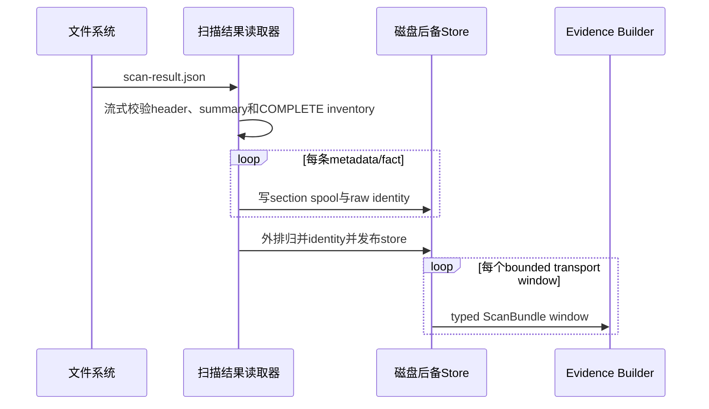
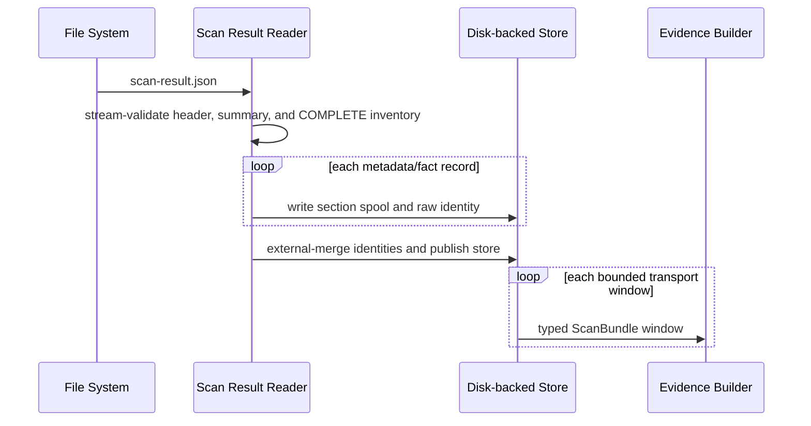

# Scan Result Reader 详细设计

## 1. 目标与定位

**职责：** 流式读取 relation-detector JSON，校验完整性并写入磁盘后备 typed store；后续只由
`SemanticInputWindowStore`为单个有界运输窗口物化`ScanBundle`。

当前代码实现位于 `semantic-layer/semantic-core/src/main/java/com/relationdetector/semantic/ingest`。它已经落地为磁盘后备 reader：

- `ScanResultReader.open(List<Path>, Path)` 是生产入口，返回可关闭的`SemanticInputStore`。
- store逐条读取顶层数组，写入section spool及外排table/column/fact索引，不持有完整输入。
- 多输入要求`database.type/catalog/schema`、inventory scope和完整inventory fingerprint一致。
- `ScanResultReader`不提供整份scan JSON的内存物化入口。
- `SemanticInputWindowStore`按typed table component排序记录，并只为一个受原始字节上限约束的运输窗口构造`ScanBundle`；该窗口不是event、owner或shard语义边界。
- relation-detector 的 `derivedNamingEvidence` 是阅读/统计视图；当前 semantic reader 不单独读取该数组，derived naming facts 通过 canonical top-level `namingEvidence` 进入 `NamingEvidenceFact`。
- 当前 reader 会构建外排table、column和fact identity索引，用于输入闭包与冲突检查；它不构建供
  业务查询使用的`metadataIndex`、`relationshipIndex`或`lineageIndex`，也不在读取阶段做
  relationship / lineage去重。这些查询索引属于后续catalog/search阶段，事实合并属于上游
  relation-detector责任。

**LLM 依赖：** 否。纯 JSON 读取、当前已实现的结构契约校验和同一 database identity 合并，是确定性规则操作。

**为什么不需要 LLM：** 输入是结构化 JSON，输出是结构化内存对象。当前操作是类型转换、必要字段检查和数组保留；LLM 无法比规则更可靠地完成这些操作，反而可能引入错误。

## 1.1 Semantica 启发：SemanticInputStore 是 Raw Records 层

Semantica 官方 ARCHITECTURE 中，不同来源会先进入 `Raw Documents`，再进入 parse、normalize、split 和 semantic extract。本项目的数据源不是任意文档，而是 relation-detector 的标准 JSON 输出；因此`SemanticInputStore`承担同类持久运输职责，`ScanBundle`只表达其中一个有界typed窗口：

- 把relationship、Data Lineage、namingEvidence、derived facts和diagnostics统一成可处理records；direct
  facts消费`rawEvidence`，derived relationship/lineage消费typed `evidenceSets`并拒绝旧笛卡尔积wire。
- 当前代码保留原始 JSON payload snapshot、summary、sources 和输入文件路径，支撑后续 provenance；`sourceHash`、`scanRunId`、`parserMode`、`grammarProfile` 等更细 build metadata 仍是后续 catalog/profile 扩展点。
- standalone`ScanResultContractValidator`在typed fact创建前执行完整wire校验；生产
  `SemanticInputStoreLoader`复用section item校验，但summary计数合同仍有本节3.2所列的三个缺口。
- database identity 是 `type + catalog + schema`；catalog 必须同时为空或精确相同，不能跨 catalog 合并同名对象。
- 只做读取、标准化和合并，不判断业务实体、指标口径或 join path 是否业务正确。

严格地说，生产Raw Records载体是`SemanticInputStore`；`ScanBundle`只是它为单个运输窗口提供的
有界typed视图。这意味着Evidence链路只能消费该store或其窗口，不应绕过reader读取零散SQL、DDL
或parser内部结构。

## 2. 上游与下游

```
上游: relation-detector
  ↓ 输入: scan-result.json（含metadataInventory）

[Scan Result Reader]
  ↓ 输出: SemanticInputStore（section spool + 外排identity/closure索引）
  ↓ 全局: SemanticEvidenceStore + typed owner plan
  ↓ 按需: bounded transport-window ScanBundle

下游: Semantic Evidence Builder
  在全局store上归并event/owner，只逐个消费token受限root/shard
```

## 3. 接口契约

### 3.1 当前 Java 入口

```java
public final class ScanResultReader {
    public SemanticInputStore open(List<Path> scanResultPaths, Path workspace);
}
```

生产`open()`的合并规则：

- 所有输入必须有相同`database.type/catalog/schema`、inventory scope与COMPLETE fingerprint。
- `NOT_REQUESTED/PARTIAL/UNAVAILABLE`及缺失inventory在任何模型调用和正式artifact写入前拒绝。
- inventory basis必须是`LIVE_METADATA`、`DDL_DECLARATIONS`或`MERGED`；`NONE`不能为正式输入。
- `sources` 去重后保留顺序。
- `summary` 中整数值按 key 求和。
- facts与四类metadata记录逐条验证、spool；stable ID与物理identity通过外排索引检查。
- 不在 reader 层做 semantic 去重、confidence 重算或 evidence 合并。

需要内存typed视图时，下游通过`SemanticInputWindowStore`从已验证store逐个物化有界窗口；reader自身
不存在绕过流式校验与磁盘store的whole-file兼容路径。

`COMPLETE`是上游collector对配置scope的采集状态，不是consumer侧引用闭包证明。reader通过共享
`MetadataInventoryClosureRules`同时约束内存和磁盘入口：

file-only结果只有在上游显式声明`inventoryCoverage=COMPLETE_SCOPE`并成功处理全部typed DDL
catalog事件时才使用`basis=DDL_DECLARATIONS`。该basis不承诺live metadata精度；parser未提供
类型payload时允许`dataType/columnType=UNKNOWN`，但表列、FK和index引用仍必须满足下列闭包。

- table、column、constraint和index完整identity唯一，column owner table必须存在。
- constraint source column必须存在；FK两端非空、等长，referenced table/column必须存在并保留顺序。
- 非FK constraint不得携带referenced endpoint。
- index至少包含一个有序typed member；ordinal从1连续递增。`FULL_COLUMN/PREFIX_COLUMN`必须引用存在的
  物理列，`EXPRESSION`只携带表达式，prefix length只属于前缀列且为正数。
- `members`是mixed physical/expression成员顺序的权威表示；旧`columns/expressions/subParts/seqInIndex`
  只作为可确定投影，无法证明交错顺序的旧mixed shape会被拒绝。

因此上游scope若没有包含FK引用对象，仍可正确标记采集为`COMPLETE`，但正式semantic reader会因
consumer引用不闭合而拒绝。

### 3.2 输入 Schema 与当前校验边界

下列字段是 relation-detector 的正常输出契约。standalone `ScanResultContractValidator`与生产
`SemanticInputStoreLoader`流式reader都会拒绝缺失必需数组、空endpoint、越界confidence、非法summary
数值、summary/数组计数不一致、无法解析的时间戳、未知枚举值以及不符合writer契约的nested
evidence/warning。十项summary count必须存在、非负、可表示为int；relationship、lineage、naming均满足
direct+derived=total并与实际数组长度一致，求和显式防溢出。`catalog`、`schema`可为空，但存在时必须是
字符串；未知顶层扩展字段被忽略，不进入`ScanBundle`。

```pseudo-json
{
  "database": {
    "type": "mysql",           // 必填，枚举来自 relation-detector 输出: common|mysql|postgresql|oracle|sqlserver 等
    "schema": "",              // 可选；MySQL catalog-only 输出通常为空
    "catalog": "shop"          // 可选；若存在则属于 database identity
  },
  "generatedAt": "2026-06-23T00:00:00Z",  // 必填，必须可由 Instant.parse 解析
  "summary": {
    "directRelationshipCount": 24,   // 必填，整数 >= 0
    "derivedRelationshipCount": 6,   // 必填，整数 >= 0
    "totalRelationshipCount": 30,    // 必填，整数 >= 0
    "directDataLineageCount": 8,
    "derivedDataLineageCount": 2,
    "totalDataLineageCount": 10,
    "directNamingEvidenceCount": 40,
    "derivedNamingEvidenceCount": 5,
    "totalNamingEvidenceCount": 45,
    "warningCount": 3,         // 必填，整数 >= 0
    "sources": ["metadata", "ddl", "logs"]  // 必填
  },
  "metadataInventory": {
    "status": "COMPLETE", // relation-detector也可输出NOT_REQUESTED/PARTIAL/UNAVAILABLE；semantic只接受COMPLETE
    "basis": "DDL_DECLARATIONS", // 也可为LIVE_METADATA或MERGED；NONE不能进入正式semantic
    "scope": {
      "catalog": "shop",
      "schema": "",
      "includeTables": [],
      "excludeTables": []
    },
    "counts": {"tables": 10, "columns": 120, "constraints": 14, "indexes": 22},
    "tables": [...],
    "columns": [...],
    "constraints": [...],
    "indexes": [...]
  },
  "relationships": [
    {
      "source": {
        "table": "orders",     // 必填，非空字符串
        "column": "customer_id" // 可空，null 表示表级关系
      },
      "target": {
        "table": "customers",  // 必填
        "column": "id"         // 可空
      },
      "relationType": "FK_LIKE",     // 必填，枚举: FK_LIKE|CO_OCCURRENCE
      "relationSubType": "INFERRED_JOIN_FK",  // 必填
      "confidence": 0.70,            // 必填，reader 接受范围 [0.0, 1.0]
      "evidence": [                  // 必填，可为空数组
        {
          "type": "SQL_LOG_JOIN",    // 必填
          "sourceType": "NATIVE_LOG", // 必填
          "score": 0.55,             // 必填
          "source": "mysql-slow.log", // 必填
          "detail": "line 10: o.user_id = u.id", // 必填
          "attributes": {"count": 2} // 可选
        }
      ],
      "rawEvidence": [...],          // direct fact必填，可为空数组；derived fact禁止此字段
      "warnings": [...]              // 必填，可为空数组
    }
  ],
  "dataLineages": [...],       // 必填，可为空数组
  "derivedRelationships": [...], // 使用evidenceSets，不接受计算型rawEvidence
  "derivedDataLineages": [...],   // 使用evidenceSets，不接受计算型rawEvidence
  "namingEvidence": [...],
  "derivedNamingEvidence": [...], // 轻量视图；semantic reader 当前忽略，canonical 数据来自 namingEvidence
  "warnings": [...]            // 必填，可为空数组
}
```

### 3.3 当前生产输出模型（SemanticInputStore）

```pseudo-json
{
  "descriptor": {
    "databaseType": "mysql",
    "catalog": "shop",
    "schema": "",
    "inventory": {"status": "COMPLETE", "counts": {...}, "fingerprint": "..."}
  },
  "sectionSpools": {
    "metadataTables": "...jsonl",
    "relationships": "...jsonl",
    "dataLineages": "...jsonl"
  },
  "externalIndexes": ["tables.index", "columns.index", "facts.index"]
}
```

store把原始字节阈值仅用作外排I/O window，不把window当作component、event或owner边界。全部typed
records先进入全局`SemanticEvidenceStore`，event contribution按完整identity归并，table component和
唯一owner在完整store上计算；只有单个原始字节受限的运输窗口会物化为`ScanBundle`，窗口随后写回
全局evidence store，不能定义root/shard边界。每个typed fact保留
原始`document()` payload；下游不再重复解析endpoint、confidence或flowKind。relationship、lineage、
naming和diagnostic ID不依赖数组位置；重复stable ID在store发布前拒绝。顶层`warnings`映射为
diagnostics。portable input label不泄漏本机绝对路径，但不等同于持久repository identity。

不可变边界覆盖外层list/map与公开JSON状态。typed fact的`document()`、`EvidenceGraphFact.payload()`
和`EvidenceGraph.diagnostics()`在构造及公开读取时deep-copy；下游调用方修改返回`JsonNode`不会改变
reader或graph内部已验证状态。

## 4. 处理流程图

<details open>
<summary>中文</summary>


```mermaid
flowchart TD
    A[流式读取 JSON] --> B[校验header与COMPLETE inventory]
    B --> C[逐条写metadata和fact section spool]
    C --> D[外排table column fact identity]
    D --> E{多输入descriptor与fingerprint一致?}
    E -- 否 --> F[原子失败并清理workspace]
    E -- 是 --> G[发布SemanticInputStore]
    G --> H[按typed table component排列运输记录]
    H --> I[逐个物化bounded transport window]
```

</details>

<details>
<summary>English</summary>


```mermaid
flowchart TD
    A[Stream JSON] --> B[Validate header and COMPLETE inventory]
    B --> C[Spool metadata and facts record by record]
    C --> D[Externally sort table column and fact identities]
    D --> E{Multi-input descriptors and fingerprints match?}
    E -- no --> F[Fail atomically and clean workspace]
    E -- yes --> G[Publish SemanticInputStore]
    G --> H[Order transport records by typed table component]
    H --> I[Materialize one bounded transport window at a time]
```

</details>

## 5. 生产交互时序图

<details open>
<summary>中文</summary>


```mermaid
sequenceDiagram
    participant FS as 文件系统
    participant SR as 扫描结果读取器
    participant DS as 磁盘后备Store
    participant EB as Evidence Builder

    FS->>SR: scan-result.json
    SR->>SR: 流式校验header、summary和COMPLETE inventory
    loop 每条metadata/fact
        SR->>DS: 写section spool与raw identity
    end
    SR->>DS: 外排归并identity并发布store
    loop 每个bounded transport window
        DS->>EB: typed ScanBundle window
    end
```

</details>

<details>
<summary>English</summary>


```mermaid
sequenceDiagram
    participant FS as File System
    participant SR as Scan Result Reader
    participant DS as Disk-backed Store
    participant EB as Evidence Builder

    FS->>SR: scan-result.json
    SR->>SR: stream-validate header, summary, and COMPLETE inventory
    loop each metadata/fact record
        SR->>DS: write section spool and raw identity
    end
    SR->>DS: external-merge identities and publish store
    loop each bounded transport window
        DS->>EB: typed ScanBundle window
    end
```

</details>

## 6. 处理逻辑详解

### 6.1 生产读取与有界窗口流程（伪代码）

正式命令只调用`open()`。需要`ScanBundle`的兼容算法从已发布store逐个消费有界窗口，不能直接对整份
scan JSON执行`readTree()`。

`ScanBundle`没有隐式生成`COMPLETE/LIVE_METADATA` inventory的便捷构造器。每个有界窗口都必须由
`SemanticInputWindowStore`显式传入已经验证且引用闭合的`ScanMetadataInventory`；测试若需要构造窗口，
也只能使用test-only typed fixture明确声明相关表列，不能以空inventory为正式物理端点背书。

```java
try (SemanticInputStore input = reader.open(paths, inputWorkspace);
     SemanticInputWindowStore windows = new SemanticInputWindowStore(input, windowWorkspace)) {
    windows.forEachWindow(maxRawBytes, window -> {
        ScanBundle bounded = window.bundle();
        consumeBoundedWindow(bounded);
    });
}
```

### 6.2 目标去重算法（未来 Catalog/Search 阶段）

当前 reader 不执行 relationship / lineage 去重；它保留 relation-detector JSON 中的数组顺序。以下算法只描述未来如果在 Semantic Catalog 或 Search 层需要合并多批事实时的目标方向，不是当前 `ScanResultReader` 代码。

```java
List<NormalizedRelationship> deduplicate(List<NormalizedRelationship> rels) {
    // key = source.table:source.column->target.table:target.column:relationType
    Map<String, NormalizedRelationship> best = new LinkedHashMap<>();
    for (NormalizedRelationship rel : rels) {
        String key = buildKey(rel);
        NormalizedRelationship existing = best.get(key);
        if (existing == null || rel.confidence().compareTo(existing.confidence()) > 0) {
            best.put(key, rel);
        } else if (rel.confidence().compareTo(existing.confidence()) == 0
                   && rel.evidence().size() > existing.evidence().size()) {
            best.put(key, rel);
        }
    }
    return new ArrayList<>(best.values());
}
```

### 6.3 校验规则

| 校验项 | 失败级别 | 处理 |
| --- | --- | --- |
| 文件不存在 | ERROR | 抛异常，终止 |
| JSON 格式错误 | ERROR | 抛异常，终止 |
| database.type 缺失 | ERROR | 抛异常，终止 |
| relationship.source.table 缺失 | ERROR | 抛出 `ScanResultContractException` |
| relationship.confidence 越界 | ERROR | 抛出 `ScanResultContractException`，不 clamp |
| 必需 fact 数组缺失 | ERROR | 抛出 `ScanResultContractException` |
| summary 与数组计数不一致 | ERROR（已覆盖字段） | standalone validator全部拒绝；生产流式reader当前未校验`totalRelationshipCount`、`totalDataLineageCount`和`directNamingEvidenceCount`，其余已登记计数不一致会抛出`ScanResultContractException`。 |
| 重复 stable fact id | ERROR | 拒绝存在重复语义身份的 bundle |
| generatedAt 不是 ISO 8601 | ERROR | 抛出 `ScanResultContractException` |
| 未知 relation/lineage/evidence/warning enum | ERROR | 抛出 `ScanResultContractException` |
| 嵌套 evidence、warning 或 derived path 不符合当前 writer shape | ERROR | 抛出 `ScanResultContractException` |
| `summary.warningCount` 与根 `warnings` 数组不一致 | ERROR | 抛出 `ScanResultContractException`；writer 的 `includeWarnings=false` 会同步清空根/fact warnings并把 count 置零，因此其 suppressed output 合法 |

## 7. 测试验收

### 7.1 单元测试

| 测试场景 | 输入 | 预期输出 |
| --- | --- | --- |
| 正常读取 | 标准 scan-result.json（24条关系） | store包含24条relationship记录；窗口合计仍为24且保留稳定顺序 |
| 空关系 | relationships: [] | store的relationship count为0 |
| 缺失 dataLineages | 无 dataLineages 字段 | `ScanResultContractException` |
| 文件不存在 | 不存在路径 | `IllegalArgumentException` |
| JSON 格式错误 | 非 JSON 文本 | `IllegalArgumentException` |
| 缺失 database.type | database: {} | `IllegalArgumentException` |
| 单条关系字段异常 | source.table 缺失 | `ScanResultContractException` |
| confidence 越界 | confidence: 1.5 | `ScanResultContractException` |
| 去重 | 3 条同 key 关系，confidence 0.5/0.8/0.6 | reader 不去重，保持输入数组顺序 |
| 合并读取 | 2 个文件，facts identity 不同 | 数组 append，summary 整数求和，sources 去重 |
| 合并重复事实 | 2 个文件含相同 stable fact id | 拒绝合并，不择优去重 |
| 跨 catalog 合并 | type/schema 相同，catalog 不同 | 拒绝合并 |
| constraint悬空成员 | source column或FK引用table/column不存在 | `ScanResultContractException` |
| 组合FK形状错误 | source/referenced成员数量或ordinal不一致 | `ScanResultContractException` |
| index成员形状错误 | member column不存在，或columns/seq/subParts不一致 | `ScanResultContractException` |
| inventory identity重复 | 同table下constraint/index identity重复 | `ScanResultContractException` |
| 输入重排 | 相同 facts 使用不同数组顺序 | stable fact/evidence/candidate id 集合不变 |
| warning suppression | writer 隐藏内部非空 warning | 根/fact warning 数组为空且 count 为 0，可正常读取；人工构造的不一致 count/array 仍拒绝 |

### 7.2 集成测试

```java
// 端到端：从 relation-detector 输出到磁盘store，再逐个消费有界ScanBundle窗口
@Test
void endToEndFromRelationDetectorOutput() {
    Path scanResult = Path.of("test-fixtures/scan-result-mysql.json");
    try (SemanticInputStore input = reader.open(List.of(scanResult), inputWorkspace);
         SemanticInputWindowStore windows = new SemanticInputWindowStore(input, windowWorkspace)) {
        assertEquals("mysql", input.descriptor().databaseType());
        assertEquals("shop", input.descriptor().catalog());
        long expected = input.count(SemanticInputStore.Section.RELATIONSHIPS);
        AtomicLong observed = new AtomicLong();
        windows.forEachWindow(MAX_WINDOW_BYTES, window ->
                observed.addAndGet(window.bundle().relationships().size()));
        assertEquals(expected, observed.get());
    }
}
```

catalog 负向 contract test 已覆盖不同 catalog 拒绝合并；artifact test 验证 `ScanBundle`、extraction bundle
和 build-run 均保留 catalog 并输出 canonical input path。

### 7.3 性能目标与当前证据

下表中的业务规模时延仍是目标预算，不是发布承诺。child-JVM memory gate使用真实typed
table/column/constraint/index记录形成主要输入体积；普通测试执行1 MiB/96 MiB smoke，
`verify-release.sh`执行128 MiB/96 MiB发布门禁，1 GiB/512 MiB由extended profile按需执行。
另有100,000节点parent链、relationship/derived-lineage association高扇出、同一event跨窗口的大量
typed contribution、standalone超预算raw与64 MiB envelope，以及20,000临时路径的结构对抗测试，
分别证明低栈查根、列表物化前预算拒绝、字段树物化前拒绝和路径数量有界清理。这些证据也不表示达到
下表中的时延目标。

| 场景 | 数据量 | 目标预算 |
| --- | --- | --- |
| 标准读取 | 100 条关系, 50 个表 | < 500ms |
| 大规模读取 | 10000 条关系, 1000 个表 | < 5s |
| 合并读取 | 3 个文件, 各 100 条关系 | < 2s |
