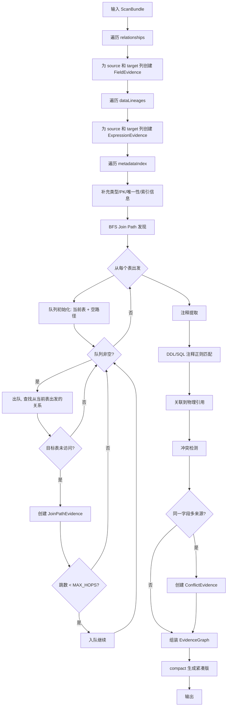
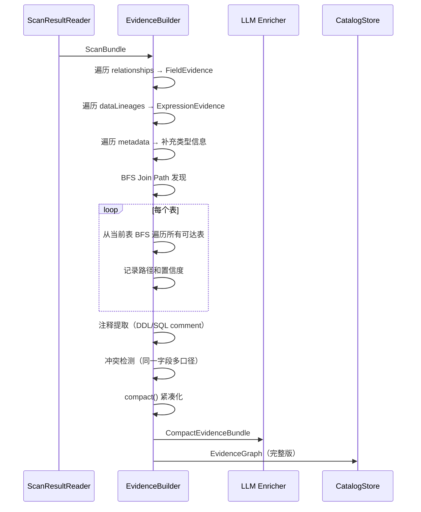

# Semantic Evidence Builder 详细设计

## 1. 目标与定位

**职责：** 将 ScanBundle 中的关系、血缘、元数据组织成 evidence graph。为每个字段收集所有已知证据，通过 BFS 发现多跳 join path，提取注释证据，检测冲突。

**LLM 依赖：** 否。纯图构建和规则提取。BFS join path 发现、注释提取、冲突检测都是确定性算法。

**为什么不需要 LLM：**
- Join path 发现是图遍历（BFS），确定性算法，LLM 无法可靠遍历图
- 注释提取是正则匹配和文本切分，规则可覆盖
- 冲突检测是集合比较，纯规则
- LLM 可能把不同表但同名的字段误判为冲突，或漏掉真正的冲突

## 2. 上游与下游

```
上游: Scan Result Reader
  ↓ 输入: ScanBundle {
      relationships: [NormalizedRelationship],
      dataLineages: [NormalizedLineage],
      metadataIndex: MetadataIndex
    }
  
[Semantic Evidence Builder]
  ↓ 输出: EvidenceGraph (完整) + CompactEvidenceBundle (给 LLM)

下游: LLM Semantic Enricher
  消费: CompactEvidenceBundle (紧凑版，适配 LLM token 预算)
  
下游: Semantic Catalog Store
  消费: EvidenceGraph (完整版，持久化)
```

## 3. 接口契约

### 3.1 主接口

```java
public interface SemanticEvidenceBuilder {
    /**
     * 构建完整 evidence graph。
     *
     * 前置条件：
     * - ScanBundle.relationships 非空（至少有空列表）
     * - ScanBundle.metadataIndex 非空
     *
     * 后置条件：
     * - 每个出现在 relationship 中的字段都有 FieldEvidence
     * - 每个出现在 metadata 中的字段都有 FieldEvidence
     * - 所有可达的表对都有 JoinPathEvidence（最多 5 跳）
     * - 冲突字段已检测并记录
     */
    EvidenceGraph build(ScanBundle scanBundle);

    /**
     * 生成 LLM 可消费的紧凑版 evidence。
     *
     * 紧凑规则：
     * - 每个字段最多保留 maxFieldEvidences 条 evidence（默认 10）
     * - 每个表达式最多保留 maxExpressionEvidences 条 evidence（默认 5）
     * - join path 只保留 top 3 条（按 confidence）
     * - 总 token 预算 < 8000（按 1 token ≈ 3 字符估算）
     *
     * 前置条件：
     * - EvidenceGraph 已构建
     */
    CompactEvidenceBundle compact(EvidenceGraph graph, int maxFieldEvidences, int maxExpressionEvidences);

    /**
     * 通过 evidence fingerprint 反查完整 evidence。
     * fingerprint 格式: {evidenceType}:{sourceName}:{lineStart}:{lineEnd}
     */
    Optional<EvidenceRef> resolveEvidenceRef(String fingerprint);
}
```

### 3.2 精确输入 Schema（来自 ScanBundle）

```json
{
  "relationships": [
    {
      "id": "FK_LIKE:orders.customer_id->customers.id",
      "source": {"table": "orders", "column": "customer_id"},
      "target": {"table": "customers", "column": "id"},
      "relationType": "FK_LIKE",
      "confidence": 0.70,
      "evidence": [{"type": "SQL_LOG_JOIN", "score": 0.55, "source": "mysql-slow.log", "detail": "line 10: o.customer_id = u.id"}]
    }
  ],
  "metadataIndex": {
    "tables": {
      "orders": {
        "columns": {
          "id": {"columnName": "id", "dataType": "bigint", "nullable": false, "isPrimaryKey": true},
          "customer_id": {"columnName": "customer_id", "dataType": "bigint", "nullable": false}
        }
      }
    }
  }
}
```

### 3.3 精确输出 Schema（EvidenceGraph）

```json
{
  "fieldEvidences": {
    "orders.customer_id": {
      "physicalRef": "orders.customer_id",
      "tableName": "orders",
      "columnName": "customer_id",
      "dataType": "bigint",
      "nullable": false,
      "isPrimaryKey": false,
      "isUnique": false,
      "evidenceRefs": [
        {
          "evidenceType": "RELATIONSHIP",
          "evidenceFingerprint": "FK_LIKE:orders.customer_id->customers.id:SQL_LOG_JOIN:mysql-slow.log",
          "sourceName": "mysql-slow.log",
          "lineStart": 10,
          "lineEnd": 10,
          "confidence": 0.70
        },
        {
          "evidenceType": "METADATA_TYPE",
          "evidenceFingerprint": "METADATA:orders.customer_id:bigint",
          "sourceName": "information_schema",
          "confidence": 0.99
        },
        {
          "evidenceType": "DDL_COLUMN",
          "evidenceFingerprint": "DDL:orders.customer_id:schema.sql",
          "sourceName": "schema.sql",
          "lineStart": 5,
          "lineEnd": 5,
          "confidence": 0.90
        }
      ],
      "attributes": {
        "relationshipCount": 1,
        "isForeignKeySource": true,
        "relatedTables": ["customers"]
      }
    }
  },
  "expressionEvidences": {
    "expr:paid_amount_30d": {
      "expressionId": "expr:paid_amount_30d",
      "expression": "SUM(payments.amount)",
      "sourceColumns": ["payments.amount"],
      "sourceTables": ["payments"],
      "flowKind": "VALUE",
      "transformType": "AGGREGATE",
      "filterClause": null,
      "evidenceRefs": [
        {
          "evidenceType": "LINEAGE",
          "evidenceFingerprint": "VALUE:AGGREGATE:payments.amount->paid_amount_30d",
          "sourceName": "app-sql.sql",
          "lineStart": 42,
          "lineEnd": 42,
          "confidence": 0.80
        }
      ]
    }
  },
  "joinPathEvidences": [
    {
      "pathId": "path:customers->orders->payments",
      "fromTable": "customers",
      "toTable": "payments",
      "steps": [
        {
          "source": "orders.customer_id",
          "target": "customers.id",
          "relationType": "FK_LIKE",
          "relationSubType": "INFERRED_JOIN_FK",
          "confidence": 0.70,
          "evidenceRef": {"evidenceType": "SQL_LOG_JOIN", "evidenceFingerprint": "...", "confidence": 0.70}
        },
        {
          "source": "payments.order_id",
          "target": "orders.id",
          "relationType": "FK_LIKE",
          "relationSubType": "DECLARED_FK",
          "confidence": 0.98,
          "evidenceRef": {"evidenceType": "METADATA_FOREIGN_KEY", "evidenceFingerprint": "...", "confidence": 0.98}
        }
      ],
      "pathConfidence": 0.686,
      "hopCount": 2,
      "evidenceRefs": [...]
    }
  ],
  "commentEvidences": [
    {
      "commentId": "comment-001",
      "commentText": "paid amount by customer in recent 30 days",
      "sourceType": "SQL_LINE_COMMENT",
      "sourceLocation": "app-sql.sql",
      "lineStart": 41,
      "lineEnd": 41,
      "associatedPhysicalRefs": ["payments.amount", "customers.id"],
      "candidateDerivations": [
        {
          "candidateType": "METRIC",
          "description": "客户30天支付金额",
          "physicalRefs": ["payments.amount"],
          "confidence": 0.60
        }
      ],
      "evidenceRefs": [...]
    }
  ],
  "candidateConflicts": [
    {
      "physicalRef": "payments.amount",
      "candidateDefinitions": [
        {
          "context": "DDL 定义",
          "description": "单笔支付金额",
          "source": "DDL:payments.amount:schema.sql",
          "confidence": 0.95
        },
        {
          "context": "存储过程 sp_process_refund",
          "description": "可退款金额",
          "source": "PROCEDURE:sp_process_refund:routines.sql",
          "filterLogic": "WHERE refund_status != 'REFUNDED'",
          "confidence": 0.85
        }
      ],
      "triggerReason": "不同 source 有不同过滤逻辑",
      "status": "CANDIDATE"
    }
  ],
  "metadata": {
    "totalFieldEvidences": 87,
    "totalExpressionEvidences": 8,
    "totalJoinPathEvidences": 52,
    "totalCommentEvidences": 12,
    "totalCandidateConflicts": 2,
    "buildTookMs": 450
  }
}
```

### 3.4 紧凑版输出 Schema（CompactEvidenceBundle）

```json
{
  "fields": [
    {
      "physicalRef": "orders.customer_id",
      "dataType": "bigint",
      "businessRole": "foreign_key",
      "computedConfidence": 0.95,
      "isPrimaryKey": false,
      "isForeignKeySource": true,
      "relatedTable": "customers",
      "relatedColumn": "id",
      "topEvidences": [
        {
          "fingerprint": "METADATA_FOREIGN_KEY:orders.customer_id:information_schema:0:0",
          "type": "METADATA_FOREIGN_KEY",
          "confidence": 0.98,
          "detail": "FK orders.customer_id -> customers.id"
        },
        {
          "fingerprint": "SQL_LOG_JOIN:orders.customer_id:mysql-slow.log:10:10",
          "type": "SQL_LOG_JOIN",
          "confidence": 0.55,
          "detail": "JOIN customers ON o.customer_id = c.id"
        }
      ]
    }
  ],
  "expressions": [...],
  "joinPaths": [...],
  "comments": [...],
  "conflicts": [
    {
      "physicalRef": "payments.amount",
      "definitions": [
        {"context": "订单支付", "description": "单笔支付金额", "source": "DDL:payments.amount"},
        {"context": "退款计算", "description": "可退款金额", "source": "PROCEDURE:sp_process_refund"}
      ]
    }
  ],
  "tableConfidences": {
    "customers": 0.87,
    "orders": 0.89
  },
  "totalEvidenceCount": 159,
  "truncated": false
}
```

## 4. 处理流程图



## 5. 交互时序图



## 6. 核心算法

### 4.1 BFS Join Path 发现

```java
List<JoinPathEvidence> discoverJoinPaths(MetadataIndex metadata, RelationshipIndex relIndex) {
    List<JoinPathEvidence> paths = new ArrayList<>();
    Set<String> allTables = metadata.tables().keySet();
    int MAX_HOPS = 5;

    for (String startTable : allTables) {
        // BFS
        Queue<PathState> queue = new LinkedList<>();
        Set<String> visited = new HashSet<>();
        queue.add(new PathState(startTable, List.of(), BigDecimal.ONE));
        visited.add(startTable);

        while (!queue.isEmpty()) {
            PathState state = queue.poll();
            if (state.steps.size() >= MAX_HOPS) continue;

            // 查找从当前表出发的所有关系
            List<NormalizedRelationship> outRels =
                relIndex.bySourceTable().getOrDefault(state.currentTable, List.of());

            for (NormalizedRelationship rel : outRels) {
                String nextTable = rel.target().table();
                if (visited.contains(nextTable)) continue; // 防止循环

                List<JoinPathStep> newSteps = new ArrayList<>(state.steps);
                newSteps.add(new JoinPathStep(
                    rel.source().table() + "." + rel.source().column(),
                    rel.target().table() + "." + rel.target().column(),
                    rel.relationType(), rel.relationSubType(), rel.confidence(),
                    rel.evidence().get(0) // 主导证据
                ));

                BigDecimal newConfidence = state.pathConfidence.multiply(rel.confidence());

                paths.add(new JoinPathEvidence(
                    "path:" + startTable + "->" + nextTable,
                    startTable, nextTable, newSteps, newConfidence,
                    newSteps.size(), extractEvidenceRefs(rel)
                ));

                visited.add(nextTable);
                queue.add(new PathState(nextTable, newSteps, newConfidence));
            }
        }
    }
    return paths;
}
```

### 4.2 冲突检测算法

```java
List<ConflictEvidence> detectConflicts(Map<String, FieldEvidence> fieldEvidences) {
    List<ConflictEvidence> conflicts = new ArrayList<>();

    for (FieldEvidence field : fieldEvidences.values()) {
        // 收集不同 source 对该字段的定义
        Map<String, List<EvidenceRef>> bySource = new HashMap<>();
        for (EvidenceRef ref : field.evidenceRefs()) {
            if (ref.evidenceType().equals("DDL_COMMENT")
                || ref.evidenceType().equals("SQL_COMMENT")
                || ref.evidenceType().equals("PROCEDURE")) {
                bySource.computeIfAbsent(ref.sourceName(), k -> new ArrayList<>()).add(ref);
            }
        }

        // 如果多个 source 有不同定义 → 冲突
        if (bySource.size() >= 2) {
            List<ConflictingDefinition> definitions = new ArrayList<>();
            for (var entry : bySource.entrySet()) {
                definitions.add(new ConflictingDefinition(
                    entry.getKey(), // context
                    extractDescription(entry.getValue()), // description
                    entry.getKey(), // source
                    averageConfidence(entry.getValue()), // confidence
                    extractFilter(entry.getValue()), // filterLogic
                    null // transformLogic
                ));
            }
            conflicts.add(new ConflictEvidence(
                field.physicalRef(), definitions,
                ReviewStatus.NEEDS_MORE_EVIDENCE,
                field.physicalRef() + " 在多个业务场景下有不同口径，需要人工确认"
            ));
        }
    }
    return conflicts;
}
```

### 4.3 注释提取规则

```java
// DDL 注释提取
Pattern DDL_INLINE_COMMENT = Pattern.compile(
    "--\\s*(.+?)\\s*$", Pattern.MULTILINE);
Pattern DDL_COLUMN_COMMENT = Pattern.compile(
    "COMMENT\\s+'([^']*)'", Pattern.CASE_INSENSITIVE);

// SQL 注释提取
Pattern SQL_LINE_COMMENT = Pattern.compile(
    "^\\s*--\\s*(.+?)\\s*$", Pattern.MULTILINE);
Pattern SQL_BLOCK_COMMENT = Pattern.compile(
    "/\\*\\s*(.+?)\\s*\\*/", Pattern.DOTALL);

// 注释与物理引用的关联规则
// 1. 注释在同一行或上一行 → 关联到该行的表/列
// 2. 注释在 SQL 语句开头 → 关联到该 SQL 的所有物理引用
// 3. 注释中包含已知表名/列名 → 关联到对应物理引用
```

### 4.4 businessRole 确定性推断（P0：从 LLM 移出）

**决策：** `businessRole` 不交给 LLM 推断。它是确定性规则，所有判断依据已在 evidence 中。

```java
String inferBusinessRole(FieldEvidence field) {
    // 优先级从高到低

    // 1. 主键 → primary_key
    if (field.isPrimaryKey()) {
        return "primary_key";
    }

    // 2. 外键来源 → foreign_key
    if (field.attributes().getOrDefault("isForeignKeySource", false).equals(true)) {
        return "foreign_key";
    }

    // 3. 出现在聚合表达式（lineage）中 → measure
    if (field.attributes().getOrDefault("inAggregateExpression", false).equals(true)) {
        return "measure";
    }

    // 4. 出现在 JOIN 条件中（非 FK 角色）→ 可能是 dimension
    // 但这里不改变已有判断

    // 5. 时间类型 → timestamp
    String dataType = field.dataType().toLowerCase();
    if (dataType.contains("timestamp") || dataType.contains("datetime")
        || dataType.contains("date") || dataType.contains("time")) {
        return "timestamp";
    }

    // 6. 数值类型且不出现在关系中 → 可能是 measure
    if (isNumericType(dataType) && !isForeignKeySource(field)) {
        return "measure";
    }

    // 7. 默认 → dimension
    return "dimension";
}
```

**推断结果写入 FieldEvidence.attributes：**

```json
{
  "physicalRef": "orders.customer_id",
  "attributes": {
    "businessRole": "foreign_key",
    "isForeignKeySource": true,
    "relatedTable": "customers"
  }
}
```

### 4.5 置信度确定性计算（P0：从 LLM 移出）

**决策：** `confidence` 不交给 LLM 生成。它由 Evidence Builder 根据 evidence 数量和质量确定性计算。

```java
// === SemanticTable.confidence ===
BigDecimal calculateTableConfidence(String tableName, Map<String, FieldEvidence> fields) {
    // 该表所有列的 evidence 最高 confidence 的平均值
    BigDecimal avgFieldConfidence = fields.values().stream()
        .filter(f -> f.tableName().equals(tableName))
        .map(f -> f.evidenceRefs().stream()
            .map(EvidenceRef::confidence)
            .max(BigDecimal::compareTo)
            .orElse(BigDecimal.ZERO))
        .reduce(BigDecimal.ZERO, BigDecimal::add)
        .divide(BigDecimal.valueOf(fields.size()), 4, RoundingMode.HALF_UP);

    // 有注释加分
    boolean hasComment = commentEvidences.stream()
        .anyMatch(c -> c.associatedPhysicalRefs().stream().anyMatch(ref -> ref.startsWith(tableName)));

    // 有关联关系加分
    boolean hasRelationships = joinPathEvidences.stream()
        .anyMatch(p -> p.fromTable().equals(tableName) || p.toTable().equals(tableName));

    BigDecimal score = avgFieldConfidence.multiply(new BigDecimal("0.7"));
    if (hasComment) score = score.add(new BigDecimal("0.15"));
    if (hasRelationships) score = score.add(new BigDecimal("0.15"));

    return score.min(new BigDecimal("0.99")).max(new BigDecimal("0.30"));
}

// === SemanticColumn.confidence ===
BigDecimal calculateColumnConfidence(FieldEvidence field) {
    // 该列所有 evidence 的最高 confidence
    return field.evidenceRefs().stream()
        .map(EvidenceRef::confidence)
        .max(BigDecimal::compareTo)
        .orElse(new BigDecimal("0.50"));
}

// === SemanticEntity.confidence ===
BigDecimal calculateEntityConfidence(String primaryTable, List<JoinPathEvidence> joinPaths) {
    // 从该表出发的所有 join path 步骤的平均 confidence
    List<BigDecimal> stepConfidences = joinPaths.stream()
        .filter(p -> p.fromTable().equals(primaryTable))
        .flatMap(p -> p.steps().stream())
        .map(JoinPathStep::confidence)
        .toList();

    if (stepConfidences.isEmpty()) return new BigDecimal("0.50");

    BigDecimal avgConfidence = stepConfidences.stream()
        .reduce(BigDecimal.ZERO, BigDecimal::add)
        .divide(BigDecimal.valueOf(stepConfidences.size()), 4, RoundingMode.HALF_UP);

    return avgConfidence.multiply(new BigDecimal("0.9"))
        .min(new BigDecimal("0.99")).max(new BigDecimal("0.30"));
}

// === SemanticMetric.confidence ===
BigDecimal calculateMetricConfidence(ExpressionEvidence expr, List<JoinPathEvidence> requiredPaths) {
    BigDecimal lineageScore = expr.evidenceRefs().stream()
        .filter(e -> e.evidenceType().equals("LINEAGE"))
        .map(EvidenceRef::confidence)
        .max(BigDecimal::compareTo)
        .orElse(new BigDecimal("0.50"));

    BigDecimal commentScore = commentEvidences.stream()
        .filter(c -> c.associatedPhysicalRefs().stream()
            .anyMatch(ref -> expr.sourceColumns().contains(ref)))
        .findFirst()
        .map(c -> new BigDecimal("0.20"))
        .orElse(BigDecimal.ZERO);

    BigDecimal pathScore = requiredPaths.stream()
        .map(JoinPathEvidence::pathConfidence)
        .reduce(BigDecimal.ONE, BigDecimal::multiply);

    return lineageScore.multiply(new BigDecimal("0.6"))
        .add(commentScore)
        .add(pathScore.multiply(new BigDecimal("0.2")))
        .min(new BigDecimal("0.99")).max(new BigDecimal("0.20"));
}
```

**计算结果写入 EvidenceGraph.metadata：**

```json
{
  "metadata": {
    "computedConfidences": {
      "table:customers": 0.87,
      "table:orders": 0.89,
      "column:orders.customer_id": 0.95,
      "entity:Customer": 0.88,
      "metric:customer_total_paid_amount": 0.80
    }
  }
}
```

### 4.6 冲突检测改为两阶段：规则初筛 + LLM 确认（方案 C）

**决策：** 冲突检测分为两个阶段。阶段一在 Evidence Builder 中做规则初筛（保证不遗漏），阶段二在 LLM Enricher 中做语义确认（减少误报）。

**为什么不能用纯规则：** 规则可能把正常的多角度描述误判为冲突。例如 `payments.amount` 在 DDL 中描述为"支付金额"，在 SQL 注释中描述为"客户消费金额"——这两个描述说的是同一件事，规则可能误判为"两个不同口径"。

**为什么不能用纯 LLM：** LLM 可能漏掉真正的冲突。例如 `payments.amount` 在 procedure 中用作"退款基数（扣除手续费）"，LLM 可能看不出这和"支付金额"是不同口径。

**两阶段方案：**

```
阶段一（Evidence Builder，规则初筛）：
  目标：召回率 100%，不遗漏任何潜在冲突
  方法：跨 source 集合比较
  输出：CandidateConflict 列表（候选冲突，非最终判定）

阶段二（LLM Enricher，语义确认）：
  目标：精确率提升，减少误报
  方法：LLM 判断候选冲突是否真的代表不同口径
  输出：每个候选冲突标记为 CONFIRMED（真冲突）或 FALSE_ALARM（误报）
```

**阶段一：规则初筛**

```java
List<CandidateConflict> preFilterConflicts(Map<String, FieldEvidence> fieldEvidences) {
    List<CandidateConflict> candidates = new ArrayList<>();

    for (FieldEvidence field : fieldEvidences.values()) {
        // 收集不同 source 对该字段的描述
        Map<String, List<EvidenceRef>> bySource = new HashMap<>();
        for (EvidenceRef ref : field.evidenceRefs()) {
            String sourceKey = ref.sourceName() + ":" + ref.evidenceType();
            bySource.computeIfAbsent(sourceKey, k -> new ArrayList<>()).add(ref);
        }

        // 规则：有 2+ 个不同 source 且满足以下条件之一 → 候选冲突
        if (bySource.size() >= 2) {
            boolean hasDifferentFilter = hasDifferentFilterLogic(bySource);
            boolean hasDifferentTransform = hasDifferentTransformLogic(bySource);
            boolean hasDifferentContext = bySource.keySet().stream()
                .map(k -> k.split(":")[1]) // evidenceType
                .distinct().count() >= 2;

            if (hasDifferentFilter || hasDifferentTransform || hasDifferentContext) {
                candidates.add(new CandidateConflict(
                    field.physicalRef(),
                    buildDefinitions(bySource),
                    hasDifferentFilter ? "不同 source 有不同过滤逻辑" : null,
                    hasDifferentTransform ? "不同 source 有不同转换逻辑" : null
                ));
            }
        }
    }
    return candidates;
}
```

**CandidateConflict 输出格式：**

```json
{
  "physicalRef": "payments.amount",
  "candidateDefinitions": [
    {
      "context": "DDL 定义",
      "description": "单笔支付金额",
      "source": "DDL:payments.amount:schema.sql",
      "filterLogic": null,
      "transformLogic": null
    },
    {
      "context": "存储过程 sp_process_refund",
      "description": "可退款金额",
      "source": "PROCEDURE:sp_process_refund:routines.sql",
      "filterLogic": "WHERE refund_status != 'REFUNDED'",
      "transformLogic": null
    }
  ],
  "triggerReason": "不同 source 有不同过滤逻辑",
  "status": "CANDIDATE"
}
```

**CompactEvidenceBundle 中传递候选冲突：**

```json
{
  "fields": [...],
  "expressions": [...],
  "joinPaths": [...],
  "comments": [...],
  "candidateConflicts": [
    {
      "physicalRef": "payments.amount",
      "candidateDefinitions": [...],
      "triggerReason": "不同 source 有不同过滤逻辑"
    }
  ],
  "totalEvidenceCount": 159,
  "truncated": false
}
```

**阶段二在 LLM Enricher 中完成（见 LLM Enricher 更新）。**

### 4.7 evidenceFingerprint 统一生成（P1）

**决策：** 所有 `evidenceFingerprint` 由 Evidence Builder 统一生成，LLM 只引用，不自己编造。

```java
String generateFingerprint(EvidenceRef ref) {
    // 格式: {evidenceType}:{physicalRef}:{sourceName}:{lineStart}:{lineEnd}
    return String.format("%s:%s:%s:%d:%d",
        ref.evidenceType(),
        ref.attributes().getOrDefault("physicalRef", "*"),
        ref.sourceName() != null ? ref.sourceName() : "unknown",
        ref.lineStart() != null ? ref.lineStart() : 0,
        ref.lineEnd() != null ? ref.lineEnd() : 0
    );
}
```

**CompactEvidenceBundle 中直接携带完整 fingerprint：**

```json
{
  "topEvidences": [
    {
      "fingerprint": "METADATA_FOREIGN_KEY:orders.customer_id:information_schema:0:0",
      "type": "METADATA_FOREIGN_KEY",
      "confidence": 0.98,
      "detail": "FK orders.customer_id -> customers.id"
    }
  ]
}
```

## 5. 测试验收

### 5.1 单元测试

| 测试场景 | 输入 | 预期输出 |
| --- | --- | --- |
| 单表单关系 | 1 条 FK_LIKE 关系 | 2 个 FieldEvidence（source + target） |
| BFS 简单路径 | A→B→C 两条关系 | 3 条 join path（A→B, B→C, A→C） |
| BFS 循环检测 | A→B, B→A | 不产生无限循环，A→B 和 B→A 各一条 |
| BFS 最大跳数 | 6 跳的长链 | 只生成 ≤5 跳的路径 |
| 注释提取 | DDL 含 `-- 客户ID` | CommentEvidence 关联到对应列 |
| 冲突检测 | 同一字段在 DDL 和 procedure 中有不同描述 | 生成 ConflictEvidence |
| 无冲突 | 同一字段只有一种来源 | 不生成 ConflictEvidence |
| 紧凑版截断 | 字段有 20 条 evidence | 紧凑版只保留 10 条，truncated=true |
| 空输入 | 空 relationships | 返回空 EvidenceGraph |

### 5.2 集成测试

```java
@Test
void endToEndFromScanBundleToEvidenceGraph() {
    ScanBundle bundle = createSampleBundle(); // 15 tables, 24 relationships, 8 lineages
    EvidenceGraph graph = builder.build(bundle);

    // 每个字段都有 FieldEvidence
    assertEquals(87, graph.fieldEvidences().size());

    // 每个 lineage 都有 ExpressionEvidence
    assertEquals(8, graph.expressionEvidences().size());

    // join path 覆盖所有可达表对
    assertTrue(graph.joinPathEvidences().size() >= 24);

    // 无循环路径
    for (JoinPathEvidence path : graph.joinPathEvidences()) {
        Set<String> tables = new HashSet<>();
        for (JoinPathStep step : path.steps()) {
            assertTrue(tables.add(extractTable(step.source())));
            assertTrue(tables.add(extractTable(step.target())));
        }
    }
}

@Test
void compactBundleForLLM() {
    EvidenceGraph graph = builder.build(scanBundle);
    CompactEvidenceBundle compact = builder.compact(graph, 10, 5);

    // Token 预算检查（1 token ≈ 3 chars）
    String json = objectMapper.writeValueAsString(compact);
    int estimatedTokens = json.length() / 3;
    assertTrue(estimatedTokens < 8000,
        "Compact bundle should fit in LLM token budget, got ~" + estimatedTokens);

    // 截断标记
    if (graph.totalEvidenceCount() > 10 * graph.fieldEvidences().size()) {
        assertTrue(compact.truncated());
    }
}
```

### 5.3 性能测试

| 场景 | 数据量 | 预算 |
| --- | --- | --- |
| BFS 全图遍历 | 50 个表, 100 条关系 | < 500ms |
| 冲突检测 | 200 个字段 | < 100ms |
| 紧凑版生成 | 完整 EvidenceGraph | < 50ms |