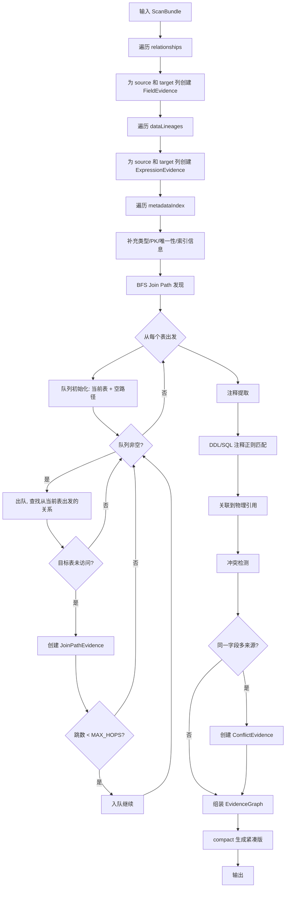
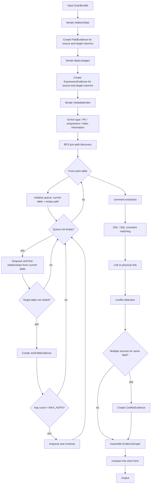
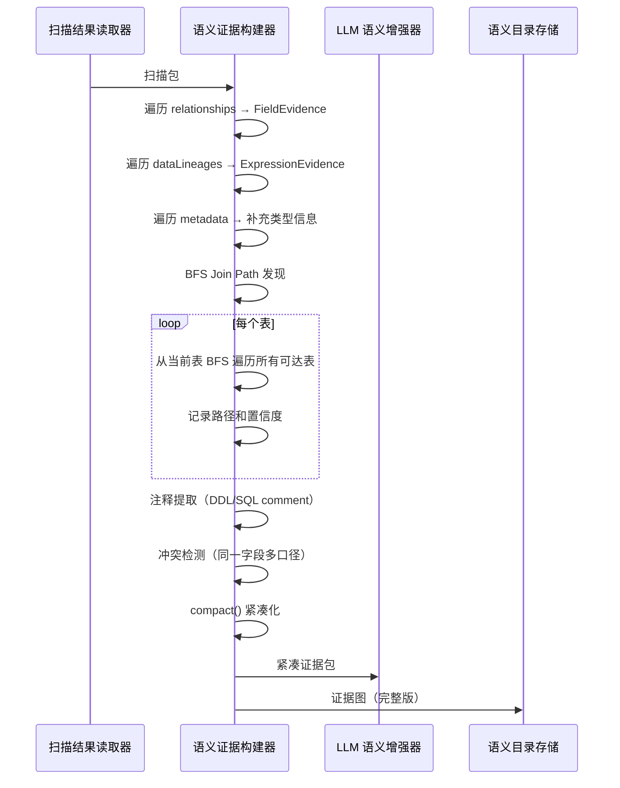

# Semantic Evidence Builder 详细设计

## 1. 目标与定位

**职责：** 将 ScanBundle 中的关系、血缘、命名证据、衍生事实和 diagnostics 组织成 evidence graph。

当前代码实现位于 `semantic-layer/semantic-core/src/main/java/com/relationdetector/semantic/graph/SemanticEvidenceBuilder.java`。它已经实现的是离线 KG 阶段的确定性 evidence materialization：

- 从 `relationships` 构建 `RelationshipFact`。
- 从 `dataLineages` 构建 `LineageFact`。
- 从 top-level `namingEvidence` 构建 `NamingEvidenceFact`，其中包含 direct 和 derived naming evidence。
- 从 `derivedRelationships` / `derivedDataLineages` 构建 `DerivedRelationshipFact` / `DerivedLineageFact`。
- 从 `warnings` 构建 `Diagnostic` fact。
- 从 deterministic `SemanticEventExtractor` 输出构建 `SemanticEventCandidate` fact；KG writer 将它渲染为 `Event` 节点。eventCandidates 只来自 direct non-control write lineage，derived lineage 只能作为 supporting evidence。event source/operation 只读取 typed provenance 与 `mappingKind`；缺失时使用 `SQL_WRITE/WRITE`，event kind 固定为 `SQL_WRITE_OPERATION`，不读取 detail、路径、source 前缀或表列名推断结构。一个 merged lineage 的 raw observations 按完整 typed source identity 分组：不同 source 拆成独立 event，同一 source 的多个 mapping kind 聚合到同一 event；排序和稳定 ID 不依赖 observation 输入顺序。
- 从每条记录的 `rawEvidence` 优先抽取 `EvidenceReference`；没有 `rawEvidence` 时回退 grouped `evidence`。
- 保存原始 relation-detector JSON payload snapshot，供后续审计和 KG materialization 使用。

尚未实现的目标包括：metadata/comment evidence 索引、bounded graph search 候选 path 发现、冲突初筛和 semantic dedup。这些是后续 catalog/search/enricher 阶段能力，不能当成当前代码能力。`semantic extract` 的 evidence bundle / prompt compact 已由 `SemanticExtractionBundleBuilder` 和 `SemanticExtractionPromptBuilder` 实现，但它们属于 extraction 输入构造层，不是 `SemanticEvidenceBuilder` 本身的 API。

**LLM 依赖：** 否。纯图构建和规则提取。bounded graph search、注释提取、冲突初筛和去重都是确定性算法。

**为什么不需要 LLM：**
- Join path 发现是图遍历和 evidence rerank，确定性算法，LLM 无法可靠遍历图。
- 注释提取、source location 归并、evidence fingerprint 生成和 dedup 都是结构化规则。
- 冲突检测第一阶段是规则初筛，例如同字段多种候选含义、同义词多目标、指标来源不一致。
- LLM 可能把不同表但同名的字段误判为冲突，或漏掉真正的冲突；它只能在后续 Enricher 中生成解释和审核建议。

## 1.1 Semantica 启发：Extract / Conflict / Dedup / Provenance 分层

Semantica 官方 ARCHITECTURE 在 semantic extract 之后显式设置 conflict detection、deduplication、KG construction 和 provenance。本模块吸收这条分层，但只落到 Phase 1 的 evidence graph：

| Semantica 思路 | 本模块落地 | 边界 |
| --- | --- | --- |
| semantic extract 输出结构化知识候选 | 当前消费 relation-detector 已抽取的 relationship、lineage、namingEvidence、derived facts。 | 不重新解析 SQL，不发明新的物理事实。 |
| conflict detection | 后续规则初筛字段含义、指标来源、同义词映射和 join path 冲突。 | 当前代码未实现 conflict detection。 |
| deduplication | 后续对同 key field/path evidence 做更丰富的 semantic dedup。 | 当前 evidence builder 按 `EvidenceReference.id` materialize；KG identity registry 只允许 ID 与完整内容都相同的幂等重复，冲突 node/edge 明确失败。 |
| provenance | 为每个 evidence graph node / edge 保留原始 evidenceRef、source location、payload snapshot。 | compact bundle 可以裁剪文本，但不能丢失可回溯引用。 |

## 2. 上游与下游

```
上游: Scan Result Reader
  ↓ 输入: ScanBundle {
      relationships: [NormalizedRelationship],
      dataLineages: [NormalizedLineage],
      namingEvidence: [NormalizedNamingEvidence],
      derivedRelationships: [NormalizedDerivedRelationship],
      derivedDataLineages: [NormalizedDerivedLineage],
      diagnostics: [NormalizedDiagnostic]
    }

[Semantic Evidence Builder]
  ↓ 当前输出: EvidenceGraph

下游: NoopSemanticEnricher
  当前实现: 直接返回 EvidenceGraph，不创造事实

下游: SemanticKgBuilder
  消费: EvidenceGraph，输出 JSON-friendly SemanticKnowledgeGraph；要求非 diagnostic fact/event、endpoint node 与 edge evidence 非空可解析，并原子拒绝冲突 ID

旁路下游: SemanticExtractionBundleBuilder
  消费: ScanBundle 与 SemanticEventExtractor 输出，构造 semantic extract 的 evidence bundle / prompt
```

## 3. 接口契约

### 3.1 当前 Java 入口

```java
public final class SemanticEvidenceBuilder {
    EvidenceGraph build(ScanBundle scanBundle);
}
```

当前没有 `compact(...)` 和 `resolveEvidenceRef(...)` Java API；完整 evidence 通过 `semantic-evidence-graph.json` / `semantic-kg.json` 中的 `evidenceRefs` 按 id 查询。用于 LLM 的 compact 输入由 `SemanticExtractionBundleBuilder` 单独构造。`SemanticEvidenceBuilder` 只负责 materialization；KG 路径由 `SemanticKgBuilder/ReferenceIndex` 执行 evidence/identity closure，正式抽取路径由 `SemanticReferenceIndex` 执行 normalized document closure。

### 3.2 精确输入 Schema（来自 ScanBundle）

```pseudo-json
{
  "relationships": [
    {
      "id": "FK_LIKE:orders.customer_id->customers.id",
      "source": {"table": "orders", "column": "customer_id"},
      "target": {"table": "customers", "column": "id"},
      "relationType": "FK_LIKE",
      "confidence": 0.70,
      "evidence": [{"type": "SQL_LOG_JOIN", "score": 0.55, "source": "mysql-slow.log", "detail": "line 10: o.customer_id = u.id"}]
    }
  ],
  "derivedRelationships": [...],
  "derivedDataLineages": [...],
  "namingEvidence": [...],
  "diagnostics": [...]
}
```

metadata/comment evidence 未来可进入 ScanBundle 或 Catalog Store，但当前 `ScanBundle` 不携带 `metadataIndex`。

### 3.3 当前输出模型（EvidenceGraph）

当前 `EvidenceGraph` 是较薄的事实图：

```pseudo-json
{
  "scanBundle": {"databaseType": "mysql", "catalog": "sample_data", "schema": "", "...": "..."},
  "endpoints": [
    {"table": "orders", "column": null},
    {"table": "orders", "column": "customer_id"},
    {"table": "customers", "column": "id"}
  ],
  "facts": [
    {
      "id": "relationship:<sha256>",
      "type": "RelationshipFact",
      "label": "orders.customer_id -> customers.id",
      "endpoints": [
        {"table": "orders", "column": "customer_id"},
        {"table": "customers", "column": "id"}
      ],
      "evidenceRefs": ["evidence:<sha256>"],
      "confidence": 0.70,
      "payload": "{原始 relationship JSON}",
      "attributes": {"relationType": "FK_LIKE", "relationSubType": "INFERRED_JOIN_FK"}
    }
  ],
  "evidenceRefs": [
    {
      "id": "evidence:<sha256>",
      "evidenceType": "SQL_LOG_JOIN",
      "sourceType": "SQL_LOG",
      "score": 0.55,
      "source": "app-sql.sql",
      "detail": "line 10: o.customer_id = c.id",
      "attributes": {}
    }
  ],
  "diagnostics": [],
  "summary": {}
}
```

下面的 FieldEvidence、ExpressionEvidence、JoinPathEvidence、CommentEvidence 和 CandidateConflict schema 是后续 enriched catalog/search 目标设计，不是当前 Java API。当前 semantic extraction 的 prompt/bundle schema 见 [LLM Semantic Enricher](03-llm-semantic-enricher.md)。

当前 `SemanticFactIds` 根据 canonical fact identity 生成 SHA-256 内容 ID；lineage source 集合先排序，
因此输入数组和 source 顺序变化不会改变 fact id。`EvidenceReference.id` 由 owner fact id 与 canonical
evidence JSON 生成，同样不使用数组位置。scanRunId/sourceHash 等跨运行治理身份仍是后续 Catalog Store
职责，不应重新混入当前内容 ID。

### 3.4 目标设计 Schema（未来 Catalog/Search 阶段）

```pseudo-json
{
  "fieldEvidences": {
    "orders.customer_id": {
      "physicalRef": "orders.customer_id",
      "tableName": "orders",
      "columnName": "customer_id",
      "dataType": "bigint",
      "nullable": false,
      "isPrimaryKey": false,
      "isUnique": false,
      "evidenceRefs": [
        {
          "evidenceType": "RELATIONSHIP",
          "evidenceFingerprint": "FK_LIKE:orders.customer_id->customers.id:SQL_LOG_JOIN:mysql-slow.log",
          "sourceName": "mysql-slow.log",
          "lineStart": 10,
          "lineEnd": 10,
          "confidence": 0.70
        },
        {
          "evidenceType": "METADATA_TYPE",
          "evidenceFingerprint": "METADATA:orders.customer_id:bigint",
          "sourceName": "information_schema",
          "confidence": 0.99
        },
        {
          "evidenceType": "DDL_COLUMN",
          "evidenceFingerprint": "DDL:orders.customer_id:schema.sql",
          "sourceName": "schema.sql",
          "lineStart": 5,
          "lineEnd": 5,
          "confidence": 0.90
        }
      ],
      "attributes": {
        "relationshipCount": 1,
        "isForeignKeySource": true,
        "relatedTables": ["customers"]
      }
    }
  },
  "expressionEvidences": {
    "expr:paid_amount_30d": {
      "expressionId": "expr:paid_amount_30d",
      "expression": "SUM(payments.amount)",
      "sourceColumns": ["payments.amount"],
      "sourceTables": ["payments"],
      "flowKind": "VALUE",
      "transformType": "AGGREGATE",
      "filterClause": null,
      "evidenceRefs": [
        {
          "evidenceType": "LINEAGE",
          "evidenceFingerprint": "VALUE:AGGREGATE:payments.amount->paid_amount_30d",
          "sourceName": "app-sql.sql",
          "lineStart": 42,
          "lineEnd": 42,
          "confidence": 0.80
        }
      ]
    }
  },
  "joinPathEvidences": [
    {
      "pathId": "path:customers->orders->payments",
      "fromTable": "customers",
      "toTable": "payments",
      "steps": [
        {
          "source": "orders.customer_id",
          "target": "customers.id",
          "relationType": "FK_LIKE",
          "relationSubType": "INFERRED_JOIN_FK",
          "confidence": 0.70,
          "evidenceRef": {"evidenceType": "SQL_LOG_JOIN", "evidenceFingerprint": "...", "confidence": 0.70}
        },
        {
          "source": "payments.order_id",
          "target": "orders.id",
          "relationType": "FK_LIKE",
          "relationSubType": "DECLARED_FK",
          "confidence": 0.98,
          "evidenceRef": {"evidenceType": "METADATA_FOREIGN_KEY", "evidenceFingerprint": "...", "confidence": 0.98}
        }
      ],
      "pathConfidence": 0.686,
      "hopCount": 2,
      "evidenceRefs": [...]
    }
  ],
  "commentEvidences": [
    {
      "commentId": "comment-001",
      "commentText": "paid amount by customer in recent 30 days",
      "sourceType": "SQL_LINE_COMMENT",
      "sourceLocation": "app-sql.sql",
      "lineStart": 41,
      "lineEnd": 41,
      "associatedPhysicalRefs": ["payments.amount", "customers.id"],
      "candidateDerivations": [
        {
          "candidateType": "METRIC",
          "description": "客户30天支付金额",
          "physicalRefs": ["payments.amount"],
          "confidence": 0.60
        }
      ],
      "evidenceRefs": [...]
    }
  ],
  "candidateConflicts": [
    {
      "physicalRef": "payments.amount",
      "candidateDefinitions": [
        {
          "context": "DDL 定义",
          "description": "单笔支付金额",
          "source": "DDL:payments.amount:schema.sql",
          "confidence": 0.95
        },
        {
          "context": "存储过程 sp_process_refund",
          "description": "可退款金额",
          "source": "PROCEDURE:sp_process_refund:routines.sql",
          "filterLogic": "WHERE refund_status != 'REFUNDED'",
          "confidence": 0.85
        }
      ],
      "triggerReason": "不同 source 有不同过滤逻辑",
      "reviewStatus": "SYSTEM_PROPOSED"
    }
  ],
  "metadata": {
    "totalFieldEvidences": 87,
    "totalExpressionEvidences": 8,
    "totalJoinPathEvidences": 52,
    "totalCommentEvidences": 12,
    "totalCandidateConflicts": 2,
    "buildTookMs": 450
  }
}
```

### 3.5 紧凑版输出 Schema（目标设计 / 历史 CompactEvidenceBundle）

本节以及后续关于 graph search、comment evidence、candidate conflict、compact bundle 的内容是后续 Catalog Store / governance 阶段的目标设计。当前代码不会在 `SemanticEvidenceBuilder` 内生成 `CompactEvidenceBundle`，也不会在这里执行 graph search 或 conflict detection。

当前已经实现的 LLM 输入压缩发生在独立的 `semantic extract` 链路中：`SemanticExtractionBundleBuilder` 从 `ScanBundle` 构造 `semantic-extraction-evidence-bundle.json`，`SemanticExtractionPromptBuilder` 再生成 prompt。该实现不等同于本节历史设计中的 `CompactEvidenceBundle`。

```pseudo-json
{
  "fields": [
    {
      "physicalRef": "orders.customer_id",
      "dataType": "bigint",
      "businessRole": "foreign_key",
      "computedConfidence": 0.95,
      "isPrimaryKey": false,
      "isForeignKeySource": true,
      "relatedTable": "customers",
      "relatedColumn": "id",
      "topEvidences": [
        {
          "fingerprint": "METADATA_FOREIGN_KEY:orders.customer_id:information_schema:0:0",
          "type": "METADATA_FOREIGN_KEY",
          "confidence": 0.98,
          "detail": "FK orders.customer_id -> customers.id"
        },
        {
          "fingerprint": "SQL_LOG_JOIN:orders.customer_id:mysql-slow.log:10:10",
          "type": "SQL_LOG_JOIN",
          "confidence": 0.55,
          "detail": "JOIN customers ON o.customer_id = c.id"
        }
      ]
    }
  ],
  "expressions": [...],
  "joinPaths": [...],
  "comments": [...],
  "conflicts": [
    {
      "physicalRef": "payments.amount",
      "definitions": [
        {"context": "订单支付", "description": "单笔支付金额", "source": "DDL:payments.amount"},
        {"context": "退款计算", "description": "可退款金额", "source": "PROCEDURE:sp_process_refund"}
      ]
    }
  ],
  "tableConfidences": {
    "customers": 0.87,
    "orders": 0.89
  },
  "totalEvidenceCount": 159,
  "truncated": false
}
```

## 4. 处理流程图

下面流程图描述 enriched catalog/search 目标设计。当前 Java 实现更薄：遍历 relationship、lineage、namingEvidence、derived facts、diagnostics 和 deterministic event candidates，生成 `EvidenceGraphFact` / `EvidenceReference`；不遍历 `metadataIndex`，不做 BFS join path discovery，也不做 conflict detection。

<details open>
<summary>中文</summary>



</details>

<details>
<summary>English</summary>



</details>

## 5. 交互时序图

<details open>
<summary>中文</summary>



</details>

<details>
<summary>English</summary>

```mermaid
sequenceDiagram
    participant SR as Scan Result Reader
    participant EB as Semantic Evidence Builder
    participant LLM as LLM Semantic Enricher
    participant CS as Semantic Catalog Store

    SR->>EB: Scan Bundle
    EB->>EB: Iterate relationships → FieldEvidence
    EB->>EB: Iterate dataLineages → ExpressionEvidence
    EB->>EB: walk metadata to enrich type information
    EB->>EB: BFS join path discovery (target design)
    loop each table
        EB->>EB: BFS from current table to reachable tables
        EB->>EB: record path and confidence
    end
    EB->>EB: comment extraction（DDL/SQL comment）
    EB->>EB: detect conflicts: multiple meanings for one field
    EB->>EB: compact() (target design)
    EB->>LLM: CompactEvidenceBundle (target design; current extraction uses SemanticExtractionBundleBuilder)
    EB->>CS: EvidenceGraph (full version)
```

</details>

## 6. 核心算法

### 6.1 BFS Join Path 发现

```java
List<JoinPathEvidence> discoverJoinPaths(MetadataIndex metadata, RelationshipIndex relIndex) {
    List<JoinPathEvidence> paths = new ArrayList<>();
    Set<String> allTables = metadata.tables().keySet();
    int MAX_HOPS = 5;

    for (String startTable : allTables) {
        // BFS
        Queue<PathState> queue = new LinkedList<>();
        Set<String> visited = new HashSet<>();
        queue.add(new PathState(startTable, List.of(), BigDecimal.ONE));
        visited.add(startTable);

        while (!queue.isEmpty()) {
            PathState state = queue.poll();
            if (state.steps.size() >= MAX_HOPS) continue;

            // 查找从当前表出发的所有关系
            List<NormalizedRelationship> outRels =
                relIndex.bySourceTable().getOrDefault(state.currentTable, List.of());

            for (NormalizedRelationship rel : outRels) {
                String nextTable = rel.target().table();
                if (visited.contains(nextTable)) continue; // 防止循环

                List<JoinPathStep> newSteps = new ArrayList<>(state.steps);
                newSteps.add(new JoinPathStep(
                    rel.source().table() + "." + rel.source().column(),
                    rel.target().table() + "." + rel.target().column(),
                    rel.relationType(), rel.relationSubType(), rel.confidence(),
                    rel.evidence().get(0) // 主导证据
                ));

                BigDecimal newConfidence = state.pathConfidence.multiply(rel.confidence());

                paths.add(new JoinPathEvidence(
                    "path:" + startTable + "->" + nextTable,
                    startTable, nextTable, newSteps, newConfidence,
                    newSteps.size(), extractEvidenceRefs(rel)
                ));

                visited.add(nextTable);
                queue.add(new PathState(nextTable, newSteps, newConfidence));
            }
        }
    }
    return paths;
}
```

### 6.2 冲突检测算法

```java
List<ConflictEvidence> detectConflicts(Map<String, FieldEvidence> fieldEvidences) {
    List<ConflictEvidence> conflicts = new ArrayList<>();

    for (FieldEvidence field : fieldEvidences.values()) {
        // 收集不同 source 对该字段的定义
        Map<String, List<EvidenceRef>> bySource = new HashMap<>();
        for (EvidenceRef ref : field.evidenceRefs()) {
            if (ref.evidenceType().equals("DDL_COMMENT")
                || ref.evidenceType().equals("SQL_COMMENT")
                || ref.evidenceType().equals("PROCEDURE")) {
                bySource.computeIfAbsent(ref.sourceName(), k -> new ArrayList<>()).add(ref);
            }
        }

        // 如果多个 source 有不同定义 → 冲突
        if (bySource.size() >= 2) {
            List<ConflictingDefinition> definitions = new ArrayList<>();
            for (var entry : bySource.entrySet()) {
                definitions.add(new ConflictingDefinition(
                    entry.getKey(), // context
                    extractDescription(entry.getValue()), // description
                    entry.getKey(), // source
                    averageConfidence(entry.getValue()), // confidence
                    extractFilter(entry.getValue()), // filterLogic
                    null // transformLogic
                ));
            }
            conflicts.add(new ConflictEvidence(
                field.physicalRef(), definitions,
                ReviewStatus.NEEDS_MORE_EVIDENCE,
                field.physicalRef() + " 在多个业务场景下有不同口径，需要人工确认"
            ));
        }
    }
    return conflicts;
}
```

### 6.3 注释提取规则

```java
// DDL 注释提取
Pattern DDL_INLINE_COMMENT = Pattern.compile(
    "--\\s*(.+?)\\s*$", Pattern.MULTILINE);
Pattern DDL_COLUMN_COMMENT = Pattern.compile(
    "COMMENT\\s+'([^']*)'", Pattern.CASE_INSENSITIVE);

// SQL 注释提取
Pattern SQL_LINE_COMMENT = Pattern.compile(
    "^\\s*--\\s*(.+?)\\s*$", Pattern.MULTILINE);
Pattern SQL_BLOCK_COMMENT = Pattern.compile(
    "/\\*\\s*(.+?)\\s*\\*/", Pattern.DOTALL);

// 注释与物理引用的关联规则
// 1. 注释在同一行或上一行 → 关联到该行的表/列
// 2. 注释在 SQL 语句开头 → 关联到该 SQL 的所有物理引用
// 3. 注释中包含已知表名/列名 → 关联到对应物理引用
```

### 6.4 businessRole 确定性推断（P0：从 LLM 移出）

**决策：** `businessRole` 不交给 LLM 推断。它是确定性规则，所有判断依据已在 evidence 中。

```java
String inferBusinessRole(FieldEvidence field) {
    // 优先级从高到低

    // 1. 主键 → primary_key
    if (field.isPrimaryKey()) {
        return "primary_key";
    }

    // 2. 外键来源 → foreign_key
    if (field.attributes().getOrDefault("isForeignKeySource", false).equals(true)) {
        return "foreign_key";
    }

    // 3. 出现在聚合表达式（lineage）中 → measure
    if (field.attributes().getOrDefault("inAggregateExpression", false).equals(true)) {
        return "measure";
    }

    // 4. 出现在 JOIN 条件中（非 FK 角色）→ 可能是 dimension
    // 但这里不改变已有判断

    // 5. 时间类型 → timestamp
    String dataType = field.dataType().toLowerCase();
    if (dataType.contains("timestamp") || dataType.contains("datetime")
        || dataType.contains("date") || dataType.contains("time")) {
        return "timestamp";
    }

    // 6. 数值类型且不出现在关系中 → 可能是 measure
    if (isNumericType(dataType) && !isForeignKeySource(field)) {
        return "measure";
    }

    // 7. 默认 → dimension
    return "dimension";
}
```

**推断结果写入 FieldEvidence.attributes：**

```pseudo-json
{
  "physicalRef": "orders.customer_id",
  "attributes": {
    "businessRole": "foreign_key",
    "isForeignKeySource": true,
    "relatedTable": "customers"
  }
}
```

### 6.5 置信度 heuristic（P0：从 LLM 移出）

**决策：** `confidence` 不交给 LLM 生成。Phase 1 可以使用可配置 heuristic 对 evidence 质量做排序辅助，但不把某一组权重或小数写成不可变 contract。

可用信号包括：

- relationship / lineage / metadata evidence 的来源类型和原始分数。
- 字段是否有 DDL / SQL comment 支持。
- 对象是否能通过 evidence-backed join path 连接到问题所需实体。
- review status 是否为 `BUSINESS_APPROVED`、`EVIDENCE_SUPPORTED` 或 `SYSTEM_PROPOSED`。

计算结果可写入 `EvidenceGraph.metadata`，但只作为排序和解释信号：

```json
{
  "metadata": {
    "confidenceSignals": {
      "column:orders.customer_id": ["METADATA_FOREIGN_KEY", "METADATA_TYPE"],
      "metric:customer_total_paid_amount": ["LINEAGE", "JOIN_PATH"]
    }
  }
}
```

**注意：** confidence 只表示 evidence 支撑强度，不表示业务正确性。业务口径正确性需要 Review Queue；具体权重需要通过 question trace、离线评测和人工审核迭代。

### 6.6 冲突检测改为两阶段：规则初筛 + LLM 解释建议

**决策：** 冲突检测分为两个阶段。阶段一在 Evidence Builder 中做规则初筛，阶段二在 LLM Enricher 中生成冲突解释、影响范围和审核建议。最终是否确认冲突由 Review Queue / governance workflow 决定。

**为什么不能用纯规则：** 规则可能把正常的多角度描述误判为冲突。例如 `payments.amount` 在 DDL 中描述为"支付金额"，在 SQL 注释中描述为"客户消费金额"——这两个描述说的是同一件事，规则可能误判为"两个不同口径"。

**为什么不能用纯 LLM：** LLM 可能漏掉真正的冲突，也不能作为最终治理裁决者。例如 `payments.amount` 在 procedure 中用作"退款基数（扣除手续费）"，LLM 可能看不出这和"支付金额"是不同口径。

**两阶段方案：**

```
阶段一（Evidence Builder，规则初筛）：
  目标：尽量提高召回率，减少潜在冲突遗漏
  方法：跨 source 集合比较
  输出：candidateConflict 列表（候选冲突，非最终判定）

阶段二（LLM Enricher，解释建议）：
  目标：帮助审核人员理解冲突来源和影响范围
  方法：LLM 生成 conflict label、reasoning、recommendation
  输出：SYSTEM_PROPOSED review item；不写入最终确认状态
```

**阶段一：规则初筛**

```java
List<CandidateConflict> preFilterConflicts(Map<String, FieldEvidence> fieldEvidences) {
    List<CandidateConflict> candidates = new ArrayList<>();

    for (FieldEvidence field : fieldEvidences.values()) {
        // 收集不同 source 对该字段的描述
        Map<String, List<EvidenceRef>> bySource = new HashMap<>();
        for (EvidenceRef ref : field.evidenceRefs()) {
            String sourceKey = ref.sourceName() + ":" + ref.evidenceType();
            bySource.computeIfAbsent(sourceKey, k -> new ArrayList<>()).add(ref);
        }

        // 规则：有 2+ 个不同 source 且满足以下条件之一 → 候选冲突
        if (bySource.size() >= 2) {
            boolean hasDifferentFilter = hasDifferentFilterLogic(bySource);
            boolean hasDifferentTransform = hasDifferentTransformLogic(bySource);
            boolean hasDifferentContext = bySource.keySet().stream()
                .map(k -> k.split(":")[1]) // evidenceType
                .distinct().count() >= 2;

            if (hasDifferentFilter || hasDifferentTransform || hasDifferentContext) {
                candidates.add(new CandidateConflict(
                    field.physicalRef(),
                    buildDefinitions(bySource),
                    hasDifferentFilter ? "不同 source 有不同过滤逻辑" : null,
                    hasDifferentTransform ? "不同 source 有不同转换逻辑" : null
                ));
            }
        }
    }
    return candidates;
}
```

**CandidateConflict 输出格式：**

```json
{
  "physicalRef": "payments.amount",
  "candidateDefinitions": [
    {
      "context": "DDL 定义",
      "description": "单笔支付金额",
      "source": "DDL:payments.amount:schema.sql",
      "filterLogic": null,
      "transformLogic": null
    },
    {
      "context": "存储过程 sp_process_refund",
      "description": "可退款金额",
      "source": "PROCEDURE:sp_process_refund:routines.sql",
      "filterLogic": "WHERE refund_status != 'REFUNDED'",
      "transformLogic": null
    }
  ],
  "triggerReason": "不同 source 有不同过滤逻辑",
  "reviewStatus": "SYSTEM_PROPOSED"
}
```

**目标 CompactEvidenceBundle 中传递候选冲突：**

```pseudo-json
{
  "fields": [...],
  "expressions": [...],
  "joinPaths": [...],
  "comments": [...],
  "candidateConflicts": [
    {
      "physicalRef": "payments.amount",
      "candidateDefinitions": [...],
      "triggerReason": "不同 source 有不同过滤逻辑"
    }
  ],
  "totalEvidenceCount": 159,
  "truncated": false
}
```

**阶段二在 LLM Enricher 中生成解释材料；最终确认在 Review Queue / governance workflow 中完成。**

### 6.7 evidenceFingerprint 统一生成（P1）

**决策：** 所有 `evidenceFingerprint` 由 Evidence Builder 统一生成，LLM 只引用，不自己编造。

```java
String generateFingerprint(EvidenceRef ref) {
    // 格式: {evidenceType}:{physicalRef}:{sourceName}:{lineStart}:{lineEnd}
    return String.format("%s:%s:%s:%d:%d",
        ref.evidenceType(),
        ref.attributes().getOrDefault("physicalRef", "*"),
        ref.sourceName() != null ? ref.sourceName() : "unknown",
        ref.lineStart() != null ? ref.lineStart() : 0,
        ref.lineEnd() != null ? ref.lineEnd() : 0
    );
}
```

**目标 CompactEvidenceBundle 中直接携带完整 fingerprint：**

```json
{
  "topEvidences": [
    {
      "fingerprint": "METADATA_FOREIGN_KEY:orders.customer_id:information_schema:0:0",
      "type": "METADATA_FOREIGN_KEY",
      "confidence": 0.98,
      "detail": "FK orders.customer_id -> customers.id"
    }
  ]
}
```

## 7. 测试验收

### 7.1 当前实现测试

| 测试场景 | 输入 | 当前预期输出 |
| --- | --- | --- |
| typed relationship / lineage / naming | 各 1 条 direct fact | 建立对应 `EvidenceGraphFact`、endpoint 和 evidence refs，并保留原始 payload。 |
| derived relationship / lineage | relation-detector derived arrays | 建立 derived fact；不在 semantic builder 内重新运行路径搜索。 |
| write lineage event | direct non-control write lineage | 建立 deterministic `SemanticEventCandidate`；derived lineage只作为 supporting ref。 |
| diagnostic | relation-detector 顶层 warning | 建立 `Diagnostic` fact 和 diagnostic evidence ref。 |
| reference closure | fact/node/edge evidence refs | `SemanticKgBuilder` 拒绝非 diagnostic 空 evidence、无法解析引用和冲突 node/edge ID；失败不返回部分 KG。 |
| fixed clock | 相同 graph 和固定 Clock | KG JSON byte-stable，且 build-run 不泄漏绝对输入路径。 |
| 空输入 | 空 fact arrays | 返回没有 fact 的薄 `EvidenceGraph`。 |

### 7.2 后续 enriched catalog/search 测试建议

下表对应尚未实现的 FieldEvidence、CommentEvidence、ConflictEvidence、bounded BFS 和 compact bundle
目标，不能用作当前 `SemanticEvidenceBuilder` 已通过能力清单。

| 场景 | 目标行为 |
| --- | --- |
| 从 ScanBundle 到 enriched evidence | metadata/comment 可形成 field/comment evidence，并与现有 fact evidence refs 共存。 |
| join path 枚举 | 只生成 evidence-backed bounded path，且不会因为环路无限扩展。 |
| conflict detection | 同一字段的互斥解释生成 CandidateConflict，不直接覆盖事实。 |
| compact bundle | 保留关键 evidenceRefs；超出预算时截断低优先级 evidence并显式标记。 |
| LLM 输入安全 | compact bundle 中每个可引用对象都带有可解析、内容稳定的 fingerprint。 |


---

## 附录 A：行为设计与测试建议

本附录只描述 Phase 1 的行为边界，不定义已实现 Java API，也不把某一组评分权重写成 contract。

保留的测试意图：

- 从 `ScanBundle` 构建 field、expression、comment、naming 和 derived evidence，并保留原始 `evidenceRef`。
- compact bundle 必须保留足够的 `evidenceRefs`，让 LLM 只能引用已有证据。
- join path 候选必须来自 relationship graph，不能由 LLM 或字段名猜测生成。
- 冲突项使用 `candidateConflict` 表达，并以 `SYSTEM_PROPOSED` 进入后续审核；它不是正式业务口径。
- 置信度和 business role 只能作为可配置 heuristic；实现前不得把示例数值写成 contract。

示例输入输出应保持行为级别：

```pseudo-json
{
  "input": {
    "relationships": ["orders.customer_id -> customers.id"],
    "lineage": ["payments.amount -> paid_amount_30d"],
    "metadata": ["orders.customer_id bigint"]
  },
  "expectedBehavior": [
    "为 orders.customer_id 生成 field evidence",
    "为 payments.amount 生成 expression evidence",
    "保留所有 evidenceRefs 以支持后续审计",
    "candidateConflict.reviewStatus 使用 SYSTEM_PROPOSED"
  ]
}
```
