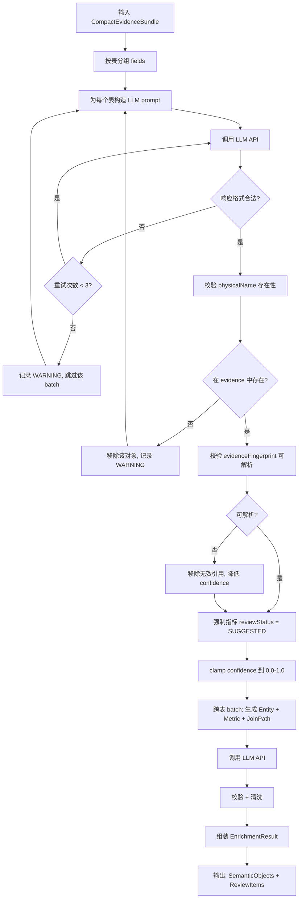
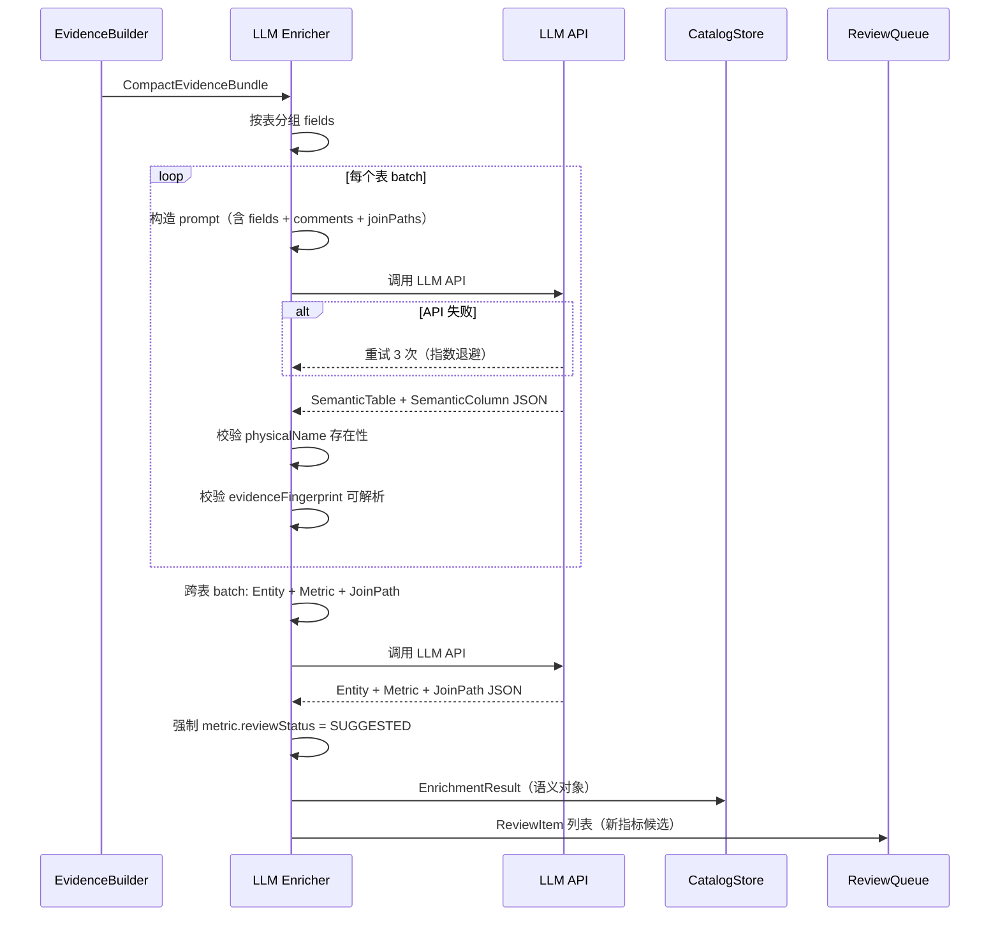

# LLM Semantic Enricher 详细设计

## 1. 目标与定位

**职责：** 使用大语言模型将 evidence graph 转换为业务语义对象。LLM 只负责需要自然语言理解和生成的部分：业务名、描述、同义词、实体识别、指标命名、join path 解释。

**LLM 不负责（已移至 Evidence Builder）：**
- `businessRole` — 由 Evidence Builder 确定性推断（PK→primary_key, FK→foreign_key, 聚合→measure, 时间→timestamp）
- `confidence` — 由 Evidence Builder 确定性计算（基于 evidence 数量和质量的公式）
- 冲突检测 — 由 Evidence Builder 确定性检测（跨 source 集合比较），LLM 只负责对已检测到的冲突生成描述

**LLM 依赖：** 是。这是 Semantic Layer 的**核心 LLM 使用点**。

**为什么必须用 LLM（仅限以下任务）：**
- **业务名生成**：从 `orders.customer_id` 推断"客户ID"、"下单客户"，需要理解中文和业务上下文
- **实体识别**：从表关系中推断"Customer"是一个业务实体，需要理解业务语义
- **同义词扩展**：从"客户"扩展到"用户、会员、买家"，需要语言知识
- **指标命名**：从 `SUM(payments.amount)` 和注释推断"客户总支付金额"，需要理解表达式含义
- **描述生成**：为表和字段生成人类可读的中文描述，需要 NLG 能力
- **冲突描述**：为 Evidence Builder 已检测到的冲突生成人类可读的描述和推荐，需要 NLG 能力

**为什么不用规则（仅限 LLM 负责的部分）：**
- 命名模式千变万化（`customer_id`, `buyer_id`, `user_id`, `member_id` 都可能是客户）
- 业务域分类无法用规则穷举
- 同义词扩展需要大规模语言知识

## 2. 上游与下游

```
上游: Semantic Evidence Builder
  ↓ 输入: CompactEvidenceBundle (紧凑版 evidence)
  
[LLM Semantic Enricher]
  ↓ 调用 LLM API (如 GPT-4.1, batch_size=10 表/批)
  ↓ 校验 LLM 输出（evidenceRef 可解析性、物理名存在性）
  ↓ 输出: EnrichmentResult

下游: Semantic Catalog Store
  消费: EnrichmentResult.tables, .columns, .entities, .metrics, .joinPaths
  
下游: Review Queue
  消费: EnrichmentResult.reviewItems
  
下游: Lexicon Manager
  消费: EnrichmentResult 中的 synonyms（通过 Catalog Store 间接获取）
```

## 3. 接口契约

### 3.1 主接口

```java
public interface LlmSemanticEnricher {
    /**
     * 全量生成语义对象。
     *
     * 前置条件：
     * - evidence 包含有效的 field 和 join path 数据
     * - config.model 是有效的 LLM 模型名
     *
     * 后置条件：
     * - 每个输入的 field 至少有一个对应的 SemanticColumn
     * - 每个 SemanticColumn 有至少一个 evidenceRef
     * - 所有 SemanticMetric.reviewStatus = SUGGESTED
     * - 所有 SemanticTable.reviewStatus = ACCEPTED
     * - 所有 SemanticColumn.reviewStatus = ACCEPTED
     *
     * 异常处理：
     * - LLM API 调用失败 → 重试 3 次，仍失败返回部分结果
     * - LLM 输出格式错误 → 重试 1 次，仍失败跳过该 batch
     */
    EnrichmentResult enrich(CompactEvidenceBundle evidence, EnrichmentConfig config);

    /**
     * 增量更新：只处理变化的 evidence。
     *
     * 前置条件：
     * - existingCatalog 是上次 build 的完整 catalog
     * - deltaEvidence 只包含变化的 evidence
     */
    EnrichmentResult enrichIncremental(
        CompactEvidenceBundle deltaEvidence,
        SemanticCatalog existingCatalog,
        EnrichmentConfig config
    );
}
```

### 3.2 精确输入 Schema（CompactEvidenceBundle → LLM Prompt）

发送给 LLM 的 prompt 中包含的 JSON：

```json
{
  "task": "generate_semantic_objects",
  "language": "zh",
  "evidence": {
    "fields": [
      {
        "physicalRef": "orders.customer_id",
        "dataType": "bigint",
        "topEvidences": [
          {"type": "SQL_LOG_JOIN", "confidence": 0.55, "detail": "JOIN customers ON o.customer_id = c.id"},
          {"type": "METADATA_TYPE", "confidence": 0.99}
        ],
        "isPrimaryKey": false,
        "isForeignKeySource": true,
        "relatedTable": "customers",
        "relatedColumn": "id"
      }
    ],
    "expressions": [
      {
        "expressionId": "expr:paid_amount_30d",
        "expression": "SUM(payments.amount)",
        "sourceColumns": ["payments.amount"],
        "transformType": "AGGREGATE",
        "confidence": 0.80,
        "relatedComment": "paid amount by customer in recent 30 days"
      }
    ],
    "joinPaths": [
      {
        "fromTable": "customers",
        "toTable": "payments",
        "pathDescription": "customers <- orders.customer_id = customers.id -> orders -> payments.order_id = orders.id -> payments",
        "pathConfidence": 0.686,
        "hopCount": 2
      }
    ],
    "comments": [
      {"text": "paid amount by customer in recent 30 days", "associatedRefs": ["payments.amount"]}
    ]
  },
  "existingCatalog": null
}
```

### 3.3 精确输出 Schema（LLM Response → EnrichmentResult）

LLM 必须返回的 JSON 结构：

```json
{
  "tables": [
    {
      "physicalName": "orders",
      "semanticNames": ["订单", "订单主表", "交易订单"],
      "description": "记录客户订单主数据，包含订单状态、金额和时间信息。一行表示一个订单",
      "domain": "交易",
      "grain": "一行表示一个订单",
      "primaryKey": ["orders.id"],
      "importantColumns": ["orders.id", "orders.customer_id", "orders.status", "orders.created_at", "orders.total_amount"],
      "evidenceRefs": [
        {"evidenceFingerprint": "DDL:orders:schema.sql:1:10", "evidenceType": "DDL_TABLE"}
      ],
      "confidence": 0.95
    }
  ],
  "columns": [
    {
      "physicalName": "orders.customer_id",
      "tableName": "orders",
      "columnName": "customer_id",
      "semanticNames": ["客户ID", "下单客户", "订单客户"],
      "description": "订单所属客户的唯一标识，关联 customers 表",
      "businessRole": "foreign_key",
      "entityRef": "entity:Customer",
      "dataType": "bigint",
      "synonyms": ["客户", "买家", "用户", "会员"],
      "evidenceRefs": [
        {"evidenceFingerprint": "FK_LIKE:orders.customer_id->customers.id:SQL_LOG_JOIN:mysql-slow.log", "evidenceType": "RELATIONSHIP"},
        {"evidenceFingerprint": "DDL:orders.customer_id:schema.sql:5:5", "evidenceType": "DDL_COLUMN"}
      ],
      "confidence": 0.95
    }
  ],
  "entities": [
    {
      "names": ["客户", "用户", "会员", "买家"],
      "primaryTable": "customers",
      "keyColumns": ["customers.id"],
      "relatedTables": ["orders", "payments", "customer_profiles"],
      "description": "系统中的客户主体，可以进行下单、支付和查看订单",
      "evidenceRefs": [
        {"evidenceFingerprint": "FK_LIKE:orders.customer_id->customers.id:SQL_LOG_JOIN:mysql-slow.log", "evidenceType": "RELATIONSHIP"},
        {"evidenceFingerprint": "FK_LIKE:payments.customer_id->customers.id:DDL_FOREIGN_KEY:schema.sql", "evidenceType": "RELATIONSHIP"}
      ],
      "confidence": 0.90
    }
  ],
  "metrics": [
    {
      "names": ["客户总支付金额", "总消费金额", "支付总额"],
      "description": "客户在指定时间范围内的支付金额合计，使用 payments.amount 求和",
      "expression": "SUM(payments.amount)",
      "sourceColumns": ["payments.amount"],
      "defaultGrain": ["customers.id"],
      "defaultTimeColumn": "payments.paid_at",
      "joinPaths": ["joinpath:customers-orders-payments"],
      "evidenceRefs": [
        {"evidenceFingerprint": "VALUE:AGGREGATE:payments.amount->paid_amount_30d:app-sql.sql:42:42", "evidenceType": "LINEAGE"},
        {"evidenceFingerprint": "SQL_COMMENT:paid amount by customer:app-sql.sql:41:41", "evidenceType": "SQL_COMMENT"}
      ],
      "confidence": 0.80
    }
  ],
  "joinPaths": [
    {
      "fromEntity": "Customer",
      "toTables": ["orders", "payments"],
      "steps": [
        {"source": "orders.customer_id", "target": "customers.id", "evidenceType": "SQL_LOG_JOIN", "confidence": 0.70},
        {"source": "payments.order_id", "target": "orders.id", "evidenceType": "DDL_FOREIGN_KEY", "confidence": 0.98}
      ],
      "usage": "回答客户订单、客户支付、客户消费金额相关问题",
      "evidenceRefs": [
        {"evidenceFingerprint": "path:customers->orders->payments:2hops", "evidenceType": "JOIN_PATH"}
      ],
      "confidence": 0.686
    }
  ]
}
```

## 4. 处理流程图



## 5. 交互时序图



## 6. LLM Prompt 设计

### 4.1 System Prompt

```text
你是一个数据库语义分析专家，负责将数据库的技术元数据转换为业务语义对象。

## 核心约束
1. 绝对不能创造证据中不存在的表、字段或关系。
2. 每个输出对象必须包含 evidenceRefs，引用输入中已有的 evidenceFingerprint。
3. 不要自己编造 evidenceFingerprint，只引用输入中提供的。
4. 所有指标（metric）的 reviewStatus 必须为 SUGGESTED。
5. 表和列的描述 reviewStatus 为 ACCEPTED。
6. businessRole 和 confidence 已由系统计算好，你不需要修改它们。
7. 如果输入中有 conflicts，你需要为每个冲突生成人类可读的 description 和 recommendation。

## 输出语言
所有 semanticNames、description、usage 使用中文。physicalName 保留英文原名。

## 你的任务
1. 为每个表和列生成中文业务名（semanticNames）和描述（description）
2. 为每个列生成同义词（synonyms）
3. 从表关系中识别业务实体，推断实体名和关联表
4. 从 expression evidence 中生成指标名和描述
5. 为 join path 生成中文用途描述
6. **P2: 冲突确认** — 对输入中的 candidateConflicts 判断是否真的冲突
7. P2: 为每个关键推断提供 reasoning（可选），解释为什么这样推断

## 冲突确认规则（方案 C：规则初筛 + LLM 确认）
输入中的 candidateConflicts 是规则初筛的候选，你需要逐一判断：
- 如果候选中的多个定义确实代表**不同的业务口径**（如金额含退款 vs 不含退款）→ CONFIRMED
- 如果候选中的多个定义只是**同一口径的不同描述**（如"支付金额"和"客户消费金额"）→ FALSE_ALARM
- 判断依据：是否有不同的 filterLogic、transformLogic，或描述明确指向不同的业务场景

## 输出格式要求
- 每个对象可以包含可选的 reasoning 字段，解释推断依据
- reasoning 应简短（1-2 句话），例如："列名包含 'customer_id'，FK 关系指向 customers.id，推断为'客户ID'"
- 冲突确认输出格式见下方 conflictConfirmations

## 业务实体推断规则
- 有多个外键指向它的表 → 核心实体
- 表名包含业务含义（非关联表/日志表） → 候选实体
- 实体名优先从注释提取，其次从表名翻译
- 实体的 relatedTables 应该包含从该实体主表出发通过 join path 可达的所有表

## 指标推断规则
- 来自 lineage 证据的聚合表达式 → 候选指标
- 来自 SQL 注释的指标描述 → 增强指标名称
- 来自 procedure 的计算逻辑 → 候选指标（confidence 降低）
- 指标的 evidenceRefs 必须包含表达式来源 lineage、注释来源 comments，以及 join path 中的 relationship evidence

## 同义词扩展规则
- 从注释中提取同义表达
- 从列名拆分中推断同义词
- 从关系角色推断同义词
- 不要编造不相关的同义词
```

### 4.2 分批策略（P1 修复）

**修复前（有问题）：** 按表分组，每个表一个 batch。LLM 在生成 entity 时看不到跨表关系。

**修复后：**

```java
List<EnrichmentResult> enrichInBatches(CompactEvidenceBundle evidence) {
    List<EnrichmentResult> results = new ArrayList<>();

    // === Phase 1: 表级 batch ===
    // 每个表 + 其字段 → 只生成 SemanticTable + SemanticColumn
    // 不在此 batch 中生成 entity/metric/joinPath
    Map<String, List<CompactFieldEvidence>> byTable = groupFieldsByTable(evidence.fields());
    for (var entry : byTable.entrySet()) {
        String tableName = entry.getKey();
        List<CompactFieldEvidence> fields = entry.getValue();
        for (int i = 0; i < fields.size(); i += 50) {
            List<CompactFieldEvidence> batch = fields.subList(i, Math.min(i + 50, fields.size()));
            EnrichmentResult r = callLLM(buildTablePrompt(tableName, batch));
            // 只取 tables 和 columns，忽略其他
            results.add(new EnrichmentResult(r.tables(), r.columns(), List.of(), List.of(), List.of(), List.of()));
        }
    }

    // === Phase 2: 跨表 batch（P1 新增）===
    // 包含所有 join path + 所有表名 + 所有 expression + 所有 comment + 所有 conflict
    // 生成 SemanticEntity + SemanticMetric + SemanticJoinPath + 冲突描述
    EnrichmentResult crossTableResult = callLLM(buildCrossTablePrompt(evidence, results));
    results.add(crossTableResult);

    // === Phase 3: 合并 ===
    // 将 Phase 1 和 Phase 2 的结果合并
    return mergeResults(results);
}
```

**跨表 batch prompt 结构：**

```json
{
  "task": "generate_cross_table_semantic_objects",
  "language": "zh",
  "evidence": {
    "tableSummary": [
      {"tableName": "customers", "semanticName": "客户", "primaryKey": "customers.id"},
      {"tableName": "orders", "semanticName": "订单", "primaryKey": "orders.id"}
    ],
    "expressions": [...],
    "joinPaths": [
      {
        "fromTable": "customers",
        "toTable": "payments",
        "pathDescription": "customers -> orders -> payments (2 hops)",
        "pathConfidence": 0.96
      }
    ],
    "comments": [...],
    "candidateConflicts": [
      {
        "physicalRef": "payments.amount",
        "candidateDefinitions": [
          {"context": "DDL 定义", "description": "单笔支付金额", "source": "DDL:payments.amount:schema.sql"},
          {"context": "存储过程", "description": "可退款金额", "source": "PROCEDURE:sp_process_refund:routines.sql", "filterLogic": "WHERE refund_status != 'REFUNDED'"}
        ],
        "triggerReason": "不同 source 有不同过滤逻辑"
      }
    ]
  }
}
```

**LLM 输出新增 conflictConfirmations：**

```json
{
  "tables": [...],
  "columns": [...],
  "entities": [...],
  "metrics": [...],
  "joinPaths": [...],
  "conflictConfirmations": [
    {
      "physicalRef": "payments.amount",
      "status": "CONFIRMED",
      "reasoning": "sp_process_refund 中使用了 WHERE refund_status != 'REFUNDED' 过滤条件，与 DDL 中定义的原始支付金额口径不同，确实存在两个不同的业务口径",
      "recommendation": "建议明确两个口径：1) 原始支付金额（所有支付记录）2) 可退款金额（排除已退款），并分别创建指标",
      "reviewPriority": "HIGH"
    },
    {
      "physicalRef": "orders.total_amount",
      "status": "FALSE_ALARM",
      "reasoning": "DDL 注释'订单原始金额（不含优惠）'和 SQL 注释'订单金额'描述的是同一口径，只是详细程度不同，不构成冲突",
      "reviewPriority": null
    }
  ]
}
```

## 5. 输出校验（P1 增强）

LLM 输出后必须执行的校验：

```java
EnrichmentResult validateAndClean(EnrichmentResult raw, EvidenceGraph evidence) {
    List<WarningMessage> warnings = new ArrayList<>();

    // 1. 校验所有 physicalName 在 evidence 中存在
    List<SemanticTable> validTables = raw.tables().stream()
        .filter(t -> evidence.hasFieldForTable(t.physicalName()))
        .toList();

    List<SemanticColumn> validColumns = raw.columns().stream()
        .filter(c -> evidence.hasFieldEvidence(c.physicalName()))
        .toList();

    // 2. 校验所有 evidenceFingerprint 可解析
    for (SemanticColumn col : validColumns) {
        List<EvidenceRef> validRefs = col.evidenceRefs().stream()
            .filter(ref -> evidence.resolveEvidenceRef(ref.fingerprint()).isPresent())
            .toList();
        if (validRefs.isEmpty()) {
            warnings.add("Column " + col.physicalName() + " has no resolvable evidenceRefs");
        }
    }

    // 3. 强制指标 SUGGESTED
    List<SemanticMetric> metrics = raw.metrics().stream()
        .map(m -> m.withReviewStatus(ReviewStatus.SUGGESTED))
        .toList();

    // 4. P1 新增: 去重
    // 同类型对象，physicalName/primaryTable 相同 → 保留 confidence 高的
    validTables = deduplicateByPhysicalName(validTables);
    validColumns = deduplicateByPhysicalName(validColumns);

    // 5. P1 新增: ID 格式校验
    for (SemanticEntity e : raw.entities()) {
        if (!e.id().matches("entity:[A-Z][a-zA-Z0-9]*")) {
            warnings.add("Entity ID format invalid: " + e.id());
        }
    }

    // 6. P1 新增: 语义名与物理名不应混淆
    for (SemanticTable t : validTables) {
        for (String name : t.semanticNames()) {
            if (name.equals(t.physicalName())) {
                warnings.add("Table " + t.physicalName() + " semanticName equals physicalName");
            }
        }
    }
    for (SemanticColumn c : validColumns) {
        for (String name : c.semanticNames()) {
            if (name.equals(c.columnName())) {
                warnings.add("Column " + c.physicalName() + " semanticName equals columnName");
            }
        }
    }

    // 7. P1 新增: 引用完整性校验
    for (SemanticEntity e : raw.entities()) {
        if (validTables.stream().noneMatch(t -> t.physicalName().equals(e.primaryTable()))) {
            warnings.add("Entity " + e.names().get(0) + " primaryTable not found: " + e.primaryTable());
        }
    }
    for (SemanticMetric m : metrics) {
        for (String col : m.sourceColumns()) {
            if (validColumns.stream().noneMatch(c -> c.physicalName().equals(col))) {
                warnings.add("Metric " + m.names().get(0) + " sourceColumn not found: " + col);
            }
        }
    }

    // 8. P2 新增: 自洽性校验
    for (SemanticEntity entity : raw.entities()) {
        for (String relatedTable : entity.relatedTables()) {
            Optional<SemanticEntity> related = raw.entities().stream()
                .filter(e -> e.primaryTable().equals(relatedTable))
                .findFirst();
            if (related.isPresent() && !related.get().relatedTables().contains(entity.primaryTable())) {
                warnings.add("实体关系不对称: " + entity.names().get(0)
                    + " 关联 " + related.get().names().get(0) + "，但反向不存在");
            }
        }
    }

    return new EnrichmentResult(validTables, validColumns, raw.entities(),
        metrics, raw.joinPaths(), raw.reviewItems(), warnings);
}
```

## 6. 错误处理与重试

```java
EnrichmentResult callLLMWithRetry(EnrichmentPrompt prompt) {
    int maxRetries = 3;
    for (int attempt = 0; attempt < maxRetries; attempt++) {
        try {
            String response = llmClient.complete(prompt);
            EnrichmentResult result = parseResponse(response);
            return validateAndClean(result); // 校验成功
        } catch (JsonParseException e) {
            // 格式错误，重试（LLM 可能输出格式不稳定）
            if (attempt == maxRetries - 1) {
                log.warning("LLM output format error after {} retries, skipping batch", maxRetries);
                return EnrichmentResult.empty();
            }
            // 在 prompt 中强调格式要求
            prompt = prompt.withFormatReminder();
        } catch (ApiException e) {
            // API 错误，指数退避
            if (isRetryable(e) && attempt < maxRetries - 1) {
                sleep((long) Math.pow(2, attempt) * 1000);
            } else {
                throw e; // 不可重试或重试耗尽
            }
        }
    }
    return EnrichmentResult.empty();
}
```

## 7. 测试验收

### 7.1 单元测试（Mock LLM）

| 测试场景 | Mock LLM 输出 | 预期结果 |
| --- | --- | --- |
| 正常生成 | 合法 JSON | EnrichmentResult 含所有对象类型 |
| physicalName 不存在 | 包含不存在的表名 | 该对象被过滤，warning 记录 |
| evidenceFingerprint 不可解析 | 无效 fingerprint | 该 evidenceRef 被移除，confidence 降低 |
| 指标 reviewStatus 不是 SUGGESTED | reviewStatus: "ACCEPTED" | 被强制改为 SUGGESTED |
| JSON 格式错误 | 非 JSON 文本 | 重试 1 次，仍失败返回空结果 |
| confidence 越界 | confidence: 1.5 | clamp 到 1.0 |
| 空 evidence | 空 fields 数组 | 返回空 EnrichmentResult |

### 7.2 集成测试（真实 LLM）

```java
@Test
void realLLMIntegration() {
    CompactEvidenceBundle evidence = buildSampleEvidence(); // 3 tables, 15 fields
    EnrichmentConfig config = new EnrichmentConfig("gpt-4.1", 0.1, 8000, 10, 5, "zh");

    EnrichmentResult result = enricher.enrich(evidence, config);

    // 每个表都有 SemanticTable
    assertEquals(3, result.tables().size());

    // 每个字段都有 SemanticColumn
    assertEquals(15, result.columns().size());

    // 所有对象有 evidenceRefs
    for (SemanticTable t : result.tables()) {
        assertFalse(t.evidenceRefs().isEmpty(), "Table " + t.physicalName() + " has no evidenceRefs");
    }

    // 所有指标 SUGGESTED
    for (SemanticMetric m : result.metrics()) {
        assertEquals(ReviewStatus.SUGGESTED, m.reviewStatus());
    }

    // 表/列 ACCEPTED
    for (SemanticTable t : result.tables()) {
        assertEquals(ReviewStatus.ACCEPTED, t.reviewStatus());
    }
}
```

### 7.3 Token 预算测试

| 场景 | 输入规模 | 预期 token |
| --- | --- | --- |
| 小表 | 5 个字段 | < 2000 tokens |
| 中表 | 20 个字段 | < 4000 tokens |
| 大表 | 50 个字段 | < 8000 tokens |
| 超大表 | 80 个字段 | 分成 2 批，每批 < 8000 tokens |