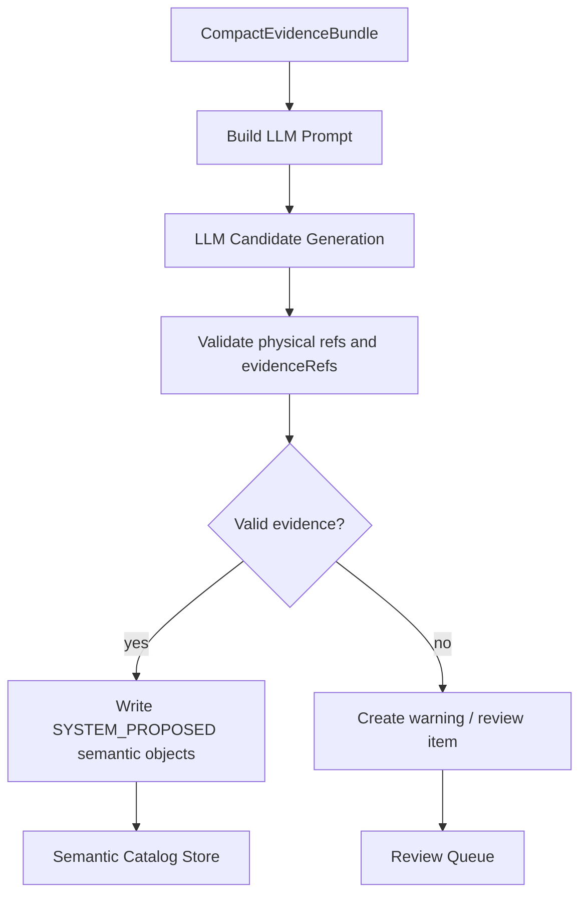

# LLM Semantic Enricher 详细设计

## 1. 目标与定位

**职责：** 基于 `Semantic Evidence Builder` 产出的 evidence bundle，生成业务语义候选：表/字段中文名、描述、同义词、实体候选、指标候选、冲突说明和 join path 解释。

**硬边界：**

- LLM 不创建正式物理 relationship。
- LLM 不创建正式 Data Lineage。
- LLM 不把任何 metric / entity / join path 直接提升为 `BUSINESS_APPROVED`。
- LLM 输出必须引用已有 `evidenceRefs`，无法绑定 evidence 的内容只能进入 warning 或 review queue。

LLM 在本模块中负责语言理解和表达，不负责数据库事实判断。数据库事实来自 relation-detector 输出的 relationship、lineage、metadata、SQL source 和注释。

## 2. 上游与下游

```text
Semantic Evidence Builder
  -> CompactEvidenceBundle
  -> LLM Semantic Enricher
  -> EnrichmentResult
  -> Semantic Catalog Store
  -> Review Queue
```

输出对象默认状态：

| 对象 | 默认状态 | 说明 |
| --- | --- | --- |
| SemanticTable | `EVIDENCE_SUPPORTED` | 可由 metadata / DDL / relationship 支撑，但不是人工确认业务口径。 |
| SemanticColumn | `EVIDENCE_SUPPORTED` | 可由字段名、注释、metadata、lineage 支撑。 |
| SemanticEntity | `SYSTEM_PROPOSED` | 业务实体抽象需要审核或后续治理确认。 |
| SemanticMetric | `SYSTEM_PROPOSED` | 指标口径必须审核后才能作为正式回答口径。 |
| JoinPath Explanation | `EVIDENCE_SUPPORTED` | 只能解释已存在 relationship path，不能新增 path。 |

## 3. 接口契约

```java
public interface LlmSemanticEnricher {
    EnrichmentResult enrich(CompactEvidenceBundle evidence, EnrichmentConfig config);

    EnrichmentResult enrichIncremental(
        CompactEvidenceBundle deltaEvidence,
        SemanticCatalog existingCatalog,
        EnrichmentConfig config
    );
}
```

`EnrichmentResult` 必须满足：

- 每个对象至少保留一个 `EvidenceRef`，除非该对象被标为 `NEEDS_MORE_EVIDENCE`。
- `reviewStatus` 只能由本模块设为 `SYSTEM_PROPOSED`、`EVIDENCE_SUPPORTED` 或 `NEEDS_MORE_EVIDENCE`。
- `BUSINESS_APPROVED` 只能由 Review Queue / governance workflow 写入。
- LLM 产生的 join path 字段必须命名为 explanation / candidate，不能命名为正式 physical join path。

## 4. Prompt 输入约束

发送给 LLM 的 evidence bundle 应是紧凑、可追溯的结构：

```json
{
  "task": "generate_semantic_candidates",
  "language": "zh",
  "evidence": {
    "fields": [
      {
        "physicalRef": "orders.customer_id",
        "dataType": "bigint",
        "topEvidences": [
          {
            "type": "SQL_LOG_JOIN",
            "confidence": 0.55,
            "detail": "JOIN customers ON o.customer_id = c.id"
          }
        ],
        "relatedTable": "customers",
        "relatedColumn": "id"
      }
    ],
    "expressions": [
      {
        "expressionId": "expr:paid_amount_30d",
        "expression": "SUM(payments.amount)",
        "sourceColumns": ["payments.amount"],
        "transformType": "AGGREGATE",
        "confidence": 0.8
      }
    ],
    "relationshipPaths": [
      {
        "pathId": "path:customers-orders-payments",
        "steps": [
          "orders.customer_id -> customers.id",
          "payments.order_id -> orders.id"
        ],
        "pathConfidence": 0.686
      }
    ]
  }
}
```

## 5. LLM 输出约束

LLM 返回 JSON semantic object proposal，系统再做 deterministic validation：

```json
{
  "tables": [
    {
      "physicalName": "orders",
      "semanticNames": ["订单", "交易订单"],
      "description": "记录客户订单主数据。",
      "reviewStatus": "EVIDENCE_SUPPORTED",
      "evidenceRefs": [
        {
          "evidenceFingerprint": "DDL:orders:schema.sql:1:10",
          "evidenceType": "DDL_TABLE"
        }
      ]
    }
  ],
  "metrics": [
    {
      "names": ["客户总支付金额", "总消费金额"],
      "description": "客户在指定时间范围内的支付金额合计。",
      "expression": "SUM(payments.amount)",
      "sourceColumns": ["payments.amount"],
      "reviewStatus": "SYSTEM_PROPOSED",
      "evidenceRefs": [
        {
          "evidenceFingerprint": "VALUE:AGGREGATE:payments.amount->paid_amount_30d",
          "evidenceType": "LINEAGE"
        }
      ]
    }
  ],
  "joinPathExplanations": [
    {
      "pathId": "path:customers-orders-payments",
      "usage": "可用于回答客户订单和客户支付金额问题。",
      "reviewStatus": "EVIDENCE_SUPPORTED"
    }
  ],
  "reviewItems": [
    {
      "objectId": "metric:customer_total_paid_amount",
      "reason": "指标过滤条件和退款处理口径需要业务确认。"
    }
  ]
}
```

## 6. 输出校验

LLM 输出进入 catalog 前必须校验：

- `physicalName`、`sourceColumns`、`relationship pathId` 必须存在于 evidence bundle。
- `evidenceRefs` 必须能解析回当前 `scanRunId` 的 evidence。
- `reviewStatus=BUSINESS_APPROVED` 一律降级为 `SYSTEM_PROPOSED` 并记录 warning。
- 无 evidence 的 metric/entity 进入 `NEEDS_MORE_EVIDENCE`，不得参与默认搜索和 SQL draft。
- join path explanation 只能引用已有 relationship path，不能产生新的 path step。

## 7. 流程图



## 8. 测试验收

| 场景 | 预期 |
| --- | --- |
| LLM 返回 `BUSINESS_APPROVED` metric | 被降级为 `SYSTEM_PROPOSED` 并记录 warning |
| LLM 返回不存在字段 | 拒绝该 candidate，进入 `NEEDS_MORE_EVIDENCE` |
| LLM 返回新 join path step | 拒绝 step，只保留解释性 review item |
| evidence 完整的 table/column | 写入 `EVIDENCE_SUPPORTED` |
| 指标候选 | 写入 `SYSTEM_PROPOSED` 并进入 Review Queue |
