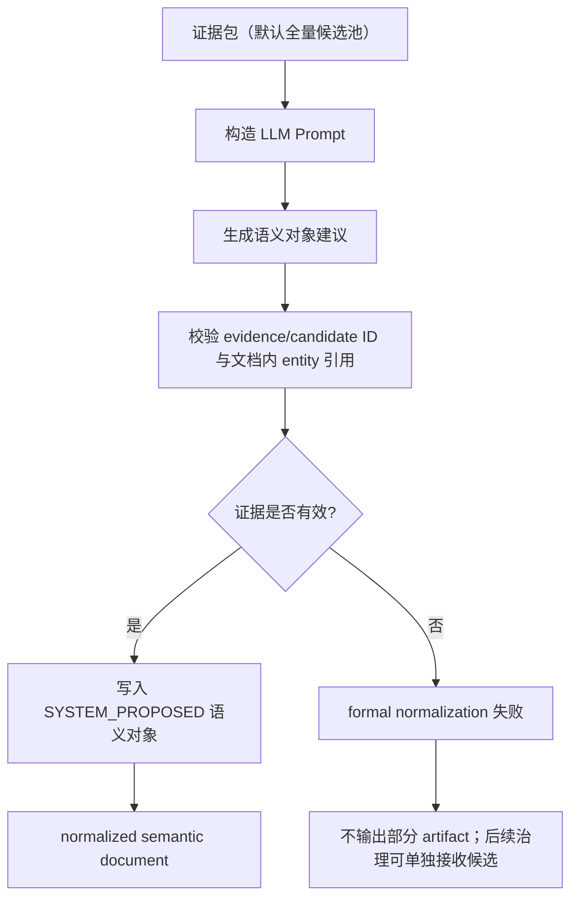
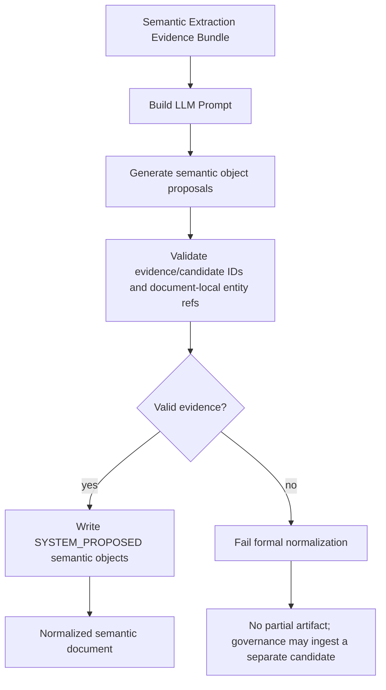

# LLM Semantic Enricher 详细设计

## 1. 目标与定位

**职责：** 基于 relation-detector scan result 构造可追溯 evidence bundle / prompt，并在需要时调用 LLM 生成业务语义候选：实体、事件、关系解释、字段血缘解释、指标候选、维度候选、三元组和审核项。

当前代码分两条链路：

- `semantic build` / `semantic e2e` 的 KG 构建链路仍使用 `NoopSemanticEnricher`，它直接返回原始 `EvidenceGraph`，不创建 semantic fact，不调用 LLM。
- `semantic extract` 的语义抽取链路已经实现：`SemanticExtractionBundleBuilder` 构造 evidence bundle（默认全量候选池，显式设置 `--max-*` 或 `focus` 时才裁剪），`SemanticExtractionPromptBuilder` 生成 prompt，`codex-session` provider 只写 prompt / bundle / 会话说明，`openai-api` provider 调用 OpenAI-compatible Responses API，并通过 bundle-aware normalizer 写 normalized semantic document。

当前 `semantic extract` 的 normalized result 包含：

- `entities`
- `events`
- `relations`
- `lineage`
- `metrics`
- `dimensions`
- `triplets`
- `reviewItems`
- `semanticGraph`
- `validation`

其中 event 必须引用 deterministic `eventCandidates`；lineage 仍是一等输出，不被 triplet 替代。`semantic extract` 结果目前仍是文件 artifact，不会写入 Semantic Catalog Store。

**硬边界：**

- LLM 不创建正式物理 relationship。
- LLM 不创建正式 Data Lineage。
- LLM 不把任何 metric / entity / join path 直接提升为 `BUSINESS_APPROVED`。
- LLM 输出必须引用 evidence bundle 中已有的 fact/evidence/candidate id；无法闭合的内容会使正式 normalization 失败。写入持久化 warning / review queue 属于后续 catalog/governance 阶段。

LLM 在本模块中负责语言理解和表达，不负责数据库事实判断。数据库事实来自 relation-detector 输出的 relationship、lineage、metadata、SQL source 和注释。

## 1.1 Semantica 启发：LLM 不是 accountability layer

Semantica 官方 README 将 Semantica 定位为 LLM 旁边的 Context and Accountability Layer，而不是让 LLM 自己承担事实、治理和审计。本模块沿用同一边界：

- LLM 可以把已有 evidence 翻译成业务可读说明。
- LLM 可以归纳业务域、实体候选、指标候选、同义词候选和冲突解释。
- LLM 输出必须引用 evidenceRefs；无法引用 evidence 的内容会使当前 formal normalization 原子失败，不会产生带 validation issue 的正式 artifact。后续 catalog/governance 阶段可以在独立的候选摄取流程中转为 warning 或 review item。
- LLM 不能确认 conflict，不能合并重复对象，不能写入 `BUSINESS_APPROVED`，不能绕过 SQL Validator。

因此 LLM Enricher 的输出是 semantic candidates，不是 catalog truth。Catalog Store 和 Review Queue 负责持久化、状态保护和治理决策。

四类角色示例：

| 角色 | 输入 evidence | LLM 可以输出什么 | 边界 |
| --- | --- | --- | --- |
| 解释 | `orders.customer_id -> customers.id`，字段注释为 "下单客户" | "`orders.customer_id` 表示订单所属客户，可用于连接客户主表。" | 只能解释已有 relationship，不能新增 join。 |
| 归纳 | `customers`、`orders`、`payments` 多个表和 join path | "这些表共同支持客户交易域，`customers` 是客户主体，`orders` 是订单事实，`payments` 是支付事实。" | 归纳的是业务视角，不改变物理表关系。 |
| 扩展 | 字段名 `customer_id`，注释 "客户编号"，已有术语 "客户" | 同义词候选："用户"、"会员"、"买家"。 | 只能进入词库候选和审核队列，不能直接成为正式业务口径。 |
| 规划 | 问题："每个客户最近30天支付金额是多少？"；catalog 中有 `customers/orders/payments` | 问题改写、候选指标、候选表字段、需要的 join path 提示。 | 只生成 question plan 候选；SQL 由模板生成并由 Validator 校验。 |

## 2. 上游与下游

```text
Semantic Evidence Builder
  -> EvidenceGraph
  -> NoopSemanticEnricher (当前默认)
  -> SemanticKgBuilder
  -> semantic-kg.json / semantic-evidence-graph.json
```

KG 构建链路不调用 LLM，也不会修改 evidence graph。

```text
ScanBundle
  -> SemanticExtractionBundleBuilder
  -> SemanticExtractionPromptBuilder
  -> semantic extract
       -> codex-session: 只写 semantic-extraction-evidence-bundle.json /
                         semantic-extraction-prompt.md /
                         semantic-extraction-codex-session.md
       -> openai-api: 调用 Responses API，写 semantic-extraction-result-raw.json /
                      semantic-extraction-result.json
  -> semantic normalize-extraction
       -> 对已有 JSON 输出生成 normalized semantic document
```

真实 LLM 只存在于 `openai-api` provider。`codex-session` 是开发/人工测试入口，不会自动调用模型；用户或 Codex 会话可以读取 prompt 后生成 JSON，再通过 `normalize-extraction` 标准化。

输出对象默认状态：

| 对象 | 默认状态 | 说明 |
| --- | --- | --- |
| SemanticTable | `EVIDENCE_SUPPORTED` | 可由 metadata / DDL / relationship 支撑，但不是人工确认业务口径。 |
| SemanticColumn | `EVIDENCE_SUPPORTED` | 可由字段名、注释、metadata、lineage 支撑。 |
| SemanticEntity | `SYSTEM_PROPOSED` | 业务实体抽象需要审核或后续治理确认。 |
| SemanticMetric | `SYSTEM_PROPOSED` | 指标口径必须审核后才能作为正式回答口径。 |
| JoinPath Explanation | `EVIDENCE_SUPPORTED` | 只能解释已存在 relationship path，不能新增 path。 |

## 3. 接口契约

```java
public interface LlmSemanticEnricher {
    EvidenceGraph enrich(EvidenceGraph graph);
}
```

`LlmSemanticEnricher` 仍是 KG 构建链路的扩展点；当前 `semantic build` 使用 `NoopSemanticEnricher`。语义抽取链路使用独立的 extraction API：

```java
public final class SemanticExtractionBundleBuilder {
    ObjectNode build(ScanBundle bundle, String focus, int maxRelationships, int maxLineage, int maxNamingEvidence);
}

public final class SemanticExtractionPromptBuilder {
    SemanticExtractionPrompt build(ScanBundle bundle, String focus, int maxRelationships, int maxLineage, int maxNamingEvidence);
}

public final class OpenAiResponsesSemanticExtractor {
    SemanticExtractionResult extract(SemanticExtractionPrompt prompt);
    String requestJson(SemanticExtractionPrompt prompt);
}

public final class SemanticExtractionDocumentNormalizer {
    ObjectNode normalize(JsonNode rawDocument, JsonNode evidenceBundle);
}
```

无 evidence bundle 的兼容入口只会 fail-fast，不产生正式语义结果。CLI 的
`normalize-extraction` 同样强制要求 `--evidence-bundle`。

normalizer 的 JSON 只是输入/输出边界：内部先映射为 typed `SemanticExtractionDocument` 及
`SemanticEntity/Event/Metric/Triplet/ReviewItem` DTO，然后依次交给 `SemanticCandidateBackfill`、
`SemanticSectionNormalizer`、`SemanticReviewGenerator`、`SemanticReferenceValidator` 和 graph assembler。
validator state 按每次 normalize 新建，同一 normalizer 实例可被并发复用。

`semantic-extraction-result.json` / normalized semantic document 当前必须满足：

- 每个对象至少保留一个可解析到 evidence bundle registry 的 `EvidenceRef`；缺失或未知引用会使正式归一化失败。
- event/triplet candidate ref 必须存在且类型匹配；不能用任意字符串冒充 deterministic candidate。
- 模型输出中的 `BUSINESS_APPROVED` 被立即拒绝；该状态只能由后续 Review Queue / governance workflow 写入。
- LLM 产生的 join path 字段必须命名为 explanation / candidate，不能命名为正式 physical join path。

闭包分为三层：evidence/fact/candidate id 在 evidence bundle 的统一 reference index 中校验；semantic
section 之间的 entity 引用在本次文档内部解析；`physicalName`、`physicalField`、`sourceFields` 等物理
字符串必须精确存在于 bundle 的表列 registry，不能用有效 evidenceRef 为不存在的 endpoint 背书。

normalized semantic document 的 entity、event、relation、lineage、metric、dimension、triplet 和 review item
共享一个 owner-id registry，同 section 或跨 section 重复均失败。graph assembler 也会拒绝重复 node；相同
edge ID 仅在内容完全一致时幂等去重，内容冲突则失败。

## 4. Prompt 输入约束

发送给 LLM 的 evidence bundle 是可追溯的结构；默认保留完整候选池，只有显式上限或 focus 才产生 preview / compact 视图。当前实现中的 bundle 顶层包括：

```json
{
  "database": {"type": "mysql", "catalog": "sample", "schema": ""},
  "focus": "",
  "inputFiles": ["..."],
  "sources": ["ddl", "object-files", "logs"],
  "tables": ["customers", "orders", "payments"],
  "evidence": [
    {"id": "evidence:<sha256>", "type": "SQL_LOG_JOIN", "source": "queries.sql", "detail": "..."}
  ],
  "relationships": [
    {
      "id": "relationship:<sha256>",
      "source": "orders.customer_id",
      "target": "customers.id",
      "type": "FK_LIKE",
      "confidence": 0.9,
      "evidenceRefs": ["evidence:<sha256>"]
    }
  ],
  "lineage": [
    {
      "id": "lineage:<sha256>",
      "sources": ["payments.amount"],
      "target": "sales_fact.amount",
      "flowKind": "VALUE",
      "transformType": "AGGREGATE"
    }
  ],
  "eventCandidates": [
    {
      "id": "event-candidate:routine:sp_rebuild_sales_fact",
      "sourceType": "ROUTINE",
      "lineageRefs": ["lineage:..."],
      "supportingDerivedLineageRefs": ["derivedLineage:..."],
      "relationshipRefs": ["relationship:..."]
    }
  ],
  "derivedRelationships": [],
  "derivedLineage": [],
  "namingEvidence": [],
  "diagnostics": [],
  "instructions": {
    "allOutputsMustUseEvidenceRefs": true,
    "llmCannotCreateDatabaseFacts": true
  }
}
```

完整输入身份保留 `database.type/catalog/schema`，`inputFiles` 使用统一 portable path label：工作目录内路径
相对化，外部绝对路径只保留文件名。

无 `focus` 时，bundle 默认覆盖全局完整候选池；`--max-relationships`、`--max-lineage`、`--max-naming`
的默认值是 `0`，表示不限制。只有用户显式设置正数上限时，才生成有意的 preview / compact prompt view。
有 `focus` 时只保留相关表和 evidence。所有输出引用 bundle 中内容稳定的 fact、evidence 或 candidate id；
relationship、lineage、naming、diagnostic、evidence、triplet candidate 以及 normalizer 生成的 relation/lineage/
triplet/review id 都不使用数组位置。bundle-aware normalizer 会根据 evidence bundle 补齐遗漏的 event、
triplet 和 review item 候选，并对每个引用做类型化闭包校验。

独立归一化命令为：

```bash
semantic normalize-extraction \
  --input semantic-extraction-result-raw.json \
  --evidence-bundle semantic-extraction-evidence-bundle.json \
  --output semantic-extraction-result.json
```

## 5. LLM 输出约束

LLM 返回 JSON semantic document，系统再做 deterministic normalization / validation：

```json
{
  "entities": [
    {
      "id": "entity:orders",
      "name": "orders",
      "physicalName": "orders",
      "machineType": "BusinessDataEntity",
      "type": "业务单据实体",
      "evidenceRefs": ["evidence:<sha256>"]
    }
  ],
  "events": [
    {
      "id": "event:sp_rebuild_sales_fact",
      "name": "重建销售事实表",
      "eventCandidateRef": "event-candidate:routine:sp_rebuild_sales_fact",
      "inputs": ["sales_orders", "payments"],
      "outputs": ["sales_fact"],
      "evidenceRefs": ["evidence:<sha256>"]
    }
  ],
  "relations": [],
  "lineage": [],
  "metrics": [],
  "dimensions": [],
  "triplets": [],
  "reviewItems": []
}
```

`SemanticExtractionDocumentNormalizer` 会补齐内容稳定 id、entity refs、`semanticGraph` 和 `validation`。
正式输出只在当前实现的 ID/内部语义引用闭包满足 `validation.isRefClosed=true` 时返回；未知 evidence、
错误 candidate 类型、孤立 entity、缺失 evidence，或无法解析到本次 semantic document entity 的物理引用
都会抛出 `SemanticExtractionValidationException`。`SemanticPhysicalReferenceIndex` 还会逐项拒绝 bundle 中不存在的
`physicalName`、lineage field、metric field 和 dimension field；有效 evidenceRef 不能替虚构物理 endpoint 背书。

## 6. 输出校验

LLM 输出进入 catalog 前必须校验。当前代码已实现的是 normalized artifact 校验，不写 catalog：

- `physicalName`、`sourceFields` 等字段按 normalized document 内的 entity / section 互引解析；所有 evidence/candidate refs 同时在 bundle reference index 中验证。
- `evidenceRefs` 必须非空且解析到 bundle 的 evidence、fact 或 deterministic candidate；整个结果原子校验。
- event 必须带 `eventCandidateRef`，不能从 derived-only lineage 单独创造 event。
- derived lineage 只能作为 eventCandidate 上的 `supportingDerivedLineageRefs` 辅助解释。
- normalizer 拒绝模型输出的 `reviewStatus=BUSINESS_APPROVED`，不把越权状态静默降级为另一个状态。
- 无 evidence 的 metric/entity 当前使 formal normalization 失败；不会返回 `validation.missingEvidenceRefs` 部分结果。转成 `NEEDS_MORE_EVIDENCE` 必须由后续 catalog/review 候选流程显式完成。
- join path explanation 只能引用已有 relationship path，不能产生新的 path step。

## 7. 流程图

<details open>
<summary>中文</summary>



</details>

<details>
<summary>English</summary>



</details>

## 8. 测试验收

| 场景 | 预期 |
| --- | --- |
| LLM 返回 `BUSINESS_APPROVED` metric | 正式 normalization 失败；只有治理流程可写该状态 |
| LLM 返回字段但没有对应 semantic entity | 正式 normalization 失败并报告 unresolved reference |
| LLM 新建 entity 并填写 bundle 中不存在的物理表/字段 | 正式 normalization 失败，不输出部分 artifact |
| LLM 在同一或不同 section 复用 semantic object id | 正式 normalization 失败；graph node/edge 也有独立冲突防御 |
| LLM 返回新 join path step | 当前不写入物理 relationship；正式拒绝/审核属于后续 catalog gate |
| evidence 完整的 table/column | 写入 `EVIDENCE_SUPPORTED` |
| 指标候选 | normalized result 保留 `SYSTEM_PROPOSED` / `REVIEW_NEEDED` 等状态；Review Queue 写入尚未实现 |

---

## 附录 A：行为设计与测试建议

本附录保留 LLM Enricher 的测试意图，但不定义已实现接口或固定调用次数。LLM 只能解释、归纳、扩展和规划，不能裁决数据库事实。

建议覆盖的行为：

- LLM 返回无法解析到本次 semantic document entity 的 `physicalRef` 时，normalizer 必须拒绝正式输出并给出 unresolved reference。
- LLM 新建 entity 并引用 bundle 中不存在的物理 endpoint 时，`SemanticPhysicalReferenceIndex` 必须拒绝正式输出；有效 evidenceRef 不能替不存在的表列背书。
- LLM 为多个 semantic object 提供相同 id 时，`SemanticOwnerIdRegistry` 必须在同 section 或跨 section 冲突处拒绝；`SemanticGraphAssembler` 继续作为 node/edge 冲突的第二道防御，不能依赖 map 覆盖或 `putIfAbsent` 选择任一项。
- LLM 返回不存在的 `evidenceFingerprint` 时，bundle reference index 必须拒绝该引用。
- LLM 返回 `BUSINESS_APPROVED` 时，normalizer 必须拒绝，不静默改写模型输出。
- LLM 生成的 metric、entity、synonym 默认是 `SYSTEM_PROPOSED`，只有治理流程可以提升为 `BUSINESS_APPROVED`。
- join path explanation 只能引用已有 relationship path，不能新增 path step。

示例：

```pseudo-json
{
  "llmOutput": {
    "metric": "customer_total_paid_amount",
    "reviewStatus": "BUSINESS_APPROVED",
    "evidenceRefs": ["VALUE:AGGREGATE:payments.amount->paid_amount_30d"]
  },
  "expectedBehavior": {"result": "REJECTED", "reason": "governance-only status"}
}
```
