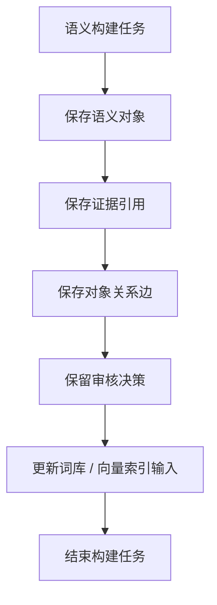
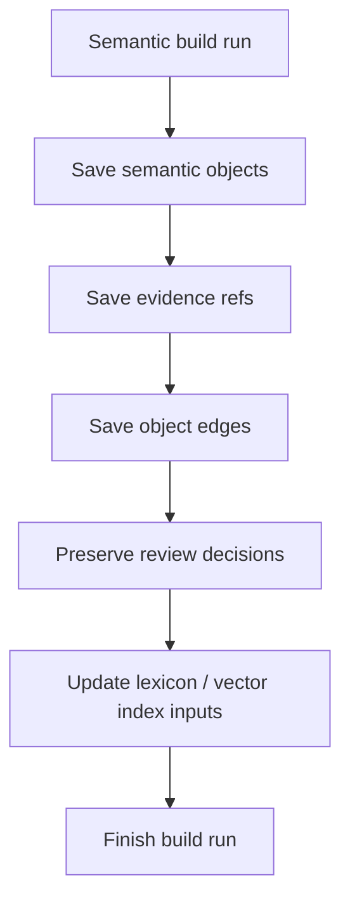

# Semantic Catalog Store 详细设计

## 1. 目标与定位

**职责：** 持久化 semantic object、evidence ref、semantic graph edge、review decision 和 build run，使语义层的每个结论都能追溯到 relation-detector scan result 与审核记录。

**存储分层：**

- Prototype / dev：可以使用 JSON 文件，便于调试和版本化。
- Production-ready Phase 1 profile profile：推荐 PostgreSQL + JSONB + pgvector，支持并发、增量查询、审核审计和向量检索。
- Future Capability：按服务边界拆分或引入消息队列，但不是第一版要求。

Catalog Store 不调用 LLM，也不做语义判断。

## 2. 上游与下游

```text
LLM Semantic Enricher
Review Queue
Semantic Evidence Builder
  -> Semantic Catalog Store
  -> Semantic Search / Query Planner / SQL Validator / Embedding Indexer / Lexicon Manager
```

## 3. 核心数据集

| 数据集 | 作用 |
| --- | --- |
| `semantic_build_run` | 记录每次 build 的 scanRunId、detectorVersion、parserMode、grammarProfile、sourceHash、状态和时间。 |
| `semantic_object` | 保存 table、column、entity、metric、join path explanation 等语义对象。 |
| `semantic_evidence_ref` | 保存 object 到 relation-detector evidence 的可审计引用和 payload snapshot。 |
| `semantic_object_edge` | 保存对象间图关系，例如 entity-column、metric-source-column、metric-default-join-path。 |
| `semantic_review_decision` | 保存人工或治理流程产生的审核决策。 |
| `semantic_lexicon` | 保存业务词、同义词和对象映射。 |
| `semantic_embedding` | 保存对象 embedding 和模型版本。 |
| `semantic_question_trace` | 保存问题、候选、plan、validator 结果和用户反馈，用于调参。 |

JSON prototype 可用同名 JSON/JSONL 文件表达这些数据集，不应只保留一个宽泛 `semantic-objects.json`。

## 4. 接口契约

```java
public interface SemanticCatalogStore {
    BuildRunId startBuild(SemanticBuildRun run);
    void finishBuild(BuildRunId runId, BuildStatus status);

    void saveObjects(BuildRunId runId, List<SemanticObject> objects);
    void saveEvidenceRefs(BuildRunId runId, List<EvidenceRef> evidenceRefs);
    void saveObjectEdges(BuildRunId runId, List<SemanticObjectEdge> edges);
    void applyReviewDecision(ReviewDecision decision);

    Optional<SemanticObject> getById(String objectId);
    List<SemanticObject> listByType(ObjectType type, int limit, int offset);
    List<SemanticObjectEdge> edgesOf(String objectId);
    List<EvidenceRef> evidenceOf(String objectId);
    SemanticCatalogSnapshot snapshot(String buildRunId);
}
```

## 5. 增量更新规则

- 新对象直接插入，初始状态由上游提供，通常是 `SYSTEM_PROPOSED` 或 `EVIDENCE_SUPPORTED`。
- 已存在对象合并 evidenceRefs，并更新 confidence / payload snapshot。
- 已有 `BUSINESS_APPROVED` 或 `REJECTED` 状态不能被 LLM 输出覆盖，只能由新的 review decision 改变。
- 本次 scan 未出现的对象标记为 `DEPRECATED` 或降低可见性，不直接物理删除。
- 每次变更都保留 `scanRunId`、`sourceHash` 和 `detectorVersion`。

## 6. 流程图

<details open>
<summary>中文</summary>



</details>

<details>
<summary>English</summary>



</details>

## 7. LLM 决策

不使用 LLM。Catalog Store 是确定性持久化和查询层。

## 8. 测试验收

| 场景 | 预期 |
| --- | --- |
| 全量 build | 生成 build run、objects、evidence refs、edges |
| 增量 build | 保留审核状态，合并新 evidence |
| `BUSINESS_APPROVED` 对象被 LLM delta 覆盖 | 状态保持 `BUSINESS_APPROVED` |
| evidence 查询 | 可回到 scanRunId/sourceHash/payloadSnapshot |
| JSON prototype | 文件结构和 production-ready 数据集一一对应 |
