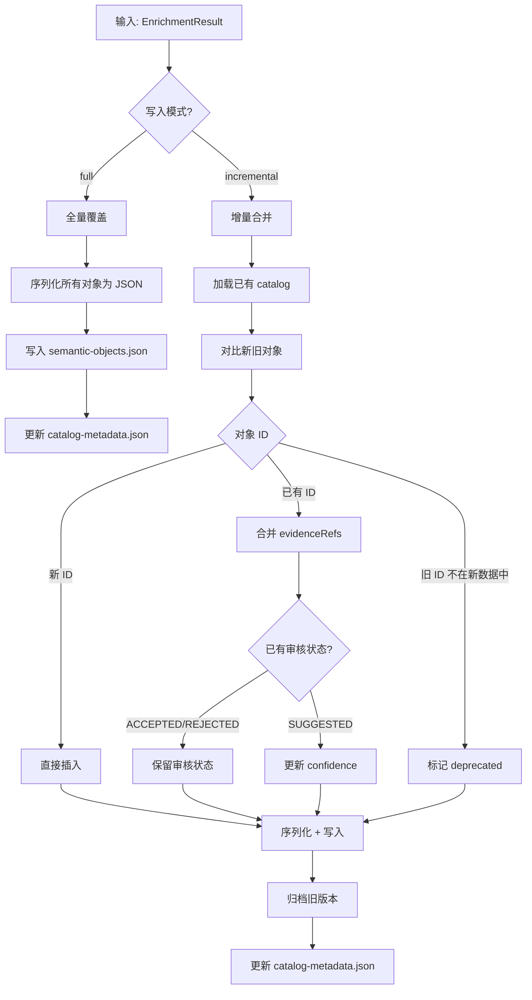
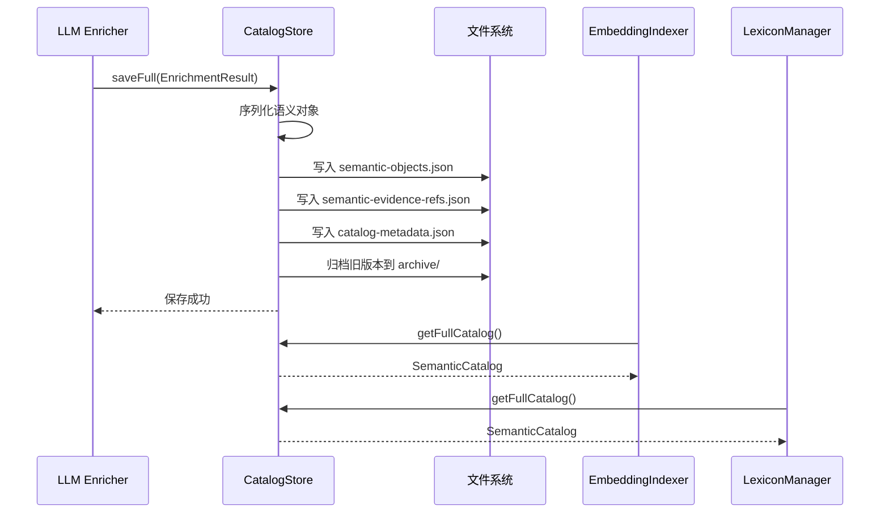

# Semantic Catalog Store 详细设计

## 1. 目标与定位

**职责：** 语义对象的持久化存储，支持 CRUD、版本化、增量更新和查询。v1 使用 JSON 文件存储，v2 迁移到 PostgreSQL + JSONB + pgvector。

**LLM 依赖：** 否。纯存储层，所有操作是确定性 CRUD。不需要 AI。

**为什么不需要 LLM：** 存储层的职责是可靠地保存和检索数据，LLM 会引入不确定性（如错误的合并、不一致的序列化）。

## 2. 上游与下游

```
上游: LLM Semantic Enricher
  ↓ 输入: EnrichmentResult {tables, columns, entities, metrics, joinPaths}
  
上游: Review Queue
  ↓ 输入: ReviewDecision (更新审核状态)
  
[Semantic Catalog Store]
  ↓ 持久化: semantic-catalog/ 目录

下游: 所有需要查询语义对象的模块
  - Semantic Search: listByType, search
  - Query Planner: getById, findByPhysicalTable, findByEntity
  - SQL Draft Generator: getById (表/列/指标)
  - SQL Validator: getById (表/列存在性校验)
  - Embedding Indexer: getFullCatalog
  - Lexicon Manager: getFullCatalog
```

## 3. 接口契约

```java
public interface SemanticCatalogStore {
    // === 写入 ===
    
    /**
     * 全量保存 catalog。覆盖已有数据。
     * 后置条件：所有对象持久化，metadata 更新。
     */
    void saveFull(SemanticCatalog catalog);

    /**
     * 增量更新。合并规则：
     * - 新对象（ID 不存在）→ 直接插入
     * - 已有对象（ID 存在）→ 合并 evidenceRefs，更新 confidence
     * - 已有对象的 reviewStatus 为 ACCEPTED/REJECTED → 保留审核状态
     * - 旧对象（本次 delta 中不存在）→ 标记 deprecated，不删除
     */
    void saveIncremental(SemanticCatalog delta, String scanResultRef);

    // === 读取 ===
    
    /**
     * 按 ID 精确获取。O(1) 查找。
     */
    Optional<SemanticObject> getById(String objectId);

    /**
     * 按类型获取所有对象。
     */
    <T extends SemanticObject> List<T> listByType(ObjectType type);

    /**
     * 按物理表名查找所有相关对象（表本身、列、关联实体、指标）。
     */
    List<SemanticObject> findByPhysicalTable(String tableName);

    /**
     * 按实体查找所有相关对象（列、指标、join path）。
     */
    List<SemanticObject> findByEntity(String entityId);

    /**
     * 获取完整 catalog。
     */
    SemanticCatalog getFullCatalog();

    // === 删除 ===
    void delete(String objectId);
    void deleteByType(ObjectType type);

    // === 查询 ===
    List<SemanticObject> search(String keyword);
    CatalogMetadata getMetadata();
}
```

## 4. 存储流程图



## 5. 交互时序图



## 6. 精确输入输出 Schema

见原设计文档中的完整 JSON schema。此处补充关键约束：

| 字段 | 约束 |
| --- | --- |
| `id` | 全局唯一，格式: `{type}:{name}` |
| `reviewStatus` | 枚举: ACCEPTED/SUGGESTED/REJECTED/NEEDS_MORE_EVIDENCE |
| `confidence` | [0.0, 1.0] |
| `evidenceRefs` | 至少 1 条，可为空数组表示未审核 |
| `createdAt/updatedAt` | ISO 8601 |
| `version` | 单调递增整数 |

## 5. LLM 决策

**不使用 LLM。** 纯 CRUD + 文件 I/O，确定性操作。

## 6. 测试验收

| 测试场景 | 预期 |
| --- | --- |
| 全量保存后读取 | 读取结果与保存一致 |
| 增量更新：新对象 | 新对象插入，已有对象不变 |
| 增量更新：审核状态保留 | ACCEPTED 对象更新后仍为 ACCEPTED |
| 按 ID 查询不存在 | 返回 Optional.empty() |
| 按物理表名查询 | 返回表、列、关联实体 |
| 归档旧版本 | 旧 catalog 移动到 archive/ |