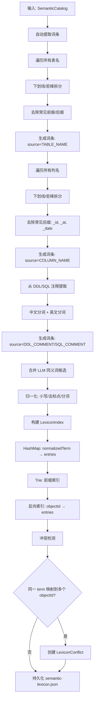
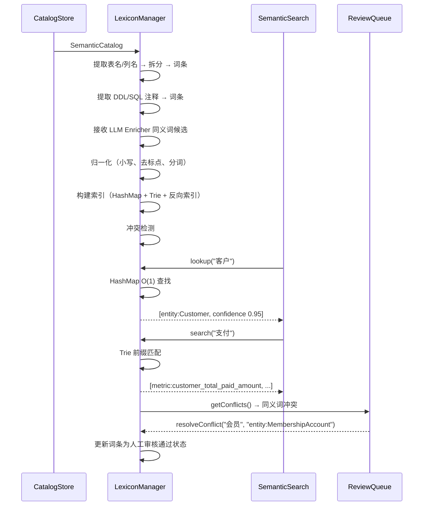

# Lexicon Manager 详细设计

## 1. 目标与定位

**职责：** 管理业务词到语义对象的映射。提供精确匹配和模糊搜索，支持多来源词条优先级排序和冲突检测。

**LLM 依赖：** 否。规则驱动的文本归一化和索引。词条来源中的同义词候选来自 LLM Enricher，但 Lexicon Manager 本身只做存储和检索。

**为什么不需要 LLM：**
- 文本归一化是确定性规则（小写、去标点、分词）
- 索引构建是标准数据结构（HashMap + Trie）
- 优先级排序是规则（source 优先级 + confidence 排序）
- 冲突检测是集合比较（同一 term 映射到多个 objectId）
- LLM 的同义词能力已在前置的 LLM Enricher 中使用，这里不需要重复

## 2. 上游与下游

```
上游: LLM Semantic Enricher
  ↓ 输入: 同义词候选（通过 SemanticColumn.synonyms, SemanticEntity.names）
  
上游: Semantic Evidence Builder
  ↓ 输入: DDL/SQL 注释（CommentEvidence）

上游: Semantic Catalog Store
  ↓ 输入: 表名、列名（用于自动提取词条）

上游: Review Queue
  ↓ 输入: 审核结果（更新词条 reviewStatus）

[Lexicon Manager]
  ↓ 持久化: semantic-lexicon.json

下游: Semantic Search
  消费: lookup(term) → 精确匹配结果
  消费: search(term) → 模糊匹配结果
```

## 3. 接口契约

```java
public interface LexiconManager {
    /**
     * 精确查找。O(1) HashMap 查找。
     * 返回按优先级排序的候选列表。
     * 优先级: HUMAN_REVIEWED > DDL_COMMENT > SQL_COMMENT > LLM_SUGGESTION > COLUMN_NAME > TABLE_NAME
     */
    List<LexiconEntry> lookup(String term);

    /**
     * 模糊搜索。支持前缀匹配（Trie）和编辑距离 ≤ 2。
     */
    List<LexiconEntry> search(String term, int maxResults);

    /**
     * 添加或更新词条。同 term+objectId 存在时更新 confidence 和 source。
     */
    LexiconEntry addOrUpdate(String term, String mapsToObjectId,
                              LexiconRelationType relationType,
                              LexiconSource source, BigDecimal confidence);

    /**
     * 从 schema 自动提取词条。
     * 规则：下划线拆分、驼峰拆分、常见后缀去除。
     */
    List<LexiconEntry> extractFromSchema(MetadataIndex metadata);

    /**
     * 获取冲突：同一 term 映射到多个不同 objectId。
     */
    List<LexiconConflict> getConflicts();

    /**
     * 解决冲突：选择正确的 objectId。
     */
    void resolveConflict(String term, String selectedObjectId, String reviewedBy);
}
```

## 4. 处理流程图



## 5. 交互时序图



## 6. 精确输入输出 Schema

```pseudo-json
// 输入: 自动提取
// MetadataIndex 中的表名和列名 → 拆分规则 → LexiconEntry 列表

// 输出: LexiconEntry
{
  "id": "lexicon:客户",
  "term": "客户",
  "normalizedTerm": "客户",
  "language": "zh",
  "mapsToObjectId": "entity:Customer",
  "relationType": "SYNONYM",
  "confidence": 0.95,
  "reviewStatus": "ACCEPTED",
  "source": "HUMAN_REVIEWED",
  "createdAt": "2026-06-23T00:00:00Z"
}

// 冲突检测输出
{
  "term": "会员",
  "conflictingEntries": [
    {"mapsToObjectId": "entity:Customer", "source": "LLM_SUGGESTION", "confidence": 0.60},
    {"mapsToObjectId": "entity:MembershipAccount", "source": "TABLE_NAME", "confidence": 0.80}
  ],
  "recommendedObjectId": "entity:MembershipAccount",
  "reason": "TABLE_NAME source 置信度高于 LLM_SUGGESTION",
  "reviewStatus": "SUGGESTED"
}
```

## 5. LLM 决策

**不使用 LLM。** 规则驱动的文本归一化、索引构建和冲突检测。同义词生成由 LLM Enricher 完成，Lexicon Manager 只负责存储和检索。

## 6. 测试验收

| 测试场景 | 输入 | 预期输出 |
| --- | --- | --- |
| 精确查找 | "客户" | entity:Customer, confidence 0.95 |
| 同义词查找 | "买家" | entity:Customer |
| 前缀搜索 | "支付" | metric:customer_total_paid_amount, payments.amount |
| 多来源优先级 | "客户"有 HUMAN_REVIEWED(0.95)和 LLM_SUGGESTION(0.60) | HUMAN_REVIEWED 排第一 |
| 冲突检测 | "会员"→Customer 和 "会员"→MembershipAccount | 生成 LexiconConflict |
| 列名拆分 | "customer_id" → ["customer", "id"] | 生成 2 个词条 |
| 空查询 | "" | 返回空列表 |
