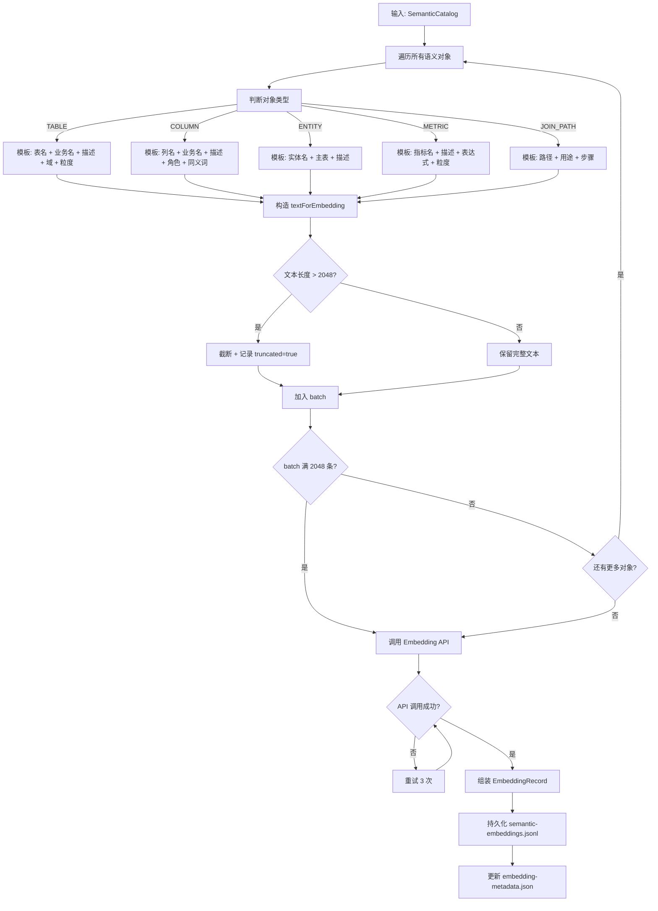
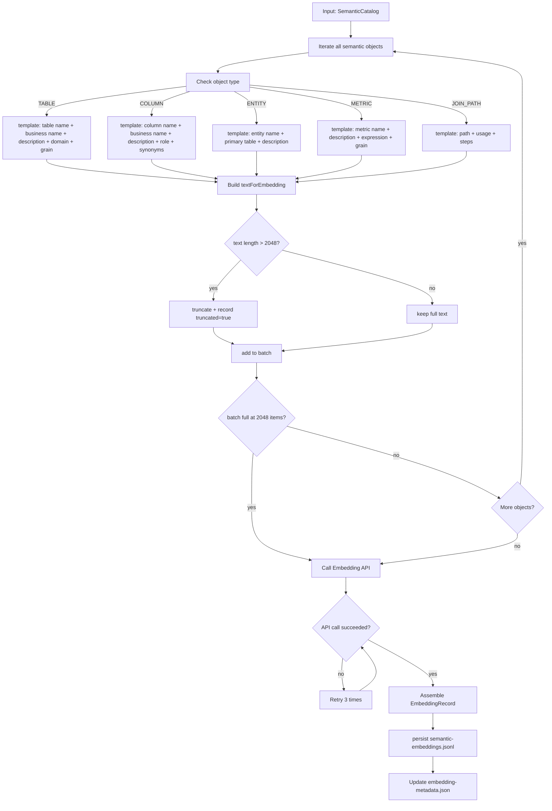
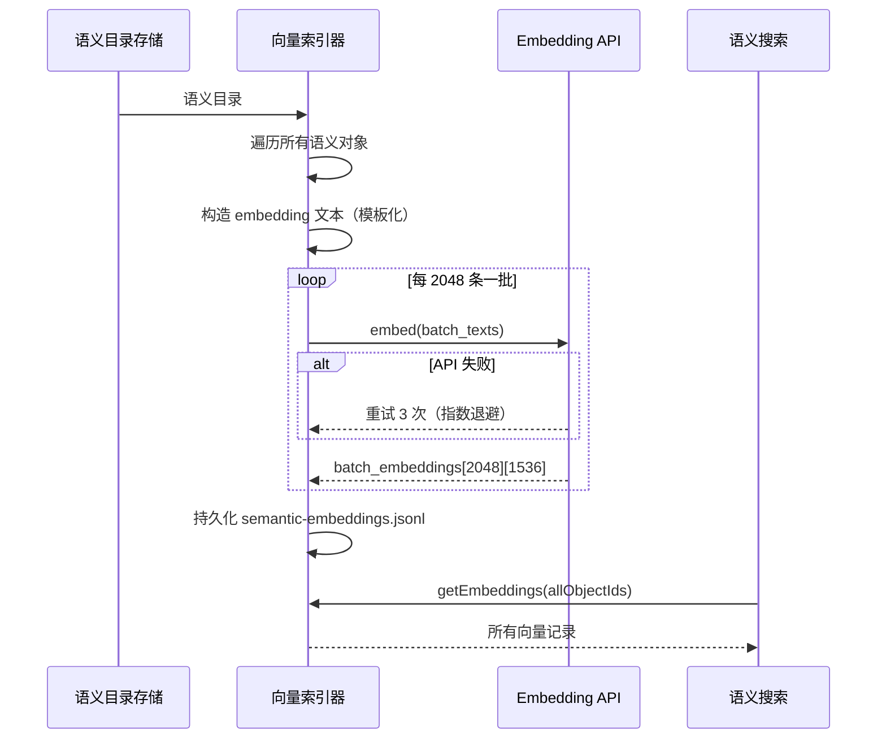
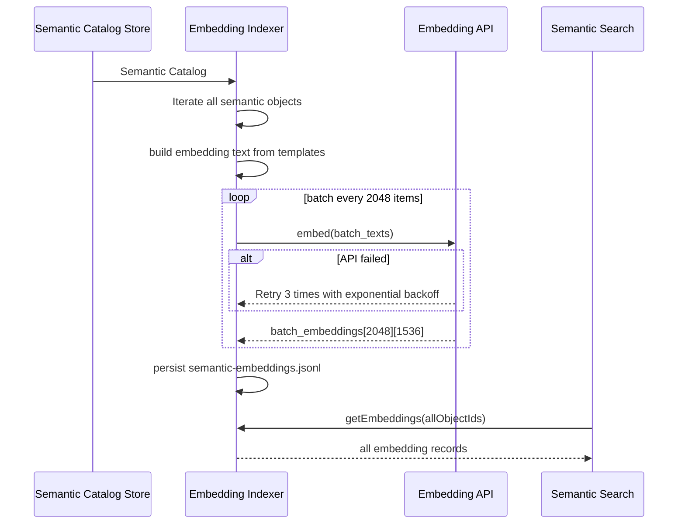

# Embedding Indexer 详细设计

## 1. 目标与定位

**职责：** 为语义对象构造 embedding 文本并写入向量索引，供 Semantic Search 做语义相似度召回。

**LLM 依赖：** 否。但使用 Embedding API（如 text-embedding-3-small）。

**为什么不是 LLM：** Embedding API 和 LLM API 是不同的能力。Embedding 是将文本转为向量，不涉及文本生成。文本构造是模板化的确定性操作。

**为什么不用 LLM 生成 embedding 文本：** 模板化文本构造可以保证一致性（同样的对象总是生成同样的 embedding 文本），LLM 生成会引入变体，导致同一对象的 embedding 在不同 build 之间漂移。

## 2. 上游与下游

```
上游: Semantic Catalog Store
  ↓ 输入: SemanticCatalog.getFullCatalog() → 所有语义对象

[Embedding Indexer]
  ↓ 调用 Embedding API: text-embedding-3-small
  ↓ 持久化: semantic-embeddings.jsonl

下游: Semantic Search
  消费: 所有 embedding 向量（内存加载或文件读取）
  消费: getEmbedding(objectId) → 单个向量
```

## 3. 接口契约

```java
public interface EmbeddingIndexer {
    /**
     * 全量索引。为所有语义对象生成 embedding。
     * 后置条件: semantic-embeddings.jsonl 包含所有对象的 embedding。
     */
    EmbeddingStats indexAll(SemanticCatalog catalog, EmbeddingConfig config);

    /**
     * 增量索引。只处理变化的对象（新增或 updatedAt > lastIndexedAt）。
     */
    EmbeddingStats indexIncremental(SemanticCatalog catalog,
                                     SemanticCatalog previousCatalog,
                                     EmbeddingConfig config);

    Optional<EmbeddingRecord> getEmbedding(String objectId);
    List<EmbeddingRecord> getEmbeddings(List<String> objectIds);
    void deleteEmbedding(String objectId);
    EmbeddingStats getStats();
}
```

## 4. 处理流程图

<details open>
<summary>中文</summary>



</details>

<details>
<summary>English</summary>



</details>

## 5. 交互时序图

<details open>
<summary>中文</summary>



</details>

<details>
<summary>English</summary>



</details>

## 6. Embedding 文本构造模板

```
SemanticTable:
  [表名] {physicalName}
  [业务名] {semanticNames.join(", ")}
  [描述] {description}
  [域] {domain}
  [粒度] {grain}

SemanticColumn:
  [列名] {physicalName}
  [业务名] {semanticNames.join(", ")}
  [描述] {description}
  [角色] {businessRole}
  [同义词] {synonyms.join(", ")}

SemanticEntity:
  [实体] {names.join(", ")}
  [主表] {primaryTable}
  [描述] {description}

SemanticMetric:
  [指标] {names.join(", ")}
  [描述] {description}
  [表达式] {expression}
  [粒度] {defaultGrain.join(", ")}
```

**为什么是模板而不是 LLM：** 模板保证同一对象在不同 build 之间生成完全一致的 embedding 文本。如果用 LLM 生成，每次可能生成不同的文本，导致 embedding 向量漂移，同一对象的搜索排名不稳定。

## 7. Embedding 质量自测（P2 新增）

在 Embedding Indexer 完成后，运行自测验证 embedding 质量：

```java
@Test
void embeddingQualitySelfTest() {
    Map<String, String> expectedMappings = Map.of(
        "客户", "entity:Customer",
        "消费金额", "metric:customer_total_paid_amount",
        "订单", "entity:Order",
        "支付金额", "column:payments.amount",
        "商品", "entity:Product"
    );

    int passed = 0, failed = 0;
    List<String> failures = new ArrayList<>();

    for (var entry : expectedMappings.entrySet()) {
        SearchResult result = semanticSearch.search(entry.getKey());
        if (result.hits().isEmpty()) {
            failures.add("查询 '" + entry.getKey() + "' 无结果，期望 " + entry.getValue());
            failed++;
        } else {
            String topHit = result.hits().get(0).objectId();
            if (topHit.equals(entry.getValue())) {
                passed++;
            } else {
                failures.add("查询 '" + entry.getKey() + "' 召回 " + topHit + "，期望 " + entry.getValue());
                failed++;
            }
        }
    }

    double passRate = (double) passed / (passed + failed);
    assertTrue(passRate >= 0.80,
        "Embedding quality too low: " + String.format("%.1f%%", passRate * 100)
        + "\nFailures:\n" + String.join("\n", failures));
}
```

**自测通过标准：** 至少 80% 的已知查询 top 1 召回正确对象。低于 80% 时检查 embedding 模板、lexicon 覆盖或模型选择。

## 5. LLM 决策

**不使用 LLM。** 使用 Embedding API（text-embedding-3-small），这是 ML 推理而非 LLM 文本生成。文本构造是模板化规则。

## 6. 测试验收

| 测试场景 | 预期 |
| --- | --- |
| 全量索引 | 所有对象都有 embedding 记录 |
| 增量索引 | 只对变化对象重新生成 embedding |
| 维度一致 | 所有 embedding 维度 = config.dimensions |
| 文本模板一致性 | 同一对象多次生成相同的 textForEmbedding |
| API 失败重试 | 重试 3 次，仍失败跳过该 batch |
