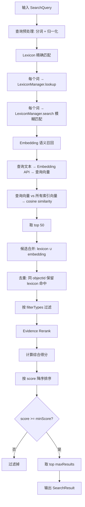

# Semantic Search 详细设计

## 1. 目标与定位

**职责：** 结合 lexicon 精确匹配和 embedding 语义召回，从自然语言查询中找到最相关的语义对象。

**LLM 依赖：** 否。纯数学计算。cosine similarity + 加权求和是确定性公式。

**为什么不需要 LLM：**
- 两阶段搜索（lexicon + embedding）已覆盖精确匹配和语义召回
- 评分公式是加权求和，确定性计算
- 排序是纯数学操作
- LLM 可能把不存在的对象排到前面，破坏 evidence-based 原则
- 如果搜索结果不好，问题在 embedding 质量或 lexicon 覆盖，不是缺少 LLM

## 2. 上游与下游

```
上游: Lexicon Manager
  ↓ 输入: lookup(term) → 精确匹配结果
  ↓ 输入: search(term) → 模糊匹配结果

上游: Embedding Indexer
  ↓ 输入: 所有 embedding 向量

上游: Semantic Catalog Store
  ↓ 输入: 对象详情（用于 Rerank 阶段获取 confidence、reviewStatus）

[Semantic Search]
  ↓ 输出: SearchResult {hits: [SearchHit]}

下游: Query Planner
  消费: SearchResult.hits → 候选实体、指标、字段
```

## 3. 接口契约

```java
public interface SemanticSearch {
    SearchResult search(SearchQuery query);
    List<SearchHit> searchByType(String query, ObjectType type, int maxResults);
    List<SearchHit> searchByTable(String tableName, String query, int maxResults);
    List<SearchHit> searchMetricsForEntity(String entityId, String query, int maxResults);
    List<String> suggest(String prefix, int maxResults);
}
```

## 4. 搜索流程图



## 5. 交互时序图

```mermaid
sequenceDiagram
    participant QP as QueryPlanner
    participant SS as SemanticSearch
    participant LM as LexiconManager
    participant EI as EmbeddingIndexer
    participant API as Embedding API
    participant CS as CatalogStore

    QP->>SS: search(query="客户消费金额")
    SS->>SS: 分词: ["客户", "消费", "金额"]
    par Lexicon 精确匹配
        SS->>LM: lookup("客户")
        LM-->>SS: entity:Customer (score 1.0)
        SS->>LM: lookup("消费")
        LM-->>SS: metric:customer_total_paid_amount
        SS->>LM: lookup("金额")
        LM-->>SS: column:payments.amount
    par Embedding 语义召回
        SS->>API: embedSingle("客户消费金额")
        API-->>SS: query_vector[1536]
        SS->>EI: 获取所有 embedding
        EI-->>SS: 所有 object vectors
        SS->>SS: cosine_similarity(query, each) → top 50
    end
    SS->>SS: 候选合并 + 去重
    SS->>CS: 获取候选对象详情（confidence, reviewStatus）
    CS-->>SS: 对象详情
    SS->>SS: Evidence Rerank（加权评分）
    SS->>SS: 排序 + 过滤 + 截断
    SS-->>QP: SearchResult
```

## 6. 搜索流程与评分公式

```
Step 1: Lexicon 精确匹配
  query "客户消费金额" → 分词 ["客户", "消费", "金额"]
  lookup("客户") → [{objectId: "entity:Customer", score: 1.0}]
  lookup("消费") → [{objectId: "metric:customer_total_paid_amount", score: 1.0}]
  lookup("金额") → [{objectId: "column:payments.amount", score: 1.0}]

Step 2: Embedding 语义召回
  queryEmbedding = embeddingClient.embedSingle("客户消费金额")
  for each objectEmbedding in index:
    similarity = cosineSimilarity(queryEmbedding, objectEmbedding)
  topK = top 50 by similarity

Step 3: 候选合并
  candidates = lexiconHits ∪ embeddingHits
  去重: 同 objectId 保留 lexicon 命中（精确匹配优先）

Step 4: Evidence Rerank
  for each candidate:
    score = embedding_similarity * 0.35
          + semantic_confidence * 0.25
          + relationship_path_confidence * 0.20
          + lineage_support * 0.10
          + reviewed_status_bonus * 0.10

Step 5: 排序返回
  sort by score DESC
  filter score < minScore
  limit maxResults
```

## 5. LLM 决策

**不使用 LLM。** 纯数学计算。cosine similarity + 加权求和。如果用 LLM 做排序，会破坏评分可解释性，且 LLM 可能把不存在的对象排到前面。

## 6. 测试验收

| 测试场景 | 输入 | 预期 |
| --- | --- | --- |
| 精确术语搜索 | "客户" | entity:Customer 排第一 |
| 同义词搜索 | "买家" | entity:Customer（通过 lexicon） |
| 语义搜索 | "买东西最多的人" | entity:Customer + metric:customer_total_paid_amount |
| ACCEPTED 优先 | 同分 ACCEPTED vs SUGGESTED | ACCEPTED 排前面 |
| REJECTED 排除 | REJECTED 对象 | score < 0，不在结果中 |
| embedding API 失败 | API 不可用 | 退化为 lexicon only |
| 无结果 | 完全无关的查询 | 返回空列表 |