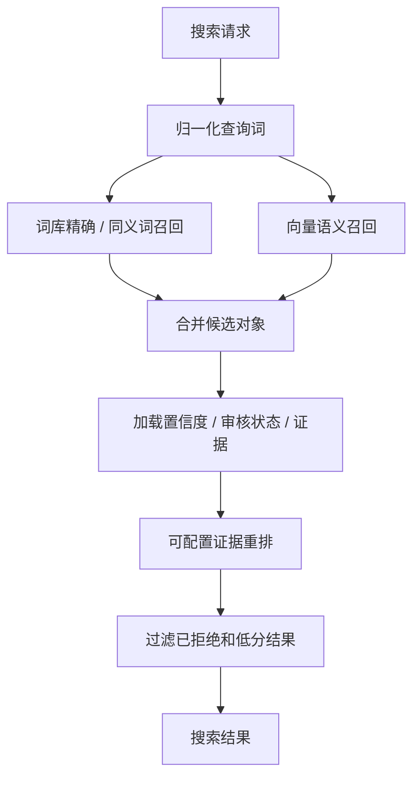
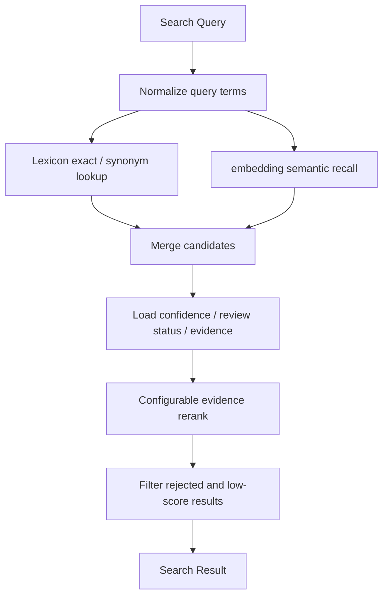

# Semantic Search 详细设计

## 1. 目标与定位

**职责：** 结合 lexicon 精确匹配、embedding 语义召回和 evidence-based rerank，从自然语言查询中找到最相关的语义对象。

**LLM 依赖：** 否。搜索阶段不让 LLM 重排事实对象，避免把不存在或无 evidence 的对象排到前面。LLM query rewrite 属于 `Question Understanding`，其输出仍要进入本模块的确定性检索和 rerank。

## 2. 上游与下游

```text
Lexicon Manager
Embedding Indexer
Semantic Catalog Store
  -> Semantic Search
  -> SearchResult
  -> Query Planner
```

## 3. 接口契约

```java
public interface SemanticSearch {
    SearchResult search(SearchQuery query);
    List<SearchHit> searchByType(String query, ObjectType type, int maxResults);
    List<SearchHit> searchMetricsForEntity(String entityId, String query, int maxResults);
    List<String> suggest(String prefix, int maxResults);
}
```

## 4. 搜索流程

<details open>
<summary>中文</summary>



</details>

<details>
<summary>English</summary>



</details>

## 5. Rerank 口径

搜索评分是 **可配置初始 heuristic**，不是已经校准的固定公式。第一版可以从以下信号开始：

- lexicon exact / synonym match。
- embedding similarity。
- semantic object confidence。
- review status：`BUSINESS_APPROVED` > `EVIDENCE_SUPPORTED` > `SYSTEM_PROPOSED`。
- relationship path confidence。
- lineage support。
- recent successful question trace。

权重必须配置化，并通过以下反馈迭代：

- question trace 中用户选择的对象。
- Review Queue 的人工决策。
- 离线 benchmark question set。
- SQL Validator 成功/失败结果。

文档和实现不应硬编码某一组长期权重。示例权重只能作为默认配置，不是语义正确性的证明。

## 6. LLM 决策

本模块不使用 LLM。LLM 可以在上游生成 query rewrite，但最终命中对象必须来自 catalog / lexicon / embedding index，并保留 evidence。

## 7. 测试验收

| 场景 | 预期 |
| --- | --- |
| 精确术语搜索 | lexicon 命中优先 |
| 同义词搜索 | 通过 lexicon synonym 命中 |
| 语义搜索 | embedding 召回候选，但仍经 evidence rerank |
| `BUSINESS_APPROVED` 和 `SYSTEM_PROPOSED` 同分 | `BUSINESS_APPROVED` 优先 |
| `REJECTED` 对象 | 不参与默认结果 |
| embedding API 失败 | 降级为 lexicon-only |
| 无 evidence candidate | 不进入默认结果，或作为低置信度候选返回 |
