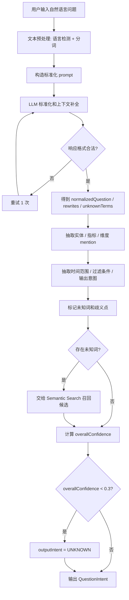
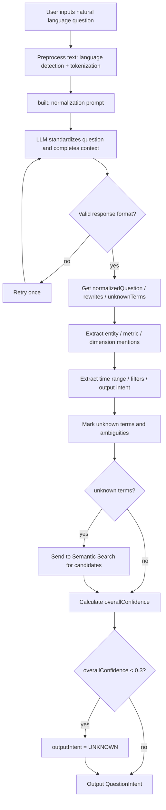
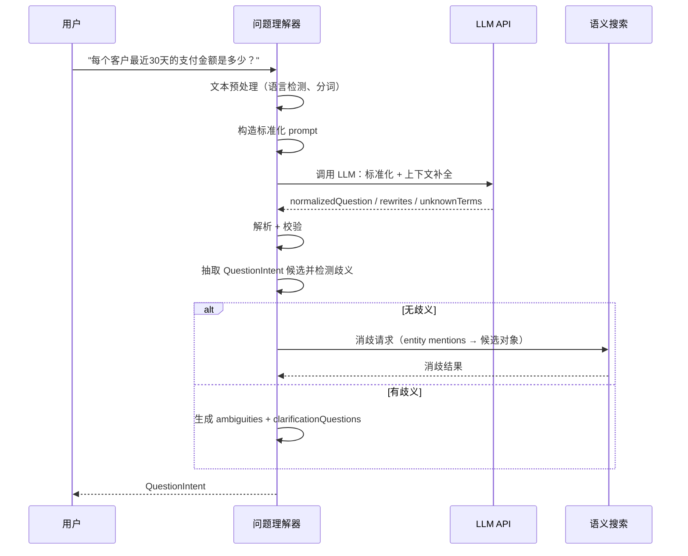
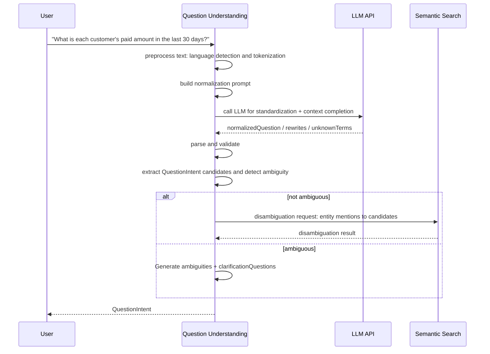

# Question Understanding 详细设计

> 当前实现状态：目标设计，尚未落地。当前代码没有在线问答入口、问题标准化或 `QuestionIntent` 生成；已实现的是离线 KG JSON 构建，以及离线 `semantic extract` 的 `codex-session` / `openai-api` 语义抽取入口。

## 1. 目标与定位

**职责：** 将用户自然语言问题先标准化，再解析为结构化意图（QuestionIntent）。识别实体 mention、指标 mention、维度、时间范围、过滤条件、输出意图、未知词和歧义点。

**LLM 依赖：** 是。这是 Phase 1 在线问答链路中建议保留的 LLM 调用点，但调用边界必须窄。LLM 负责问题标准化、上下文补全和结构化候选提取；表字段选择、join path、指标口径确认和 SQL draft 由后续 catalog / planner / validator 约束。

亿问 Alisa / LogicForm 材料给出的启发是：生产级 NL2LogicForm 不应让大模型直接生成最终 LogicForm 或 SQL，而是先由大模型把原始提问整理成更标准、更完整、更明确的问题表达，再由确定性语义引擎做结果空间收敛和 LogicForm 生成。本设计吸收这个职责拆分，但不照搬 Alisa 实现。

Question Understanding 内部分成两个子步骤：

| 子步骤 | 输入 | 输出 | 边界 |
| --- | --- | --- | --- |
| 问题标准化 / 上下文补全 | 原始问题、有限会话上下文、locale、当前日期 | `normalizedQuestion`、补全后的上下文、query rewrites、未知词、歧义提示 | 不需要全量 schema、指标库、口径库；不决定表字段；不生成 SQL。 |
| 结构化意图抽取 | 标准化问题、原始 mention、未知词提示 | `QuestionIntent`：实体 mention、指标 mention、时间、过滤、维度、输出意图 | 只输出候选语义，不确认 BUSINESS_APPROVED metric 或 join path。 |

**为什么必须用 LLM：**
- 用户问题是自由形式的自然语言，没有固定格式
- 同一问题有无数种问法："客户消费金额"、"每个客户花了多少钱"、"客户支付排行"、"最近谁买得最多"
- 省略、代词和多轮上下文需要语言补全，例如"那上个月呢"、"前十呢"、"核心店看一下"
- 实体/指标/时间范围的 mention 提取需要理解上下文："最近30天"在不同语境下可能指不同时间窗口
- 歧义检测需要语义理解："活跃客户"可能指登录、下单、支付等多种口径
- 规则 NER 无法覆盖业务术语的多样性（"买家"、"会员"、"用户"都可能指客户）

**为什么不用规则：**
- 正则表达式无法覆盖所有自然语言变体
- 关键词匹配无法处理否定、条件、比较等复杂语义
- 规则维护成本随业务场景增长而爆炸

## 2. 上游与下游

```
上游: 用户输入
  ↓ 输入: String "每个客户最近30天的支付金额是多少？"

[Question Understanding]
  ↓ 调用 LLM: 问题标准化 / 上下文补全 / 结构化候选提取
  ↓ 输出: QuestionIntent

下游: Semantic Search
  消费: QuestionIntent.entities[].mention → 消歧查找

下游: Query Planner
  消费: QuestionIntent (完整结构化意图)
```

## 3. 接口契约

```java
public interface QuestionUnderstanding {
    /**
     * 解析自然语言问题。
     *
     * 前置条件：question 非空字符串
     * 后置条件：QuestionIntent 中所有 mention 保留原始文本位置
     *
     * LLM 调用：1 次
     * 超时预算：< 1 秒
     */
    QuestionIntent parse(String question);

    /**
     * 带上下文解析（多轮对话）。
     */
    QuestionIntent parseWithContext(String question, List<QuestionIntent> conversationHistory);

    /**
     * 生成澄清问题。当 intent 有 ambiguity 时调用。
     * 不需要 LLM，使用模板生成。
     */
    List<ClarificationQuestion> generateClarifications(QuestionIntent intent);
}
```

## 4. 处理流程图

<details open>
<summary>中文</summary>



</details>

<details>
<summary>English</summary>



</details>

## 5. 交互时序图

<details open>
<summary>中文</summary>



</details>

<details>
<summary>English</summary>



</details>

## 6. 精确输入输出 Schema

本节就是 `Question Understanding` 的输入输出样例入口。它定义的是 LLM 调用后的结构化意图，不是最终 SQL、正式指标或 join path。

### 6.1 模块级输入输出契约

输入：

```json
{
  "question": "最近消费高的客户有哪些？",
  "conversationHistory": [
    {
      "role": "user",
      "question": "最近30天销售情况怎么样？",
      "resolvedContext": {
        "timeRange": "最近30天"
      }
    }
  ],
  "locale": "zh-CN",
  "currentDate": "2026-06-29",
  "dialect": "postgresql",
  "schema": "public"
}
```

输出：

```json
{
  "question": "最近消费高的客户有哪些？",
  "normalizedQuestion": "最近30天消费金额较高的客户有哪些？",
  "intentType": "RANKING_QUERY",
  "entities": [
    {
      "mention": "客户",
      "semanticType": "ENTITY",
      "candidateTerms": ["客户"],
      "needsCatalogResolution": true
    }
  ],
  "metrics": [
    {
      "mention": "消费高",
      "candidateMeaning": "支付金额或订单金额较高",
      "needsClarification": true,
      "candidateTerms": ["支付金额", "订单金额", "净收入"]
    }
  ],
  "unknownTerms": [],
  "timeRange": {
    "rawText": "最近",
    "normalized": "最近30天",
    "source": "conversation_context",
    "needsClarification": false,
    "candidateOptions": []
  },
  "requestedOutput": "customer_list",
  "queryRewrites": [
    "客户支付金额排行",
    "客户订单金额排行",
    "高消费客户列表"
  ],
  "ambiguities": [
    {
      "term": "消费高",
      "reason": "metric_definition_ambiguous",
      "options": ["支付金额", "订单金额", "净收入"]
    },
    {
      "term": "最近",
      "reason": "time_window_ambiguous",
      "options": ["最近7天", "最近30天", "最近自然月"]
    }
  ],
  "overallConfidence": 0.58
}
```

边界：

- LLM 只输出结构化意图、候选术语、query rewrite 和歧义点。
- LLM 可以把省略问题补完整，例如从上一轮继承时间范围；但补全内容必须在 `source` 或 attributes 中说明来源。
- `needsCatalogResolution=true` 表示后续必须交给 Semantic Search / Semantic Catalog 消歧。
- `needsClarification=true` 表示 Query Planner 不应直接生成正式 AnswerPlan。
- 输出里不能出现 LLM 自行确认的物理表、物理 join、BUSINESS_APPROVED metric。

### 6.2 简单输入

```
"每个客户最近30天的支付金额是多少？"
```

### 6.3 LLM Prompt

```text
你是一个自然语言问题标准化助手。你的任务是把用户原始问题整理成更完整、更明确、更规范的问题表达，并提取候选 mention。

你不负责选择数据库表、字段或 join path。
你不负责确认指标口径。
你不负责生成 SQL。
如果业务词不确定，只能标记 unknownTerms 或 ambiguities。

## 输入信息
- 原始问题
- 有限会话上下文
- 当前日期
- 语言和区域设置

## 标准化规则
- 补全省略和代词指代，例如"那上个月呢"要恢复上一轮主题。
- 整理口语表达，但保留业务词原文。
- 不要把业务黑话强行解释成某个表字段。
- 不要编造不存在的指标或实体。

## 提取规则
- entities: 问题中提到的业务实体 mention（客户、订单、商品等）
- metrics: 问题中提到的指标 mention（金额、数量、比率等），包含聚合提示
- dimensions: 问题中提到的分组维度 mention（按客户、按地区、按日期等）
- timeRange: 时间范围，需解析为具体表达式
- filters: 过滤条件（状态、金额范围等）
- outputIntent: QUERY_DETAIL（明细）/ AGGREGATE_RANK（聚合排行）/ EXPLAIN_SCHEMA（解释）/ COMPARE（对比）
- unknownTerms: 未知词、黑话、缩写、项目代号

## 时间范围解析
- "最近N天" → RELATIVE: CURRENT_DATE - INTERVAL 'N days'
- "本月" → RELATIVE: DATE_TRUNC('month', CURRENT_DATE)
- "上个月" → ABSOLUTE: 上月第一天到上月最后一天
- "今年" → RELATIVE: DATE_TRUNC('year', CURRENT_DATE)
- "去年" → ABSOLUTE: 去年第一天到去年最后一天

## 歧义处理
- 如果某个术语有多种可能解释，在 ambiguities 中列出
- 不要猜测！如果无法确定，标记为 ambiguous
- 例子: "活跃客户" → 可能是 status='ACTIVE'、最近登录、最近下单、最近支付

## 输出格式
严格 JSON，不要输出其他内容。
```

### 6.4 输出：QuestionIntent

```pseudo-json
{
  "originalQuestion": "每个客户最近30天的支付金额是多少？",
  "normalizedQuestion": "每个客户最近30天的支付金额是多少？",
  "language": "zh",
  "entities": [
    {
      "mention": "客户",
      "startChar": 2,
      "endChar": 4,
      "candidateEntityId": null,
      "confidence": 0.90,
      "alternativeEntityIds": []
    }
  ],
  "metrics": [
    {
      "mention": "支付金额",
      "startChar": 10,
      "endChar": 14,
      "candidateMetricId": null,
      "aggregationHint": "SUM",
      "confidence": 0.85,
      "alternativeMetricIds": []
    }
  ],
  "dimensions": [
    {
      "mention": "每个客户",
      "startChar": 0,
      "endChar": 4,
      "candidateColumnId": null,
      "dimensionType": "entity_key",
      "confidence": 0.90
    }
  ],
  "timeRange": {
    "mention": "最近30天",
    "type": "RELATIVE",
    "startExpression": "CURRENT_DATE - INTERVAL '30 days'",
    "endExpression": "CURRENT_DATE",
    "confidence": 0.95
  },
  "filters": [],
  "outputIntent": "AGGREGATE_RANK",
  "ambiguities": [],
  "overallConfidence": 0.88,
  "attributes": {
    "model": "gpt-4.1",
    "promptVersion": "Phase 1 Scope",
    "tokensUsed": 350
  }
}
```

### 6.5 歧义场景输出

```pseudo-json
// 输入: "找出活跃客户"
{
  "originalQuestion": "找出活跃客户",
  "entities": [{"mention": "客户", "confidence": 0.90}],
  "filters": [{"mention": "活跃", "confidence": 0.30}],
  "ambiguities": [
    {
      "mention": "活跃",
      "description": "\"活跃\"有多个可能口径，无法自动确定",
      "possibleInterpretations": [
        "客户状态字段为 ACTIVE (customers.status = 'ACTIVE')",
        "最近登录过 (customers.last_login_at 在近期)",
        "最近下单过 (orders.created_at 在近期)",
        "最近支付过 (payments.paid_at 在近期)"
      ],
      "clarificationQuestion": "你希望按哪种标准判断\"活跃客户\"？"
    }
  ],
  "overallConfidence": 0.40
}
```

## 7. LLM 决策

**使用 LLM。** 自然语言标准化、上下文补全、歧义提示和候选 mention 抽取是 LLM 的强项，规则无法覆盖用户问法的多样性。

Phase 1 约束：

- 默认每个问题最多 1 次主 LLM 调用，用于标准化和候选意图抽取。
- 未知词处理可以触发独立的 Semantic Search；必要时才进入大模型二次确认。
- LLM 不直接生成 SQL、不确认表字段、不决定 join path、不提升 BUSINESS_APPROVED。
- 如果模型输出无法通过 schema 校验，重试一次；仍失败则返回 `UNKNOWN` 或 clarification。

## 8. 测试验收

| 测试场景 | 输入 | 预期输出 |
| --- | --- | --- |
| 简单聚合 | "每个客户最近30天的支付金额" | entities=[客户], metrics=[支付金额], timeRange=RELATIVE 30天, outputIntent=AGGREGATE_RANK |
| 明细查询 | "列出所有订单" | entities=[订单], outputIntent=QUERY_DETAIL |
| 时间范围: 本月 | "本月订单金额" | timeRange.type=RELATIVE, startExpression=DATE_TRUNC('month', CURRENT_DATE) |
| 时间范围: 去年 | "去年订单金额" | timeRange.type=ABSOLUTE |
| 歧义: 活跃 | "找出活跃客户" | ambiguities 非空, overallConfidence < 0.5 |
| 空问题 | "" | 抛出 InvalidQuestionException |
| 无法理解 | "asdfgh" | outputIntent=UNKNOWN, overallConfidence < 0.2 |
| 多轮对话 | "客户呢？" + 历史 | 从历史中补全上下文 |
