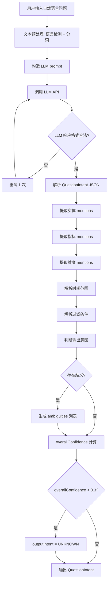
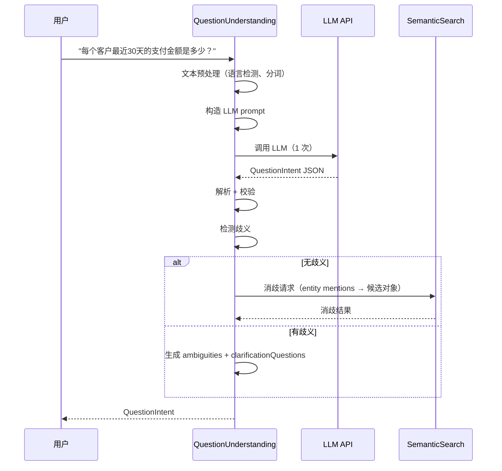

# Question Understanding 详细设计

## 1. 目标与定位

**职责：** 将用户自然语言问题解析为结构化意图（QuestionIntent）。识别实体、指标、维度、时间范围、过滤条件和输出意图。

**LLM 依赖：** 是。这是在线链路的**唯一 LLM 调用点**。

**为什么必须用 LLM：**
- 用户问题是自由形式的自然语言，没有固定格式
- 同一问题有无数种问法："客户消费金额"、"每个客户花了多少钱"、"客户支付排行"、"最近谁买得最多"
- 实体/指标/时间范围的提取需要理解上下文："最近30天"在不同语境下可能指不同时间窗口
- 歧义检测需要语义理解："活跃客户"可能指登录、下单、支付等多种口径
- 规则 NER 无法覆盖业务术语的多样性（"买家"、"会员"、"用户"都可能指客户）

**为什么不用规则：**
- 正则表达式无法覆盖所有自然语言变体
- 关键词匹配无法处理否定、条件、比较等复杂语义
- 规则维护成本随业务场景增长而爆炸

## 2. 上游与下游

```
上游: 用户输入
  ↓ 输入: String "每个客户最近30天的支付金额是多少？"

[Question Understanding]
  ↓ 调用 LLM (1 次)
  ↓ 输出: QuestionIntent

下游: Semantic Search
  消费: QuestionIntent.entities[].mention → 消歧查找
  
下游: Query Planner
  消费: QuestionIntent (完整结构化意图)
```

## 3. 接口契约

```java
public interface QuestionUnderstanding {
    /**
     * 解析自然语言问题。
     *
     * 前置条件：question 非空字符串
     * 后置条件：QuestionIntent 中所有 mention 保留原始文本位置
     *
     * LLM 调用：1 次
     * 超时预算：< 1 秒
     */
    QuestionIntent parse(String question);

    /**
     * 带上下文解析（多轮对话）。
     */
    QuestionIntent parseWithContext(String question, List<QuestionIntent> conversationHistory);

    /**
     * 生成澄清问题。当 intent 有 ambiguity 时调用。
     * 不需要 LLM，使用模板生成。
     */
    List<ClarificationQuestion> generateClarifications(QuestionIntent intent);
}
```

## 4. 处理流程图



## 5. 交互时序图



## 6. 精确输入输出 Schema

### 4.1 输入

```
"每个客户最近30天的支付金额是多少？"
```

### 4.2 LLM Prompt

```text
你是一个数据库查询意图分析专家。分析用户问题，提取结构化意图。

## 提取规则
- entities: 问题中提到的业务实体（客户、订单、商品等）
- metrics: 问题中提到的指标（金额、数量、比率等），包含聚合提示
- dimensions: 问题中提到的分组维度（按客户、按地区、按日期等）
- timeRange: 时间范围，需解析为具体表达式
- filters: 过滤条件（状态、金额范围等）
- outputIntent: QUERY_DETAIL（明细）/ AGGREGATE_RANK（聚合排行）/ EXPLAIN_SCHEMA（解释）/ COMPARE（对比）

## 时间范围解析
- "最近N天" → RELATIVE: CURRENT_DATE - INTERVAL 'N days'
- "本月" → RELATIVE: DATE_TRUNC('month', CURRENT_DATE)
- "上个月" → ABSOLUTE: 上月第一天到上月最后一天
- "今年" → RELATIVE: DATE_TRUNC('year', CURRENT_DATE)
- "去年" → ABSOLUTE: 去年第一天到去年最后一天

## 歧义处理
- 如果某个术语有多种可能解释，在 ambiguities 中列出
- 不要猜测！如果无法确定，标记为 ambiguous
- 例子: "活跃客户" → 可能是 status='ACTIVE'、最近登录、最近下单、最近支付

## 输出格式
严格 JSON，不要输出其他内容。
```

### 4.3 输出：QuestionIntent

```pseudo-json
{
  "originalQuestion": "每个客户最近30天的支付金额是多少？",
  "normalizedQuestion": "每个客户最近30天的支付金额是多少？",
  "language": "zh",
  "entities": [
    {
      "mention": "客户",
      "startChar": 2,
      "endChar": 4,
      "candidateEntityId": null,
      "confidence": 0.90,
      "alternativeEntityIds": []
    }
  ],
  "metrics": [
    {
      "mention": "支付金额",
      "startChar": 10,
      "endChar": 14,
      "candidateMetricId": null,
      "aggregationHint": "SUM",
      "confidence": 0.85,
      "alternativeMetricIds": []
    }
  ],
  "dimensions": [
    {
      "mention": "每个客户",
      "startChar": 0,
      "endChar": 4,
      "candidateColumnId": null,
      "dimensionType": "entity_key",
      "confidence": 0.90
    }
  ],
  "timeRange": {
    "mention": "最近30天",
    "type": "RELATIVE",
    "startExpression": "CURRENT_DATE - INTERVAL '30 days'",
    "endExpression": "CURRENT_DATE",
    "confidence": 0.95
  },
  "filters": [],
  "outputIntent": "AGGREGATE_RANK",
  "ambiguities": [],
  "overallConfidence": 0.88,
  "attributes": {
    "model": "gpt-4.1",
    "promptVersion": "v1",
    "tokensUsed": 350
  }
}
```

### 4.4 歧义场景输出

```pseudo-json
// 输入: "找出活跃客户"
{
  "originalQuestion": "找出活跃客户",
  "entities": [{"mention": "客户", "confidence": 0.90}],
  "filters": [{"mention": "活跃", "confidence": 0.30}],
  "ambiguities": [
    {
      "mention": "活跃",
      "description": "\"活跃\"有多个可能口径，无法自动确定",
      "possibleInterpretations": [
        "客户状态字段为 ACTIVE (customers.status = 'ACTIVE')",
        "最近登录过 (customers.last_login_at 在近期)",
        "最近下单过 (orders.created_at 在近期)",
        "最近支付过 (payments.paid_at 在近期)"
      ],
      "clarificationQuestion": "你希望按哪种标准判断\"活跃客户\"？"
    }
  ],
  "overallConfidence": 0.40
}
```

## 5. LLM 决策

**使用 LLM。** 自然语言理解是 LLM 的核心能力，规则无法覆盖用户问法的多样性。这是在线链路的唯一 LLM 调用点，1 次/问题。

## 6. 测试验收

| 测试场景 | 输入 | 预期输出 |
| --- | --- | --- |
| 简单聚合 | "每个客户最近30天的支付金额" | entities=[客户], metrics=[支付金额], timeRange=RELATIVE 30天, outputIntent=AGGREGATE_RANK |
| 明细查询 | "列出所有订单" | entities=[订单], outputIntent=QUERY_DETAIL |
| 时间范围: 本月 | "本月订单金额" | timeRange.type=RELATIVE, startExpression=DATE_TRUNC('month', CURRENT_DATE) |
| 时间范围: 去年 | "去年订单金额" | timeRange.type=ABSOLUTE |
| 歧义: 活跃 | "找出活跃客户" | ambiguities 非空, overallConfidence < 0.5 |
| 空问题 | "" | 抛出 InvalidQuestionException |
| 无法理解 | "asdfgh" | outputIntent=UNKNOWN, overallConfidence < 0.2 |
| 多轮对话 | "客户呢？" + 历史 | 从历史中补全上下文 |
