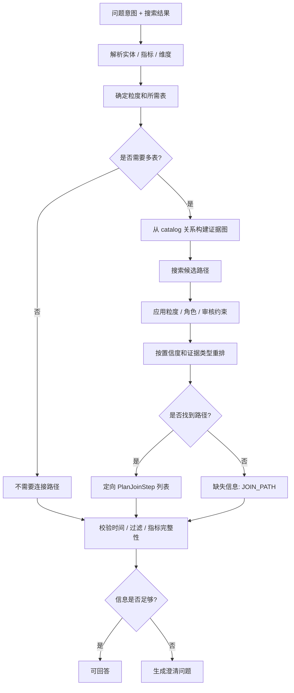
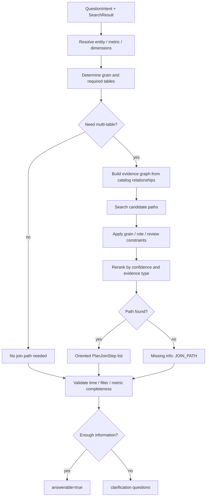

# Query Planner 详细设计

## 1. 目标与定位

**职责：** 将结构化问题意图和搜索候选映射为 `AnswerPlan`：选择主实体、grain、指标、字段、过滤条件和 evidence-backed join path，并判断是否能生成 SQL draft 或需要反问。

**LLM 依赖：** Phase 1 不使用 LLM。LLM 可以在 `Question Understanding` 中帮助解析自然语言，但 Query Planner 只能基于 catalog、relationship evidence、review status 和规则做计划。

## 2. 上游与下游

```text
Question Understanding + Semantic Search
  -> Query Planner
  -> AnswerPlan
  -> SQL Draft Generator / Answer Composer
```

## 3. 接口契约

```java
public interface QueryPlanner {
    AnswerPlan plan(QuestionIntent intent, SearchResult searchResult);
    List<AnswerPlan> planAlternatives(QuestionIntent intent, SearchResult searchResult, int maxAlternatives);
}
```

`AnswerPlan` 中的 join 必须是定向的：

```java
record PlanJoinStep(
    String leftTable,
    String leftColumn,
    String rightTable,
    String rightColumn,
    JoinType joinType,
    String evidenceFingerprint,
    BigDecimal confidence
) {}
```

SQL Draft Generator 只消费 `PlanJoinStep`，不自行推断 join 方向。

## 4. 处理流程

<details open>
<summary>中文</summary>



</details>

<details>
<summary>English</summary>



</details>

## 5. Join Path 选择口径

默认策略不是简单 MST。MST 只保证覆盖节点，不保证：

- 查询 grain 正确。
- join 方向和别名角色正确。
- fact/dimension 角色合理。
- 多条路径语义等价。

Phase 1 使用以下确定性流程：

1. 从 relationship catalog 构建表级/列级 evidence graph。
2. 从 primary entity / metric source / dimension source 生成 required table set。
3. 用 bounded graph search 枚举候选路径。
4. 过滤无 evidence、低 review status、明显破坏 grain 的路径。
5. 按 evidence type、confidence、hop count、review status rerank。
6. 输出定向 `PlanJoinStep`，并保留每一步的 evidence fingerprint。

当多条路径置信度接近且无法判断时，不让 LLM拍板；返回 clarification 或进入 Review Queue。

## 6. 完整性检查

```java
List<MissingInfo> checkCompleteness(AnswerPlan plan) {
    List<MissingInfo> missing = new ArrayList<>();
    if (plan.requiredTables().size() > 1 && plan.joinPath().isEmpty()) {
        missing.add(MissingInfo.joinPath(plan.requiredTables()));
    }
    if (plan.timeRange().isPresent() && plan.timeRange().get().columnRef().isEmpty()) {
        missing.add(MissingInfo.timeColumn(plan.candidateTimeColumns()));
    }
    for (PlanFilter filter : plan.filters()) {
        if (filter.columnRef().isEmpty()) {
            missing.add(MissingInfo.filterDefinition(filter.sourceDescription()));
        }
    }
    return missing;
}
```

未审核指标不是 hard missing，但会在 AnswerPlan 和 SQL Validator 中产生 warning；正式回答口径默认只使用 `BUSINESS_APPROVED` metric。

## 7. LLM 决策

Phase 1 不使用 LLM。Phase 2+ 可以让 LLM 解释多个候选 plan 的业务差异，但不能选择无 evidence 的路径，也不能绕过 review status。

## 8. 测试验收

| 场景 | 预期 |
| --- | --- |
| 单表查询 | 不生成 join path |
| 多表查询 | 输出定向 `PlanJoinStep` |
| 无 evidence path | `answerable=false`, missing `JOIN_PATH` |
| 多条近似路径 | 输出 alternatives 或 clarification |
| 未审核指标 | 可生成 draft warning，不作为正式口径 |
| 缺时间列 | `answerable=false`, missing `TIME_COLUMN` |

---

## 附录 A：行为设计与测试建议

Query Planner 的主策略是 bounded graph search + grain/role constraints + evidence rerank，不使用“只覆盖节点的最小生成树”作为默认策略。这类图算法只能作为未来可选实验策略，不能写入 Phase 1 contract。

建议覆盖的行为：

- required table set 来自 primary entity、metric source、dimension source 和 filters。
- join path 必须来自 catalog relationship evidence，并保留每一步 evidence fingerprint。
- grain、role、hop count、review status 会影响候选路径重排。
- 多条路径证据接近且无法判断时，返回 clarification 或 Review Queue，不由 LLM 拍板。
- 未审核 metric 可进入 draft plan，但必须携带 warning，不作为正式业务口径。

示例：

```pseudo-json
{
  "questionIntent": "每个客户最近30天支付金额是多少？",
  "requiredTables": ["customers", "payments"],
  "expectedBehavior": [
    "枚举 customers 到 payments 的 evidence-backed join path",
    "选择符合 grain 和 role 约束的候选路径",
    "输出定向 PlanJoinStep",
    "如果路径语义不确定则生成澄清问题"
  ]
}
```
