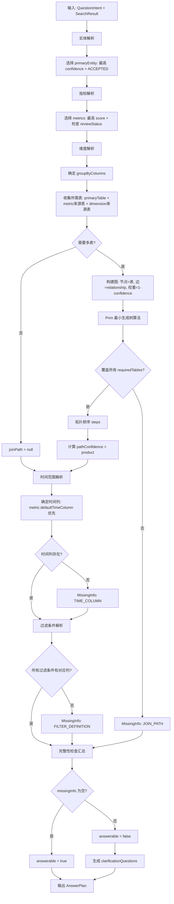
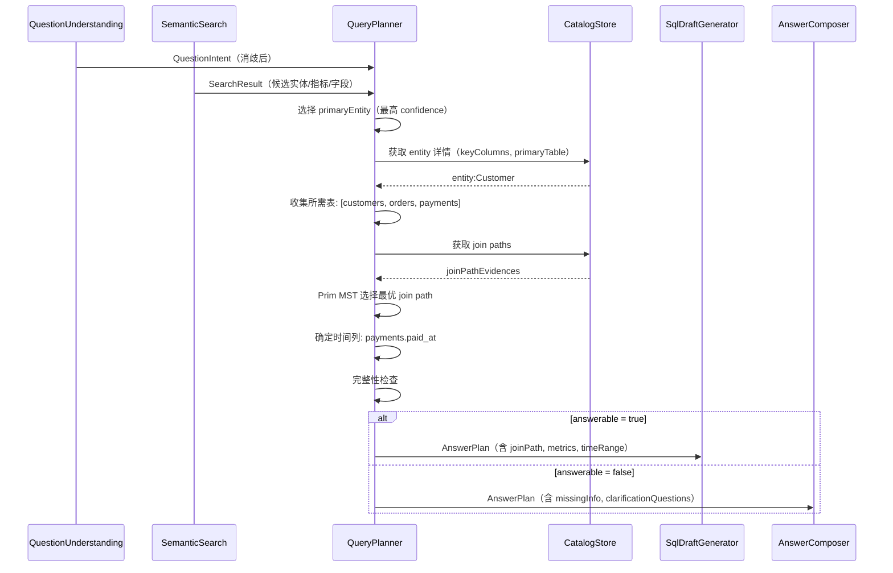

# Query Planner 详细设计

## 1. 目标与定位

**职责：** 将消歧后的 QuestionIntent 映射为 AnswerPlan：选择主实体、grain、指标、字段、join path，判断是否需要聚合，检测缺失信息，决定是生成 SQL draft 还是反问澄清。

**LLM 依赖：** 否。核心逻辑是图算法（join path 选择）和规则匹配。v1 不用 LLM。

**为什么不需要 LLM（v1）：**
- Join path 选择是图的最短路径问题，Dijkstra/Prim 算法是确定性的
- 实体/指标匹配是 Semantic Search 的结果，search 已完成语义工作
- 完整性检查是规则（缺时间列？缺指标公式？）
- LLM 做 join path 选择可能选中无 evidence 的路径，破坏 evidence-based 原则

**为什么 v2 可以考虑 LLM 辅助：**
- 复杂歧义消解（多条 join path 置信度接近，需要语义判断哪条更合理）
- 但 v1 默认选 confidence 最高路径已足够

## 2. 上游与下游

```
上游: QuestionUnderstanding
  ↓ 输入: QuestionIntent (消歧后，entity.mapsToObjectId 已填充)

上游: SemanticSearch
  ↓ 输入: SearchResult (候选实体、指标、字段)

[Query Planner]
  ↓ 选择 join path (图算法)
  ↓ 完整性检查 (规则)
  ↓ 输出: AnswerPlan

下游: SQL Draft Generator (当 answerable=true)
下游: Answer Composer (当 answerable=false，生成澄清问题)
```

## 3. 接口契约

```java
public interface QueryPlanner {
    /**
     * 生成 answer plan。
     *
     * 前置条件：
     * - QuestionIntent 中 entity.candidateEntityId 已消歧
     * - SemanticSearch 已返回候选对象
     *
     * 后置条件：
     * - answerable=true → plan 包含所有 SQL 生成所需信息
     * - answerable=false → plan 包含 missingInfo 和 clarificationQuestions
     */
    AnswerPlan plan(QuestionIntent intent, SearchResult searchResult);

    /**
     * 生成多个候选 plan（不同 join path 等）。
     */
    List<AnswerPlan> planAlternatives(QuestionIntent intent, SearchResult searchResult, int maxAlternatives);
}
```

## 4. 处理流程图



## 5. 交互时序图



## 6. Join Path 选择算法

```java
PlanJoinPath selectJoinPath(String primaryTable, Set<String> requiredTables,
                             Map<String, List<JoinPathEvidence>> joinPaths) {
    // 1. 构建图
    // 节点 = 表名
    // 边 = join path step
    // 权重 = 1 - confidence（confidence 越高，权重越小）
    Map<String, Map<String, Edge>> graph = buildGraph(joinPaths);

    // 2. 从 primaryTable 出发，找覆盖所有 requiredTables 的最小生成树
    // 使用 Prim 算法
    List<Edge> mst = primMST(graph, primaryTable, requiredTables);

    // 3. 如果 MST 不能覆盖所有 requiredTables → 无法生成 join path
    if (mst.size() < requiredTables.size() - 1) {
        return null; // 触发 MissingInfo(JOIN_PATH)
    }

    // 4. 按 primaryTable 出发的拓扑排序排列 steps
    List<JoinPathStep> orderedSteps = topologicalSort(mst, primaryTable);

    // 5. 计算 pathConfidence = product(step.confidence)
    BigDecimal pathConfidence = BigDecimal.ONE;
    for (Edge e : mst) {
        pathConfidence = pathConfidence.multiply(e.confidence);
    }

    return new PlanJoinPath(pathId, orderedSteps, pathConfidence, mst.size());
}
```

## 5. 完整性检查（确定性规则）

```java
List<MissingInfo> checkCompleteness(AnswerPlan plan) {
    List<MissingInfo> missing = new ArrayList<>();

    // 需要多表但没有 join path
    if (plan.requiredTables().size() > 1 && plan.joinPath() == null) {
        missing.add(new MissingInfo(MissingInfoType.JOIN_PATH,
            "无法找到从 " + plan.primaryEntity().primaryTable() + " 到所有需要表的 join path",
            plan.requiredTables(), null));
    }

    // 有时间过滤但找不到时间列
    if (plan.timeRange() != null && plan.timeRange().columnRef() == null) {
        missing.add(new MissingInfo(MissingInfoType.TIME_COLUMN,
            "无法确定时间过滤应该使用哪个列",
            plan.candidateTimeColumns(), "请指定时间范围对应的列"));
    }

    // 有过滤条件但找不到对应列
    for (PlanFilter filter : plan.filters()) {
        if (filter.columnRef() == null) {
            missing.add(new MissingInfo(MissingInfoType.FILTER_DEFINITION,
                "无法确定过滤条件 \"" + filter.sourceDescription() + "\" 对应的列",
                filter.candidates(), "请明确过滤条件"));
        }
    }

    // 指标未审核
    for (PlanMetric metric : plan.metrics()) {
        if (metric.reviewStatus() == ReviewStatus.SUGGESTED) {
            // 不是 MissingInfo，而是 warning
            // plan 仍然 answerable，但 SQL 中会标注
        }
    }

    return missing;
}
```

## 6. LLM 决策

**不使用 LLM（v1）。** Join path 选择是图算法，完整性检查是规则。LLM 可能选中无 evidence 的路径。

## 7. 测试验收

| 测试场景 | 预期 |
| --- | --- |
| 完整信息 | answerable=true, joinPath 非空, metrics 非空 |
| 缺失 join path | answerable=false, missingInfo=[JOIN_PATH] |
| 缺失时间列 | answerable=false, missingInfo=[TIME_COLUMN] |
| 未审核指标 | answerable=true, metric.reviewStatus=SUGGESTED |
| 多表 join | joinPath 覆盖所有 requiredTables |
| 单表查询 | joinPath=null（不需要）, answerable=true |
| 歧义实体 | answerable=false, clarificationQuestions 非空 |