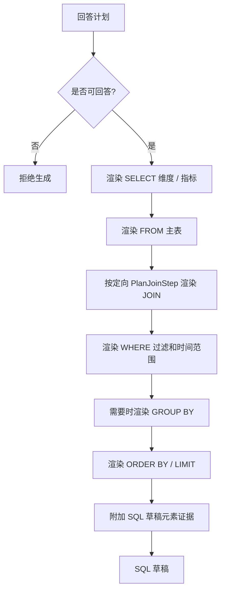
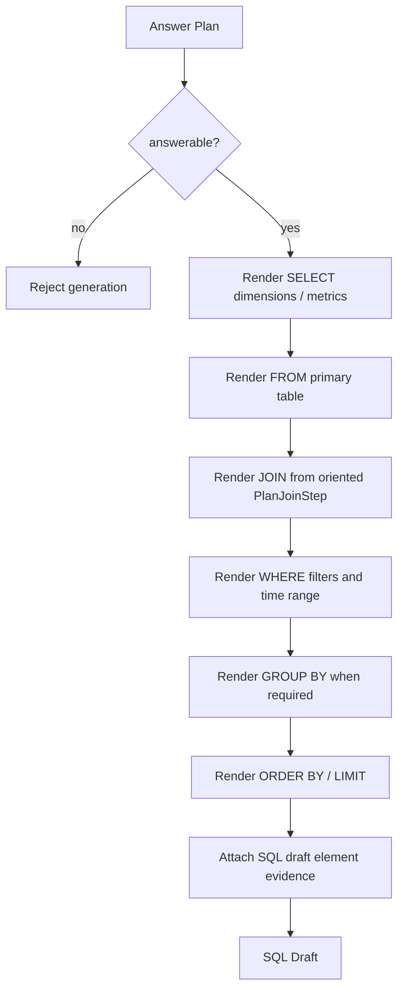

# SQL Draft Generator 详细设计

## 1. 目标与定位

**职责：** 根据 `AnswerPlan` 生成 SQL 草稿。它只做模板渲染，不做事实推断，不决定 join 方向，不调用 LLM。

**硬边界：**

- 只生成 read-only SQL draft。
- 表、字段、表达式、join 条件都必须来自 `AnswerPlan`。
- join 方向来自 `PlanJoinStep`，本模块不从字符串反推 source/target。
- SQL draft 不能直接执行，必须经过 SQL Validator。

## 2. 上游与下游

```text
Query Planner
  -> AnswerPlan
  -> SQL Draft Generator
  -> SqlDraft
  -> SQL Validator
```

## 3. 接口契约

```java
public interface SqlDraftGenerator {
    SqlDraft generate(AnswerPlan plan);
    SqlDraft generate(AnswerPlan plan, String dialect);
}
```

`SqlDraft` 除 SQL 文本外，还必须携带结构化 elements，供 validator 逐项校验：

```java
record SqlDraft(
    String sql,
    String dialect,
    List<SqlDraftElement> elements,
    List<Warning> warnings
) {}
```

## 4. 生成流程

<details open>
<summary>中文</summary>



</details>

<details>
<summary>English</summary>



</details>

## 5. Join 渲染规则

SQL Draft Generator 不执行路径搜索，也不自行推断 join 方向。它只消费 planner 给出的结构：

```java
for (PlanJoinStep step : plan.joinPath().steps()) {
    sql.append("JOIN ")
       .append(quote(step.rightTable(), dialect))
       .append(" ON ")
       .append(alias(step.leftTable())).append(".").append(quote(step.leftColumn(), dialect))
       .append(" = ")
       .append(alias(step.rightTable())).append(".").append(quote(step.rightColumn(), dialect));

    elements.add(SqlDraftElement.join(step.evidenceFingerprint(), step.confidence()));
}
```

如果某一步缺少 table/column/evidence，生成失败并返回 `SqlGenerationException`；不能用字符串 heuristic 补齐。

## 6. LLM 决策

Phase 1 Scope 绝对不使用 LLM 生成 SQL。Phase 2+ 可以让 LLM解释 SQL draft，但不能修改 SQL 文本、表字段、join 条件或过滤条件。

## 7. 测试验收

| 场景 | 预期 |
| --- | --- |
| 单表查询 | 生成 SELECT + FROM，无 JOIN |
| 多表查询 | JOIN 条件逐项来自 `PlanJoinStep` |
| 未审核指标 | SQL 中带 draft warning / comment |
| 缺 evidence join | 生成失败，交给 Query Planner / Validator 处理 |
| MySQL 方言 | 使用 MySQL quote 和日期表达式策略 |
| PostgreSQL 方言 | 使用 PostgreSQL quote 和日期表达式策略 |
| 非 SELECT 需求 | 拒绝生成 |
