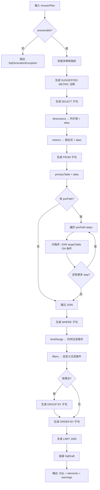
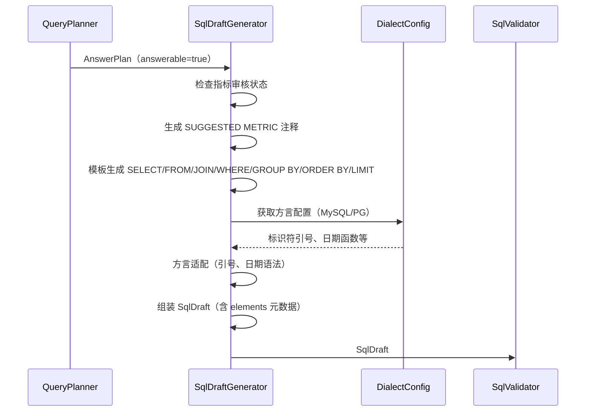

# SQL Draft Generator 详细设计

## 1. 目标与定位

**职责：** 根据 AnswerPlan 生成 SQL 草稿。使用严格的模板生成，绝对不能使用 LLM。

**LLM 依赖：** **绝对不能使用 LLM。** 这是整个系统中最关键的 LLM 禁区。

**为什么绝对不能使用 LLM：**
- LLM 生成 SQL 会**编造不存在的列名**：catalog 中有 `customers.name`，LLM 可能编造 `customers.full_name`
- LLM 会**编造 join 条件**：catalog 中只有 `orders.customer_id = customers.id`，LLM 可能编造 `orders.user_id = customers.id`
- LLM 会**编造函数**：生成 `DATE_SUB()` 在 PostgreSQL 中不存在
- LLM 会**忽略安全约束**：可能生成 `DELETE`、`DROP` 等危险操作
- SQL 生成是**确定性模板填充**：表名、列名、join 条件、聚合函数全部来自 AnswerPlan，不需要任何"创造性"

**为什么用模板而不是 LLM：**
- 模板保证生成的 SQL 中每个表名、列名都来自 catalog
- 模板保证每个 join 条件都来自 evidence
- 模板保证方言语法正确
- 模板可以审计和测试，LLM 输出不可预测

## 2. 上游与下游

```
上游: Query Planner
  ↓ 输入: AnswerPlan (answerable=true)

[SQL Draft Generator]
  ↓ 模板填充（确定性）
  ↓ 输出: SqlDraft

下游: SQL Validator
  消费: SqlDraft.sql (校验)
  消费: SqlDraft.elements (逐项校验)
```

## 3. 接口契约

```java
public interface SqlDraftGenerator {
    /**
     * 根据 AnswerPlan 生成 SQL draft。
     *
     * 前置条件：
     * - plan.answerable() == true
     * - plan.primaryEntity() 非空
     * - 所有表名和列名来自 catalog
     *
     * 后置条件：
     * - SQL 字符串语法正确
     * - 所有表引用来自 catalog
     * - 所有 join 条件来自 evidence
     * - 只生成 SELECT 语句
     *
     * 绝对不使用 LLM。
     */
    SqlDraft generate(AnswerPlan plan);

    SqlDraft generate(AnswerPlan plan, String dialect);
}
```

## 4. 处理流程图



## 5. 交互时序图



## 6. SQL 生成模板

```java
String generateSQL(AnswerPlan plan, DialectConfig dialect) {
    StringBuilder sql = new StringBuilder();

    // -- SUGGESTED METRIC 注释
    for (PlanMetric m : plan.metrics()) {
        if (m.reviewStatus() == ReviewStatus.SUGGESTED) {
            sql.append("-- SUGGESTED METRIC: ").append(m.metricName()).append("\n");
            sql.append("-- Expression: ").append(m.expression()).append("\n");
            sql.append("-- Review this metric before using in production\n");
        }
    }

    // SELECT
    sql.append("SELECT\n");
    List<String> selectParts = new ArrayList<>();
    int colIndex = 1;
    for (PlanDimension dim : plan.dimensions()) {
        String alias = dim.physicalName().contains(".")
            ? dim.physicalName().substring(dim.physicalName().lastIndexOf(".") + 1)
            : "col_" + colIndex;
        selectParts.add("  " + quote(dim.physicalName(), dialect) + " AS " + alias);
        colIndex++;
    }
    for (PlanMetric m : plan.metrics()) {
        selectParts.add("  " + m.expression() + " AS " + toAlias(m.metricName()));
    }
    sql.append(String.join(",\n", selectParts)).append("\n");

    // FROM
    String primaryTable = plan.primaryEntity().primaryTable();
    String primaryAlias = abbreviation(primaryTable);
    sql.append("FROM ").append(quote(primaryTable, dialect)).append(" ").append(primaryAlias).append("\n");

    // JOIN
    if (plan.joinPath() != null) {
        String prevAlias = primaryAlias;
        String prevTable = primaryTable;
        for (JoinPathStep step : plan.joinPath().steps()) {
            String joinTable = extractTable(step.target());
            String joinAlias = abbreviation(joinTable);
            sql.append("JOIN ").append(quote(joinTable, dialect)).append(" ").append(joinAlias).append("\n");
            sql.append("  ON ").append(joinAlias).append(".").append(extractColumn(step.target()))
               .append(" = ").append(prevAlias).append(".").append(extractColumn(step.source())).append("\n");
            prevAlias = joinAlias;
            prevTable = joinTable;
        }
    }

    // WHERE
    List<String> whereParts = new ArrayList<>();
    if (plan.timeRange() != null) {
        whereParts.add(plan.timeRange().columnRef() + " >= " + plan.timeRange().startExpression());
        whereParts.add(plan.timeRange().columnRef() + " < " + plan.timeRange().endExpression());
    }
    for (PlanFilter f : plan.filters()) {
        whereParts.add(f.columnRef() + " " + f.operator().sql() + " " + quoteValue(f.value(), dialect));
    }
    if (!whereParts.isEmpty()) {
        sql.append("WHERE ").append(String.join("\n  AND ", whereParts)).append("\n");
    }

    // GROUP BY
    if (plan.needsAggregation() && !plan.groupByColumns().isEmpty()) {
        sql.append("GROUP BY ").append(String.join(", ", plan.groupByColumns())).append("\n");
    }

    // ORDER BY
    if (!plan.metrics().isEmpty()) {
        sql.append("ORDER BY ").append(toAlias(plan.metrics().get(0).metricName())).append(" DESC\n");
    }

    // LIMIT
    sql.append("LIMIT 1000");

    return sql.toString();
}
```

## 5. LLM 决策

**绝对不使用 LLM。** SQL 是确定性模板生成。LLM 会编造不存在的列名、join 条件和函数，这是生产环境不可接受的。

## 6. 测试验收

| 测试场景 | 预期 |
| --- | --- |
| 单表查询 | SELECT + FROM + WHERE，无 JOIN |
| 多表 JOIN | JOIN 条件来自 evidence |
| 聚合查询 | 含 GROUP BY 和聚合函数 |
| 时间过滤 | WHERE 含时间范围条件 |
| 未审核指标 | SQL 中含 `-- SUGGESTED METRIC` 注释 |
| 不生成 INSERT | 所有 SQL 都是 SELECT |
| 不生成 DELETE | 所有 SQL 都是 SELECT |
| 方言: MySQL | 反引号标识符 |
| 方言: PostgreSQL | 双引号标识符 |
| 空 plan | 抛出 SqlGenerationException |