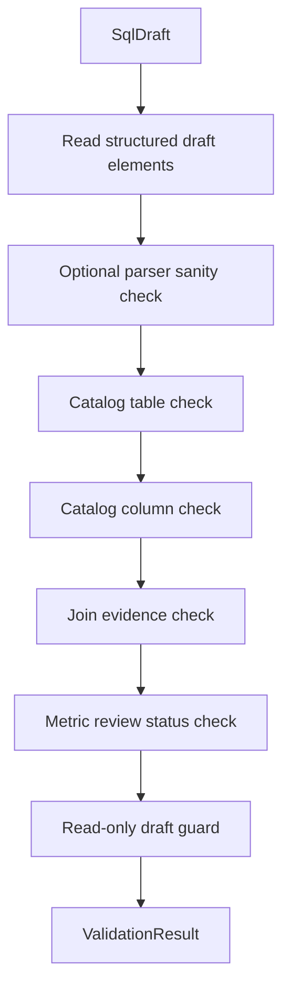

# SQL Validator 详细设计

## 1. 目标与定位

**职责：** 校验 SQL draft 是否仍然受 catalog、evidence 和 governance 约束。Phase 1 validator 是 draft guard，不是完整数据库安全审计器。

**Phase 1 Scope 承诺：**

- catalog 表存在性。
- catalog 字段存在性。
- join evidence 存在性和置信度 warning。
- metric review status。
- read-only / draft guard。
- 基础 parser 结构校验。

**Future Capability：**

- 深层 GROUP BY / window / subquery 合法性。
- 方言自动改写。
- 成本估算。
- 权限和数据安全审计。
- SQL 自动执行前的数据库侧 explain / dry run。

## 2. 上游与下游

```text
SQL Draft Generator
  -> SqlDraft {sql, elements, dialect}
  -> SQL Validator
  -> ValidationResult
  -> Answer Composer
```

## 3. 接口契约

```java
public interface SqlValidator {
    ValidationResult validate(SqlDraft draft);
}
```

Phase 1 不提供“任意 raw SQL 完整校验”承诺。若需要校验人工 SQL，必须先经过 relation-detector parser 或其他结构化 SQL parser 得到 statement kind、table refs、column refs 和 join predicates。

## 4. 校验流程



## 5. 规则说明

### 5.1 表和字段存在性

表和字段来自 `SqlDraftElement` 或 parser 结构化结果，不从 SQL 字符串用 regex 提取。

```java
for (SqlDraftElement element : draft.elements()) {
    if (element.type() == TABLE_REF && !catalog.hasTable(element.table())) {
        errors.add(TABLE_NOT_FOUND);
    }
    if (element.type() == COLUMN_REF && !catalog.hasColumn(element.table(), element.column())) {
        errors.add(COLUMN_NOT_FOUND);
    }
}
```

### 5.2 Join Evidence

每个 join element 必须携带 relationship evidence fingerprint。没有 evidence 的 join 不能作为默认 SQL draft 输出。

```java
for (SqlDraftElement element : draft.elements()) {
    if (element.type() == JOIN_REF) {
        Optional<RelationshipEvidence> evidence = catalog.findRelationship(element.evidenceFingerprint());
        if (evidence.isEmpty()) {
            errors.add(JOIN_NO_EVIDENCE);
        } else if (evidence.get().confidence().compareTo(LOW_CONFIDENCE_THRESHOLD) < 0) {
            warnings.add(LOW_CONFIDENCE_JOIN);
        }
    }
}
```

`JOIN_NO_EVIDENCE` 是 semantic-layer validator draft diagnostic，不是 relation-detector 当前 warning schema。

### 5.3 Read-only / Draft Guard

Phase 1 不用关键字黑名单或 `contains` 判断危险操作。只接受 SQL Draft Generator 生成的 read-only draft，并通过结构化 statement kind 校验：

```java
if (draft.statementKind() != StatementKind.SELECT) {
    errors.add(NON_READ_ONLY_DRAFT);
}
```

如果 future 支持用户输入 raw SQL，必须先经过 parser 得到 statement kind；不能用 keyword blacklist 近似判断。

### 5.4 指标审核状态

```java
for (SqlDraftElement element : draft.elements()) {
    if (element.type() == METRIC_EXPRESSION
        && element.reviewStatus() != ReviewStatus.BUSINESS_APPROVED) {
        warnings.add(METRIC_NOT_BUSINESS_APPROVED);
    }
}
```

未审核指标可用于 draft，但 Answer Composer 必须明确提示，不能作为正式口径。

## 6. LLM 决策

不使用 LLM。validator 只做结构化规则校验和 catalog/evidence 查询。

## 7. 测试验收

| 场景 | 预期 |
| --- | --- |
| 表不存在 | `TABLE_NOT_FOUND` |
| 列不存在 | `COLUMN_NOT_FOUND` |
| join 无 evidence | `JOIN_NO_EVIDENCE` |
| join evidence 低置信度 | `LOW_CONFIDENCE_JOIN` warning |
| metric 未 `BUSINESS_APPROVED` | `METRIC_NOT_BUSINESS_APPROVED` warning |
| statement kind 非 SELECT | `NON_READ_ONLY_DRAFT` |
| parser sanity check 失败 | `SYNTAX_ERROR` 或 `DIALECT_MISMATCH` draft diagnostic |
