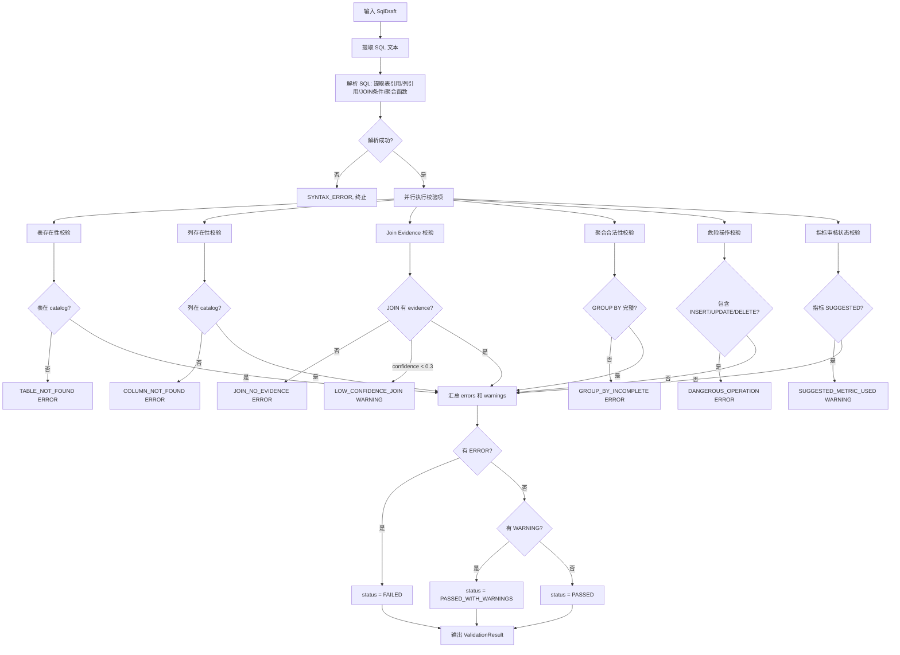
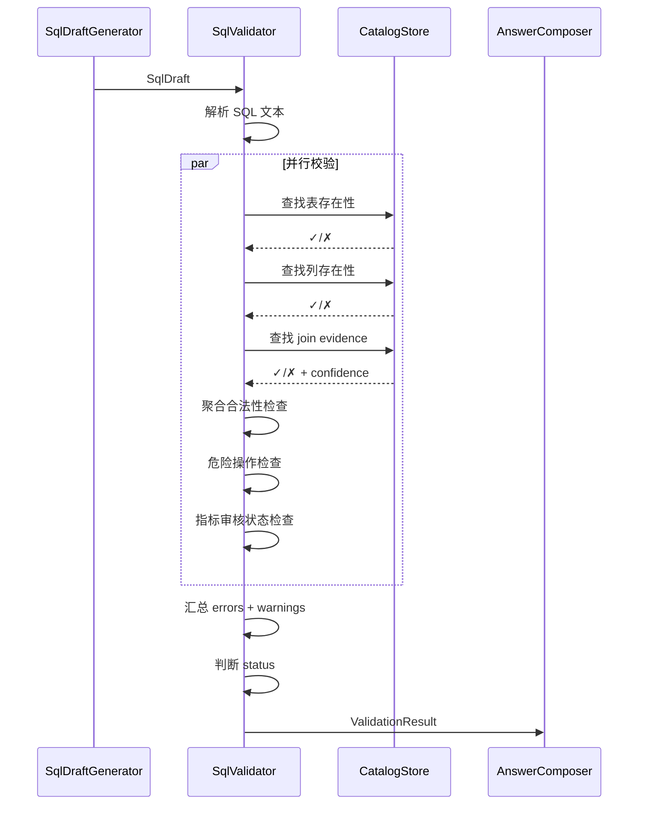

# SQL Validator 详细设计

## 1. 目标与定位

**职责：** 校验 SQL Draft 的正确性和安全性。验证表字段是否存在、join 是否有 evidence、聚合是否合法、是否包含危险操作。

**LLM 依赖：** 否。规则校验。表存在性、列存在性、join evidence 都是查 catalog 的确定性操作。

**为什么不需要 LLM：**
- 表存在性：查 catalog，是/否，确定性
- 列存在性：查 catalog，是/否，确定性
- join evidence：查 relationship index，是/否，确定性
- 聚合合法性：SQL 语法分析，规则
- 危险操作：关键字匹配，规则
- LLM 做校验可能漏掉错误（假阴性）或误报（假阳性）

## 2. 上游与下游

```
上游: SQL Draft Generator
  ↓ 输入: SqlDraft {sql, elements, dialect}

[SQL Validator]
  ↓ 查 catalog（表/列存在性）
  ↓ 查 relationship index（join evidence）
  ↓ 输出: ValidationResult {status, checks, errors, warnings}

下游: Answer Composer
  消费: ValidationResult
  - PASSED → 输出 SQL + 解释
  - PASSED_WITH_WARNINGS → 输出 SQL + 警告
  - FAILED → 不输出 SQL，输出错误解释
```

## 3. 接口契约

```java
public interface SqlValidator {
    /**
     * 校验 SQL draft。
     *
     * 前置条件：draft.sql 非空
     * 后置条件：ValidationResult.status 为 PASSED/PASSED_WITH_WARNINGS/FAILED
     *
     * 绝对不使用 LLM。
     */
    ValidationResult validate(SqlDraft draft);

    /**
     * 校验原始 SQL 文本（不依赖 SqlDraft 元数据）。
     * 用于校验人工编写的 SQL 或外部输入的 SQL。
     */
    ValidationResult validateRaw(String sql, String dialect);

    /**
     * 快速校验（只检查危险操作和表存在性）。
     * 用于高性能场景。
     */
    ValidationResult quickValidate(String sql, String dialect);
}
```

## 4. 校验流程图



## 5. 交互时序图



## 6. 校验项与规则

### 4.1 表存在性（ERROR）

```java
// 从 SQL 中提取所有表引用
Set<String> tableRefs = extractTableReferences(sql);
for (String tableRef : tableRefs) {
    if (!catalog.hasTable(tableRef)) {
        errors.add(new ValidationError(TABLE_NOT_FOUND, "表 " + tableRef + " 在 catalog 中不存在", ...));
    }
}
```

### 4.2 列存在性（ERROR）

```java
// 从 SQL 中提取所有列引用（带表别名解析）
Set<ColumnRef> columnRefs = extractColumnReferences(sql, tableAliases);
for (ColumnRef colRef : columnRefs) {
    if (!catalog.hasColumn(colRef.table(), colRef.column())) {
        errors.add(new ValidationError(COLUMN_NOT_FOUND, "列 " + colRef + " 在 catalog 中不存在", ...));
    }
}
```

### 4.3 Join Evidence（ERROR）

```java
// 从 SQL 中提取所有 JOIN ON 条件
List<JoinCondition> joinConditions = extractJoinConditions(sql);
for (JoinCondition jc : joinConditions) {
    if (jc.isEqualityCondition()) {
        Optional<NormalizedRelationship> evidence = catalog.findRelationship(
            jc.leftTable(), jc.leftColumn(), jc.rightTable(), jc.rightColumn());
        if (evidence.isEmpty()) {
            errors.add(new ValidationError(JOIN_NO_EVIDENCE,
                "JOIN 条件 " + jc + " 未找到 relationship evidence", ...));
        } else if (evidence.get().confidence() < 0.3) {
            warnings.add(new ValidationWarning(LOW_CONFIDENCE_JOIN,
                "JOIN 条件 " + jc + " 的 evidence 置信度较低: " + evidence.get().confidence(), ...));
        }
    }
}
```

### 4.4 聚合合法性（ERROR）

```java
// 检查 GROUP BY 是否包含所有非聚合列
Set<String> nonAggregateColumns = findNonAggregateSelectColumns(sql);
Set<String> groupByColumns = extractGroupByColumns(sql);
if (!groupByColumns.containsAll(nonAggregateColumns)) {
    Set<String> missing = new HashSet<>(nonAggregateColumns);
    missing.removeAll(groupByColumns);
    errors.add(new ValidationError(GROUP_BY_INCOMPLETE,
        "SELECT 中的非聚合列未出现在 GROUP BY: " + missing, ...));
}
```

### 4.5 危险操作（ERROR）

```java
// 关键字黑名单
Set<String> DANGEROUS_KEYWORDS = Set.of(
    "INSERT", "UPDATE", "DELETE", "DROP", "TRUNCATE",
    "CREATE", "ALTER", "EXECUTE", "CALL", "GRANT", "REVOKE"
);
for (String keyword : DANGEROUS_KEYWORDS) {
    if (sql.toUpperCase().contains(keyword)) {
        errors.add(new ValidationError(DANGEROUS_OPERATION,
            "SQL 包含危险操作: " + keyword, ...));
    }
}
```

### 4.6 指标审核状态（WARNING）

```java
for (SqlDraftElement element : draft.elements()) {
    if (element.type() == SqlElementType.METRIC_EXPRESSION
        && element.reviewStatus() == ReviewStatus.SUGGESTED) {
        warnings.add(new ValidationWarning(SUGGESTED_METRIC_USED,
            "指标 " + element.sourceObjectId() + " 审核状态为 SUGGESTED", ...));
    }
}
```

## 5. LLM 决策

**不使用 LLM。** 所有校验都是查 catalog 的确定性操作。LLM 校验会漏报（假阴性）或误报（假阳性）。

## 6. 测试验收

| 测试场景 | 预期 |
| --- | --- |
| 正确 SQL | status=PASSED |
| 不存在表 | TABLE_NOT_FOUND ERROR |
| 不存在列 | COLUMN_NOT_FOUND ERROR |
| 无 evidence join | JOIN_NO_EVIDENCE ERROR |
| GROUP BY 不完整 | GROUP_BY_INCOMPLETE ERROR |
| INSERT 语句 | DANGEROUS_OPERATION ERROR |
| DELETE 语句 | DANGEROUS_OPERATION ERROR |
| 未审核指标 | SUGGESTED_METRIC_USED WARNING |
| 低置信度 join | LOW_CONFIDENCE_JOIN WARNING |
| 空 SQL | FAILED, "Empty SQL" |