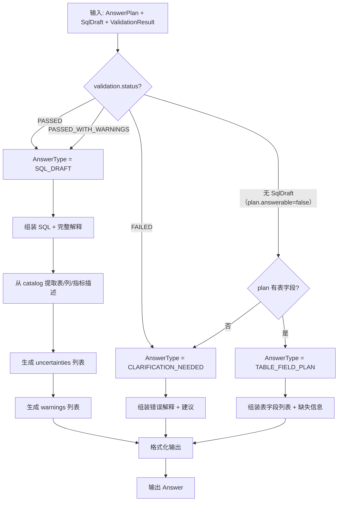
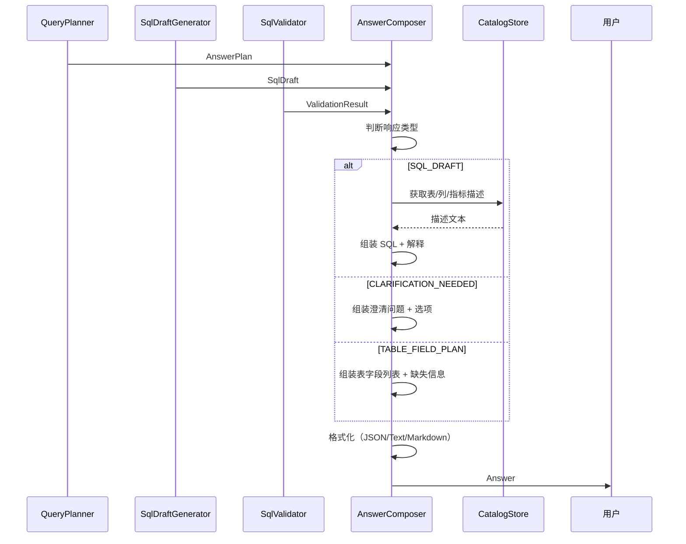

# Answer Composer 详细设计

## 1. 目标与定位

**职责：** 将 validation result 和 answer plan 组装为最终用户响应。根据场景输出不同形式：SQL draft + 解释、澄清问题、或表字段计划。

**LLM 依赖：** 否。模板化响应组装。解释文本来自 catalog 中的描述字段，不需要 LLM 重新生成。

**为什么不需要 LLM：**
- SQL draft 的解释文本来自 catalog 中的 `SemanticTable.description`、`SemanticColumn.description` 等字段（这些是 LLM Enricher 离线生成的）
- 响应结构是固定的模板（SQL + 使用的表 + 使用的字段 + 不确定项）
- 澄清问题是模板化的（"请选择以下选项之一"）
- 在线链路不需要再次调用 LLM 做文本生成，避免延迟和成本

## 2. 上游与下游

```
上游: SQL Draft Generator
  ↓ 输入: SqlDraft

上游: SQL Validator
  ↓ 输入: ValidationResult

上游: Query Planner
  ↓ 输入: AnswerPlan

[Answer Composer]
  ↓ 模板组装
  ↓ 输出: Answer (JSON + 人类可读文本)

下游: 用户
  看到: SQL draft + 解释 + 不确定项
  或看到: 澄清问题
  或看到: 表字段计划
```

## 3. 接口契约

```java
public interface AnswerComposer {
    /**
     * 组装完整响应（SQL + 解释）。
     * 前置条件: validation.status != FAILED
     */
    Answer compose(AnswerPlan plan, SqlDraft draft, ValidationResult validation);

    /**
     * 组装澄清问题响应。
     * 前置条件: plan.answerable() == false
     */
    Answer composeClarification(AnswerPlan plan);

    /**
     * 组装表字段计划响应（无 SQL）。
     * 前置条件: plan 有表字段信息但无法生成 SQL
     */
    Answer composeTableFieldPlan(AnswerPlan plan);

    /**
     * 格式化为人类可读文本（中文/英文）。
     */
    String formatAsText(Answer answer, String language);

    /**
     * 格式化为 JSON。
     */
    String formatAsJson(Answer answer);
}
```

## 4. 响应类型决策流程图



## 5. 交互时序图



## 6. 响应类型决策树

```
validation.status == PASSED || PASSED_WITH_WARNINGS
  → AnswerType.SQL_DRAFT
  → 输出: SQL + 完整解释 + warnings

validation.status == FAILED
  → AnswerType.CLARIFICATION_NEEDED
  → 输出: 错误解释 + 建议

plan.answerable == false
  → AnswerType.CLARIFICATION_NEEDED
  → 输出: 澄清问题 + 选项

plan 有表字段但无法生成 SQL
  → AnswerType.TABLE_FIELD_PLAN
  → 输出: 表字段列表 + 缺失信息
```

## 5. LLM 决策

**不使用 LLM。** 响应组装是模板化操作。解释文本来自 catalog 中 LLM Enricher 离线生成的描述字段。在线链路不需要再次调用 LLM。

## 6. 测试验收

| 测试场景 | 预期输出类型 |
| --- | --- |
| PASSED + SQL | SQL_DRAFT，含完整解释 |
| PASSED_WITH_WARNINGS | SQL_DRAFT，含 SQL + 警告 |
| FAILED | CLARIFICATION_NEEDED，含错误解释 |
| answerable=false | CLARIFICATION_NEEDED，含澄清问题 |
| 表字段计划 | TABLE_FIELD_PLAN，含候选表字段 |
| 未审核指标 | 解释中标注 "审核状态: SUGGESTED" |
| 中文输出 | 中文模板 |
| 英文输出 | 英文模板 |