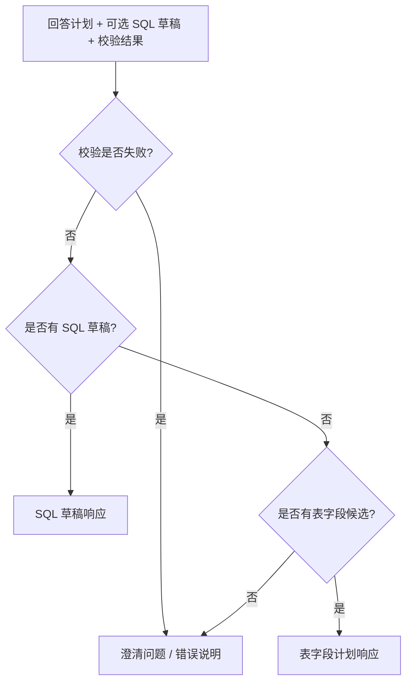
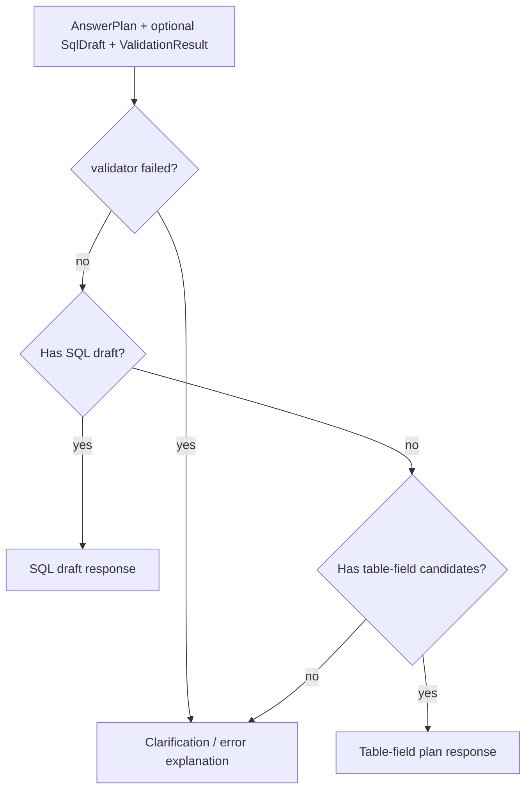

# Answer Composer 详细设计

> 当前实现状态：目标设计，尚未落地。当前代码不生成面向用户的回答，也没有在线 Answer API；当前输出是离线 KG JSON artifact。

## 1. 目标与定位

**职责：** 将 `AnswerPlan`、`SqlDraft` 和 `ValidationResult` 组装为最终响应。Phase 1 使用模板输出，所有事实来自 catalog、plan 和 validator，不在线调用 LLM 改写事实。

## 2. 上游与下游

```text
Query Planner
SQL Draft Generator
SQL Validator
  -> Answer Composer
  -> User
```

## 3. 接口契约

```java
public interface AnswerComposer {
    Answer compose(AnswerPlan plan, SqlDraft draft, ValidationResult validation);
    Answer composeClarification(AnswerPlan plan);
    Answer composeTableFieldPlan(AnswerPlan plan);
    String formatAsText(Answer answer, String language);
    String formatAsJson(Answer answer);
}
```

## 4. 响应类型

| 类型 | 触发条件 | 输出 |
| --- | --- | --- |
| `SQL_DRAFT` | plan answerable 且 validator 未失败 | SQL draft、使用表字段、join evidence、warnings |
| `CLARIFICATION_NEEDED` | 信息不足或 validator failed | 缺失信息、候选选项、下一步问题 |
| `TABLE_FIELD_PLAN` | 能定位表字段但不能安全生成 SQL | 候选表、字段、join path、审核点 |

## 5. 流程图

<details open>
<summary>中文</summary>



</details>

<details>
<summary>English</summary>



</details>

## 6. LLM 决策

Phase 1 不在线调用 LLM。Phase 2+ 可以增加 LLM 文案润色，但必须满足：

- 只能基于 Answer JSON 改写表述。
- 不能新增表、字段、指标、join path 或 SQL。
- 不能移除 warning / review status。
- 输出仍保留 machine-readable answer。

## 7. 测试验收

| 场景 | 预期 |
| --- | --- |
| Validator passed | 输出 `SQL_DRAFT` |
| Validator warning | 输出 SQL，同时展示 warning |
| Validator failed | 不输出可执行 SQL，输出澄清/错误说明 |
| 仅有候选表字段 | 输出 `TABLE_FIELD_PLAN` |
| 未审核指标 | 明确标注 draft / not business-approved |
| Future LLM polish | 不改变 Answer JSON 的事实字段 |
