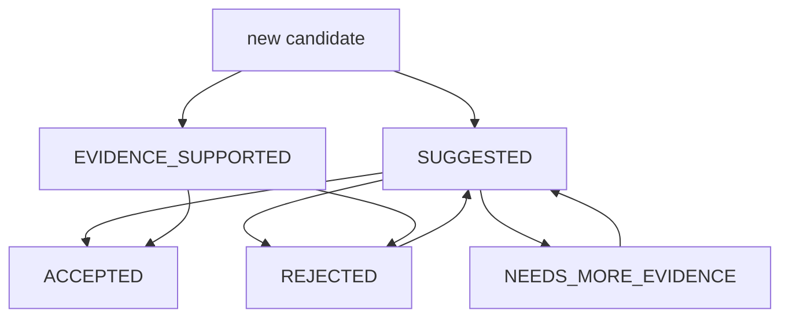

# Review Queue 详细设计

## 1. 目标与定位

**职责：** 管理需要人工或治理流程确认的 semantic candidate，包括指标候选、实体候选、同义词冲突、低置信度对象和冲突解释。

Review Queue 是状态机和审计日志，不是另一个 LLM 判断器。

## 2. 上游与下游

```text
LLM Semantic Enricher
Semantic Evidence Builder
Lexicon Manager
Query Planner / SQL Validator
  -> Review Queue
  -> Human / Governance workflow
  -> Semantic Catalog Store
```

LLM 可以提供 conflict label、推荐说明和影响范围摘要，但不能最终确认冲突，也不能把对象提升为 `ACCEPTED`。

## 3. 状态模型

| 状态 | 含义 |
| --- | --- |
| `SUGGESTED` | 候选对象或候选口径，尚未有足够治理确认。 |
| `EVIDENCE_SUPPORTED` | 有 evidence 支撑，但不是人工确认的正式业务口径。 |
| `NEEDS_MORE_EVIDENCE` | 当前 evidence 不足，需要后续 scan 或人工补充。 |
| `ACCEPTED` | 人工或治理流程确认，可作为默认回答口径。 |
| `REJECTED` | 已拒绝，不参与默认搜索、规划和 SQL draft。 |

## 4. 接口契约

```java
public interface ReviewQueue {
    ReviewItem submit(ReviewItem item);
    List<ReviewItem> submitBatch(List<ReviewItem> items);
    List<ReviewItem> listPending(ReviewFilter filter, int limit, int offset);
    ReviewItem decide(ReviewDecision decision);
    List<ReviewItem> getHistory(String objectId);
    ReviewQueueStats getStats();
    ReviewItem reopen(String reviewId, String reason);
}
```

## 5. ReviewItem 示例

```json
{
  "reviewId": "review-001",
  "objectId": "metric:customer_total_paid_amount",
  "objectType": "METRIC",
  "status": "SUGGESTED",
  "priority": "MEDIUM",
  "recommendation": "建议确认是否过滤退款和失败支付。",
  "context": {
    "relatedTables": ["customers", "orders", "payments"],
    "sampleSqlDraft": "SELECT c.id, SUM(p.amount) FROM customers c JOIN orders o ON o.customer_id = c.id JOIN payments p ON p.order_id = o.id GROUP BY c.id",
    "impact": "影响客户消费金额、客户排行、消费统计等问题。",
    "evidenceRefs": ["VALUE:AGGREGATE:payments.amount->paid_amount_30d"]
  },
  "reviewedBy": null,
  "reviewedAt": null
}
```

## 6. 状态流转



## 7. 优先级排序

1. 冲突和口径不一致。
2. 指标候选。
3. 同义词多映射。
4. 低置信度 entity。
5. 长期无人使用的低优先级 candidate。

同优先级内按创建时间和影响范围排序。

## 8. LLM 决策

Review Queue 不使用 LLM 做审核决策。LLM 的 conflict summary 只能作为 `recommendation` 或 `context`，最终状态由人工或治理规则写入。

## 9. 测试验收

| 场景 | 预期 |
| --- | --- |
| 提交新指标 | `SUGGESTED`, priority `MEDIUM` |
| 提交 evidence-supported table/column | `EVIDENCE_SUPPORTED` |
| 审核通过 | Catalog 对象状态变为 `ACCEPTED` |
| 审核拒绝 | Catalog 对象状态变为 `REJECTED` |
| LLM 推荐审核结果 | 只保存为 recommendation，不直接改变状态 |
| 重新打开 | `REJECTED` 或 `NEEDS_MORE_EVIDENCE` 回到 `SUGGESTED` |
