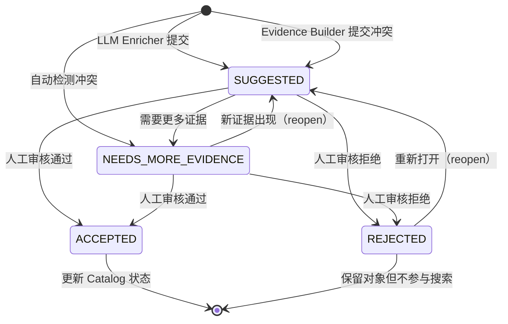
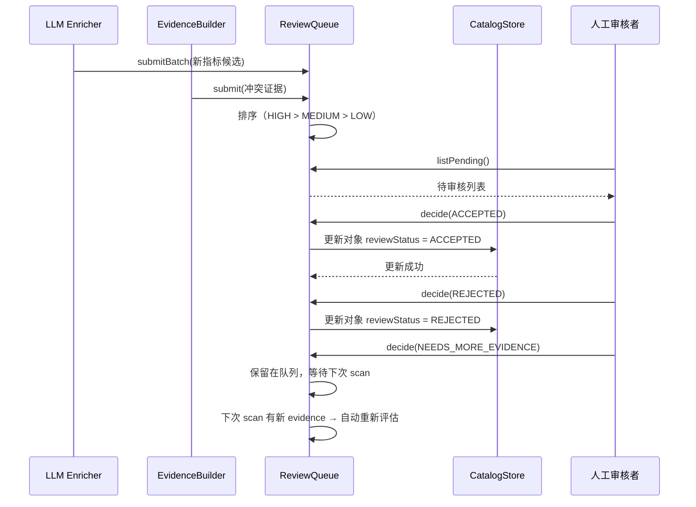

# Review Queue 详细设计

## 1. 目标与定位

**职责：** 管理需要人工审核的语义候选对象。所有 LLM 生成的指标、冲突定义、低置信度实体和同义词冲突都进入审核队列。

**LLM 依赖：** 否。状态机 + CRUD。审核是人工决策，不需要 AI。

**为什么不需要 LLM：**
- 审核队列是状态管理（SUGGESTED → ACCEPTED/REJECTED）
- 优先级排序是规则（冲突 > 新指标 > 同义词）
- 审核决策是人工操作，不是 AI 操作
- 如果用 LLM 自动审核，会形成"AI 审核 AI 输出"的循环，不可审计

## 2. 上游与下游

```
上游: LLM Semantic Enricher
  ↓ 输入: ReviewItem 列表（新指标候选）
  ↓ 输入: ConflictConfirmation 列表（CONFIRMED 的冲突 → 自动创建 ReviewItem）

上游: Semantic Evidence Builder
  ↓ 输入: CandidateConflict（规则初筛，不直接进入 ReviewQueue）

上游: Lexicon Manager
  ↓ 输入: LexiconConflict（同义词冲突）

[Review Queue]
  ↓ 持久化: semantic-review-queue.json

下游: Semantic Catalog Store
  ↓ 输出: ReviewDecision → 更新对象 reviewStatus

下游: Lexicon Manager
  ↓ 输出: ReviewDecision → 更新词条 reviewStatus
```

**冲突的两阶段处理流程（方案 C）：**

```
Evidence Builder（规则初筛，保证召回率 100%）
  ↓ 输出: CandidateConflict（status=CANDIDATE）
LLM Enricher（语义确认，提升精确率）
  ↓ 输出: ConflictConfirmation（status=CONFIRMED 或 FALSE_ALARM）
  ↓
  ├─ CONFIRMED → 自动创建 ReviewItem（priority=HIGH，含 LLM reasoning 和 recommendation）
  └─ FALSE_ALARM → 丢弃，不进入 ReviewQueue
```

**进入审核的触发条件：**

| 触发条件 | 优先级 | 来源 | 说明 |
| --- | --- | --- | --- |
| LLM 确认的冲突（CONFIRMED） | HIGH | LLM Enricher | 规则初筛 + LLM 确认的真冲突 |
| 新指标候选 | MEDIUM | LLM Enricher | 所有 LLM 生成的指标默认 SUGGESTED |
| 同义词冲突 | HIGH | Lexicon Manager | 同一术语映射到多个不同对象 |
| 低置信度实体 | MEDIUM | LLM Enricher | confidence < 0.5 的实体识别 |

## 3. 接口契约

```java
public interface ReviewQueue {
    ReviewItem submit(ReviewItem item);
    List<ReviewItem> submitBatch(List<ReviewItem> items);

    /**
     * 获取待审核列表。
     * 排序: HIGH > MEDIUM > LOW, 旧 > 新, metric > entity > other
     */
    List<ReviewItem> listPending(ReviewPriority priority, ObjectType objectType,
                                  int limit, int offset);

    /**
     * 提交审核决定。
     * 后置条件：
     * - ACCEPTED → 更新 catalog 中对象 reviewStatus = ACCEPTED
     * - REJECTED → 更新 catalog 中对象 reviewStatus = REJECTED
     * - NEEDS_MORE_EVIDENCE → 保留在队列，下次 scan 重新评估
     */
    ReviewItem decide(ReviewDecision decision);
    List<ReviewItem> decideBatch(List<ReviewDecision> decisions);

    List<ReviewItem> getHistory(String objectId);
    ReviewQueueStats getStats();

    /**
     * 重新打开已审核项（例如发现新证据）。
     */
    ReviewItem reopen(String reviewId, String reason);
}
```

## 4. ReviewItem 增强 Schema（P2）

```json
{
  "reviewId": "review-001",
  "objectId": "metric:customer_total_paid_amount",
  "objectType": "METRIC",
  "status": "SUGGESTED",
  "priority": "MEDIUM",
  "recommendation": "建议统一口径为 SUM(payments.amount)，并确认是否要过滤退款",
  "context": {
    "relatedTables": ["customers", "orders", "payments"],
    "relatedMetrics": [],
    "conflictingDefinitions": [
      {
        "expression": "SUM(payments.amount)",
        "filter": "payments.status = 'success'",
        "source": "SQL:bi_dashboard",
        "support": 0.85
      }
    ],
    "sampleSQL": "SELECT c.id, SUM(p.amount) FROM customers c JOIN orders o ON o.customer_id = c.id JOIN payments p ON p.order_id = o.id GROUP BY c.id",
    "impact": "影响所有客户消费金额相关的查询，包括客户排行、消费统计等",
    "affectedQuestions": ["客户消费金额", "客户支付排行", "客户消费统计"]
  },
  "needsDecision": true,
  "reviewedBy": null,
  "reviewedAt": null,
  "reviewComment": null,
  "createdAt": "2026-06-23T00:00:00Z"
}
```

**新增字段说明：**

| 字段 | 说明 |
| --- | --- |
| `context.sampleSQL` | 展示该指标在实际查询中的使用示例，帮助审核者理解 |
| `context.impact` | 该审核决策的影响范围描述 |
| `context.affectedQuestions` | 可能受此决策影响的典型问题列表 |
| `context.relatedTables` | 指标涉及的表，帮助审核者快速定位 |
| `context.relatedMetrics` | 与此指标相关的其他指标（如替代口径） |

## 5. 状态流转图



## 5. 交互时序图



## 6. 优先级排序规则

```java
int compareReviewItems(ReviewItem a, ReviewItem b) {
    // 1. 优先级: HIGH > MEDIUM > LOW
    int priorityCmp = b.priority().ordinal() - a.priority().ordinal();
    if (priorityCmp != 0) return priorityCmp;

    // 2. 冲突项优先
    if (a.hasConflicts() && !b.hasConflicts()) return -1;
    if (!a.hasConflicts() && b.hasConflicts()) return 1;

    // 3. 对象类型: metric > entity > join_path > column > table
    int typeCmp = typePriority(b.objectType()) - typePriority(a.objectType());
    if (typeCmp != 0) return typeCmp;

    // 4. 创建时间: 旧的优先
    return a.createdAt().compareTo(b.createdAt());
}
```

## 5. 审核通过后的动作

```
ACCEPTED:
  1. CatalogStore: 更新对象 reviewStatus = ACCEPTED
  2. 如果是 metric: 允许在 SQL Draft 中使用（不再标注 SUGGESTED）
  3. 如果是 lexicon entry: 更新 source = HUMAN_REVIEWED, confidence = 0.95
  4. 如果是 join path: 标记为可信任路径

REJECTED:
  1. CatalogStore: 更新对象 reviewStatus = REJECTED
  2. 对象保留但不参与搜索和 SQL 生成
  3. 记录拒绝原因

NEEDS_MORE_EVIDENCE:
  1. 保留在审核队列
  2. 下次 scan 如果有新 evidence，自动重新评估
```

## 6. LLM 决策

**不使用 LLM。** 状态机 + CRUD。审核是人工决策。"AI 审核 AI 输出"不可审计。

## 7. 测试验收

| 测试场景 | 预期 |
| --- | --- |
| 提交新指标 | status=SUGGESTED, priority=MEDIUM |
| 提交冲突 | status=NEEDS_MORE_EVIDENCE, priority=HIGH |
| 审核通过 | 对象 reviewStatus → ACCEPTED |
| 审核拒绝 | 对象 reviewStatus → REJECTED，不参与搜索 |
| 优先级排序 | HIGH > MEDIUM > LOW，冲突 > 非冲突 |
| 重新打开 | NEEDS_MORE_EVIDENCE → SUGGESTED |
| 批量审核 | 全部成功或部分成功 |