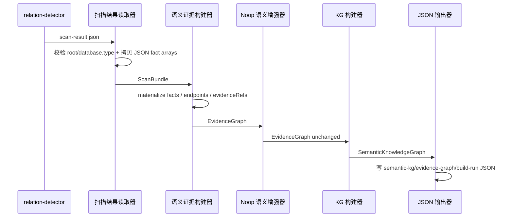
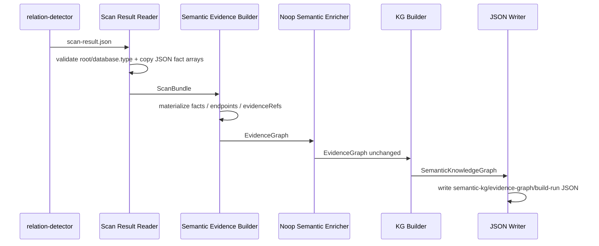
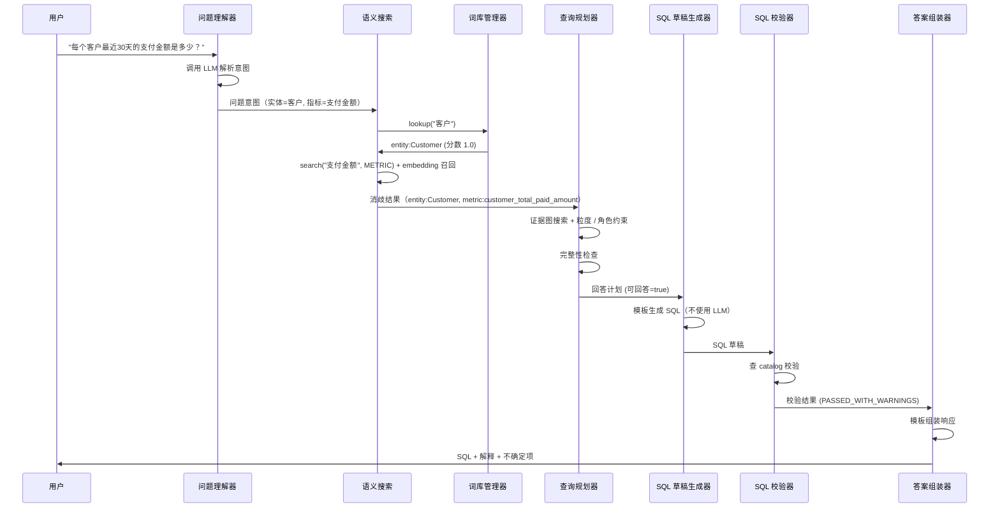
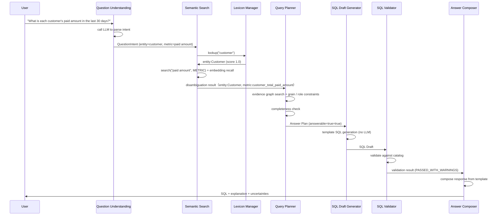
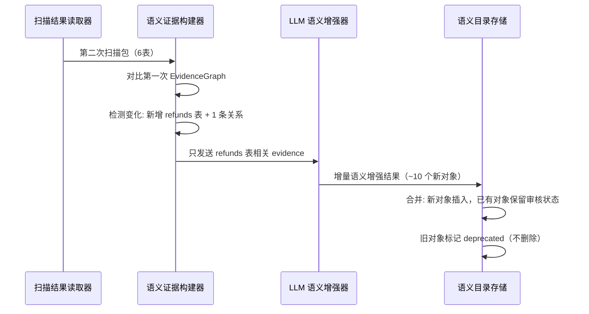
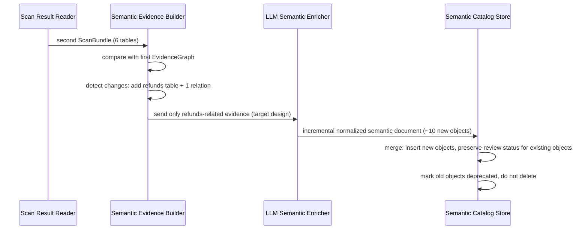

# 端到端测试示例

## 1. 概述

本文档提供 Semantic Layer 的端到端测试示例。当前代码已经落地两条离线链路：

- KG JSON artifact 构建链路：`relation-detector scan-result.json -> ScanBundle -> EvidenceGraph -> SemanticKnowledgeGraph -> semantic-kg.json`
- 语义抽取链路：`semantic extract` 从同一个 `ScanBundle` 并列写 deterministic KG 与完整
  evidence bundle；大输入按当前 table-touch component 形成 evidence closure，并把小型断开分量确定性装箱为 bounded
  shards。`codex-session` 只写逐片会话输入，
  `openai-api` 可逐片调用 Responses API，经 exact-ID merge、受限协调和完整 bundle 最终校验后产出
  normalized semantic document

在线问答、Catalog Store、Embedding、Lexicon 仍是目标设计示例，不是当前已实现 API。

每个示例包含：
- 输入数据（来自 relation-detector 的 scan-result.json）
- 每步中间输出（验证每个模块的正确性）
- 最终输出（用户看到的响应）
- 验收检查点

## 2. 测试数据准备

### 2.1 示例数据库 Schema

```sql
-- 5 个表，模拟电商场景
CREATE TABLE customers (
    id BIGINT PRIMARY KEY,
    name VARCHAR(100) NOT NULL,
    status VARCHAR(20) DEFAULT 'ACTIVE',  -- ACTIVE/INACTIVE
    created_at TIMESTAMP DEFAULT CURRENT_TIMESTAMP
);

CREATE TABLE orders (
    id BIGINT PRIMARY KEY,
    customer_id BIGINT NOT NULL,
    status VARCHAR(20) DEFAULT 'pending',
    total_amount DECIMAL(12,2),
    created_at TIMESTAMP DEFAULT CURRENT_TIMESTAMP,
    FOREIGN KEY (customer_id) REFERENCES customers(id)
);

CREATE TABLE payments (
    id BIGINT PRIMARY KEY,
    order_id BIGINT NOT NULL,
    amount DECIMAL(12,2) NOT NULL,
    paid_at TIMESTAMP DEFAULT CURRENT_TIMESTAMP,
    FOREIGN KEY (order_id) REFERENCES orders(id)
);

CREATE TABLE products (
    id BIGINT PRIMARY KEY,
    name VARCHAR(200) NOT NULL,
    price DECIMAL(12,2)
);

CREATE TABLE order_items (
    id BIGINT PRIMARY KEY,
    order_id BIGINT NOT NULL,
    product_id BIGINT NOT NULL,
    quantity INT NOT NULL,
    unit_price DECIMAL(12,2),
    FOREIGN KEY (order_id) REFERENCES orders(id),
    FOREIGN KEY (product_id) REFERENCES products(id)
);
```

### 2.2 relation-detector 输出（scan-result.json 摘要）

```json
{
  "database": {"type": "mysql", "schema": "shop"},
  "generatedAt": "2026-06-23T00:00:00Z",
  "summary": {
    "directRelationshipCount": 5,
    "derivedRelationshipCount": 0,
    "totalRelationshipCount": 5,
    "directDataLineageCount": 1,
    "derivedDataLineageCount": 0,
    "totalDataLineageCount": 1,
    "directNamingEvidenceCount": 0,
    "derivedNamingEvidenceCount": 0,
    "totalNamingEvidenceCount": 0,
    "warningCount": 0,
    "sources": ["metadata", "ddl"]
  },
  "relationships": [
    {
      "source": {"table": "orders", "column": "customer_id"},
      "target": {"table": "customers", "column": "id"},
      "relationType": "FK_LIKE", "relationSubType": "DECLARED_FK",
      "confidence": 0.98,
      "evidence": [{"type": "METADATA_FOREIGN_KEY", "score": 0.98, "source": "information_schema", "detail": "FK orders.customer_id -> customers.id"}]
    },
    {
      "source": {"table": "payments", "column": "order_id"},
      "target": {"table": "orders", "column": "id"},
      "relationType": "FK_LIKE", "relationSubType": "DECLARED_FK",
      "confidence": 0.98,
      "evidence": [{"type": "METADATA_FOREIGN_KEY", "score": 0.98, "source": "information_schema", "detail": "FK payments.order_id -> orders.id"}]
    },
    {
      "source": {"table": "order_items", "column": "order_id"},
      "target": {"table": "orders", "column": "id"},
      "relationType": "FK_LIKE", "relationSubType": "DECLARED_FK",
      "confidence": 0.98,
      "evidence": [{"type": "METADATA_FOREIGN_KEY", "score": 0.98}]
    },
    {
      "source": {"table": "order_items", "column": "product_id"},
      "target": {"table": "products", "column": "id"},
      "relationType": "FK_LIKE", "relationSubType": "DECLARED_FK",
      "confidence": 0.98,
      "evidence": [{"type": "METADATA_FOREIGN_KEY", "score": 0.98}]
    },
    {
      "source": {"table": "payments", "column": "customer_id"},
      "target": {"table": "customers", "column": "id"},
      "relationType": "FK_LIKE", "relationSubType": "INFERRED_JOIN_FK",
      "confidence": 0.55,
      "evidence": [{"type": "SQL_LOG_JOIN", "score": 0.55, "source": "app-sql.sql", "detail": "JOIN customers ON payments.customer_id = customers.id"}]
    }
  ],
  "dataLineages": [
    {
      "sources": [{"table": "payments", "column": "amount"}],
      "target": {"table": "orders", "column": "total_amount"},
      "flowKind": "VALUE", "transformType": "AGGREGATE",
      "confidence": 0.80,
      "evidence": [{
        "type": "DATA_LINEAGE",
        "transformType": "AGGREGATE",
        "sourceType": "PLAIN_SQL",
        "score": 0.80,
        "source": "sales-summary.sql",
        "detail": "SUM(payments.amount) -> orders.total_amount"
      }]
    }
  ]
}
```

## 3. 端到端示例一：当前离线 KG 构建链路

### 3.1 目标

验证从 relation-detector 输出到可审计 KG JSON artifact 的当前已实现链路。

### 3.2 逐步验证

**Step 1: ScanResultReader**

```
输入: test-fixtures/scan-result-shop.json

预期输出: ScanBundle
- relationships: 5 条
- dataLineages: 1 条
- derivedRelationships / derivedDataLineages / namingEvidence / diagnostics: 按输入 JSON 原样进入对应数组
- summary: 只保留整数统计字段
- sources: 来自 summary.sources

验收检查点:
[✓] database.type 存在
[✓] 文件不存在、JSON 非对象、database.type 缺失时抛出 IllegalArgumentException
[✓] reader 不做 relationship/lineage 去重，不做 confidence clamp，不构建 metadataIndex/relationshipIndex
```

**Step 2: SemanticEvidenceBuilder**

```
输入: ScanBundle（5 表，5 关系，1 lineage）

预期输出: EvidenceGraph
- endpoints: 从 relationship / lineage / namingEvidence fact 中出现的 endpoint 提取
- facts: RelationshipFact、LineageFact、NamingEvidenceFact、DerivedRelationshipFact、DerivedLineageFact、Diagnostic
- evidenceRefs: 优先来自 rawEvidence，缺失时来自 grouped evidence
- summary: 继承 ScanBundle summary

验收检查点:
[✓] 每个 relationship / lineage / namingEvidence 至少生成一个 fact
[✓] derived relationship / derived lineage 进入独立 fact kind
[✓] `SemanticEvidenceBuilder` 不生成历史 `CompactEvidenceBundle`，不做 BFS join path 搜索，不做 conflict detection
```

**Step 3: SemanticKgBuilder + JsonSemanticKgWriter**

```
SemanticKgBuilder 输出:
  SemanticKnowledgeGraph:
    nodes: PhysicalTable / PhysicalColumn / RelationshipFact / LineageFact / NamingEvidenceFact / Diagnostic
    edges: table-column / fact-source / fact-target / supported-by / derived-path-step

JsonSemanticKgWriter 输出:
  semantic-kg.json
  semantic-evidence-graph.json
  semantic-build-run.json

验收检查点:
[✓] 三个 JSON 文件均生成
[✓] KG fact 和边都可回溯到 evidenceRefs 或原始 relation-detector payload
[✓] 文件可被 JSON parser 解析
```

### 3.3 当前链路时序图

<details open>
<summary>中文</summary>



</details>

<details>
<summary>English</summary>



</details>

## 4. 端到端示例二：在线问答全链路（目标设计，尚未实现）

### 4.1 目标

验证从用户问题到 SQL draft 的完整在线链路。

### 4.2 输入

```
用户问题: "每个客户最近30天的支付金额是多少？"
```

### 4.3 逐步验证

**Step 1: QuestionUnderstanding**

```
输入: "每个客户最近30天的支付金额是多少？"

调用 LLM 1 次

预期输出: QuestionIntent
{
  "entities": [{"mention": "客户", "confidence": 0.90}],
  "metrics": [{"mention": "支付金额", "aggregationHint": "SUM", "confidence": 0.85}],
  "dimensions": [{"mention": "每个客户", "dimensionType": "entity_key"}],
  "timeRange": {"type": "RELATIVE", "startExpression": "CURRENT_DATE - INTERVAL '30 days'"},
  "outputIntent": "AGGREGATE_RANK",
  "overallConfidence": 0.88
}

验收检查点:
[✓] 实体识别正确: "客户"
[✓] 指标识别正确: "支付金额" + SUM 提示
[✓] 时间范围解析正确: "最近30天" → RELATIVE
[✓] 输出意图: AGGREGATE_RANK
[✓] 无歧义
```

**Step 2: SemanticSearch（消歧）**

```
输入: entity "客户" → LexiconManager.lookup("客户")
      metric "支付金额" → SemanticSearch.search("支付金额", METRIC)

Lexicon 结果:
  lookup("客户") → [{objectId: "entity:Customer", score: 1.0}]

Search 结果:
  search("支付金额", METRIC) → [
    {objectId: "metric:customer_total_paid_amount", score: 0.88},
    {objectId: "column:payments.amount", score: 0.82}
  ]

消歧后:
  entities[0].candidateEntityId = "entity:Customer"
  metrics[0].candidateMetricId = "metric:customer_total_paid_amount"

验收检查点:
[✓] "客户" 精确匹配 entity:Customer
[✓] "支付金额" 召回 metric:customer_total_paid_amount（排第一）
[✓] column:payments.amount 也在召回中（相关列）
```

**Step 3: QueryPlanner**

```
输入: 消歧后的 QuestionIntent + SearchResult

处理:
1. primaryEntity = entity:Customer (primaryTable=customers)
2. metrics = [metric:customer_total_paid_amount]
3. dimensions = [customers.id, customers.name]
4. 需要的表: [customers, orders, payments]
   - metric 需要 payments.amount
   - joinPath 需要 customers→orders→payments
5. joinPath 选择:
   - path:customers->orders->payments (pathConfidence=0.9604)
   - 覆盖所有 requiredTables ✓
6. 时间列: payments.paid_at（来自 metric.defaultTimeColumn）
7. 完整性检查: 全部通过

预期输出: AnswerPlan
{
  "answerable": true,
  "primaryEntity": {"primaryTable": "customers", "keyColumns": ["customers.id"]},
  "metrics": [{"metricId": "metric:customer_total_paid_amount", "reviewStatus": "SYSTEM_PROPOSED"}],
  "dimensions": [{"physicalName": "customers.id"}, {"physicalName": "customers.name"}],
  "joinPath": {"pathConfidence": 0.9604, "hopCount": 2},
  "timeRange": {"columnRef": "payments.paid_at"},
  "needsAggregation": true,
  "groupByColumns": ["customers.id", "customers.name"],
  "missingInfo": []
}

验收检查点:
[✓] answerable = true
[✓] joinPath 覆盖所有需要的表
[✓] 时间列选对: payments.paid_at
[✓] 需要聚合: GROUP BY customers.id, customers.name
[✓] 无缺失信息
```

**Step 4: SqlDraftGenerator**

```
输入: AnswerPlan

模板生成（不使用 LLM）:

预期输出: SqlDraft
{
  "sql": "-- SYSTEM_PROPOSED METRIC: 客户总支付金额\n-- Expression: SUM(payments.amount)\nSELECT c.id, c.name, SUM(p.amount) AS paid_amount_30d\nFROM customers c\nJOIN orders o ON o.customer_id = c.id\nJOIN payments p ON p.order_id = o.id\nWHERE p.paid_at >= CURRENT_DATE - INTERVAL '30 days'\nGROUP BY c.id, c.name\nORDER BY paid_amount_30d DESC\nLIMIT 1000",
  "dialect": "mysql",
  "warnings": [{"type": "SYSTEM_PROPOSED_METRIC_USED"}]
}

验收检查点:
[✓] SQL 语法正确
[✓] 所有表名来自 catalog
[✓] 所有 join 条件来自 evidence
[✓] 未审核指标有注释标注
[✓] 只生成 SELECT
[✓] 有 LIMIT 保护
```

**Step 5: SqlValidator**

```
输入: SqlDraft

校验结果: ValidationResult
{
  "status": "PASSED_WITH_WARNINGS",
  "checks": {
    "tableExists": {"customers": true, "orders": true, "payments": true},
    "columnExists": {"customers.id": true, "customers.name": true, "payments.amount": true, "payments.paid_at": true},
    "joinEvidence": {
      "orders.customer_id->customers.id": {"evidence": "METADATA_FOREIGN_KEY", "confidence": 0.98},
      "payments.order_id->orders.id": {"evidence": "METADATA_FOREIGN_KEY", "confidence": 0.98}
    },
    "aggregationValid": true,
    "groupByComplete": true,
    "dangerousOperation": false
  },
  "errors": [],
  "warnings": [{"type": "SYSTEM_PROPOSED_METRIC_USED"}]
}

验收检查点:
[✓] 所有表存在
[✓] 所有列存在
[✓] 所有 join 有 evidence
[✓] GROUP BY 完整
[✓] 无危险操作
[✓] 未审核指标 WARNING
```

**Step 6: AnswerComposer**

```
输入: AnswerPlan + SqlDraft + ValidationResult

最终输出: Answer
{
  "type": "SQL_DRAFT",
  "answerable": true,
  "sql": "SELECT c.id, c.name, SUM(p.amount) AS paid_amount_30d\n...",
  "explanation": {
    "summary": "查询每个客户在最近30天内的支付金额合计",
    "tablesUsed": [
      {"tableName": "customers", "semanticName": "客户", "role": "主实体"},
      {"tableName": "orders", "semanticName": "订单", "role": "关联表"},
      {"tableName": "payments", "semanticName": "支付", "role": "指标来源"}
    ],
    "metricsUsed": [
      {"name": "客户总支付金额", "expression": "SUM(payments.amount)", "reviewStatus": "SYSTEM_PROPOSED"}
    ],
    "uncertainties": [
      {"item": "支付金额口径", "reason": "指标尚未审核", "suggestion": "请确认支付金额是否包含退款金额"}
    ]
  }
}

验收检查点:
[✓] 输出包含 SQL
[✓] 输出包含解释
[✓] 不确定项被标注
[✓] 未审核指标被标注
```

### 4.4 全链路时序图

<details open>
<summary>中文</summary>



</details>

<details>
<summary>English</summary>



</details>

## 5. 端到端示例三：歧义问题（目标设计，尚未实现）

### 5.1 输入

```
用户问题: "找出活跃客户"
```

### 5.2 关键步骤

**QuestionUnderstanding 输出:**

```json
{
  "originalQuestion": "找出活跃客户",
  "entities": [{"mention": "客户", "confidence": 0.90}],
  "filters": [{"mention": "活跃", "confidence": 0.30}],
  "ambiguities": [
    {
      "mention": "活跃",
      "description": "\"活跃\"有多个可能口径",
      "possibleInterpretations": [
        "客户状态字段为 ACTIVE (customers.status = 'ACTIVE')",
        "最近登录过 (customers.last_login_at 在近期)",
        "最近下单过 (orders.created_at 在近期)",
        "最近支付过 (payments.paid_at 在近期)"
      ],
      "clarificationQuestion": "你希望按哪种标准判断\"活跃客户\"？"
    }
  ],
  "overallConfidence": 0.40
}
```

**QueryPlanner 输出:**

```json
{
  "answerable": false,
  "missingInfo": [{"type": "FILTER_DEFINITION", "description": "无法确定\"活跃\"对应的列"}],
  "clarificationQuestions": [{
    "question": "你希望按哪种标准判断\"活跃客户\"？",
    "options": [
      {"label": "状态为ACTIVE", "description": "customers.status = 'ACTIVE'"},
      {"label": "最近下单", "description": "orders.created_at 在近期"},
      {"label": "最近支付", "description": "payments.paid_at 在近期"}
    ]
  }]
}
```

**最终输出:**

```text
无法直接回答"找出活跃客户"，因为"活跃"有多个可能口径。

请选择你希望的标准：
1. 客户状态字段为 ACTIVE
2. 最近下单过（有订单记录）
3. 最近支付过（有支付记录）

如果你选择 1，我可以生成以下 SQL：
SELECT * FROM customers WHERE status = 'ACTIVE'
```

验收检查点:
```
[✓] 不生成了 SQL（answerable=false）
[✓] 澄清问题列出了具体候选口径
[✓] 每个候选口径有对应的列名
[✓] 提供了可选的 SQL 预览
```

## 6. 端到端示例四：SQL 校验失败（目标设计，尚未实现）

### 6.1 目标

模拟 SQL Generator 生成了引用不存在列的 SQL（bug 场景），验证 Validator 能拦截。

### 6.2 模拟输入

```sql
-- 假设 SQL Generator 有 bug，引用了不存在的列
SELECT c.id, c.full_name, SUM(p.amount) AS paid_amount_30d
FROM customers c
JOIN orders o ON o.user_id = c.id  -- 错误: orders 没有 user_id
JOIN payments p ON p.order_id = o.id
WHERE p.paid_at >= CURRENT_DATE - INTERVAL '30 days'
GROUP BY c.id, c.full_name
```

### 6.3 ValidationResult

```json
{
  "status": "FAILED",
  "errors": [
    {
      "type": "COLUMN_NOT_FOUND",
      "message": "列 customers.full_name 在 catalog 中不存在",
      "sqlFragment": "c.full_name",
      "severity": "ERROR",
      "suggestion": "可用列: customers.name"
    },
    {
      "type": "JOIN_NO_EVIDENCE",
      "message": "JOIN 条件 orders.user_id = customers.id 未找到 relationship evidence",
      "sqlFragment": "o.user_id = c.id",
      "severity": "ERROR",
      "suggestion": "可用 join: orders.customer_id = customers.id (evidence: METADATA_FOREIGN_KEY, confidence: 0.98)"
    }
  ]
}
```

验收检查点:
```
[✓] 不存在的列被检测
[✓] 无 evidence 的 join 被检测
[✓] 提供了修复建议
[✓] status = FAILED
[✓] AnswerComposer 不输出 SQL，输出错误解释
```

## 7. 端到端示例五：增量更新（目标设计，尚未实现）

### 7.1 场景

第一次扫描后，数据库新增了一个 `refunds` 表，第二次扫描只处理增量。

### 7.2 输入

```
第一次 scan-result.json: 5 表（customers, orders, payments, products, order_items）
第一次 catalog: 39 个语义对象

第二次 scan-result.json: 6 表（新增 refunds）
  - 新增关系: refunds.order_id -> orders.id (FK_LIKE, confidence 0.98)
```

### 7.3 增量更新流程

<details open>
<summary>中文</summary>



</details>

<details>
<summary>English</summary>



</details>

验收检查点:
```
[✓] 只处理增量部分（不重新生成全部 39 个对象）
[✓] 已有对象的审核状态保留
[✓] 新对象正常创建
[✓] 旧对象标记 deprecated
[✓] 增量处理时间 < 全量处理的 30%
```
